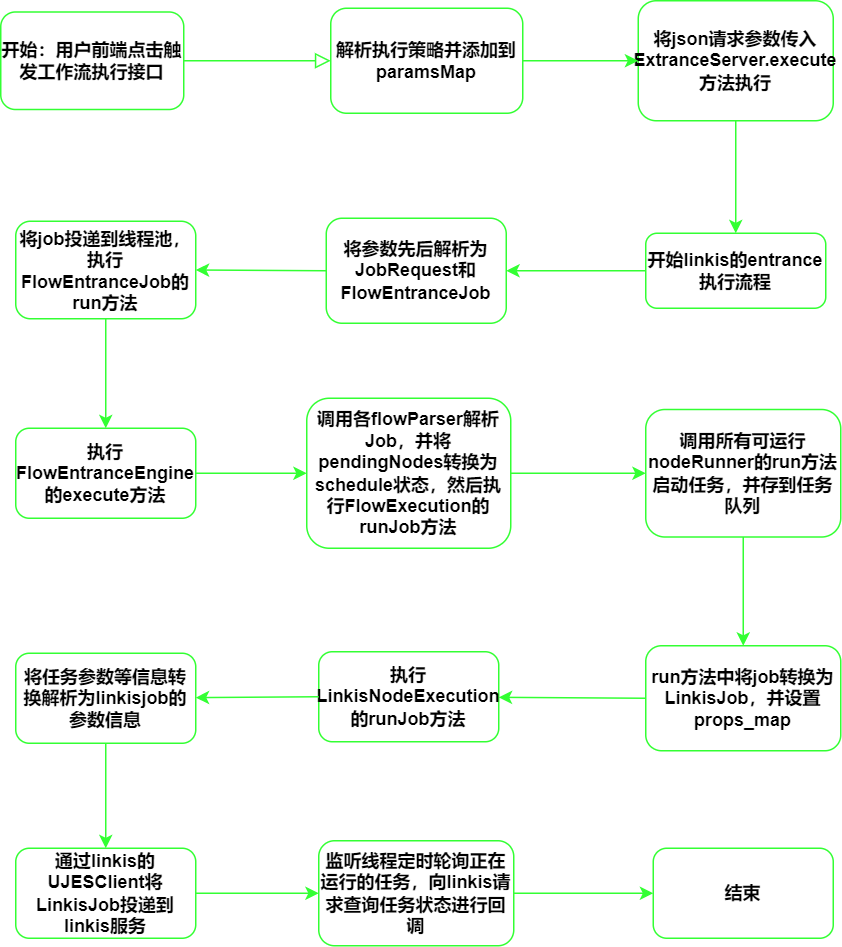

FlowExecution
-------------------------
FlowExecution：The workflow real-time execution module provides interface services for workflow execution, uses the Entrance module of linkis, and inherits some classes of linkis-entrance for adaptive transformation.
Such as inheriting the PersistenceEngine to implement the persistence operation of the dss workflow task, and overriding the EntranceExecutionJob class to implement the workflow node execution, state transition, kill and other operations. Finally, the parsed and processed tasks are delivered to the linkis service through linkis-computation-client.


### 1 business architecture

User use function points:

| component name           |  First-level module | Second-level module | Function point         |
|---------------------|------------------|-----------------|-----------------|
| DataSphereStudio    | Workflow | Workflow Execution | Execute             |
|                     |                   |                  |    Check to execute     |
|                     |                   |                  |   fail and rerun       |
|                     |                   |                  | Execution history view    |


### 2. Introduction to FlowExecution interface/class function:

| Core Interface/Class | Core Function                            |
|---------------------------|------------------------------|
| FlowEntranceRestfulApi | Provides a restful interface for workflow execution, such as task execution, status acquisition |
| WorkflowPersistenceEngine | Overrides the persist method of the PersistenceEngine of linkis, converts the jobRequest to a workflowTask and persists it to the workflow_task table of dss |
| WorkflowQueryService | Provides interface services such as workflow task creation and status update |
| WorkflowExecutionInfoService | Provides services such as creation and query of workflow execution information |
| FlowEntranceEngine | Executor inherited from linkis, implements the execute method, will call flowParser to parse the flow and use it as the entry of the runJob method |
| FlowExecutionExecutorManagerImpl | Inherit the ExecutorManager of the child linkis, rewrite the createExecutor method, so that the created executor is the FlowEntranceEngine of dss |
| FlowExecutionParser | CommonEntranceParser inherited from linkis, rewrites the parseToJob method to return FlowEntranceJob of dss |
| DefaultFlowExecution | Provides the runJob() method to convert all scheduled nodes of FlowEntranceJob to runnable state, and add the running nodes to the task queue. The timing thread pool polls the linkis task status corresponding to each node. If the status task is completed is removed from the queue. |
| FlowEntranceJobParser | Define the parse() method, the subclass contains various parsing implementation classes, such as parsing workflow from jobRequest, parsing the params attribute of workflow nodes |
| FlowEntranceJob | EntranceExecutionJob inherited from linkis, rewrites run(), kill(), onStatusChanged() and other methods to provide job execution entry and status callback processing. |
| DefaultNodeRunner | The node task running thread, converts the node task to LinkisJob and delivers it to linkis, and provides methods for initiating task status query and task cancellation to linkis |
| NodeSkipStrategy | Strategy interface for judging whether a node is skipped, including three implementation strategies: execution, rerun on failure, and selected execution |
| FlowContext | Contains workflow context status information, and provides methods such as getRunningNodes and getSucceedNodes to obtain information such as running nodes and successful nodes of the workflow |


### 3. Workflow execution process link:


### 4. Data Structure/Storage Design
Workflow execution information table:
```roomsql
CREATE TABLE `dss_workflow_execute_info` (
   `id` bigint(20) NOT NULL AUTO_INCREMENT,
   `task_id` bigint(20) NOT NULL COMMENT 'task id',
   `status` int(1) DEFAULT NULL COMMENT 'status，0：faild 1：success，',
   `flow_id` bigint(20) NOT NULL COMMENT 'flowId',
   `version` varchar(200) DEFAULT NULL COMMENT 'Workflow bml version number',
   `failed_jobs` text COMMENT 'execution failed node',
   `Pending_jobs` text COMMENT 'Node not executed',
   `skipped_jobs` text COMMENT 'execute skip node',
   `succeed_jobs` text COMMENT 'Execute successful node',
   `createtime` datetime NOT NULL COMMENT 'create time',
   `running_jobs` text COMMENT 'running jobs',
   `updatetime` datetime DEFAULT NULL COMMENT 'update time',
   PRIMARY KEY (`id`)
 ) ENGINE=InnoDB DEFAULT CHARSET=utf8;
```
Workflow task information table:
```roomsql
CREATE TABLE `dss_workflow_task` (
  `id` bigint(20) NOT NULL AUTO_INCREMENT COMMENT 'Primary Key, auto increment',
  `instance` varchar(50) DEFAULT NULL COMMENT 'An instance of Entrance, consists of IP address of the entrance server and port',
  `exec_id` varchar(50) DEFAULT NULL COMMENT 'execution ID, consists of jobID(generated by scheduler), executeApplicationName , creator and instance',
  `um_user` varchar(50) DEFAULT NULL COMMENT 'User name',
  `submit_user` varchar(50) DEFAULT NULL COMMENT 'submitUser name',
  `execution_code` text COMMENT 'Run script. When exceeding 6000 lines, script would be stored in HDFS and its file path would be stored in database',
  `progress` float DEFAULT NULL COMMENT 'Script execution progress, between zero and one',
  `log_path` varchar(200) DEFAULT NULL COMMENT 'File path of the log files',
  `result_location` varchar(200) DEFAULT NULL COMMENT 'File path of the result',
  `status` varchar(50) DEFAULT NULL COMMENT 'Script execution status, must be one of the following: Inited, WaitForRetry, Scheduled, Running, Succeed, Failed, Cancelled, Timeout',
  `created_time` datetime DEFAULT NULL COMMENT 'Creation time',
  `updated_time` datetime DEFAULT NULL COMMENT 'Update time',
  `run_type` varchar(50) DEFAULT NULL COMMENT 'Further refinement of execution_application_time, e.g, specifying whether to run pySpark or SparkR',
  `err_code` int(11) DEFAULT NULL COMMENT 'Error code. Generated when the execution of the script fails',
  `err_desc` text COMMENT 'Execution description. Generated when the execution of script fails',
  `execute_application_name` varchar(200) DEFAULT NULL COMMENT 'The service a user selects, e.g, Spark, Python, R, etc',
  `request_application_name` varchar(200) DEFAULT NULL COMMENT 'Parameter name for creator',
  `script_path` varchar(200) DEFAULT NULL COMMENT 'Path of the script in workspace',
  `params` text COMMENT 'Configuration item of the parameters',
  `engine_instance` varchar(50) DEFAULT NULL COMMENT 'An instance of engine, consists of IP address of the engine server and port',
  `task_resource` varchar(1024) DEFAULT NULL,
  `engine_start_time` time DEFAULT NULL,
  `label_json` varchar(200) DEFAULT NULL COMMENT 'label json',
  PRIMARY KEY (`id`),
  KEY `created_time` (`created_time`),
  KEY `um_user` (`um_user`)
) ENGINE=InnoDB DEFAULT CHARSET=utf8mb4;
```