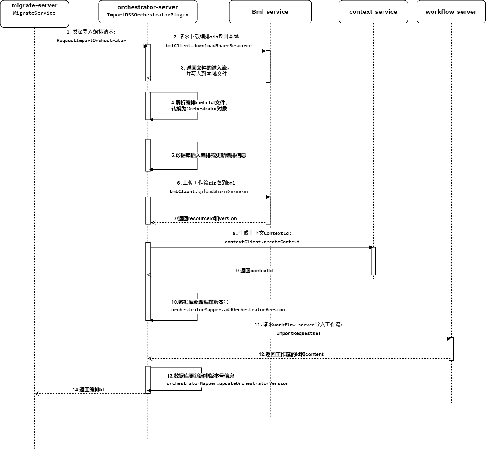

Orchestrator Architecture Design
-------------------------
Orchestrator：The orchestration module provides interface services such as adding, deleting, modifying, querying, importing and exporting orchestrated under the project, and serves as a unified input for each orchestration implementation (such as workflow). Connect to the project service upward, and connect to the specific orchestration implementation (such as workflow service) downward.

### 1 business architecture
User use function point：


|Component name | First-level module | Second-level module | Function point        |
|---------------------|------------------|-----------------|-----------------|
| DataSphereStudio    | Orchestration Mode | New Orchestration Mode | Create a New Orchestration             |
|                     |                   |   Edit Arrangement Mode | Edit Arranged Field Information         |
|                     |                   |  Delete Arrangement Mode | Delete Arrangement                  |
|                     |                   |   Open Arrangement Mode | Open Arrangement to perform drag-and-drop development of choreography nodes    |
|                     |                   |   View the list of orchestration versions | View the historical versions of the orchestration mode, you can open and view a version, or roll back a version  |
|                     |                   |   Orchestration mode rollback | Roll back to a historical version of the orchestration (a version will be added after the orchestration is released)   |


### 一、Orchestrator Architecture：


### 二、Orchestrator module design：
Second-level module core class introduction：

**dss-orchestrator-core**

The core module of Orchestrator defines top-level interfaces such as DSSOrchestrator, DSSOrchestratorContext, and DSSOrchestratorPlugin.

| Core top-level interface/class | Core functionality                         |
|---------------------------|------------------------------|
| DSSOrchestrator           | Defines the method of obtaining the properties of the orchestration, such as obtaining the editorial ranking, associated appconn, context information, etc.      |
| DSSOrchestratorContext    | Defines the context information of the orchestrator, and provides methods such as obtaining the orchestration plug-in class         |
| DSSOrchestratorPlugin     | The top-level interface for orchestrating plugins, defines the init method, and the subclass contains the imported and exported plugin implementation classes        |
| DSSOrchestratorRelation   |Defines the method of obtaining the associated properties of the orchestration, such as obtaining the orchestration mode, and obtaining the appconn associated with the orchestration      |

**dss-orchestrator-db**

Defines the unified entry of the dao layer method of orchestration.

**dss-orchestrator-conversion-standard**

Defines the interface specification for orchestration and conversion to third-party systems, including top-level interfaces such as ConversionOperation, ConversionRequestRef, and ConversionService.
The core module of Orchestrator defines top-level interfaces such as DSSOrchestrator, DSSOrchestratorContext, and DSSOrchestratorPlugin.

| Core Interface/Class | Core Function                                 |
|---------------------      |------------------------------------------|
| ConversionOperation       | Defines the conversion core convert method, the input parameter is ConversionRequestRef, and returns ResponseRef    |
| DSSToRelConversionRequestRef   | Defines the basic parameters of the conversion request, such as userName, workspace, dssProject and other information    |
| ConversionIntegrationStandard    | The following core methods are defined: getDSSToRelConversionService (used to support the orchestration of DSS and convert it to the workflow of the scheduling system) |
| ConversionService         | Defines methods for getting labels and getting ConversionIntegrationStandard            |


**dss-orchestrator-loader**

Used to load orchestration-related appconn, such as workflow-appconn, and load subclasses of DSSOrchestratorPlugin, such as ExportDSSOrchestratorPlugin.

| Core Interface/Class | Core Function                             |
|---------------------      |---------------------------------------------|
| OrchestratorManager       | The getOrCreateOrchestrator method is defined to load the appconn associated with the orchestrator, which will be cached after the first load to avoid repeated loading |
| LinkedAppConnResolver   | Defines the interface for obtaining appconn according to the user |
| SpringDSSOrchestratorContext    | The initialization method of the class will load all subclasses of DSSOrchestratorPlugin and cache them in memory |

**dss-framework-orchestrator-server**

The Orchestrator framework service provides interfaces such as adding, deleting, modifying, checking, and rolling back the orchestration front-end, as well as rpc services such as orchestration import and export.

**dss-framework-orchestraotr-publish**

Provides publishing-related plug-ins, such as arranging import and export implementation classes, arranging compressed package generation, and parsing implementation classes.

| Core Interface/Class | Core Function                                |
|---------------------      |---------------------------------------------|
| ExportDSSOrchestratorPlugin       | Defines the orchestration export interface |
| ImportDSSOrchestratorPlugin       | The orchestration import interface is defined |
| MetaWriter            | Provides the function of outputting the arranged table field information to the metadata file in a specific format|
| MetaReader            | Provides the function of parsing the arranged metadata file to generate table field content|

#### Create an orchestration sequence diagram (delete and edit operations are similar):


#### Import and arrange sequence diagrams (export operations are similar)：



### Data Structure/Storage Design
orchestrator information sheet:
```roomsql
CREATE TABLE `dss_orchestrator_info` (
`id` bigint(20) NOT NULL AUTO_INCREMENT,
`name` varchar(255) NOT NULL COMMENT 'orchestrator name',
`type` varchar(255) NOT NULL COMMENT 'orchestrator type，E.g：workflow',
`desc` varchar(1024) DEFAULT NULL COMMENT 'description',
`creator` varchar(100) NOT NULL COMMENT 'creator',
`create_time` datetime DEFAULT NULL COMMENT 'create time',
`project_id` bigint(20) DEFAULT NULL COMMENT 'project id',
`uses` varchar(500) DEFAULT NULL COMMNET 'uses',
`appconn_name` varchar(1024) NOT NULL COMMENT 'Orchestrate the associated appconn，E.g:workflow',
`uuid` varchar(180) NOT NULL COMMENT 'uuid',
`secondary_type` varchar(500) DEFAULT NULL COMMENT 'Orchestrate of the second type，E.g:workflow-DAG',
`is_published` tinyint(1) NOT NULL DEFAULT '0' COMMENT 'Is it published',
`workspace_id` int(11) DEFAULT NULL COMMENT 'workspace id',
`orchestrator_mode` varchar(100) DEFAULT NULL COMMENT 'orchestrator mode，The value obtained is dic_key(parent_key=p_arrangement_mode) in dss_dictionary',
`orchestrator_way` varchar(256) DEFAULT NULL COMMENT 'orchestrator way',
`orchestrator_level` varchar(32) DEFAULT NULL COMMENT 'orchestrator level',
`update_user` varchar(100) DEFAULT NULL COMMENT 'update user',
`update_time` datetime DEFAULT CURRENT_TIMESTAMP COMMENT 'update time',
PRIMARY KEY (`id`) USING BTREE,
UNIQUE KEY `unique_idx_uuid` (`uuid`)
) ENGINE=InnoDB DEFAULT CHARSET=utf8mb4 ROW_FORMAT=COMPACT;
```

orchestrator version information table:
```roomsql
CREATE TABLE `dss_orchestrator_version_info` (
  `id` bigint(20) NOT NULL AUTO_INCREMENT,
  `orchestrator_id` bigint(20) NOT NULL COMMENT 'associated orchestration id',
  `app_id` bigint(20) DEFAULT NULL COMMENT 'The id of the orchestration implementation, such as flowId',
  `source` varchar(255) DEFAULT NULL COMMENT 'source',
  `version` varchar(255) DEFAULT NULL COMMENT 'verison',
  `comment` varchar(255) DEFAULT NULL COMMENT 'description',
  `update_time` datetime DEFAULT NULL COMMENT 'update time',
  `updater` varchar(32) DEFAULT NULL COMMENT 'updater',
  `project_id` bigint(20) DEFAULT NULL COMMENT 'project id',
  `content` varchar(255) DEFAULT NULL COMMENT '',
  `context_id` varchar(200) DEFAULT NULL COMMENT 'context id',
  `valid_flag` INT(1) DEFAULT '1' COMMENT 'Version valid flag, 0: invalid; 1: valid',
  PRIMARY KEY (`id`) USING BTREE
) ENGINE=InnoDB DEFAULT CHARSET=utf8mb4 ROW_FORMAT=COMPACT;
```

And the scheduling system orchestration association table:
```roomsql
CREATE TABLE `dss_orchestrator_ref_orchestration_relation` (
  `id` bigint(20) NOT NULL AUTO_INCREMENT COMMENT 'primary key ID',
  `orchestrator_id` bigint(20) NOT NULL COMMENT 'The orchestration mode id of dss',
  `ref_project_id` bigint(20) DEFAULT NULL COMMENT 'The project ID associated with the scheduling system',
  `ref_orchestration_id` int(11) DEFAULT NULL COMMENT 'The id of the scheduling system workflow (the orchestrationId returned by calling the OrchestrationOperation service of SchedulerAppConn)',
  PRIMARY KEY (`id`)
) ENGINE=InnoDB DEFAULT CHARSET=utf8mb4 ROW_FORMAT=COMPACT;
```

### 5.interface design


### 6.non-functional design
#### 6.1 Safety
Using the special ID in the cookie, GateWay needs to use a special decryption algorithm to identify it.
#### 6.2 Performance
can meet performance requirements.
#### 6.3 Capacity
not involving
#### 6.4 High Availability
Deployable Multi-Active
 