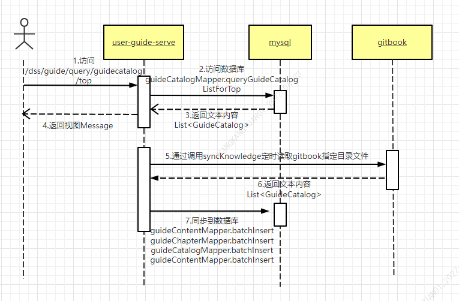

# DSS-UserGuide module design

### Introduce

The DSS user manual module is a newly added function module of DSS1.0, which is used to provide user guidance for DSS users. It contains many problems and solutions encountered during the use of DSS, and also includes some function points. Users can self-service search for solutions to problems encountered. It can also be used to associate error codes in the later stage, which supports directly locating the solutions that have been entered in the knowledge base after the pop-up error codes. The guide module stores the files in the fields of the table in the form of html. It needs to parse the md file and convert it into html. Since some files have links and need to be jumped, it is necessary to build a gitbook to display and manage these documents. In order to be efficient To synchronize the dss-guide-user module, package the files on gitLab, upload and decompress them to the specified directory of the server where gitbook is located, and scan the specified directory regularly through guide-user to achieve the purpose of synchronization.

## Introduction to the main modules of dss_guide

The DSS_Guide module mainly contains the definitions of Restful, Service, Dao, and Entity.

### GuideGroupService

It is used to solve GuideGroup's ability to add, query, modify, save, delete, etc. It also has the ability to synchronize Summary.md. The guide module can parse this file, and then locate the file that needs to be read and write it to the database regularly according to the configuration paths of the parsed directories at all levels in the file, so as to complete the synchronization. When the service is running on other servers, In order to avoid repeated installation of gitbook, the guide module needs to pass the ip of the server where the configuration file is located, and then automatically synchronize the file to the server where the guide module is located for display.

### GuideContentService

It is used to handle the save, query, update and delete operations of GuideContent.

### GuideChapterService

It is used to deal with the specific content of manual chapters, including chapter search, ID-based query, deletion, saving, etc.

### GuideCatalogService

It is used to synchronize the knowledge base, support batch insertion of directory content, and implement operations such as saving, deleting, and querying the directory structure classification.

### Core flow chart

### data structure

### dss_guide_group

Divide the grouping of dss_guide, including group_id, path (access path), title, etc.

### dss_guide_chapter

Used to store the detailed content of the dss_guide chapter, including catalog_id, title, content, content_html. Associate with the content of dss_guide_catalog.

### dss_guide_content

It is used to store the description content after grouping, and will be planned under the corresponding group. Contains title, type, content, content_html, etc.

### dss_guide_catalog

It is used to classify the content of dss_guide, which is equivalent to the directory structure of the knowledge base and has a hierarchical directory relationship.
