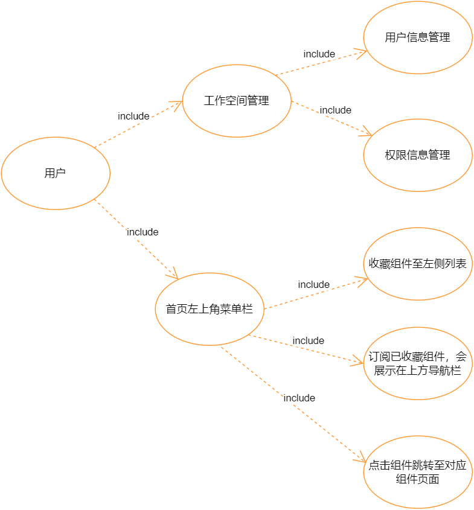

Introduce
-------------------------
Workspace：The workspace module belongs to the project service and provides the interface implementation of all the functions of the workspace. It mainly includes these interfaces: the interface for obtaining dictionary table information, the workspace menu, the crud operation interface for component permissions,
Workspace role, user's crud operation interface. The favorite interface of the menu bar component in the upper left corner of the workspace.

User use function points:

| Primary Module | Secondary Module | User Function          |
|-------------|-----------               |----------------       |
|   Workspace | Workspace Management (Workspace Admins only) | Query, Add, Edit, Delete Workspace Users    |
|             |                          |    Permission settings for the menu component of the workspace role    |
|             |                         |    Home Settings for Workspace Roles             |
|             | Menu bar in the upper left corner of the home page           |    Favorite components to the left list               |
|             |                         |    Subscribe to Favorite Components, which will be displayed in the upper navigation bar    |
|             |                         |    Click a component to jump to the corresponding component page          |

### Restful/Service class function introduction:

| Core Interface/Class | Core Function                            |
|---------------------------|------------------------------|
| DSSDictionaryRestful、DSSDictionaryServiceImpl           |  Provide dictionary information acquisition interface, query corresponding records from dictionary table through parameter key or parentKey     |
| DSSWorkspacePrivRestful、DSSWorkspacePrivServiceImpl    | Provides viewing and editing functions for the permission information of the menu component of the workspace role                 |
| DSSWorkspaceRestful、DSSWorkspaceServiceImpl            | Provides basic functional interfaces of workspace, such as creating workspace, obtaining workspace list, obtaining permission information of menu components, etc.                |
| DSSWorkspaceRoleRestful、DSSWorkspaceRoleServiceImpl   | Provides query and creation interfaces for workspace roles              |
| DSSWorkspaceUserRestful、DSSWorkspaceUserServiceImpl   | Provides an interface for adding, deleting, modifying, and querying workspace users           |

### User function UML class diagram:


## database table design

Workspace basic information table:
```roomsql
CREATE TABLE `dss_workspace` (
`id` bigint(20) NOT NULL AUTO_INCREMENT,
`name` varchar(255) DEFAULT NULL COMMENT 'workspace name',
`label` varchar(255) DEFAULT NULL COMMENT 'label',
`description` varchar(255) DEFAULT NULL  COMMENT 'description',
`create_by` varchar(255) DEFAULT NULL COMMENT 'creater',
`create_time` datetime DEFAULT NULL COMMENT 'create time',
`department` varchar(255) DEFAULT NULL COMMENT 'department',
`product` varchar(255) DEFAULT NULL COMMENT 'product，reserved field',
`source` varchar(255) DEFAULT NULL COMMENT 'reserved field',
`last_update_time` datetime DEFAULT NULL,
`last_update_user` varchar(30) DEFAULT NULL COMMENT 'last update user',
`workspace_type`  varchar(20) DEFAULT NULL comment 'workspace type',
PRIMARY KEY (`id`),
UNIQUE KEY `name` (`name`)
) ENGINE=InnoDB DEFAULT CHARSET=utf8;
```
Workspace dictionary table：
```roomsql
CREATE TABLE `dss_workspace_dictionary` (
  `id` int(11) NOT NULL AUTO_INCREMENT COMMENT 'primary key ID',
  `workspace_id` int(11) DEFAULT '0' COMMENT 'Space ID, default is 0, all spaces have',
  `parent_key` varchar(200) DEFAULT '0' COMMENT 'parent key',
  `dic_name` varchar(200) NOT NULL COMMENT 'dictionary name',
  `dic_name_en` varchar(300) DEFAULT NULL COMMENT 'dictionary english name',
  `dic_key` varchar(200) NOT NULL COMMENT 'key is equivalent to encoding, the space starts with w_, and the project is p_',
  `dic_value` varchar(500) DEFAULT NULL COMMENT 'the value corresponding to the key',
  `dic_value_en` varchar(1000) DEFAULT NULL COMMENT 'The value corresponding to the key (English)',
  `title` varchar(200) DEFAULT NULL COMMENT 'title',
  `title_en` varchar(400) DEFAULT NULL COMMENT 'english title',
  `url` varchar(200) DEFAULT NULL COMMENT 'url',
  `url_type` int(1) DEFAULT '0' COMMENT 'url type: 0-internal system, 1-external system; default is internal',
  `icon` varchar(200) DEFAULT NULL COMMENT 'icon',
  `order_num` int(2) DEFAULT '1' COMMENT 'order',
  `remark` varchar(1000) DEFAULT NULL COMMENT 'remnark',
  `create_user` varchar(100) DEFAULT NULL COMMENT 'creater',
  `create_time` datetime DEFAULT CURRENT_TIMESTAMP COMMENT 'create time',
  `update_user` varchar(100) DEFAULT NULL COMMENT 'update user',
  `update_time` datetime DEFAULT CURRENT_TIMESTAMP COMMENT 'update time',
  PRIMARY KEY (`id`),
  UNIQUE KEY `idx_unique_workspace_id` (`workspace_id`,`dic_key`),
  KEY `idx_parent_key` (`parent_key`),
  KEY `idx_dic_key` (`dic_key`)
) ENGINE=InnoDB DEFAULT CHARSET=utf8 COMMENT='data dictionary table';
```
Component Menu Information Sheet
```roomsql
CREATE TABLE `dss_workspace_menu` (
  `id` int(11) NOT NULL AUTO_INCREMENT,
  `name` varchar(64) DEFAULT NULL COMMENT 'memu name',
  `title_en` varchar(64) DEFAULT NULL COMMENT 'English title of menu',
  `title_cn` varchar(64) DEFAULT NULL COMMENT 'Chinese title of menu',
  `description` varchar(255) DEFAULT NULL COMMENT 'description',
  `is_active` tinyint(1) DEFAULT '1' COMMENT 'is active',
  `icon` varchar(255) DEFAULT NULL COMMENT 'icon',
  `order` int(2) DEFAULT NULL COMMENT 'order',
  `create_by` varchar(255) DEFAULT NULL COMMENT 'creater',
  `create_time` datetime DEFAULT NULL COMMENT 'create time',
  `last_update_time` datetime DEFAULT NULL,
  `last_update_user` varchar(30) DEFAULT NULL,
  PRIMARY KEY (`id`)
) ENGINE=InnoDB DEFAULT CHARSET=utf8;
```