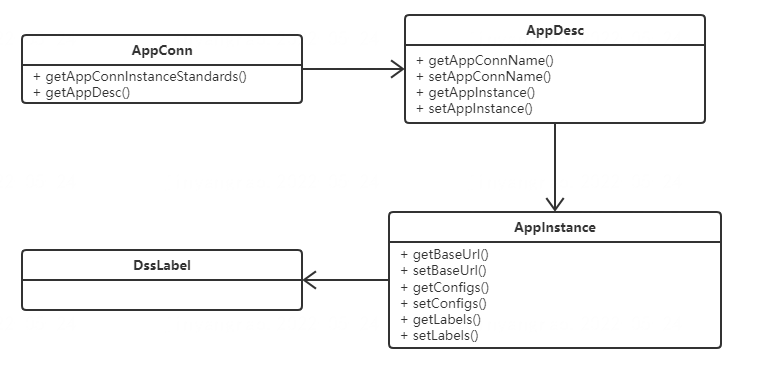
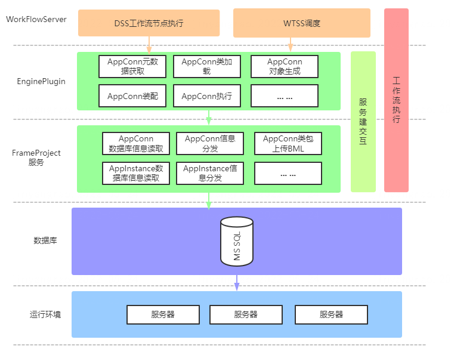
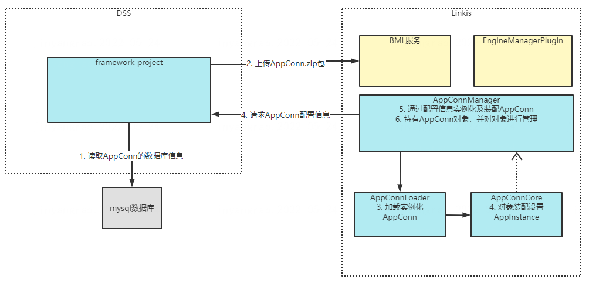

DSS-AppConn Design Documentation
------
## Introduce
&nbsp;&nbsp;&nbsp;&nbsp;The principle of the original AppJoint is to define a top-level interface AppJoint. The third party implements this interface and stores its own connection information in the DSS table, and implements a "proxy service" in DSS that communicates with the third-party system. At the initial stage of initialization , creating an instance of the service through the reflection mechanism, and using the connection information in the table, DSS can use the "proxy service" to establish HTTP communication with the third-party system, thereby invoking the third-party system. However, there are shortcomings in the design of AppJoint. Each connected application instance needs to generate an AppJoint instance. Different instances of the same application are not logically associated. The application instance AppConn of each system is DSS1.0. The top-level interface, in DSS1.0, its own orchestration mode, workflow, single-task node, etc., are all instances of AppConn. In addition, third-party systems that access DSS need to implement the AppConn interface to implement DSS. Integrate with third-party systems to call third-party applications. Logically, AppConn has a higher abstraction logic than AppJoint. AppConn is similar to a class instance, while AppJoint is similar to an instance.

### Introduction to related modules
|Level 1 Module | Level 2 Module | Function Introduction|
|-------------|-----------|----------------|
|dss-appconn|appconns|Access DSS to implement AppConn related specification implementation code|
|           |dss-appconn-core|Appconn interface and basic class definition|
|           |dss-appconn-loader|Instantiation, loading and assembly of the AppConn compiled package of the connected application|
|           |dss-appconn-manager|Interact with framework modules and manage related AppConn instance information|
|           |dss-scheduler-appconn|Abstract AppConn Definition for Scheduling System Implementation|
|           |linkis-appconn-engineplugin|Implement the relevant specifications of linkis appconn and open up the interaction between DSS AppConn and Linkis|  

| Core interface/class            | Core functions                           |
|---------------------------|------------------------------|
| DSSDictionaryRestful、DSSDictionaryServiceImpl           |  Provide dictionary information acquisition interface, query corresponding records from dictionary table through parameter key or parentKey     |
| DSSWorkspacePrivRestful、DSSWorkspacePrivServiceImpl    | Provides viewing and editing functions for the permission information of the menu component of the workspace role                 |
| DSSWorkspaceRestful、DSSWorkspaceServiceImpl            | Provides basic functional interfaces of workspace, such as creating workspace, obtaining workspace list, obtaining permission information of menu components, etc.               |
| DSSWorkspaceRoleRestful、DSSWorkspaceRoleServiceImpl   | Provides query and creation interfaces for workspace roles              |
| DSSWorkspaceUserRestful、DSSWorkspaceUserServiceImpl   | Provides an interface for adding, deleting, modifying, and querying workspace users          |

### AppConn Architecture Diagram

  

