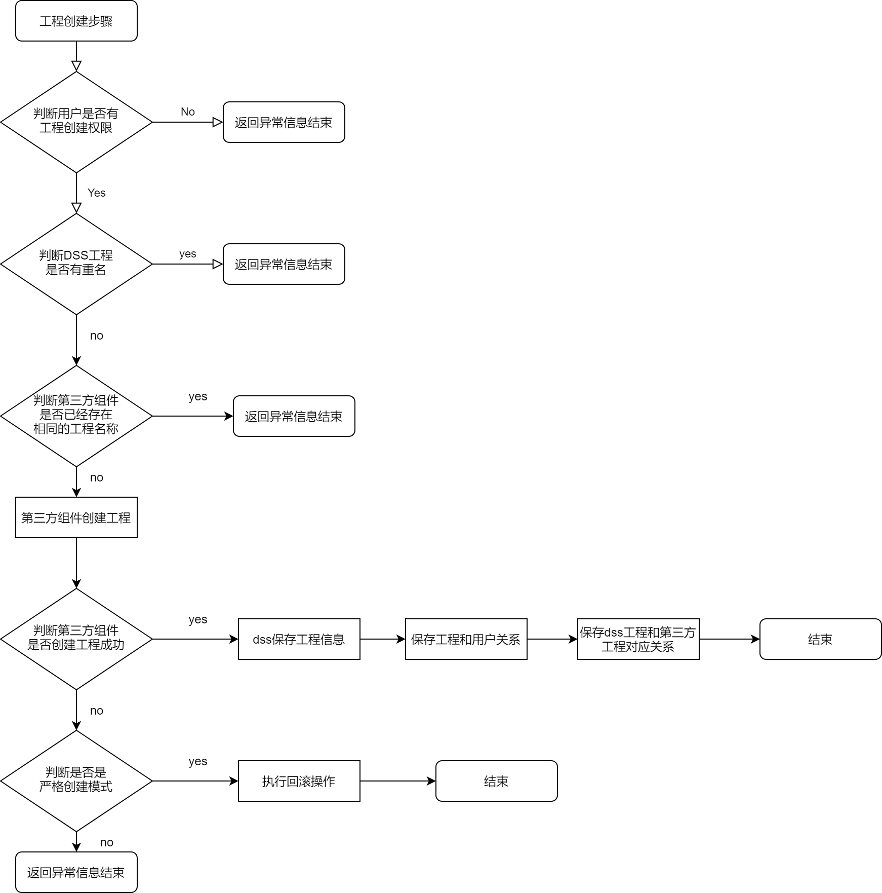
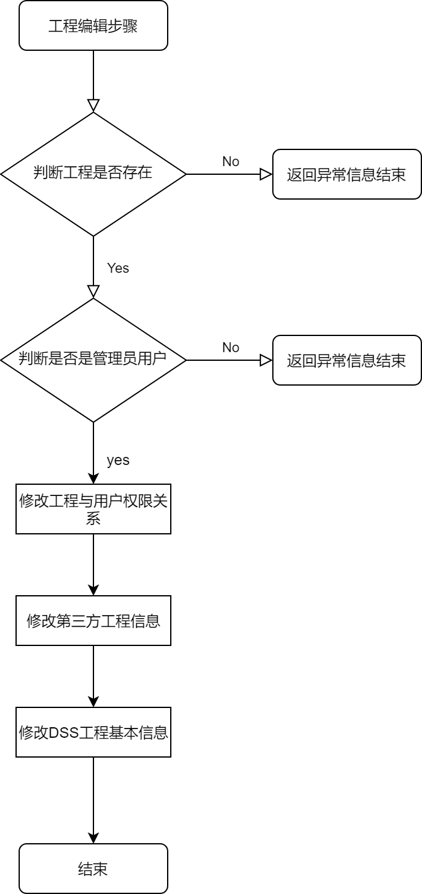

# DSS Engineering


In actual development and production, projects are often used to manage and develop a type of data application. A project can be an actual type of data application, including workflow, single task, etc. The projects under each workspace are isolated from each other.


## 1. Architecture Design

- DSS itself can create and manage projects. Including create, view, modify, delete and other functions. At the same time, DSS provides engineering integration specifications to complete the docking operation with external components.
- DSS projects are created and bound to each other synchronously with projects of external systems (or entities at the same level) through project integration specifications.
- The external system obtains the project corresponding to the user in the DSS through the project integration specification, and completes the unified management of the underlying entities.
- The external system obtains the user's project authority in DSS through the project integration specification, and further restricts the operation authority of the native project.


### 2.1.1, project creation

Brief process description: Create a DSS project 》Create a third-party application project 》Save the relationship between the project and user permissions

flow chart:



### 2.1.2, project editing

Brief process description: Edit user permission relationship 》Edit third-party project information 》Edit DSS project basic information


flow chart:



### 2.1.3, Project deletion

Brief process description: determine whether there is delete permission "delete third-party application project "delete DSS project

### 

## 3、Database table structure design

```
--dss Engineering Basic Information Sheet
dss_project:
 id                      
 name                    
 source                  
 description             
 user_id                 
 username                
 workspace_id            
 create_time             
 create_by               
 update_time             
 update_by               
 org_id                  
 visibility              
 is_transfer             
 initial_org_id          
 isArchive               
 pic                     
 star_num                
 product                 
 application_area        
 business                
 is_personal             
 create_by_str           
 update_by_str           
 dev_process             
 orchestrator_mod        
 visible
 
 --dss project and user authority relationship table
 dss_project_user:
  id                 
  project_id         
  username           
  workspace_id       
  priv  
  last_update_time 
  
 --Relationship between third-party application engineering and dss engineering
 dss_appconn_project_relation:  
  id                           
  project_id                   
  appconn_instance_id          
  appconn_instance_project_id

```


