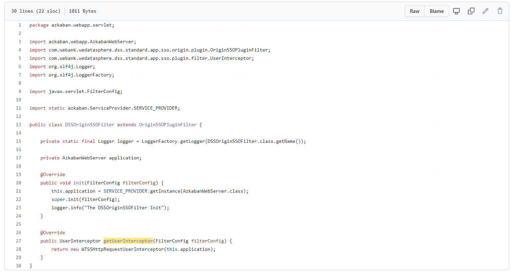

# AppConn Development Guide

## 1. Introduction

The third-party system accesses DSS by implementing an ```AppConn```. DSS provides a variety of ```AppConn``` to facilitate the fast access of third-party systems in different application scenarios.

The following is a detailed introduction to the various basic ``AppConn``, each of which represents a capability of the DSS framework abstraction:

- ```OnlySSOAppConn``. If your third-party system wants to complete SSO login-free jump with DSS, you need to use the capabilities provided by this AppConn.
- ```OnlyStructureAppConn```. If your third-party system wants to have a unified organizational structure with DSS, such as unified management operations such as project creation, update, and deletion, and unified management of role rights management, you need to inherit this AppConn.
- ```OnlyDevelopmentAppConn``. This AppConn needs to be implemented if your third-party system wants to be integrated as a node of the DSS workflow.
- ````OptionalAppConn```. The AppConn is an optional non-mandatory implementation of the AppConn specification. It is used to assist the third-party AppConn to provide some special operation capabilities. These operations have nothing to do with the framework logic of DSS, and are not the capabilities that the DSS framework requires the third-party AppConn to have.

On top of the above basic AppConn, DSS provides several combined AppConns to facilitate integration and docking, which are:

- ```SchedulerAppConn```. This AppConn is a subclass of ```OnlySSOAppConn``` and ```OnlyStructureAppConn```, used to synchronize a DSS workflow to a third-party scheduling system, supplementing the scheduling capabilities of DSS workflow; if you want to connect with other schedulers system, you need to implement the AppConn.
- ```SecondlyAppConn```. It is a subclass of ```OnlySSOAppConn``` and ```OnlyStructureAppConn```, indicating that the third-party system wants to get through both SSO and organizational structure.
- ```ThirdlyAppConn```. It is a subclass of ```OnlySSOAppConn``, ```OnlyStructureAppConn`` and ```OnlyDevelopmentAppConn```, indicating that the third-party system not only wants to get through the SSO and organizational structure, but also wants to be integrated as a node of the DSS workflow Come in.

You can choose the corresponding ``AppConn``` to implement according to your actual needs.

## 2. Detailed introduction of basic AppConn

The specific implementation of ```AppConn``` includes the following layers, the first layer is the ```AppConn``` layer, the second layer is the ```AppStandard``` specification layer, and the third layer is ``` The Service```` layer, the fourth layer is the ````Operation``` layer, the main business logic is implemented in the ```Operation``` layer, and the parameter transmission is unified using ```Ref`` ` Implementation class.

Its organizational structure relationship is expressed in a tree structure as follows:

```html
|-- [OnlySSOAppConn](#21-onlyssoappconn--open-sso-login-free jump): The third-party system and DSS complete the SSO login-free jump, the default implementation has been provided, and the user does not need any method of this AppConn.
|   |-- SSOIntegrationStandard: SSO login-free jump specification for DSS and third-party systems, the default implementation has been provided, and users do not need any methods of this AppConn.
|   |   |-- SSORequestService: Provides a general service capability that can send front-end or back-end requests to third-party AppConn systems integrated with DSS.
|   |   |   |-- SSORequestOperation: Send front-end or back-end requests to third-party AppConn systems integrated with DSS.
|   |   |-- SSOPluginService: Corresponding to `SSOBuilderService`, after the third-party system introduces the DSS SSO Jar, the Jar will use the Service to parse the background `HttpServletRequest` of the third-party system to obtain the required DSS entity information.
|   |   |   |-- SSOMsgParseOperation: **_No need to pay attention, if you are interested, please refer to the architecture design document_**.
|   |   |   |-- DssMsgCacheOperation::**_No need to pay attention, if you are interested, please refer to the architecture design document_**.
|   |   |   |-- WorkspaceInfoOperation::**_No need to pay attention, if you are interested, please refer to the architecture design document_**.
|   |   |-- [SSOUserService](#214-dss-user-sync-with-third-party-appconn-): DSS user sync service with third-party AppConn users. **_Can be implemented on demand_**.
|   |   |   |-- SSOUserCreationOperation: Used to request a third-party AppConn to create a user with the same name.
|   |   |   |-- SSOUserUpdateOperation: Used to modify the basic information of third-party AppConn users.
|   |   |   |-- SSOUserGetOperation: Used to request the third-party AppConn to obtain the user information of the same name.
|   |   |   |-- SSOUserDeletionOperation: reserved interface for deleting third-party AppConn users.
|   |   |-- SSOBuilderService: Corresponding to `SSOPluginService`, when initiating an Http request to a third-party system, it is used to spell out the special URL of a third-party system that supports SSO password-free access capability.
|   |   |   |-- SSOUrlBuilderOperation: **_No need to pay attention, if you are interested, please refer to the architecture design document_**.
|   |   |   |-- DssMsgBuilderOperation: **_No need to pay attention, if you are interested, please refer to the architecture design document_**.
|-- [OnlyStructureAppConn](#22-onlystructureappconn--access-dss-organizational structure specification): Unify the organizational structure with DSS, such as the unified management operations of creating, updating, and deleting projects.
|   |-- StructureIntegrationStandard: The second-level specification of DSS, which is the organizational structure specification, mainly provides engineering management service capabilities, role management service capabilities and third-party system state management capabilities.
|   |   |-- ProjectService: An engineering system used to connect DSS projects with connected third-party systems to realize collaborative management of projects.
|   |   |   |-- ProjectCreationOperation: Requests the third-party system to create a third-party refProject that is associated one-to-one with the DSS project.
|   |   |   |-- ProjectUpdateOperation: Requests a third-party system to update the associated third-party refProject.
|   |   |   |-- ProjectDeletionOperation: Requests the third-party system to delete the associated third-party refProject.
|   |   |   |-- ProjectSearchOperation: Request a third-party system to query the project that contains projectName.
|   |   |-- RoleService: Unified role specification, used to connect the role system between DSS and each integrated access system. **_Reserved specification, no need to implement _** for the time being.
|   |   |   |-- RoleCreationOperation: Requests the third-party system to create a third-party refRole that is one-to-one associated with the DSS role.
|   |   |   |-- RoleUpdateOperation: Requests a third-party system to update a third-party refRole that is already one-to-one associated with a DSS role.
|   |   |   |-- RoleDeletionOperation: Requests the third-party system to delete the associated third-party refRole.
|   |   |   |-- RoleUrlOperation: When the user sets the permission information of this role of the third-party system on the DSS front-end, it returns the jumpURL of the front-end jumping page of the role of the third-party system.
|   |   |-- AppStatusService: The third-party application status check specification. **_Reserved specification, no need to implement _** for the time being.
|   |   |   |-- AppStatusOperation: Check the status of the third-party system. If the third-party system is found to be abnormal, it can be alerted in time or displayed to the front-end users.
|-- [OnlyDevelopmentAppConn](#23-onlydevelopmentappconn--access-dss-development process specification): If your third-party system wants to be integrated as a node of DSS workflow, you need to implement this AppConn.
|   |-- DevelopmentIntegrationStandard: DSS development process specification. Can directly inherit `AbstractDevelopmentIntegrationStandard`, including five `DevelopmentService` that need to be implemented by the user.
|   |   |-- RefCRUDService: Job management specification, mainly used to manage jobs of third-party application tools (named refJob).
|   |   |   |-- RefCreationOperation, the creation operation of the Job (named refJob) of the third-party application tool.
|   |   |   |-- RefCopyOperation, the copy operation of the Job (named refJob) of the third-party application tool.
|   |   |   |-- RefUpdateOperation, the update operation of the Job (named refJob) of the third-party application tool.
|   |   |   |-- RefDeletionOperation, the delete operation of the Job (named refJob) of the third-party application tool.
|   |   |-- RefExecutionService: Job execution specification, mainly used to execute jobs of third-party application tools.
|   |   |   |-- RefExecutionOperation: Execute the refJob of the third-party AppConn.
|   |   |-- RefExportService: Job export specification, mainly used to export jobs of third-party application tools.
|   |   |   |-- RefExportOperation: Supports exporting third-party AppConn jobs as Linkis BML materials or `InputStream` byte streams.
|   |   |-- RefImportService: Job import specification, mainly used to import jobs of third-party application tools.
|   |   |   |-- RefImportOperation: By passing in Linkis BML material or `InputStream` byte stream, the third-party AppConn needs to support converting it into a refJob.
|   |   |-- RefQueryService: Job query specification, mainly used to open the Job page of a third-party application tool.
|   |   |   |-- RefQueryJumpUrlOperation: used to return a jumpURL that can be jumped when the user double-clicks the workflow node on the front end.
|   |   |   |-- RefQueryOperation: Get some information about the refJob of the third-party AppConn under refProject.
|-- [OptionalAppConn](#24-optionalappconn--optional non-mandatory implementation-appconn-specification): Assist third-party AppConn to provide some special `Operation` capabilities.
|   |-- OptionalIntegrationStandard: Optional specification.
|   |   |-- OptionalService: A generic `Service` service provided for third-party AppConn to build some `Operation` with special capabilities for use by DSS-embedded application tools.
|   |   |   |-- OptionalOperation: An `Operation` for the third-party system with special capabilities.
```

### 2.1 OnlySSOAppConn - get through SSO without login jump

If your third-party system wants to complete SSO login-free jump with DSS, you need to use the capabilities provided by this AppConn.

`OnlySSOAppConn` provides the default abstract class `AbstractOnlySSOAppConn`, which already provides a default implementation of the first-level specification.

**_Please note: In general, the relevant `AppConn` subclasses will actively inherit this abstract class, so you do not need to implement any methods of `OnlySSOAppConn`_**.

If your third-party system only wants to implement SSO login-free jump with DSS, then you don't even need to re-write an `OnlySSOAppConn` implementation, you can just use `SSOAppConn` directly.

How to use `SSOAppConn`? Just add a new record to the dss_appconn table in DSS, specifying the reference field as sso.

For the introduction of the dss_appconn table, please refer to: [Introduction to the dss_appconn table] (Third-party system access DSS development guide.md#331-dss_appconn-table).

The core of **_`OnlySSOAppConn` is to require a third-party AppConn to import the SSO Jar package of DSS as required to complete the code implementation and introduction of related interfaces, as follows_**:

DSS provides the core SSO Jar package for SSO login-free jump. The third-party system needs to import the SSO Jar package and trust the DSS user in the Filter to complete the user's login-free jump.

The design scheme of DSS SSO login-free jump is as follows:


At present, the third-party AppConn system can connect to the first-level SSO login-free jump specification of DSS in two ways: one is the connection method of Spring Web applications; the other is the connection method of non-Spring Web applications.

#### 2.1.1 Spring Web application implements DSS first-level specification

Define a ```Configuration```, as shown below:

```java
@Configuration
public class DSSConfiguration {

    @Bean
    public FilterRegistrationBean<SSOPluginFilter> dssSSOFilter(@Autowired SSOPluginFilter ssoPluginFilter) { 
        FilterRegistrationBean<SSOPluginFilter> filter = new FilterRegistrationBean<>();
        filter.setName("dssSSOFilter");
        filter.setFilter(ssoPluginFilter); 
        // Specify the priority, the order must be before the user login judgment filter of the third-party application
        filter.setOrder(-1); 
        return filter; 
    }
} 

```

Please note: If ```@Autowired SSOPluginFilter ssoPluginFilter``` is introduced by means of dependency injection, you need to add ```com.webank.wedatasphere``` to ```@ComponentScan(basePackages=” of SpringBoot main class com.webank.wedatasphere”)````; otherwise, use the following directly:
```java
@Configuration
public class DSSConfiguration {

    @Bean
    public FilterRegistrationBean<SSOPluginFilter> dssSSOFilter() { 
        FilterRegistrationBean<SSOPluginFilter> filter = new FilterRegistrationBean<>();
        filter.setName("dssSSOFilter");
        filter.setFilter(new SpringOriginSSOPluginFilter());
        // Specify the priority, the order must be before the user login judgment filter of the third-party application
        filter.setOrder(-1); 
        return filter; 
    }
} 
```

#### 2.1.2 Non-Spring web application

You need to inherit ``OriginSSOPluginFilter`` by yourself, and add the filter to the web container. The order must be before the user login judgment filter of the third-party application.

The specific code reference is shown in the following figure:
https://github.com/WeBankFinTech/Schedulis/blob/branch-0.6.1/azkaban-web-server/src/main/java/azkaban/webapp/servlet/DSSOriginSSOFilter.java



#### 2.1.3 Implements UserInterceptor

Please note: Whether it is a Spring Web application or a non-Spring Web application, you need to implement a ```UserInterceptor ```.

According to different scenarios, DSS provides the following three ``UserInterceptor``` sub-interfaces:

- ``DSSInternalUserInterceptor``: If the third-party application is a DSS internal application, implement this interface;
- ``HttpRequestUserInterceptor````: If the user login information (such as: User object) of the third-party application is stored in cookies, you need to implement this interface. The main purpose of this interface is to hope that the third-party system will write the user Go to ``HttpServletRequest```` and return, so that the latter Filter can detect the user in the cookie and release it directly. You can refer to the implementation of Schedulis: https://github.com/WeBankFinTech/Schedulis/blob/branch-0.6.1/azkaban-web-server/src/main/java/azkaban/webapp/servlet/WTSSHttpRequestUserInterceptor.java
- ``HttpSessionUserInterceptor``: If the user login information of the third-party application (such as: User object) is stored in the HttpSession, you need to implement this interface. The main purpose of this interface is to hope that the third-party system will write the user to ``HttpSession``, so that the following Filter can detect the user in the cookie and let it go directly;

Please note: **If it is a Spring Web application, you need to mark the implemented ```UserInterceptor``` with ```@Component```, so that ```SpringOriginSSOPluginFilter``` can be loaded into the ``` UserInterceptor```. **

#### 2.1.4 DSS user synchronization with third-party AppConn

From DSS1.1.0, the DSS admin module provides the function of adding LDAP users.

Since some upper-layer application tools themselves also provide user management functions (store user information in the database), in order to open up the user system between DSS users and third-party AppConn, `OnlySSOAppConn` also provides a `SSOUserService` service, which is used when DSS users When a user adds or modifies, it can support synchronously adding or modifying third-party AppConn users.

Since `SSOUserService` is not a service that must be implemented, if your third-party application does not have user management functions, you can skip this section directly.

If you want to get through the user system of third-party AppConn and DSS, please directly implement the following `Operation`:

- `SSOUserCreationOperation`: Added user operation, when the DSS Admin module creates a new user, or when the user logs in to DSS for the first time, synchronously requests the third-party AppConn to create a user.
- `SSOUserUpdateOperation`: update user operation, when the DSS Admin module updates a user, synchronously request a third-party AppConn to update a user.
- `SSOUserDeletionOperation`: delete user operation, when the DSS Admin module deletes a user, synchronously requests the third-party AppConn to delete a user.
- `SSOUserGetOperation`: Request the third-party AppConn to obtain the user information of the third-party AppConn with the unique English username username.

You only need to implement these four abstract classes directly in AppConn, no need to implement a `SSOUserService` manually, the DSS framework will automatically recognize and load these four operations.

### 2.2 OnlyStructureAppConn - Access to DSS Organizational Structure Specification

```OnlyStructureAppConn``` requires that the user must return a ```StructureIntegrationStandard``` object, which is: DSS organization structure specification.

Users can directly inherit ```AbstractStructureIntegrationStandard```, which contains three ```StructureService``` that need to be implemented by users, namely:

- ``ProjectService```, engineering integration specification. It is used to open up the engineering system of DSS engineering and access third-party application tools, and realize the collaborative management of engineering.
- ``RoleService``, the role integration specification. This specification is a reserved specification, and the DSS framework layer has not yet been connected with these two specifications, and the user can directly return null.
- ``AppStatusService``, the third-party application status check specification. This specification is a reserved specification, and the DSS framework layer has not yet been connected with these two specifications, and the user can directly return null.

#### 2.2.1 Engineering Integration Specification

``ProjectService``` realizes the unified creation, update, deletion and duplicate checking of projects. The project specification structure is shown in the following figure:


##### 2.2.1.1 StructureOperation Introduce

The engineering integration specification ``ProjectService``, requires that the ```StructureOperation``` must be implemented as follows:

- ``ProjectCreationOperation``, the project creation protocol.
- ``ProjectUpdateOperation``, project update protocol.
- ``ProjectDeletionOperation``, the project deletion protocol.
- ``ProjectSearchOperation``, the project duplication checking protocol.

The interface definition of ``ProjectCreationOperation``` is given below. Other ProjectOperations also provide rich interface annotations, which will not be posted here.

```java
    import com.webank.wedatasphere.dss.standard.app.structure.StructureOperation;
    import com.webank.wedatasphere.dss.standard.app.structure.project.ref.DSSProjectContentRequestRef;
    import com.webank.wedatasphere.dss.standard.app.structure.project.ref.ProjectResponseRef;
    import com.webank.wedatasphere.dss.standard.common.exception.operation.ExternalOperationFailedException;

    public interface ProjectCreationOperation<R extends DSSProjectContentRequestRef<R>>
            extends StructureOperation<R, ProjectResponseRef> {
    
        /**
         * This method attempts to request the third-party utility to create a third-party refProject that is associated one-to-one with the DSS project.
         * If the creation is successful, please return a ProjectResponseRef containing the project ID (named refProjectId) of the third-party application tool,
         * So that DSS can then use refProjectId to manage this project (named refProject) of the third-party utility.
         * <br>
         * The returned refProjectId is the basis for other ProjectOperation projects that can operate this third-party application tool. DSS is calling other
         * During ProjectOperation, the refProjectId will be passed in as a method parameter, so that the user can normally find the corresponding refProject and perform the corresponding operation.
         * @param projectRef contains DSS project information.
         * @return returns a ProjectResponseRef containing refProjectId
         * @throws ExternalOperationFailedException Thrown if an exception occurs during creation.
         */
        ProjectResponseRef createProject(R projectRef) throws ExternalOperationFailedException;
    
    }
```

As can be seen from the above, ```ProjectCreationOperation``` is a generic interface with ```<R extends DSSProjectContentRequestRef<R>>```, which requires the user's implementation class to specify a specific generic type.

Please note: each ``ProjectOperation``` interface is a generic interface, the user must specify the appropriate generic class as required when implementing, so that the DSS framework layer can normally find the ```ProjectRequestRef``` and complete it successfully transfer.

It is recommended that users inherit ```AbstractStructureOperation``` when implementing the corresponding ```ProjectOperation```. The following is an example of ```VisualisAppConn```:

```java
    public class VisualisProjectCreationOperation extends AbstractStructureOperation<DSSProjectContentRequestRef.DSSProjectContentRequestRefImpl, ProjectResponseRef>
            implements ProjectCreationOperation<DSSProjectContentRequestRef.DSSProjectContentRequestRefImpl> {
    }
```

##### 2.2.1.2 Introduction to ProjectRequestRef System of StructureOperation

Here we will focus on the ``ProjectOperation``` method entry parameter ```ProjectRequestRef``` and return value ```ProjectResponseRef``` system.

According to the needs, ``ProjectRequestRef``` mainly has the following basic definitions:

- ```DSSProjectContentRequestRef```, contains DSS project information, such as: ```DSSProject``` object, DSS project permission information (mainly accessUsers, editUsers, releaseUsers). It is mainly provided to ```ProjectCreationOperation``` and ```ProjectUpdateOperation``` to be used when creating and updating projects of third-party applications.
- ```RefProjectContentRequestRef```, contains the project ID information of the third-party application tool, such as: ```refProjectId```, which is convenient for users to find the refProject corresponding to the third-party application tool and perform corresponding operations, such as: `` `ProjectDeletionOperation```, ```ProjectUpdateOperation``` and ```ProjectSearchOperation``` are used when deleting, updating and searching.
- ```ProjectUpdateRequestRef``` is a subclass of ```DSSProjectContentRequestRef``` and ```RefProjectContentRequestRef```. When a third-party application tool updates a project, it needs not only the relevant information of the DSS project, but also the information of the refProject. ID information.

Each of the above ```ProjectRequestRef``` has provided a specific implementation class in the corresponding interface, you can directly import and use when implementing the corresponding ```ProjectOperation```, such as ```DSSProjectContentRequestRef.DSSProjectContentRequestRefImpl ````.

##### 2.2.1.3 Introduction to ProjectResponseRef System of StructureOperation

The ```ProjectResponseRef``` is relatively simple, only requires the user to return ```refProjectId```, the DSS framework will store the ```refProjectId``` in the database, which is convenient for calling each ```ProjectOperation`` `, you can pass in ```refProjectId``` as needed.

Among them, only ```ProjectCreationOperation``` and ```ProjectSearchOperation``` require a ```ProjectResponseRef``` containing a ```refProjectId```, while ```ProjectUpdateOperation``` and ` ``ProjectDeletionOperation``` is only required to return a ```ResponseRef```, which simply tells the DSS framework whether the delete and update operations were successful.

You can also refer to the implementation of VisualisAppConn: [Please click me to view](https://github.com/WeBankFinTech/Visualis/tree/master/visualis-appconn/src/main/java/com/webank/wedatasphere/dss/appconn/visualis/project)

### 2.3 OnlyDevelopmentAppConn - access to DSS development process specification

```OnlyDevelopmentAppConn``` requires that the user must return a ```DevelopmentIntegrationStandard``` object, which is: DSS development process specification.

DSS 开发流程规范用于打通并关联 DSS 的 Job 与集成的第三方 AppConn 的一个 Job，并在 DSS 的编排器（如：DSS 工作流）中对第三方 AppConn 的 Job 进行统一管理，DSS 编排器会提供通用的从需求 -> 设计 -> 开发 -> 调试 -> 导出 -> 导入 -> 发布 的全流程数据应用开发管理能力。

Users can directly inherit ```AbstractDevelopmentIntegrationStandard```, which contains five ```DevelopmentService``` that need to be implemented by users, namely:

- ```RefCRUDService```, Job management specification, mainly used to manage jobs of third-party application tools (named ```refJob```).
- ``RefExecutionService``, Job execution specification, mainly used to execute jobs of third-party application tools.
- ``RefExportService``, Job export specification, mainly used to export jobs of third-party application tools.
- ``RefImportService``, Job import specification, mainly used to import jobs of third-party application tools.
- ``RefQueryService``, Job query specification, mainly used to open the Job page of third-party application tools.

At present, DSSOrchestrator mainly needs to use development process specifications, such as: DSS workflow, addition, deletion, modification, and query operations of workflow nodes of various third-party application tools, import and export operations, real-time node execution, and opening third-party node front-end pages and other operations.

##### 2.3.1.1 DevelopmentService Introduce

Since the architecture design of each ``DevelopmentService```` is exactly the same, here is a detailed introduction to the Job management specification ```RefCRUDService```.

The ```DevelopmentOperation``` that must be implemented by the Job Management Specification ```RefCRUDService``` is as follows:

- ```RefCreationOperation```, the creation protocol for the Job (named ```refJob```) of the third-party utility.
- ```RefCopyOperation```, the copy protocol for the Job (named ```refJob```) of a third-party utility.
- ```RefUpdateOperation```, the update protocol for the third-party utility's Job (named ```refJob```).
- ```RefDeletionOperation```, the deletion protocol for the third-party utility's Job (named ```refJob```).

The interface definition of ```RefCreationOperation``` is given below, and other ```DevelopmentOperation``` also provide rich interface comments, which will not be posted here.

```java
    import com.webank.wedatasphere.dss.standard.app.development.ref.DSSJobContentRequestRef;
    import com.webank.wedatasphere.dss.standard.app.development.ref.RefJobContentResponseRef;
    import com.webank.wedatasphere.dss.standard.common.exception.operation.ExternalOperationFailedException;
    
    public interface RefCreationOperation<K extends DSSJobContentRequestRef<K>>
            extends DevelopmentOperation<K, RefJobContentResponseRef> {
    
        /**
         * This method will attempt to request a third-party utility to create a third-party refJob under refProject that is one-to-one associated with the DSS Job.
         * If the creation is successful, please return a RefJobContentResponseRef containing the job ID (named refJobId) of the third-party application tool,
         * So that DSS can use refJobId to manage the refJob under the refProject corresponding to the third-party application tool.
         * <br>
         * The returned refJobId is the basis for other DevelopmentOperation jobs that can operate on this third-party utility. DSS is calling other
         * During DevelopmentOperation, the refJobId will be passed in as a method parameter, so that the user can normally find the corresponding refJob and perform the corresponding operation.
         *
         */
        RefJobContentResponseRef createRef(K requestRef) throws ExternalOperationFailedException;
    
    }

```

Here we focus on the implementation reference of ```RefQueryJumpUrlOperation``` and ```RefExecutionOperation```.

The following is an implementation reference for ```RefQueryJumpUrlOperation```:

```java
    public class TestRefQueryOperation 
        extends AbstractDevelopmentOperation<ThirdlyRequestRef.QueryJumpUrlRequestRefImpl, QueryJumpUrlResponseRef>
        implements RefQueryJumpUrlOperation<ThirdlyRequestRef.QueryJumpUrlRequestRefImpl, QueryJumpUrlResponseRef> {
        
        public QueryJumpUrlResponseRef query(ThirdlyRequestRef.QueryJumpUrlRequestRefImpl ref) throws ExternalOperationFailedException {
            String jumpUrl = ref.getSSOUrlBuilderOperation().setReqUrl(getBaseUrl()).redirectTo(getBaseUrl() + "/jobUi/1")
                            // nodeId is mainly provided for "open first, then create" type of workflow nodes. For details, please refer to How to Add Workflow Nodes in DSS Workflow #1.2 Special Connections for Third-Party Node Types
                            .addQueryParameter(QueryJumpUrlConstant.NODE_ID.getKey(), QueryJumpUrlConstant.NODE_ID.getValue())
                            .addQueryParameter("projectId", ref.getProjectRefId().toString())
                            // The id value of the refJob corresponding to the third-party system, the "id" here is just an example, the third-party system is not necessarily the name, it depends on RefCreationOperation
                            // The refJobContent value brought back.
                            .addQueryParameter("id", String.valueOf(ref.getRefJobContent().get("id")))
                            .getBuiltUrl();
            return QueryJumpUrlResponseRef.newBuilder().setJumpUrl(jumpUrl).success();
        }
    }
```

The following is an implementation reference for ```RefExecutionOperation```:

```java
    public class TestRefExecutionOperation 
        extends LongTermRefExecutionOperation<RefExecutionRequestRef.RefExecutionProjectWithContextRequestRef>
        implements Killable {
        
        /**
         * Asynchronously submitted to the third-party AppConn, requesting the execution of the refJob.
         * Usually, the third-party AppConn will return an executionId, please put the executionId into {@code RefExecutionAction},
         * So that the following state(), result() and kill() methods can request the third-party AppConn to operate through the executionId in this RefExecutionAction.
         * @return contains the RefExecutionAction of the executionId
         * @throws ExternalOperationFailedException Thrown when the submission fails
         */    
        @Override
        protected RefExecutionAction submit(RefExecutionRequestRef.RefExecutionProjectWithContextRequestRef requestRef) throws ExternalOperationFailedException {
            // submitTo is pseudocode, which means submitting a request to a third-party system and obtaining the executionId
            String executionId = submitTo(requestRef);
            // Please define an implementation class of AbstractRefExecutionAction to store the extra information you want
            AbstractRefExecutionAction action = new AbstractRefExecutionAction(){};
            action.setExecutionRequestRefContext(requestRef.getExecutionRequestRefContext());
            action.setId(id);
            return action; 
        }
    
        /**
         * Get the status of a refJob that has been submitted to a third-party AppConn.
         * You can also get the status of refJob and the execution progress of refJob in this method, and then call
         * The RefExecutionAction.getExecutionRequestRefContext().updateProgress() method updates the execution progress of the refJob,
         * So that DSS can directly display the real-time progress information of the refJob on the front end.
         * @param action contains RefExecutionAction of executionId
         * @return returns the state of refJob
         * @throws ExternalOperationFailedException Thrown when getting status fails
         */
        @Override
        public RefExecutionState state(RefExecutionAction action) throws ExternalOperationFailedException {
            // getStateFrom is pseudo code representing the state of requesting executionId from a third-party system
            String state = getStateFrom(action);
            // toRefExecutionState is pseudo code that translates the state of the third-party system into RefExecutionState
            RefExecutionState state = toRefExecutionState(state);
            // (Optional) You can also get the execution progress of refJob and update it at the same time
            // (Not required) getProgressFrom is pseudocode, which indicates the progress of requesting executionId from the third-party system
            long progress = getProgressFrom(action);
            // (optional) update progress
            action.getExecutionRequestRefContext().updateProgress(progress);
            return state;
        }

        /**
         * Get the result of a refJob that has been submitted to a third-party AppConn.
         * Please note: This method will only be called when the state returned by the state() method is successful.
         * @param action contains RefExecutionAction of executionId
         * @return returns the result of refJob
         * @throws ExternalOperationFailedException Thrown when the result fails to be obtained
         */
        @Override
        public ExecutionResponseRef result(RefExecutionAction action) throws ExternalOperationFailedException {
            // Please confirm first: Does the task of executionId have a result set? If there is a result set, do you want to make it available to downstream workflow nodes?
            // If you don't want either, just simply return the result, like this:
            if(isSucceed) {
                return ExecutionResponseRef.newBuilder().success();
            } else {
                return ExecutionResponseRef.newBuilder().setException(t).build();
            }
            // If you want both, you need to write the result set as follows:
            // Please confirm the result set type first. For details, please refer to the result set type supported by ExecutionRequestRefContext
            // Here we take the table type result set as an example
            ResultSetWriter resultSetWriter = null;
            try {
                resultSetWriter = action.getRequestRef().getExecutionRequestRefContext().createTableResultSetWriter();
                // getColumnsFrom is pseudo code to get all field information
                List<Column> columns = getColumnsFrom(action);
                resultSetWriter.addMetaData(new TableMetaData(columns.toArray(new Column[0])));
                // getDataFrom is pseudo code to get all table data
                List<List<Object>> resultList = getDataFrom(action);
                if(resultList != null && !resultList.isEmpty()) {
                    resultList.forEach(list -> resultSetWriter.addRecord(new TableRecord(list.toArray())));
                }
                resultSetWriter.flush();
                action.getRequestRef().getExecutionRequestRefContext().sendResultSet(resultSetWriter);
            } catch (Exception e) {
                LOGGER.error("fetch result failed!", e);
                // To facilitate troubleshooting, you can also use the following methods to print more information
                action.getRequestRef().getExecutionRequestRefContext().appendLog("Richer log information.");
                throw new ExternalOperationFailedException(90176, "fetch result failed!", e);
            } finally{
                IOUtils.closeQuietly(resultSetWriter);
            }
            return ExecutionResponseRef.newBuilder().success();
        }

        /**
         * Request to kill the refJob of the third-party AppConn.
         * Note: also return true if refJob has completed execution (success or failure).
         * @param action contains RefExecutionAction of executionId
         * @return returns the result of kill refJob, true for kill success, false for kill failure
         */
        @Override
        public boolean kill(RefExecutionAction action) {
            //killFrom is pseudocode, which means to request kill executionId from a third-party system
            return killFrom(action);
        }

    }
```

It should be noted that all ``DevelopmentOperation``` are also generic interfaces, and the user must specify the appropriate generic class as required when implementing, so that the DSS framework layer can normally find the ```DevelopmentRequestRef``` The call completed successfully.

It is recommended that users inherit ```AbstractDevelopmentOperation``` when implementing the corresponding ```DevelopmentOperation```. The following is an example of ```VisualisAppConn```:


##### 2.3.1.2 DevelopmentRequestRef Introduce

``DevelopmentRequestRef``` The system is more complicated, so let's start with the basic definition:

- ```DSSJobContentRequestRef```, contains the information of the DSS workflow node, ```dssJobContent``` stores the basic information of the workflow node, all keys have been included in ```DSSJobContentConstant```.
- ```RefJobContentRequestRef```, contains the refJob ID information of the third-party application tool, such as: ```refJobContent```, which is convenient for users to find the refJob corresponding to the third-party application tool and perform corresponding operations, such as: `` `RefUpdateOperation```, ```RefDeletionOperation```, etc. are used in delete, update and lookup.
- ``DSSContextRequestRef``, contains the contextId information of the DSS workflow.
- ``ProjectRefRequestRef``, contains the refProjectId of the third-party application tool.
- ````UpdateRequestRef```, a sub-interface of ````DSSJobContentRequestRef``` and ```RefJobContentRequestRef```.
- ```CopyRequestRef```, is a sub-interface of ```RefJobContentRequestRef```, and contains the copied workflow version information.
- ```ImportRequestRef```, a sub-interface of ```CopyRequestRef```, contains resourceMap , which represents the metadata file of the workflow node, through which the workflow node can be restored.
- ```QueryJumpUrlRequestRef```, including ```SSOUrlBuilderOperation```, can help to encapsulate the URL of the front-end page corresponding to the third-party system refJob.

We also provide specific implementation classes for each of the above ```DevelopmentRequestRef```, there are currently two implementation systems: ```OnlyDevelopmentRequestRef``` and ```ThirdlyRequestRef```.

When you read the source code, you can see that ```OnlyDevelopmentRequestRef``` and ```ThirdlyRequestRef``` define exactly the same subclass,
The only difference is that ```OnlyDevelopmentRequestRef``` is for third-party ```AppConn`` that does not have a project concept (ie its corresponding ```AppConn``` does not implement ```OnlyStructureAppConn```). ` used,
And ```ThirdlyRequestRef``` is for those third-party ```AppConn``` with project concept.

It should be noted that each ```DevelopmentRequestRef``` implementation class of ```ThirdlyRequestRef``` and ```OnlyDevelopmentRequestRef``` also defines the implementation class of each scene as needed. You can, according to your actual needs, Select the corresponding implementation class to fill in the generic type required by each ``DevelopmentOperation```.

Here is an example of ```RefCreationOperation```.

Since Visualis has the concept of a project, and Visualis has opened up the context capability of DSS workflow (that is, the result set of the upstream node can be directly used as the view of the Visualis widget for visual chart analysis, so the definition of ```VisualisRefCreationOperation``` is as follows:

```java
public class VisualisRefCreationOperation
        extends VisualisDevelopmentOperation<ThirdlyRequestRef.DSSJobContentWithContextRequestRef, RefJobContentResponseRef>
        implements RefCreationOperation<ThirdlyRequestRef.DSSJobContentWithContextRequestRef> {
    // Omit its internal specific implementation method...
        }
```

```VisualisRefCreationOperation``` selected ```ThirdlyRequestRef.DSSJobContentWithContextRequestRef``` as the generic class K required by ```RefCreationOperation<K extends DSSJobContentRequestRef<K>>```.

The following is the definition of ```ThirdlyRequestRef.DSSJobContentWithContextRequestRef```:

```java
class DSSJobContentWithContextRequestRef extends DevelopmentRequestRefImpl<DSSJobContentWithContextRequestRef>
            implements DSSJobContentRequestRef<DSSJobContentWithContextRequestRef>, DSSContextRequestRef<DSSJobContentWithContextRequestRef>,
            ProjectRefRequestRef<DSSJobContentWithContextRequestRef> {}
```

It can be seen that `DSSJobContentWithContextRequestRef` also implements `DSSContextRequestRef` (representing context capabilities) and `ProjectRefRequestRef` (representing engineering capabilities). ability,
When creating `DSSJobContentWithContextRequestRef`, context information and project information `set` will be automatically entered, so that `VisualisRefCreationOperation` can use these two capabilities normally.

##### 2.3.1.3 DevelopmentResponseRef Introduce

``DevelopmentResponseRef``` The system is relatively simple, as follows:

- ```RefJobContentResponseRef```, corresponding to ```RefJobContentRequestRef```, contains the refJob ID information of third-party application tools, such as: ```refJobContent```, which is convenient for users to find the corresponding third-party application tools refJob to operate accordingly.
- ```ExportResponseRef```, corresponding to ```ImportRequestRef```, where resourceMap refers to the metadata file exported by the refJob from the third-party application system, through which the workflow node can be restored.
- ```QueryJumpUrlResponseRef```, returns a jumpUrl, which is used to jump to the front-end page corresponding to the third-party system refJob through this jumpUrl when the front-end double-clicks the DSS workflow node.


### 2.4 OptionalAppConn - Optional non-mandatory implementation of the AppConn specification

It is used to assist the third-party `AppConn` to provide some special `Operation` capabilities. These `Operation` have nothing to do with the framework logic of DSS, and are not the capabilities that the DSS framework requires the third-party `AppConn` to have.

However, some applications embedded in DSS (in the `dss-apps` directory) may use some incoming external AppConns and expect these third-party external AppConns to have some special capabilities.

For example: `DolphinSchedulerTokenGetOperation` provided by `DolphinSchedulerAppConn` to get the `token` of the DolphinScheduler user.

If users want to use `OptionalAppConn`, they need to introduce `OptionalAppConn` on their corresponding AppConn class, for example:

```java
public class DolphinSchedulerAppConn extends AbstractSchedulerAppConn implements OptionalAppConn {
    // Omit its internal specific implementation method...
}
```

It only needs to be introduced simply, and then the user only needs to directly write the relevant `OptionalOperation` implementation class, the DSS framework will automatically scan the entire AppConn jar package, and automatically register these `OptionalOperation` into its AppConn.

We strongly recommend that users inherit from the `AbstractOptionalOperation` class.

Finally, a brief introduction to the difference between `OptionalOperation` and `RefQueryOperation`:

- `OptionalOperation`, provided by the second-level specification `OnlyStructureAppConn`, is used to initiate some additional system requests to the third-party external system, or obtain some additional information of the third-party external system.
- `RefQueryOperation`, which is provided by the third-level specification `OnlyDevelopmentAppConn` to obtain additional information about the refJob of a third-party external system.

Therefore, `RefQueryOperation` is dedicated to the third-level specification - the development process specification, and is generally only called by a specific DSSOrchestrator (eg: DSS workflow).

The positioning of `OptionalOperation` is to provide flexible expansion capabilities to facilitate users to initiate some additional system requests to third-party external systems. It does not have any usage restrictions and can be used either by DSS-embedded applications (in the `dss-apps` directory) or by a specific DSSOrchestrator.