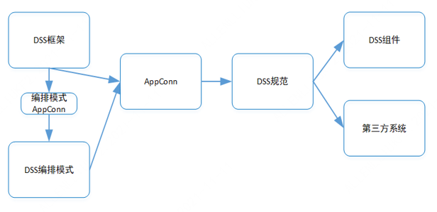

# Third-party system access DSS development guide

There are four steps in total:

1. Create a brand new AppConn directory in DSS;
2. Implement a new AppConn in the background;
3. Supplement relevant documents required by AppConn;
4. If you want to access the DSS workflow as a workflow node, you need to complete the addition of the workflow node.

Details as follows:

## 1. Create a new AppConn directory in DSS

The directory format requirements of the new AppConn are as follows, please create a new AppConn module according to the required format:

```html

|-- DataSphereStudio    
|   |-- dss-appconn  // The root directory of the AppConn framework
|   |   |-- appconns // All AppConn storage directories
|   |   |   |-- dss-<appconnName>-appconn   // Added root directory of AppConn
|   |   |   |   |-- src
|   |   |   |   |   |-- main
|   |   |   |   |   |   |-- assembly  // The configuration directory for the DSS-loadable appconnName.zip package
|   |   |   |   |   |   |   |-- distribution.xml   // packaged config file
|   |   |   |   |   |   |-- icons   // If you want to use it as a workflow node, here is the icon used to store each workflow node
|   |   |   |   |   |   |-- java    // The directory where AppConn code is stored
|   |   |   |   |   |   |-- resources   // The resource file storage directory of the AppConn
|   |   |   |   |   |   |   |-- appconn.properties   // The AppConn configuration file, must be named appconn.properties
|   |   |   |   |   |   |   |-- init.sql   // dml sql file to import AppConn information into DSS database
|   |   |   |   |-- pom.xml  // Added AppConn pom file

```

## 2. Implement a new AppConn in the background

Please refer to: [AppConn Development Guide](AppConn_Development_Guide.md).

## 3. Supplementary relevant documents required by AppConn

Mainly divided into the following steps:

- Supplement pom.xml file
- Supplementary icons file
- Added init.sql
- Supplement distribution.xml
- What appconn.properties does

### 3.1 Supplemental pom.xml file

Please refer to:

```xml
<?xml version="1.0" encoding="UTF-8"?>
<project xmlns="http://maven.apache.org/POM/4.0.0"
         xmlns:xsi="http://www.w3.org/2001/XMLSchema-instance"
         xsi:schemaLocation="http://maven.apache.org/POM/4.0.0 http://maven.apache.org/xsd/maven-4.0.0.xsd">
    <parent>
        <artifactId>dss</artifactId>
        <groupId>com.webank.wedatasphere.dss</groupId>
        <version>1.1.0</version>
        <relativePath>../../../pom.xml</relativePath>
    </parent>
    <modelVersion>4.0.0</modelVersion>

    <artifactId>dss-${appconnName}-appconn</artifactId>

    <dependencies>
        <!-- The following are required DSS dependencies -->
        <dependency>
            <groupId>com.webank.wedatasphere.dss</groupId>
            <artifactId>dss-appconn-core</artifactId>
            <version>${dss.version}</version>
            <exclusions>
                <exclusion>
                    <artifactId>linkis-common</artifactId>
                    <groupId>org.apache.linkis</groupId>
                </exclusion>
                <exclusion>
                    <artifactId>json4s-jackson_2.11</artifactId>
                    <groupId>org.json4s</groupId>
                </exclusion>
            </exclusions>
        </dependency>

        <!-- If you want to access DSS workflow, please add the following dependency -->
        <dependency>
            <groupId>com.webank.wedatasphere.dss</groupId>
            <artifactId>dss-development-process-standard-execution</artifactId>
            <version>${dss.version}</version>
        </dependency>

        <!-- The following dependencies can be referenced on demand -->
        <dependency>
            <groupId>org.apache.linkis</groupId>
            <artifactId>linkis-cs-client</artifactId>
            <version>${linkis.version}</version>
            <scope>compile</scope>
        </dependency>

        <dependency>
             <groupId>org.apache.linkis</groupId>
             <artifactId>linkis-httpclient</artifactId>
             <version>${linkis.version}</version>
             <exclusions>
                  <exclusion>
                       <artifactId>linkis-common</artifactId>
                       <groupId>org.apache.linkis</groupId>
                  </exclusion>
                  <exclusion>
                       <artifactId>json4s-jackson_2.11</artifactId>
                       <groupId>org.json4s</groupId>
                  </exclusion>
             </exclusions>
        </dependency>


    </dependencies>

    <build>
        <plugins>
            <!-- The plugin can be directly referenced -->
            <plugin>
                <groupId>org.apache.maven.plugins</groupId>
                <artifactId>maven-deploy-plugin</artifactId>
            </plugin>
            <!-- If you have Scala code, you need to add this plugin -->
            <plugin>
                <groupId>net.alchim31.maven</groupId>
                <artifactId>scala-maven-plugin</artifactId>
            </plugin>
            <!-- The plugin can be directly referenced -->
            <plugin>
                <groupId>org.apache.maven.plugins</groupId>
                <artifactId>maven-jar-plugin</artifactId>
            </plugin>
            <!-- The plugin can be directly referenced -->
            <plugin>
                <groupId>org.apache.maven.plugins</groupId>
                <artifactId>maven-assembly-plugin</artifactId>
                <version>2.3</version>
                <inherited>false</inherited>
                <executions>
                    <execution>
                        <id>make-assembly</id>
                        <phase>package</phase>
                        <goals>
                            <goal>single</goal>
                        </goals>
                        <configuration>
                            <descriptors>
                                <descriptor>src/main/assembly/distribution.xml</descriptor>
                            </descriptors>
                        </configuration>
                    </execution>
                </executions>
                <configuration>
                    <skipAssembly>false</skipAssembly>
                    <finalName>out</finalName>
                    <appendAssemblyId>false</appendAssemblyId>
                    <attach>false</attach>
                    <descriptors>
                        <descriptor>src/main/assembly/distribution.xml</descriptor>
                    </descriptors>
                </configuration>
            </plugin>
        </plugins>
        <resources>
            <!-- The resource can be directly referenced -->
            <resource>
                <directory>src/main/java</directory>
                <includes>
                    <include>**/*.xml</include>
                </includes>
            </resource>
            <!-- The resource can be directly referenced -->
            <resource>
                <directory>src/main/resources</directory>
                <excludes>
                    <exclude>**/application.yml</exclude>
                    <exclude>**/bootstrap.yml</exclude>
                    <exclude>**/log4j2.xml</exclude>
                </excludes>
            </resource>
        </resources>
    </build>
</project>
```

### 3.2 icons file

If the AppConn wants to access the DSS workflow as a workflow node, the icon of the relevant workflow node needs to be stored in the DSS workflow ```dss-appconn/appconns/dss-<appconnName>-appconn/src/main/icons``` directory.

When you add an icon, please directly copy the code of the icon and put it into the file. For example: create a new widget.icon file, and copy the relevant SVG code into this file.

### 3.3 Added init.sql

Here is only an example of basic dml sql that can be used in the top menu bar to connect an external system to DSS. If you want to connect AppConn as a workflow node, you should also refer to [How to add a DSS workflow Workflow Node](How_to_Add_Workflow_Node_in_DSS_Workflow.md).

As follows:

```mysql-sql

select @old_dss_appconn_id:=id from `dss_appconn` where `appconn_name` = 'Specific AppConnName，eg：Visualis';

delete from  `dss_workspace_menu_appconn` WHERE `appconn_id` = @old_dss_appconn_id;
delete from `dss_appconn_instance` where `appconn_id` = @old_dss_appconn_id;
delete from  `dss_appconn` where `appconn_name`='Specific AppConnName，eg：Visualis';

-- Except appconn_class_path and resource users do not need to pay attention, other fields need to pay attention
-- The following is a detailed introduction
INSERT INTO `dss_appconn` (`appconn_name`, `is_user_need_init`, `level`, `if_iframe`, `is_external`, `reference`, `class_name`, `appconn_class_path`, `resource`) VALUES ('具体的AppConnName，如：Visualis', 0, 1, NULL, 0, NULL, 'com.webank.wedatasphere.dss.appconn.visualis.VisualisAppConn', '', '');

select @dss_appconn_id:=id from `dss_appconn` where `appconn_name` = 'Specific AppConnName，eg：Visualis';

-- Fields that users need to pay attention to：menu_id、title_en、title_cn、desc_en、desc_cn、labels_en、labels_cn、is_active、access_button_en、access_button_cn、manual_button_url
-- The following is a detailed introduction
INSERT INTO `dss_workspace_menu_appconn`(`appconn_id`,`menu_id`,`title_en`,`title_cn`,`desc_en`,`desc_cn`,`labels_en`,`labels_cn`,`is_active`,`access_button_en`,`access_button_cn`,`manual_button_en`,`manual_button_cn`,`manual_button_url`,`icon`,`order`,`create_by`,`create_time`,`last_update_time`,`last_update_user`,`image`) 
    values(@dss_appconn_id,2,'appconn English title','This is the Chinese name of the engine','This is English description.','This is the Chinese description.','label1,label2','Label 1, Label 2','1','enter AppConnName1','into the engine1','user manual','User Manual','Please add user manual address',NULL,10,'system',NULL,'system',NULL,NULL);

-- Fields that users need to pay attention to:enhance_json、homepage_uri
-- The following is a detailed introduction
INSERT INTO `dss_appconn_instance` (`appconn_id`, `label`, `url`, `enhance_json`, `homepage_uri`) VALUES (@dss_appconn_id, 'DEV', 'http://APPCONN_INSTALL_IP:APPCONN_INSTALL_PORT/', '', '');

```

#### 3.3.1 dss_appconn table

```dss_appconn``` The table is the core table of DSS. Except appconn_class_path and resource users do not need to pay attention, other fields need to be concerned.

The specific concerns are as follows:

- ```is_user_need_init```，Whether the user needs to initialize, this field is reserved and can be directly set to 0
- ```if_iframe```，Whether DSS can open third-party AppConn pages through Iframe embedding, 1 means it can be opened through Iframe, 0 means it can be opened through front-end routing;
- ```is_external```，When opening a third-party AppConn page, whether to open it by opening a new browser tab, 1 means opening a new browser tab, 0 means opening in this page.
- ```reference```，Associated AppConn. Some AppConns want to reuse the implemented AppConn directly, you can directly use this field to specify the corresponding AppConn name. For example, if an AppConn only wants to get through with DSS for a password-free jump (ie, the first-level specification), this field can be directly filled with sso (ie, associated with SSOAppConn);
- ```class_name```，The main class for this AppConn. This field is empty if ```reference``` is not empty.

#### 3.3.2 dss_workspace_menu_appconn table

The ```dss_workspace_menu_appconn``` table needs the user's attention, as follows:

- Other fields do not need to be changed, and related fields can be modified as needed:menu_id、title_en、title_cn、desc_en、desc_cn、labels_en、labels_cn、is_active、access_button_en、access_button_cn、manual_button_url
- ```menu_id```，That is, the classification id of the top menu bar, currently divided into: 1-data exchange; 2-data analysis; 3-production operation and maintenance; 4-data quality; 5-administrator function; 6-data application
- If the existing ```menu_id``` does not meet your needs, you can insert a new menu category into the ```dss_workspace_menu``` table by yourself.
- ```is_active```，That is, whether the AppConn can be accessed, if it is 1, it means available; if it is 0, it means stay tuned
- ```manual_button_url```，URL address of the user manual

#### 3.3.2 dss_appconn_instance table

The ```dss_appconn_instance``` table needs the user's attention, as follows:

- ```enhance_json```，The additional parameters of AppConn are strings in map json format, which have the same function as appconn.properties. They are all configured with additional parameters for the AppConn.
- ```homepage_uri```，The URI of the home page. Note that it's a URI, not a URL. For example: if the home page URL is: ```http://ip:port/test/home```, then the home page URI is: test/home


### 3.4 distribution.xml file

The following reference example does not need to be modified except for appconnName which needs to be modified by the user according to the actual name, and can be directly copied and used.

Please copy and use as needed. For details, please refer to:

```xml
<assembly
        xmlns="http://maven.apache.org/plugins/maven-assembly-plugin/assembly/2.3"
        xmlns:xsi="http://www.w3.org/2001/XMLSchema-instance"
        xsi:schemaLocation="http://maven.apache.org/plugins/maven-assembly-plugin/assembly/2.3 http://maven.apache.org/xsd/assembly-1.1.2.xsd">
    <!-- Here you need to ensure that the id is unique -->
    <id>dss-appconnName-appconn</id> 
    <formats>
        <format>dir</format>
    </formats>
    <includeBaseDirectory>true</includeBaseDirectory>
    <!-- Specific AppConn name -->
    <baseDirectory>appconnName</baseDirectory>

    <dependencySets>
        <!-- If there is a dependency, the lib directory is required -->
        <dependencySet>
            <outputDirectory>lib</outputDirectory>
            <useProjectArtifact>true</useProjectArtifact>
            <useTransitiveDependencies>true</useTransitiveDependencies>
            <unpack>false</unpack>
            <useStrictFiltering>true</useStrictFiltering>
            <useTransitiveFiltering>true</useTransitiveFiltering>
        </dependencySet>
    </dependencySets>

    <fileSets>
        <!-- conf directory if there is appconn.properties -->
        <fileSet>
            <directory>${basedir}/conf</directory>
            <includes>
                <include>*</include>
            </includes>
            <fileMode>0777</fileMode>
            <outputDirectory>conf</outputDirectory>
            <lineEnding>unix</lineEnding>
        </fileSet>
        <!-- storing init.sql -->
        <fileSet>
            <directory>${basedir}/src/main/resources</directory>
            <includes>
                <include>init.sql</include>
            </includes>
            <fileMode>0777</fileMode>
            <outputDirectory>db</outputDirectory>
        </fileSet>
        <!-- Icons for storing workflow nodes -->
        <fileSet>
            <directory>${basedir}/src/main/icons</directory>
            <includes>
                <include>*</include>
            </includes>
            <fileMode>0777</fileMode>
            <outputDirectory>icons</outputDirectory>
        </fileSet>
    </fileSets>
</assembly>
```

### 3.5 What appconn.properties does

appconn.properties is used to configure additional parameters of the AppConn. If your AppConn does not define any parameters, you can also not create the appconn.properties file.

appconn.properties has the same effect as the ```enhance_json``` field of the ````dss_appconn_instance``` table.

The benefits of using appconn.properties are:

- ```enhance_json``` is a string in map json format, there are certain thresholds for modification, and it needs to be converted before it can be used;
- Modifying ``enhance_json`` requires changing the database, which is far less simple than directly changing the AppConn configuration file.

We recommend that you use appconn.properties to configure the parameters of AppConn, you can also choose to use one of them according to your actual needs.

## 4. the new workflow node

Please refer to: [How to Add Workflow Node in DSS Workflow](How_to_Add_Workflow_Node_in_DSS_Workflow.md).

## 5. How DSS loads new AppConn

Use ```install-appconn.sh``` to install the new AppConn as follows:

```shell script
  cd $DSS_HOME/bin
  sh install-appconn.sh
```

If it is an existing AppConn, when the AppConn changes, please use ```appconn-refresh.sh``` to refresh the AppConn, as follows:

```shell script
  cd $DSS_HOME/bin
  sh appconn-refresh.sh
```

Note: You need to put the packaged AppConn zip in the AppConn installation directory in advance.

## 6. AppConn Contribution

**If you want to contribute the AppConn plugin to the community, please contact the community and communicate with the community before implementing the AppConn**. And before release, you also need to write `AppConn plugin installation document`.
For plugin installation documentation, please refer to: [VisualisAppConn Plugin installation documentation](https://github.com/WeBankFinTech/Visualis/blob/master/visualis_docs/en_US/Visualis_appconn_install_en.md)

## 7. How DSS uses AppConn to interact with third-party applications

The interaction between DSS and the third-party application system is completed through the corresponding AppConn instance.

When the AppConn is deployed to the specified directory, the ``dss-framework-project-server``` service will load or **refresh** all AppConns when it starts, and store it in the material library.

Other DSS microservices will pull all AppConn materials on demand from ``dss-framework-project-server``` and dynamically load them into the service process to be called as AppConn instances.

