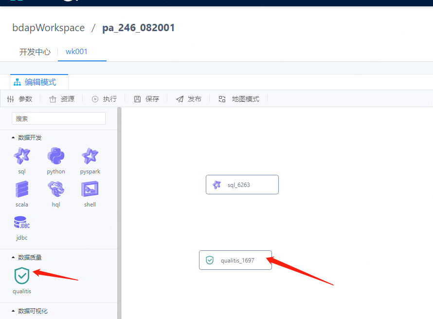

# QualitisAppConn installation documentation

This article mainly introduces the deployment, configuration and use of QualitisAppConn in DSS (DataSphere Studio) 1.0.


## 1. Preparations for deploying QualitisAppConn

Before you deploy QualitisAppConn, you must start the Qualitis deployment and ensure that the basic functions are available.


## 2. Download and compile the QualitisAppConn plugin

We provide the material package of QualitisAppConn, if you have already downloaded it, you can skip this step. If you want to compile QualitisAppConn yourself, the specific compilation steps are as follows:
1. clone the code of DataSphere Studio
2. Compile qualitis-appconn separately
```bash 
cd {DSS_CODE_HOME}/dss-appconn/appconns/dss-qualitis-appconn
mvn clean install
```

## 3. Deployment and configuration of QualitisAppConn plugin


1. Obtain the qualitis-appconn.zip material package from the target directory in step 2
2. Put it in the following directory and unzip it
```bash 
cd {DSS_HOME}/dss/dss-appconns
unzip qualitis-appconn.zip
```
3. Configure the relevant information of QualitisAppConn
``` bash 
cd {DSS_INSTALL_HOME}/dss/bin
sh install-appconn.sh
The script is an interactive installation solution. You need to enter the string qualitis and the ip and port of the qualitis service to complete the installation.
```
4. Restart the dss service to complete the update of the plugin

## 4. Use of QualitisAppConn
You can enter the front-end homepage of DSS, and then enter the homepage of the Qualitis application, as shown in the figure.


<center>Figure</center>

You can also use the visualization capabilities of Qualitis by using the visualization node of the workflow, as shown in Fig.



## 5. How the QualitisAppConn plugin works
This section is an extension of the installation and a brief explanation of how QualitisAppConn works.

1. Microservices using QualitisAppConn

The following microservices in DSS will interact with Qualitis through QualitisAppConn to complete specified functions.

| Microservice name      | Functions done with AppConn   | Remark                                   |
|-----------------|----------------|----------------------------------------|
| dss-framework-project-server       | Complete engineering and organizational unification with qualitis-appconn    | must                                   |
| dss-workflow-server     | Use the third-level specification to complete the creation, editing, import and export of nodes, etc.| must                                   |
| appconn-engine | Use the third-level specification to complete the execution of the qualitis node |                    must                |

2. Qualitis integration into dss needs to set the corresponding content in the following database tables

| Table Name      | Table Role   | Remark                                   |
|-----------------|----------------|----------------------------------------|
| dss_application       | Application table, mainly to insert basic information of qualitis application   | must                                   |
| dss_menu     | Menu table, which stores the content displayed to the outside world, such as icons, names, etc.| must                                   |
| dss_onestop_menu_application | The association table of menu and application for joint search |                    must                |
| dss_appconn      | Basic information of appconn, used to load appconn  | must                                   |
| dss_appconn_instance  | Information about the qualitis instance, including the url information of qualitis itself   | must         |
| dss_workflow_node  | Information that Qualitis needs to insert as a workflow node   | If you want to use data quality checks, you must   |

