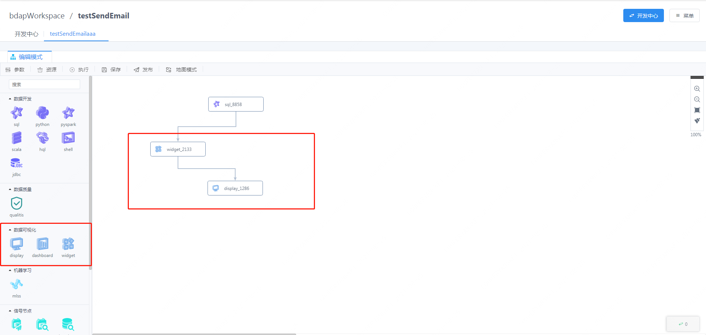

# VisualisAppConn Installation Documentation

This article mainly introduces the deployment, configuration and use of VisualisAppConn in DSS (DataSphere Studio) 1.0.


## 1. Preparations for deploying VisualisAppConn

Before you deploy VisualisAppConn, you must start Visualis deployment and ensure that the basic functions are available.


## 2. Downloading and compiling the VisualisAppConn plugin

We provide a material package for VisualisAppConn, if you have already downloaded it, you can skip this step. If you want to compile VisualisAppConn yourself, the specific compilation steps are as follows:
1. clone the code of DataSphere Studio
2. Compile visualis-appconn separately
```bash 
cd {DSS_CODE_HOME}/dss-appconn/appconns/dss-visualis-appconn
mvn clean install
```

## 3.Deployment and configuration of the VisualisAppConn plugin


1. Obtain the visualis-appconn.zip material package from the target directory in step 2
2. Put it in the following directory and unzip it
```bash 
cd {DSS_HOME}/dss/dss-appconns
unzip visualis-appconn.zip
```
3. Configure the relevant information of VisualisAppConn
``` bash
cd {DSS_INSTALL_HOME}/dss/bin
sh install-appconn.sh
The script is an interactive installation scheme. You need to enter the string visualis and the ip and port of the visualis service to complete the installation.
```
4. Restart the dss service to complete the update of the plugin

## 4. Use of VisualisAppConn
You can enter the front-end homepage of DSS, and then enter the homepage of the Visualis application, as shown in the figure


You can also use the visualization capabilities of Visualis by using the visualization node of the workflow, as shown in the figure




## 5. How the VisualisAppConn plugin works
This section is an extension of the installation and a brief explanation of how VisualisAppConn works.

1. Microservices using VisualisAppConn

The following microservices in DSS will interact with Visualis through VisualisAppConn to complete the specified functions.

|Microservice name | Function done using AppConn | Remarks                                 |
|-----------------|----------------|----------------------------------------|
| dss-framework-project-server | Use visualis-appconn to complete the project and unify the organization | required |
| dss-workflow-server | Use the third-level specification to complete the creation, editing, import and export of nodes, etc. | required |
| appconn-engine | Use the third-level specification to complete the execution of the visualis node | required                |

2. Visualis integration into dss requires setting the corresponding content in the following database tables

| Table name | Table role | Remarks                                   |
|-----------------|----------------|----------------------------------------|
| dss_application | Application table, mainly to insert basic information of visualis application | required |
| dss_menu | Menu table, which stores the content displayed to the outside world, such as icons, names, etc. | Required |
| dss_onestop_menu_application | Association table of menu and application for joint search | required |
| dss_appconn | Basic information of appconn, used to load appconn | Required |
| dss_appconn_instance | information about the visualis instance, including the url information of visualis itself | required |
| dss_workflow_node | Information that Visualis needs to insert as a workflow node | If you want to use a visualization node, you must         |


