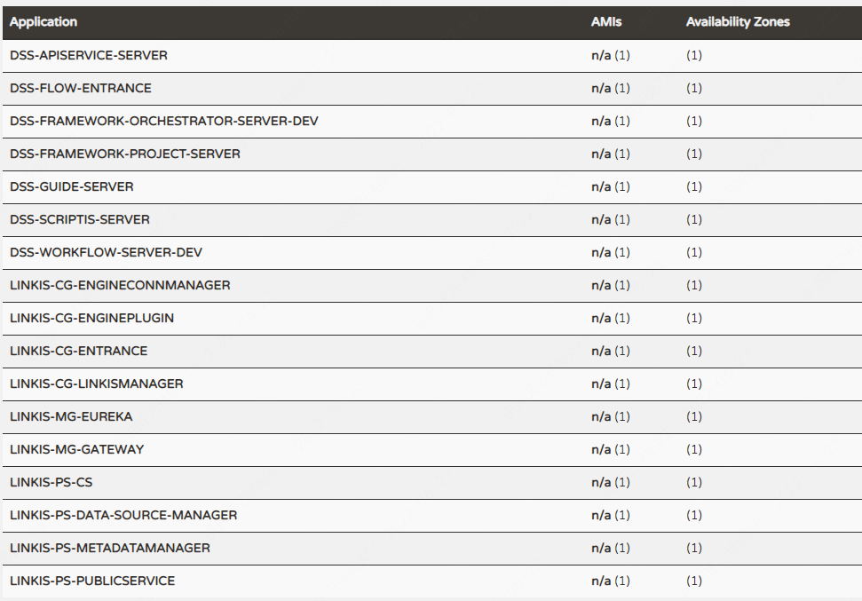

# DataSphere Studio & Linkis one-click deployment document stand-alone version


### 1. Basic software installation

- Required command tools (before the official installation, the script will automatically detect whether these commands are available. If they do not exist, they will try to install them automatically. If the installation fails, the user needs to manually install the following basic shell command tools):

  *telnet;tar;sed;dos2unix;mysql;yum;java;unzip;zip;expect*


- Software to be installed:

  MySQL (5.5+); JDK (above 1.8.0_141); Python (both 2.x and 3.x are supported); Nginx


- The following services must be accessible from this machine:

  Hadoop (**2.7.2, other versions of Hadoop need to compile Linkis**), the installed machine must support the execution of the `hdfs dfs -ls /` command

  Hive (**2.3.3, other versions of Hive need to compile Linkis**), the installed machine must support the execution of the `hive -e "show databases"` command

  Spark (**supports all versions above 2.0**), the installed machine must support the execution of the `spark-sql -e "show databases"` command


- Tips:

  If the user is installing Hadoop for the first time, you can refer to: [Hadoop single-machine deployment](https://hadoop.apache.org/docs/r2.7.2/hadoop-project-dist/hadoop-common/SingleCluster.html) ；For distributed deployment of Hadoop, please refer to: [Hadoop Distributed Deployment](https://hadoop.apache.org/docs/r2.7.2/hadoop-project-dist/hadoop-common/ClusterSetup.html)

  If the user is installing Hive for the first time, please refer to: [Hive Quick Installation and Deployment](https://cwiki.apache.org/confluence/display/Hive/GettingStarted)

  If the user is installing Spark for the first time, the On Yarn mode can refer to: [Spark on Yarn deployment](https://spark.apache.org/docs/2.4.3/running-on-yarn.html)

### 2. Create a user

1. Assume **deployment user is hadoop account** (it may not be hadoop user, but it is recommended to use Hadoop super user for deployment, here is just an example)


2. Create a deployment user on all machines that need to be deployed for installation. The following command creates a deployment user hadoop

    ```shell
    sudo useradd hadoop
    ````

3. Because the Linkis service uses the `sudo -u ${linux-user}` method to switch the engine to execute the job, the deployment user needs to have sudo permissions, and it is password-free. Follow the steps below to modify the deployment user permissions

   Edit the /etc/sudoers file:

    ```shell
    vi /etc/sudoers
    ````

   Add the following to the /etc/sudoers file:

    ````
    hadoop ALL=(ALL) NOPASSWD: NOPASSWD: ALL
    ````

4. Make sure that the server where DSS and Linkis are deployed can execute commands such as hdfs , hive -e and spark-sql -e normally. In the one-click install script, the components are checked.


5. **If the user's Pyspark wants to have the drawing function, you need to install the drawing module on all installation nodes**. The command is as follows:

   ```shell
   python -m pip install matplotlib
   ```

### 3. Prepare the installation package

- Users can compile their own or go to the release page to download the installation package：[DSS Release-1.1.0](https://github.com/WeBankFinTech/DataSphereStudio/releases/tag/1.1.0)

  **Please note: In order to use Visualis1.0.0 and Exchangis1.0.0 normally, please go to the releases page to download the latest one-click installation deployment package. **

  **Please note: In order to use Visualis1.0.0 and Exchangis1.0.0 normally, please go to the releases page to download the latest one-click installation deployment package. **


- The hierarchical directory structure of DSS & Linkis one-click installation deployment package is as follows:

    ```text
    ├── dss_linkis # One-click deployment home directory
       ├── bin # for one-click installation, and one-click to start DSS + Linkis
       ├── conf # Parameter configuration directory for one-click deployment
       ├── wedatasphere-dss-x.x.x-dist.tar.gz # DSS backend installation package
       ├── wedatasphere-dss-web-x.x.x-dist.zip # DSS front-end and Linkis front-end installation package
       ├── wedatasphere-linkis-x.x.x-dist.tar.gz # Linkis backend installation package
    ```

- If the user chooses to directly deploy by downloading the installation package, they can directly jump to [Modify Configuration](#1)


- If the user chooses to compile Linkis or DSS by themselves, please make sure to compile Linkis1.1.1 and the latest code that has pulled the DSS `master` branch. For the compilation method, please refer to: <br>
  [DSS backend compilation documentation](../Development_Documentation/Compilation_Documentation.md)  
  [DSS front-end compilation documentation](../Development_Documentation/Front-end_compilation_documentation.md)  
  [Linkis backend compilation documentation](https://linkis.apache.org/docs/latest/development/linkis_compile_and_package/)  
  [Linkis front-end compilation documentation](https://linkis.apache.org/docs/latest/development/web_build/)


       1. For the back-end installation package, you can directly replace the above Linkis back-end installation package or DSS back-end installation package with the relevant installation package after compilation.

        2. For the front-end installation package, you need to pay special attention. The directory structure of the entire front-end installation package is as follows:
        ````
        ├── wedatasphere-dss-web-x.x.x-dist # DSS and Linkis front-end installation package
          ├── config.sh # parameter configuration script
          ├── install.sh # Front-end deployment script
          ├── dist # DSS front-end package
          ├── dss # Front-end package used to store applications deployed with DSS with one click
            ├── linkis # Linkis front-end package directory
              ├── build.zip # Compressed Linkis front-end package
        ````
   
        3. The DSS front-end package can be directly replaced with the relevant installation package compiled by the user. The Linkis front-end package needs to be compressed into an installation package named build.zip, and then replace xx/dss_linkis/wedatasphere-dss-web-x.x.x-dist with it build.zip under the /dss/linkis directory.
   
        4. Users need to pay special attention when packaging wedatasphere-dss-web-x.x.x-dist.zip and build.zip, do not directly compress them in the parent directory, they should select all the files under the directory and then compress.

### <a id = "1">4. modify the configuration</a>

- You need to modify 'config.sh' and 'db.sh' in 'xx/dss_linkis/conf'.


- Run 'config.sh' and modify the parameters as required. The parameters are described as follows:

```properties
#################### One-click installation of basic deployment configurations ####################

### deploy user（Deployment user. The default value is the current login user）
deployUser=hadoop

### Linkis_VERSION（You are not advised to change the value if it is not mandatory）
LINKIS_VERSION=1.1.1

### DSS Web（Generally, no modification is required for the local installation. However, check whether the port is occupied. If it is occupied, modify an available port）
DSS_NGINX_IP=127.0.0.1
DSS_WEB_PORT=8085

### DSS VERSION（You are not advised to change the value if it is not mandatory）
DSS_VERSION=1.1.0


############## Linkis other default configuration information start ############## 
### Specifies the user workspace, which is used to store the user's script files and log files.
### Generally local directory
##file:// required（You are not advised to change the value if it is not mandatory）
WORKSPACE_USER_ROOT_PATH=file:///tmp/linkis/ 
### User's root hdfs path
##hdfs:// required（You are not advised to change the value if it is not mandatory）
HDFS_USER_ROOT_PATH=hdfs:///tmp/linkis 
### Path to store job ResultSet:file or hdfs path
##hdfs:// required（You are not advised to change the value if it is not mandatory）
RESULT_SET_ROOT_PATH=hdfs:///tmp/linkis 

### Path to store started engines and engine logs, must be local（You are not advised to change the value if it is not mandatory）
ENGINECONN_ROOT_PATH=/appcom/tmp


###HADOOP CONF DIR #/appcom/config/hadoop-config（You are not advised to change the value if it is not mandatory）
HADOOP_CONF_DIR=/appcom/config/hadoop-config
###HIVE CONF DIR  #/appcom/config/hive-config（You are not advised to change the value if it is not mandatory）
HIVE_CONF_DIR=/appcom/config/hive-config
###SPARK CONF DIR #/appcom/config/spark-config（You are not advised to change the value if it is not mandatory）
SPARK_CONF_DIR=/appcom/config/spark-config
###for install （You are not advised to change the value if it is not mandatory）
LINKIS_PUBLIC_MODULE=lib/linkis-commons/public-module

##YARN REST URL spark engine required（Change the IP address and port number as required）
YARN_RESTFUL_URL=http://127.0.0.1:8088


## Engine version
#SPARK_VERSION（Modify the version number according to the actual version）
SPARK_VERSION=2.4.3
##HIVE_VERSION（Modify the version number according to the actual version）
HIVE_VERSION=2.3.3
##PYTHON_VERSION（Modify the version number according to the actual version）
PYTHON_VERSION=python2

## LDAP is for enterprise authorization, if you just want to have a try, ignore it.
#LDAP_URL=ldap://localhost:1389/
#LDAP_BASEDN=dc=webank,dc=com
#LDAP_USER_NAME_FORMAT=cn=%s@xxx.com,OU=xxx,DC=xxx,DC=com

############## Other default configuration information for linkis end ##############


################### The install Configuration of all Linkis's Micro-Services #####################
################### Users can modify the IP and port according to the actual situation ###################
#
#    NOTICE:
#       1. If you just wanna try, the following micro-service configuration can be set without any settings.
#            These services will be installed by default on this machine.
#       2. In order to get the most complete enterprise-level features, we strongly recommend that you install
#          the following microservice parameters
#

###  EUREKA install information
###  You can access it in your browser at the address below:http://${EUREKA_INSTALL_IP}:${EUREKA_PORT}
###  Microservices Service Registration Discovery Center
LINKIS_EUREKA_INSTALL_IP=127.0.0.1
LINKIS_EUREKA_PORT=9600
#LINKIS_EUREKA_PREFER_IP=true

###  Gateway install information
#LINKIS_GATEWAY_INSTALL_IP=127.0.0.1
LINKIS_GATEWAY_PORT=9001

### ApplicationManager
#LINKIS_MANAGER_INSTALL_IP=127.0.0.1
LINKIS_MANAGER_PORT=9101

### EngineManager
#LINKIS_ENGINECONNMANAGER_INSTALL_IP=127.0.0.1
LINKIS_ENGINECONNMANAGER_PORT=9102

### EnginePluginServer
#LINKIS_ENGINECONN_PLUGIN_SERVER_INSTALL_IP=127.0.0.1
LINKIS_ENGINECONN_PLUGIN_SERVER_PORT=9103

### LinkisEntrance
#LINKIS_ENTRANCE_INSTALL_IP=127.0.0.1
LINKIS_ENTRANCE_PORT=9104

###  publicservice
#LINKIS_PUBLICSERVICE_INSTALL_IP=127.0.0.1
LINKIS_PUBLICSERVICE_PORT=9105

### cs
#LINKIS_CS_INSTALL_IP=127.0.0.1
LINKIS_CS_PORT=9108

########## Linkis微服务配置完毕 ##########

################### The install Configuration of all DataSphereStudio's Micro-Services #####################
#################### Non-commented parameters must be configured, and commented out parameters can be modified as needed #################### 
#    NOTICE:
#       1. If you just wanna try, the following micro-service configuration can be set without any settings.
#            These services will be installed by default on this machine.
#       2. In order to get the most complete enterprise-level features, we strongly recommend that you install
#          the following microservice parameters
#

# Temporary ZIP package file for storing publications to Schedules
WDS_SCHEDULER_PATH=file:///appcom/tmp/wds/scheduler
### DSS_SERVER
### This service is used to provide dss-server capability.

### project-server
#DSS_FRAMEWORK_PROJECT_SERVER_INSTALL_IP=127.0.0.1
#DSS_FRAMEWORK_PROJECT_SERVER_PORT=9002
### orchestrator-server
#DSS_FRAMEWORK_ORCHESTRATOR_SERVER_INSTALL_IP=127.0.0.1
#DSS_FRAMEWORK_ORCHESTRATOR_SERVER_PORT=9003
### apiservice-server
#DSS_APISERVICE_SERVER_INSTALL_IP=127.0.0.1
#DSS_APISERVICE_SERVER_PORT=9004
### dss-workflow-server
#DSS_WORKFLOW_SERVER_INSTALL_IP=127.0.0.1
#DSS_WORKFLOW_SERVER_PORT=9005
### dss-flow-execution-server
#DSS_FLOW_EXECUTION_SERVER_INSTALL_IP=127.0.0.1
#DSS_FLOW_EXECUTION_SERVER_PORT=9006
###dss-scriptis-server
#DSS_SCRIPTIS_SERVER_INSTALL_IP=127.0.0.1
#DSS_SCRIPTIS_SERVER_PORT=9008
########## DSS微服务配置完毕#####


############## other default configuration Other default configuration information  ############## 

## java application default jvm memory（The stack size of the Java application. If the memory of the deployment machine is less than 8G, 128M is recommended；
## When it reaches 16G, at least 256M is recommended; if you want to have a very good user experience, it is recommended to deploy the machine with a memory of at least 32G）
export SERVER_HEAP_SIZE="128M"

##sendemail configuration, only affects the sending email function in DSS workflow
EMAIL_HOST=smtp.163.com
EMAIL_PORT=25
EMAIL_USERNAME=xxx@163.com
EMAIL_PASSWORD=xxxxx
EMAIL_PROTOCOL=smtp

### Save the file path exported by the orchestrator service
ORCHESTRATOR_FILE_PATH=/appcom/tmp/dss
### Save DSS flow execution service log path
EXECUTION_LOG_PATH=/appcom/tmp/dss
############## other default configuration Other default configuration information ############## 
```

- Please note: DSS recommends using LDAP for user login authentication. If you want to access the company's LDAP, you need to fill in the LDAP configuration parameters in the `config.sh` above. [How to install LDAP? ](https://web.mit.edu/rhel-doc/5/RHEL-5-manual/Deployment_Guide-en-US/s1-ldap-quickstart.html)

- Modify database configuration. Please ensure that the configured database and the installation machine can be accessed normally, otherwise there will be an error of DDL and DML import failure, open `db.sh`, and modify the relevant configuration parameters as needed. The parameter descriptions are as follows:

```properties
### Configure the DSS database
MYSQL_HOST=127.0.0.1
MYSQL_PORT=3306
MYSQL_DB=dss
MYSQL_USER=xxx
MYSQL_PASSWORD=xxx

## The database configuration of the Hive metastore, which is used by Linkis to access the metadata information of Hive
HIVE_HOST=127.0.0.1
HIVE_PORT=3306
HIVE_DB=xxx
HIVE_USER=xxx
HIVE_PASSWORD=xxx
```

### Five, installation and use

1. #### Stop all DSS and Linkis services on the machine

- If you have never installed DSS and Linkis services, ignore this step

2. #### Change the current directory to the bin directory
     ```shell
     cd xx/dss_linkis/bin
     ````
3. #### Execute the installation script
     ```shell
     sh install.sh
     ````
- The installation script will check various integrated environment commands. If not, please follow the prompts to install. The following commands are required:

  *yum; java; mysql; unzip; expect; telnet; tar; sed; dos2unix; nginx*

- During installation, the script will ask you if you need to initialize the database and import metadata, both Linkis and DSS will ask, **The first installation must select Yes**

- Check whether the installation is successful by checking the log information printed on the console. If there is an error message, you can check the specific error reason
- *This command should only be executed once unless the user wants to reinstall the entire app*

4. #### start the service
- If the user's Linkis installation package is obtained by compiling and the user wants to enable the data source management function, then it is necessary to modify the configuration to enable this function, and no operation is required to use the downloaded installation package
    ```shell
    ## Switch to the Linkis configuration file directory
    cd xx/dss_linkis/linkis/conf
    
    ## Open the configuration file linkis-env.sh
    vi linkis-env.sh
    
    ## Change the following configuration to true
    export ENABLE_METADATA_MANAGER=true
    ````
- If the user's Linkis installation package is obtained by compiling by yourself, try to change the password used later to be the same as the deployment user name before starting the service. No operation is required to use the downloaded installation package.
    ```shell
    ## Switch to the Linkis configuration file directory
    cd xx/dss_linkis/linkis/conf/

    ## Open the configuration file linkis-mg-gateway.properties
    vi linkis-mg-gateway.properties

    ## change Password
    wds.linkis.admin.password=hadoop
    ````
- Execute the startup service script in the xx/dss_linkis/bin directory

    ```shell
    sh start-all.sh
    ```

- If the startup generates an error message, you can view the specific error reason. After startup, each microservice will perform **communication detection**, and if there is an abnormality, it can help users locate the abnormal log and cause

5. #### Install default Appconn

    ```shell
    # Switch the directory to dss. Normally, the dss directory is in the xx/dss_linkis directory.
    cd xx/dss_linkis/dss/bin
   
    # Execute the startup default Appconn script
    sh install-default-appconn.sh
    ````

- *This command can be executed once, unless the user wants to reinstall the entire application*

6. #### Check if the verification is successful

- Users can view the startup status of Linkis & DSS background microservices on the Eureka interface. By default, DSS has 7 microservices, and Linkis has 10 microservices (including 2 microservices after enabling the data source management function) **(Eureka address is configured in xx/dss_linkis/conf/config.sh)**
  

- Users can use **Google Chrome** to access the following front-end address: `http://DSS_NGINX_IP:DSS_WEB_PORT` ** The startup log will print this access address (this address is also configured in xx/dss_linkis/conf/config.sh )**. When logging in, the default administrator username and password are the deployment user hadoop (if the user wants to change the password, you can modify the wds.linkis.admin.password in the xx/dss_linkis/linkis/conf/linkis-mg-gateway.properties file parameter)

7. #### stop service
    ```shell
    sh stop-all.sh
    ````
- If the user needs to stop all services, execute the command `sh stop-all.sh`, restart all services and execute `sh start-all.sh`, these two commands are executed in the xx/dss_linkis/bin directory

### 6. Supplementary Instructions
- Considering the problem that the installation package is too large, Linkis only provides Hive, Python, Shell, Spark engine plug-ins by default. If users want to use other engines, please refer to the document: [Linkis Engine Installation](https://linkis.apache.org/docs/latest/deployment/engine_conn_plugin_installation/)
- DSS does not install the scheduling system by default. Users can choose to install Schedulelis or DolphinScheduler. The specific installation method is shown in the following table
- DSS only installs DateChecker, EventSender, EventReceiver AppConn by default. Users can refer to the documentation to install other AppConn, such as Visualis, Exchangis, Qualitis, Prophecis, Streamis. The scheduling system can use Schedulelis or DolphinScheduler

  | Component Name | Component Version Requirements | Component Deployment Link                                                                                                                                                                      | AppConn Deployment Link                                                                                                                                                      |
  |-----------------|------------------------------------------------------------------------------------------------------------------------------------------------------------------------------------------------|------------------------------------------------------------------------------------------------------------------------------------------------------------------------------|-------------------|
  | Schedulis | Schedulis0.7.0 | [Schedulis deploy](https://github.com/WeBankFinTech/Schedulis/blob/master/docs/schedulis_deploy_cn.md)                                                                                         | [Schedulis AppConn install](SchedulisAppConn_Plugin_Installation_Documentation.md)                                                                                                                       |
  | Visualis | Visualis1.0.0  | [Visualis deploy](https://github.com/WeBankFinTech/Visualis/blob/master/visualis_docs/en_US/Visualis_deploy_doc_en.md)                                                                         | [Visualis AppConn install](https://github.com/WeBankFinTech/Visualis/blob/master/visualis_docs/en_US/Visualis_appconn_install_en.md)                                         |
  | Exchangis | Exchangis1.0.0 | [Exchangis deploy](https://github.com/WeBankFinTech/Exchangis/blob/master/docs/en_US/ch1/exchangis_appconn_deploy_en.md)                                                                            | [Exchangis AppConn install](https://github.com/WeBankFinTech/Exchangis/blob/master/docs/en_US/ch1/exchangis_appconn_deploy_en.md)                                            |
  | Qualitis |Qualitis0.9.2 | [Qualitis deploy](https://github.com/WeBankFinTech/Qualitis/blob/master/docs/en_US/ch1/QuickDeploy.md) | [Qualitis AppConn install](https://github.com/WeBankFinTech/Qualitis/blob/master/docs/zh_CN/ch1/%E6%8E%A5%E5%85%A5%E5%B7%A5%E4%BD%9C%E6%B5%81%E6%8C%87%E5%8D%97.md)          |
  | Prophecis  | Prophecis0.3.2 | [Prophecis deploy](https://github.com/WeBankFinTech/Prophecis/blob/master/docs/zh_CN/QuickStartGuide.md)                                                                                       | [Prophecis AppConn install](https://github.com/WeBankFinTech/Prophecis/blob/master/docs/zh_CN/Deployment_Documents/Prophecis%20Appconn%E5%AE%89%E8%A3%85%E6%96%87%E6%A1%A3.md) |
  | Streamis  | Streamis0.2.0 | [Streamis deploy](https://github.com/WeBankFinTech/Streamis/blob/main/docs/zh_CN/0.2.0/Streamis%E5%AE%89%E8%A3%85%E6%96%87%E6%A1%A3.md)                                                        | [Streamis AppConn install](https://github.com/WeBankFinTech/Streamis/blob/main/docs/en_US/0.2.0/development/StreamisAppConnInstallationDocument.md)          |
  | DolphinScheduler | DolphinScheduler1.3.x | [DolphinScheduler deploy](https://dolphinscheduler.apache.org/zh-cn/docs/1.3.8/user_doc/standalone-deployment.html)                                                                                  | [DolphinScheduler AppConn install](DolphinScheduler_Plugin_Installation_Documentation.md)                                                                                                                | 
