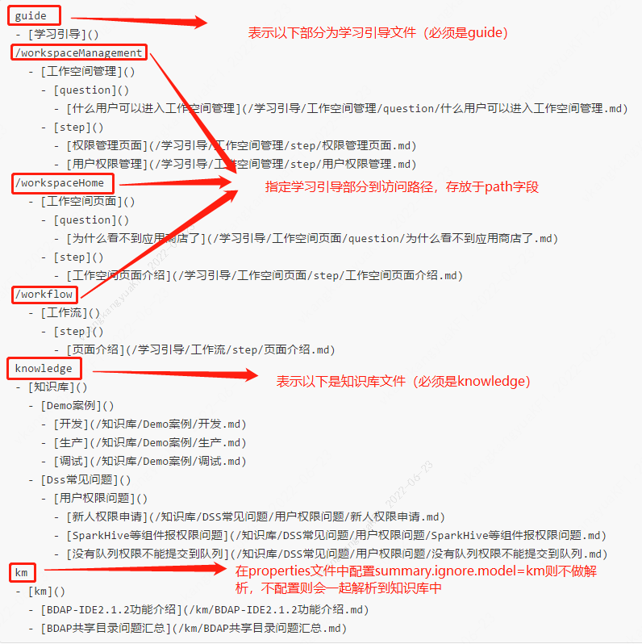

# DSSUserGuide Deploy documentation

> Introduction: The help documentation module belongs to the dss-user-guide module and is used to provide dss project related materials.

&nbsp;&nbsp;&nbsp;&nbsp;&nbsp;&nbsp;&nbsp;&nbsp;When using the dss-user-guide module, you need to deploy the dss project service first. You can refer to the dss deployment related documents. The dss-user-guide document synchronization function uses timed tasks to synchronize every two hours, and the document needs to be updated to the system. Maintain a summary. The md file is used by the user-guide module to parse the location of the file and parse the content of the document.


## 1、dss-guide-server.properties Knowledge Base Related Configuration Instructions

### 1.1 Reference configuration

````properties
#gitbook
#The ip address of the server where the document is stored
target.ip.address=127.0.0.1
#The path to the server where the document is located
host.gitbook.path=/appcom/Install/ApacheInstall/gitbook_books
#Need to sync to server
target.gitbook.path=/appcom/Install/ApacheInstall
#Used to ignore parsing km down to the directory
summary.ignore.model=km
#Knowledge base synchronization method: gitbook database
guide.sync.model=gitbook
````

### 1.2 DSS1.1.0 config

````properties
#gitbook
#The ip address of the server where the document is stored
target.ip.address=127.0.0.1
#The path of the server where the document is located (the directory can be configured to the directory where the summary.md file is located, for example: /xxx/test1/SUMMARY.md)
host.gitbook.path=/xxx/test1
#Dss1.1.0 does not support gitbook synchronization, so use database
guide.sync.model=gitbook
````


## 2、SUMMARY.mdDescription of file structure

&nbsp;&nbsp;&nbsp;&nbsp;&nbsp;&nbsp;&nbsp;&nbsp;SUMMARY.md this file is mainly used to maintain the location of the file and the file to the hierarchical structure after the file is parsed

**E.g：**

````SUMMARY.md
guide
- [学习引导]()
/workspaceManagement
  - [工作空间管理]()
    - [question]()
      - [什么用户可以进入工作空间管理](/学习引导/工作空间管理/question/什么用户可以进入工作空间管理.md)
    - [step]()
      - [权限管理页面](/学习引导/工作空间管理/step/权限管理页面.md)
      - [用户权限管理](/学习引导/工作空间管理/step/用户权限管理.md)
/workspaceHome
  - [工作空间页面]()
    - [question]()
      - [为什么看不到应用商店了](/学习引导/工作空间页面/question/为什么看不到应用商店了.md)
    - [step]()
      - [工作空间页面介绍](/学习引导/工作空间页面/step/工作空间页面介绍.md)
/workflow
  - [工作流]()
    - [step]()
      - [页面介绍](/学习引导/工作流/step/页面介绍.md)
knowledge
- [知识库]()
  - [Demo案例]()
    - [开发](/知识库/Demo案例/开发.md)
    - [生产](/知识库/Demo案例/生产.md)
    - [调试](/知识库/Demo案例/调试.md)
  - [Dss常见问题]()
    - [用户权限问题]()
      - [新人权限申请](/知识库/DSS常见问题/用户权限问题/新人权限申请.md)
      - [SparkHive等组件报权限问题](/知识库/DSS常见问题/用户权限问题/SparkHive等组件报权限问题.md)   
      - [没有队列权限不能提交到队列](/知识库/DSS常见问题/用户权限问题/没有队列权限不能提交到队列.md)
km
- [km]()
  - [BDAP-IDE2.1.2功能介绍](/km/BDAP-IDE2.1.2功能介绍.md)
  - [BDAP共享目录问题汇总](/km/BDAP共享目录问题汇总.md)
````

**note：**



**Directory Structure Description：**

- "-" + "space" + "[content]" + "()" means first level directory
- "space" + "space" + "-" + "space" + "[content]" + "()" for secondary directory
- "space" + "space" + "space" + "space" + "-" + "space" + "[content]" + "()" means three-level directory
- "space" + "space" + "space" + "space" + "space" + "space" + "-" + "space" + "[content]" + "()" means four-level directory

**Note: () put the file to a relative path, and the file name cannot contain English characters ()**


## 3.File picture description and configuration

&nbsp;&nbsp;&nbsp;&nbsp;&nbsp;&nbsp;&nbsp;&nbsp;Since some documents will have illustrations, the md file will be stored in the database after being parsed by the user-guide module. The image stored in the database is only the image to the path. Therefore, when inserting an image into the md document, the file needs to be stored in a relative path. , and then proxy to the folder where the server pictures are stored through nginx.

The file directory structure is as follows: (Assume the file is stored in the sub-server /xxx/test1 directory)

├── This is just an example.md <br>
│   ├── images  <br>
│   │   └── 1.png <br>
├──  SUMMARY.md  <br>

**例：**

````md
This is just an example！！！
Below is the picture

````

**nginx config：**

````nginx
# The path of the server where the image is located
location /images {
   root /xxx/test1/;
   autoindex on;
}        
````

**Note: This configuration needs to be added to the nginx configuration where the dss service is located, and it is necessary to ensure that the image to the ip:port has the same server.**

&nbsp;&nbsp;&nbsp;&nbsp;&nbsp;&nbsp;&nbsp;&nbsp;After the configuration is complete, restart the service to synchronize the files to the user-guide！


