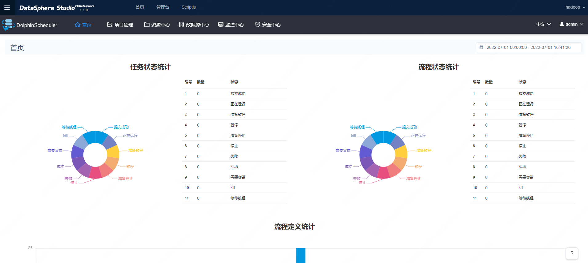

# DolphinSchedulerAppConn installation documentation

## 1.Preparation

Before you deploy `DolphinSchedulerAppConn`, you must first start the `DolphinScheduler` deployment and ensure that the `DolphinScheduler` is available.

**Please note: Currently `DolphinSchedulerAppConn` only supports DolphinScheduler 1.3.X. **

For the installation and deployment of `DolphinScheduler`, please refer to：[`DolphinScheduler` Install and deploy documentation](https://dolphinscheduler.apache.org/en-us/docs/1.3.8/user_doc/standalone-deployment.html)

## 2. Download and compile

The `DolphinSchedulerAppConn` plugin installation package can be downloaded from here: [Click me to download the `DolphinSchedulerAppConn` plugin installation package](https://osp-1257653870.cos.ap-guangzhou.myqcloud.com/WeDatasphere/DolphinScheduler/DSS1.1.1_dolphinscheduler/dolphinscheduler-appconn.zip)

If you want to compile `DolphinSchedulerAppConn` yourself, the specific compilation steps are as follows:

1. The code of clone DataSphereStudio

2. Compile dss-dolphinscheduler-appconn separately

```shell script 
 cd ${DSS_HOME}/dss-appconn/appconns/dss-dolphinscheduler-appconn
 mvn clean install
```
3. 在dss-dolphinscheduler-appconn/target/out目录下会生成dolphinscheduler文件夹，用户将其压缩成dolphinscheduler-appconn.zip文件即可

## 3. Configure and deploy

### 3.1 appconn configuration and installation
- Put the `dolphinscheduler-appconn.zip` plugin installation package in the following directory and unzip it.

```shell script 
 cd ${DSS_HOME}/dss/dss-appconns
 unzip dolphinscheduler-appconn.zip
```

- Configuration parameters, please modify the configuration parameters of `appconn.properties` as needed.

```shell script
 cd ${DSS_HOME}/dss/dss-appconns/dolphinscheduler
 vim appconn.properties
```

```properties
# [Required] Specify the administrator user of DolphinScheduler
wds.dss.appconn.ds.admin.user=admin
# [Required] Specify the token of the DolphinScheduler administrator user, which can be obtained from "Security Center -> Token Management" on the dolphinscheduler page
wds.dss.appconn.ds.admin.token=

# [Please refer to] Currently only compatible with DolphinScheduler 1.3.X.
wds.dss.appconn.ds.version=1.3.9

# Used to configure the home path of dss-dolphinscheduler-client, it can be a specific path, please refer to the fourth step for details
wds.dss.appconn.ds.client.home=${DSS_DOLPHINSCHEDULER_CLIENT_HOME}

# this property is used to add url prefix, if you add a proxy for dolphinscheduler url.
# for example: the normal dolphinscheduler url is http://ip:port/users/create, if you set
# this property, the real url will be http://ip:port/${wds.dss.appconn.ds.url.prefix}/users/create
#wds.dss.appconn.ds.url.prefix=
```

- Load the `DolphinScheduler` plugin

```shell script 
cd ${DSS_HOME}/bin
sh install-appconn.sh
# This script is an interactive installation program, you only need to follow the instructions, enter the string dolphinscheduler and the ip and port of the dolphinscheduler service to complete the installation
```

Please note: Do not enter `localhost` or `127.0.0.1` for the ip of dolphinscheduler, please enter the real IP.

### 3.2 Modify the jar package
#### 3.2.1 Put dss-dolphinscheduler-token.jar under lib of dss-framework-project

The plugin installation package can be downloaded from here: [Click me to download plugin installation package](https://osp-1257653870.cos.ap-guangzhou.myqcloud.com/WeDatasphere/DolphinScheduler/DSS1.1.1_dolphinscheduler/dss-dolphinscheduler-token-1.1.1.jar)

The role of this Jar package is to provide the `/api/rest_j/v1/dss/framework/project/ds/token` interface, which is used to request the interface of DolphinScheduler without password.

How to obtain the Jar package: After DSS is compiled, it can be obtained from the `plugins/dolphinscheduler` directory:


Upload the Jar package to the DSS deployment directory: `${DSS_HOME}/lib/dss-framework/dss-framework-project-server/`，然后重启 `dss-framework-project-server` 服务：

```shell
sh sbin/dss-daemon.sh restart project-server
```

#### 3.2.2 Put dolphinscheduler-prod-metrics-with-dependencies.jar into DolphinScheduler's lib directory

The plugin installation package can be downloaded from here: [Click me to download plugin installation package](https://osp-1257653870.cos.ap-guangzhou.myqcloud.com/WeDatasphere/DolphinScheduler/DSS1.1.1_dolphinscheduler/dolphinscheduler-prod-metrics-1.1.1-jar-with-dependencies.jar)

This step is to add the custom interface implementation Jar package of DolphinScheduler to the lib directory of the DolphinScheduler service, and restart the DolphinScheduler service to make it effective.

Jar acquisition method: There are dolphinscheduler related plugin packages in the plugins directory compiled from DSS, as shown in the figure:


Copy the Jar package to the lib directory deployed by DolphinScheduler:


Restart the DolphinScheduler service to make the Jar's custom interface take effect:

```shell script
sh bin/stop-all.sh
sh bin/start-all.sh
```


### 3.3 Modify the nginx configuration of DSS and add the request matching rule of the /dolphinscheduler path.

This step is because the front end of the operation and maintenance center page will directly call the interface of the DolphinScheduler service to request data (`/dolphinscheduler` URI path prefix),

So the request needs to be forwarded to the DolphinScheduler service.

```shell script
vim /etc/nginx/conf.d/dss.conf
```

```shell script
location /dolphinscheduler {
    proxy_pass http://127.0.0.1:12345;#The address of the backend dolphinscheduler service
    proxy_http_version 1.1;
    proxy_set_header Upgrade $http_upgrade;
    proxy_set_header Connection upgrade;
}
```

After the modification, execute the command to reload the nginx configuration to make it take effect:

```shell script
sudo nginx -s reload
```

### 3.4 Configure the url to the dispatch center

update `${DSS_HOME}/conf/dss-workflow-server.properties` config：

```properties
#This path corresponds to the page of the dolphinscheduler operation and maintenance center
wds.dss.workflow.schedulerCenter.url="/scheduler"
```

Then restart the workflow to make the configuration take effect:

```shell script
sh sbin/dss-daemon.sh restart workflow-server
```

## 4. Deploy dss-dolphinscheduler-client

In order for `DolphinScheduler` to normally schedule workflow node jobs in DataSphereStudio, you also need to install the dss-dolphinscheduler-client plugin, which is used to execute DSS workflow node jobs.

### 4.1 Installation package preparation

The `dss-dolphinscheduler-client` plugin installation package can be downloaded from here: [Click me to download the plugin installation package](https://osp-1257653870.cos.ap-guangzhou.myqcloud.com/WeDatasphere/DolphinScheduler/DSS1.1.1_dolphinscheduler/dss-dolphinscheduler-client.zip)

If you want to compile `dss-dolphinscheduler-client` yourself, the specific compilation steps are as follows:

1. The code of clone DataSphereStudio
2. Compile dss-dolphinscheduler-client separately

```shell script 
cd ${DSS_HOME}/plugins/dolphinscheduler/dss-dolphinscheduler-client
mvn clean install
```

### 4.2 Installation and deployment

Please configure the environment variable `DSS_DOLPHINSCHEDULER_CLIENT_HOME` in `/home/${USER}/.bash_rc` first (if you specify an absolute path instead of this environment variable in `appconn.properties`, this environment variable can also be left unconfigured ).

Configure `DSS_DOLPHINSCHEDULER_CLIENT_HOME` to the actual `dss-dolphinscheduler-client` root path.

Unzip and install in the root path of `dss-dolphinscheduler-client`, as follows:

```shell script 
cd ${DSS_DOLPHINSCHEDULER_CLIENT_HOME}
unzip dss-dolphinscheduler-client.zip
```

Unzip it to complete the installation of `dss-dolphinscheduler-client`.

Then you need to modify the ip and port of the linkis gateway in the configuration file conf/linkis.properties in dss-dolphinscheduler-client:


## 5. Use of DolphinSchedulerAppConn

### 5.1 Password-free jump

Go to the DSS workspace home page, and then click Jump to DolphinScheduler on the top menu bar.




### 5.2 Publish DSS workflows to DolphinScheduler

Click the Publish button of the DSS workflow to publish the DSS workflow to DolphinScheduler with one click.

### 5.3 dispatch center documentation

For more information on the use of DSS dispatch center, please refer to：[Schedul Center Documentation](../User_Manual/Schedule_Center_Documentation.md)