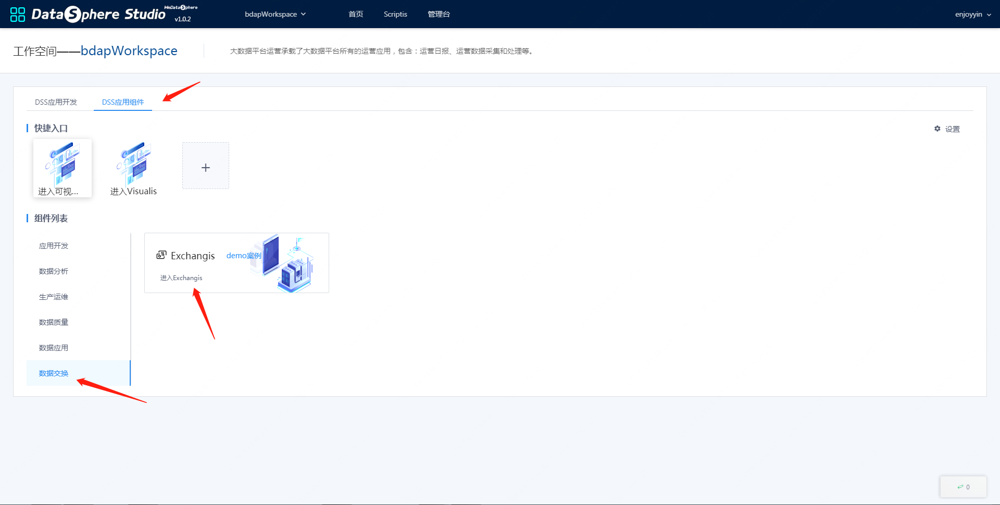

# ExchangisAppConn installation documentation

This article mainly introduces the deployment, configuration and use of ExchangeisAppConn in DSS (DataSphere Studio) 1.0.


## 1. Preparations for deploying ExchangisAppConn

Before you deploy the ExchangisAppConn, you must start the Exchangis deployment and ensure that the basic functions are available. And Exchangis needs to introduce the following maven dependencies, which can achieve unified SSO capabilities
````xml
<dependency>
     <groupId>com.webank.wedatasphere.dss</groupId>
     <artifactId>spring-origin-sso-integration-plugin</artifactId>
     <version>${dss.version}</version>
</dependency>
````
In the DSS1.0.0 version, Exchangis can achieve the SSO specification in the first-level specification of DSS, and can log in to Exchangeis without password on the home page.


## 2. Compilation of ExchangisAppConn materials

DSS1.0.0 version, this step can be skipped, ExchangisAppConn uses the default SSO implementation

## 3. Deployment and installation of ExchangisAppConn materials

DSS1.0.0 version, ExchangisAppConn material installation can be skipped, but you need to insert the corresponding data in the database, the sql is as follows, you need to modify the ip and port of the Exhangis service in the first line
```roomsql
SET @EXCHANGIS_INSTALL_IP_PORT='127.0.0.1:9003';
SET @URL = replace('http://EXCHANGIS_IP_PORT', 'EXCHANGIS_IP_PORT', @EXCHANGIS_INSTALL_IP_PORT);
SET @HOMEPAGE_URL = replace('http://EXCHANGIS_IP_PORT', 'EXCHANGIS_IP_PORT', @EXCHANGIS_INSTALL_IP_PORT);
SET @PROJECT_URL = replace('http://EXCHANGIS_IP_PORT', 'EXCHANGIS_IP_PORT', @EXCHANGIS_INSTALL_IP_PORT);
SET @REDIRECT_URL = replace('http://EXCHANGIS_IP_PORT/udes/auth', 'EXCHANGIS_IP_PORT', @EXCHANGIS_INSTALL_IP_PORT);

delete from `dss_application` WHERE `name` = 'Exchangis';
INSERT INTO `dss_application`(`name`,`url`,`is_user_need_init`,`level`,`user_init_url`,`exists_project_service`,`project_url`,`enhance_json`,`if_iframe`,`homepage_url`,`redirect_url`) VALUES ('Exchangis', @URL, 0, 1, NULL, 0, @PROJECT_URL, '', 1, @HOMEPAGE_URL, @REDIRECT_URL);

select @dss_exchangis_applicationId:=id from `dss_application` WHERE `name` = 'Exchangis';

delete from `dss_onestop_menu` WHERE `name` = 'data exchange';
INSERT INTO `dss_onestop_menu`(`name`, `title_en`, `title_cn`, `description`, `is_active`) values ('data exchange','data exchange','data exchange','data exchange',1);

select @dss_onestop_menu_id:=id from `dss_onestop_menu` where `name` = 'data exchange';

delete from `dss_onestop_menu_application` WHERE title_en = 'Exchangis';
INSERT INTO `dss_onestop_menu_application` (`application_id`, `onestop_menu_id`, `title_en`, `title_cn`, `desc_en`, `desc_cn`, `labels_en`, `labels_cn`, `is_active`, `access_button_en`, `access_button_cn`, `manual_button_en`, `manual_button_cn`, `manual_button_url`, `icon`, `order`, `create_by`, `create_time`, `last_update_time`, `last_update_user`, `image`) 
VALUES(@dss_exchangis_applicationId, @dss_onestop_menu_id, 'Exchangis','data exchange','Exchangis is a lightweight, high scalability, data exchange platform, support for structured and unstructured data transmission between heterogeneous data sources','Exchangis is a lightweight A highly scalable data exchange platform that supports data transmission between structured and unstructured heterogeneous data sources, and has business features such as data permission control, high availability of node services, and multi-tenant resource isolation at the application layer. , and on the data layer, it has architectural features such as diversification of transmission architecture, module plug-in and low coupling of components.','Data Exchange','Data Exchange','1','Enter Exchangis','Enter Exchange', 'user manual','user manual','http://127.0.0.1:8088/wiki/scriptis/manual/workspace_cn.html','shujujiaohuan-logo',NULL,NULL,NULL,NULL,NULL,'shujujiaohuan -icon');
```


## 4. Use of ExchangisAppConn
You can enter the front-end homepage of DSS, and then enter the homepage of the Exchangis application, as shown in the figure




## 5.How the ExchangisAppConn plugin works

1. Microservices using ExchangeisAppConn

The following microservices in DSS will interact with Exchangis through ExchangisAppConn to complete the specified functions.

| Microservice name      | Functions done with AppConn   | Remark                                   |
|-----------------|----------------|----------------------------------------|
| dss-framework-project-server       | Unified authentication to achieve SSO   | must                                   |


2. Exchangis integration into dss needs to set the corresponding content in the following database tables

| Table Name      | Table Role   | Remark                                   |
|-----------------|----------------|----------------------------------------|
| dss_application       | Application table, mainly to insert the basic information of the Exchangis application    | must                                   |
| dss_menu     | Menu table, which stores the content displayed to the outside world, such as icons, names, etc. | must                                   |
| dss_onestop_menu_application | The association table of menu and application for joint search |                    must                |


3. Follow-up development items

3.1 ExchangisAppConn supports engineering specifications in primary specifications

3.2 ExchangisAppConn supports the execution specification in the third-level specification, and supports the execution of tasks of the type Exchangis

3.3 ExchangisAppConn supports import and export specifications in the third-level specification
