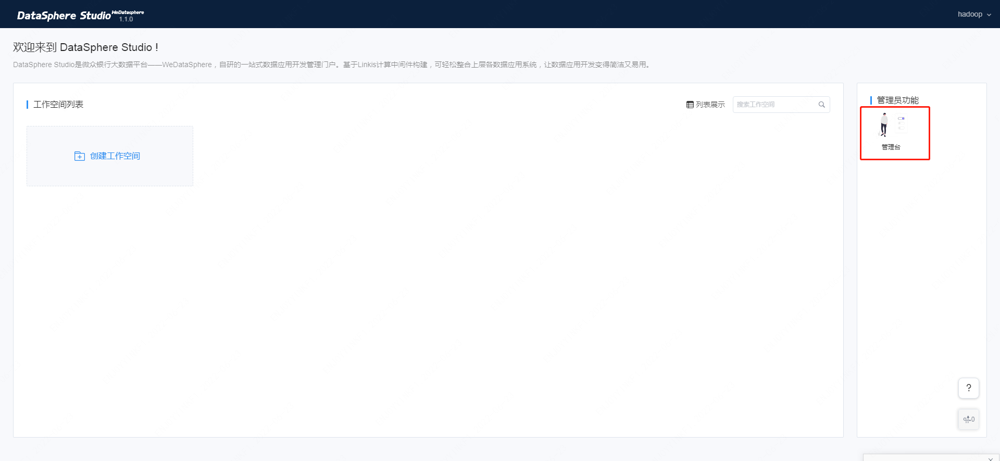

# DataSphere Studio How to add users

> DSS only provides an administrator account by default. User login authentication relies on Linkis' LDAP user login authentication system. This article will introduce in detail how to add a new DSS user.

## 1. Basic introduction

The user name of the DSS super administrator is the deployment user name. If the deployment user is hadoop, the administrator's user name and password are hadoop/hadoop. The specific user can be found in [DSS single-machine deployment document](../Installation/Deployment/DSS&Linkis One-click Deployment document stand-alone version.md) view.

Adding a DSS user is mainly divided into the following steps:

- Add LDAP user
- Improve environmental information for new users

## 2. Add LDAP user

DSS super administrators can create departments and users on the homepage, establish the company's hierarchy and personnel management system, and create departments and users. As shown below:
 
 

#### Create department and user:

On the home page of the super administrator, click [Management Desk] to enter the management desk page.

Super administrators can create, modify and delete departments (please note: a maximum of four levels can be established at the department level, including meta-company), meta-company cannot be deleted, only information can be modified.

At the same time, the super administrator can create, modify and reset user passwords.

As shown below:
 
  

After you create a user on the page, the DSS background will automatically request LDAP and create a user with the same name in LDAP for you.

## 3. Improve environmental information for new users

1. Due to the top-down multi-tenant isolation of DSS & Linkis, in order to allow logged-in users to use DSS normally, it is necessary to create a corresponding Linux user on the Linux server. The specific steps are as follows:

- Create corresponding Linux users on all Linkis & DSS servers.
- If Hadoop is used, a corresponding Linux user needs to be created on the NameNode of Hadoop.
- Ensure that Linux users on the Linkis & DSS server can use commands such as `hdfs dfs -ls /` normally, and the user needs to be able to execute shell commands such as `spark-sql -e` and `hive -e` normally.
- Since each user's workspace is strictly isolated, you also need to create a workspace and HDFS directory for the user, as follows:

```shell script
## Create user workspace directory and authorization
mkdir $WORKSPACE_USER_ROOT_PATH/${NEW_USER}
chmod 750 $WORKSPACE_USER_ROOT_PATH/${NEW_USER}

## Create user HDFS directory and authorize
hdfs dfs -mkdir $HDFS_USER_ROOT_PATH/${NEW_USER}
hdfs dfs -chown ${NEW_USER}:${NEW_USER} $HDFS_USER_ROOT_PATH/${NEW_USER}
hdfs dfs -chmod 750 $HDFS_USER_ROOT_PATH/${NEW_USER}
```

`WORKSPACE_USER_ROOT_PATH` and `HDFS_USER_ROOT_PATH` are the workspace and HDFS root paths set when you install DSS with one click.

If you don't set it, it defaults to:

```shell script
WORKSPACE_USER_ROOT_PATH=file:///tmp/linkis
HDFS_USER_ROOT_PATH=hdfs:///tmp/linkis
```
