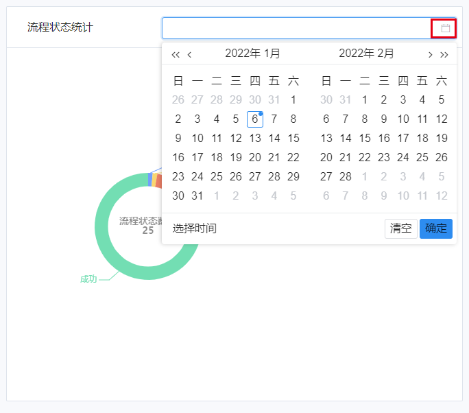
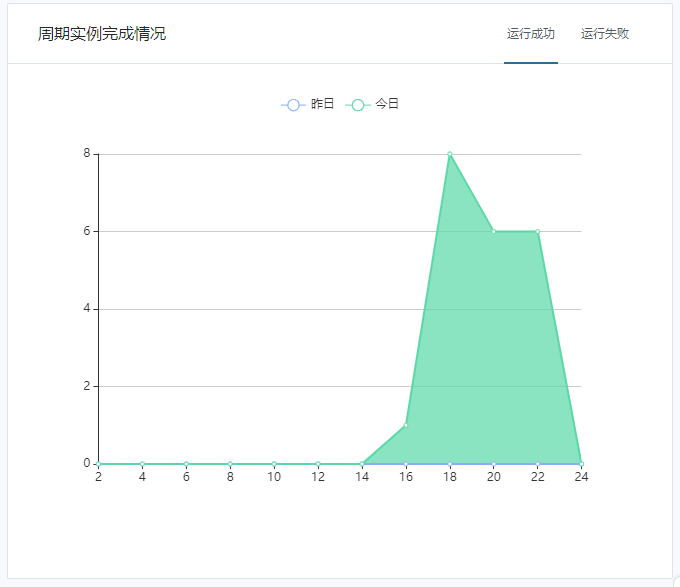
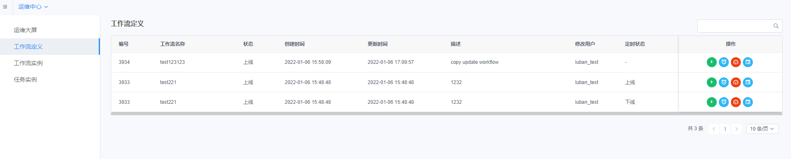
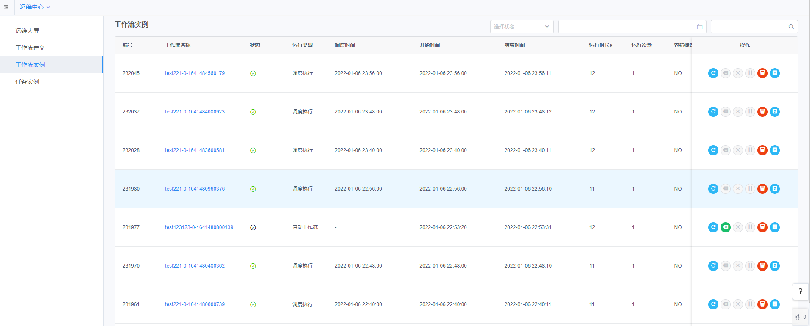

# Schedule Center Documentation

The scheduling center is a visual workflow scheduling platform. The operation and maintenance large-screen function can visually monitor and count the running status of workflow tasks in real time. The scheduling function supports the running of workflows.

Timing management, online and offline operations, etc., also support workflow management, such as rerun, resume, terminate, pause and other operations.

The log function supports operations such as viewing and downloading workflow log information.

**Note: If you want to use the dispatch center, please install it first DolphinSchedulerAppConn。** [How to install DolphinSchedulerAppConn](../Installation_and_Deployment/DolphinScheduler_Plugin_Installation_Documentation.md)

## page overview

The Dispatch Center page is shown below.

The functions of each area on the homepage of the operation and maintenance center are as follows:

- ①Project and workflow list: The list on the left side of the page displays all projects and workflows in the workspace, and you can switch projects here;
- ②Function module list: This area displays the operation and maintenance screen, workflow definition, workflow instance and task instance under the project in units of projects;
- ③ Operation area: perform operations on specific functions in this area;

## Operation and maintenance large screen

The large operation and maintenance screen is used to display the statistical chart monitoring information of all workflows in different time periods under the entire project, and display process status statistics, cycle instance completion status, workflow instance and success rate statistics, and process definition statistics.

The operation steps are as follows:

1. Log in to the platform, enter the operation and maintenance center, and select "Operation and Maintenance Large Screen"
2. View the workflow statistics under the currently selected item. The meanings and operations of different information are as follows:

#### 2.1 Process Status Statistics

Count the running status of all workflow instances under the selected project and display them in the form of a pie chart.

Users can click the **date icon** to select the statistical time period

#### 2.2 Cycle instance completion

Statistics on the task execution of periodic instances under the selected project, where the horizontal axis is time, and the vertical axis is the number of periodic instances. Users can click [Running Successfully] or [Running Failed] in the upper right corner to switch the cycle instance to be viewed.

#### 2.3 Workflow instance and success rate statistics

Count the number of execution workflow instances and success rate information in different time periods under the selected item, where the horizontal axis is time, and the vertical axis is the number of instances and success rate. Users can click [Today] and [Yesterday] in the upper right corner to switch the date to be viewed.

#### 2.4 Process time ranking

Displays the time-consuming descending ranking of task instances that have an end time in the corresponding time period.

## Workflow Definition

Workflow definition displays the information of all workflows defined under the currently selected item, and can perform operations such as running, timing, online/offline, and timing management for a single workflow in the operation bar.

- 1. How to run the currently selected workflow?

Select the row of the workflow to be run, and click the **Run** button in the action bar.

- 2. How to run the workflow regularly?

Select the row of the workflow to be run, and click the **Timer** button in the action bar.

In the pop-up box, set the parameters and configure the notification person and other information. After filling in, click the [Create] button to set the scheduled task.

- 3. Workflow online/offline switching

Select a workflow that is not online, and click the **Go Online** and **Go Offline** buttons in its operation bar to go online and offline.

- 4. Timing management

Workflow timing management can perform operations such as online/offline switching, deletion or editing of the historical execution of the workflow and the running timing service.

Select the workflow that needs timing management, and click the **Timing** button in its operation bar to enter the timing management interface of the workflow. As shown below:

Click the **Edit** button to edit the scheduled service of the workflow.

## Workflow instance

The workflow instance page displays the workflow status, running type, start time, running duration and other information in the form of a list, and can operate the running status of the workflow.

- 1. Rerun the workflow

Select the workflow that needs to be rerun, and click the **Rerun** button in its operation bar.

- 2. Resume workflow

Select the workflow to be restored and click the **Restore** button in its action bar.

- 3. Terminate the workflow

Select the workflow to be terminated and click the ** Terminate ** button in its action bar.

- 4. Pause the workflow

Select the workflow that needs to be paused, and click the **Pause** button in its operation bar.

- 5. Delete workflow

Select the workflow that needs to be deleted and click the **Delete** button in its operation bar.

- 6. View Gantt Chart

Look at the Gantt chart of the workflow, which consists of the time and the runtime of each node under the workflow.

Select the workflow that needs to view the Gantt chart, and click the **View Gantt Chart** button in its operation bar.

## task instance

The task instance page displays the basic information and running status of each node task in the workflow in the form of a list, and you can view the running log of the task instance.

- 1. View log

View the running log of the task instance, and support operations such as downloading, refreshing, and full-screen viewing of the log.

Click the **Download** button in the log window to download the log to the local.

For a running task instance, click the **Refresh** button in the log window to refresh the log in real time.

Click the **full screen** button in the log window to view the log in full screen.