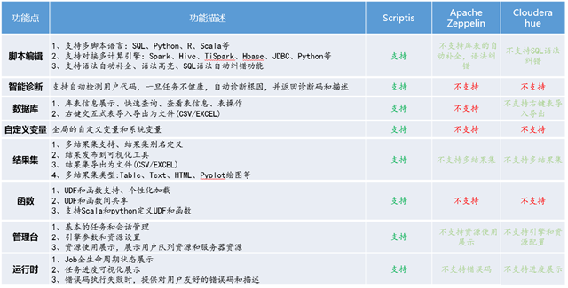
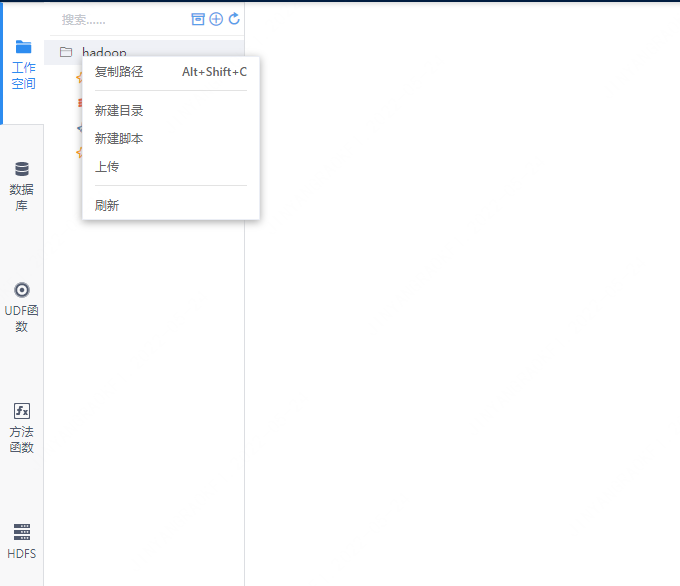
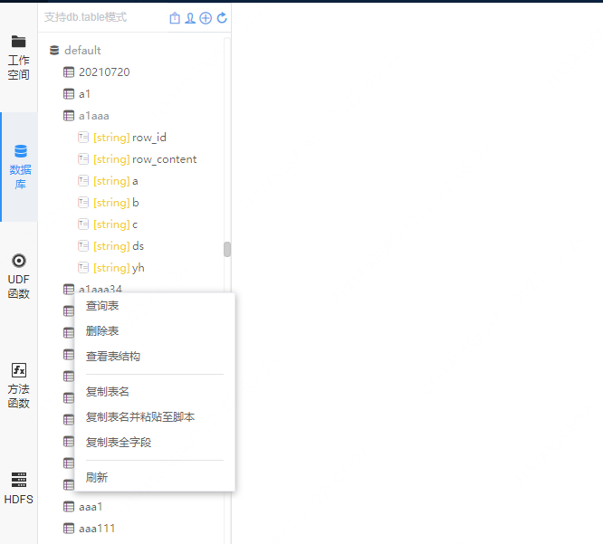
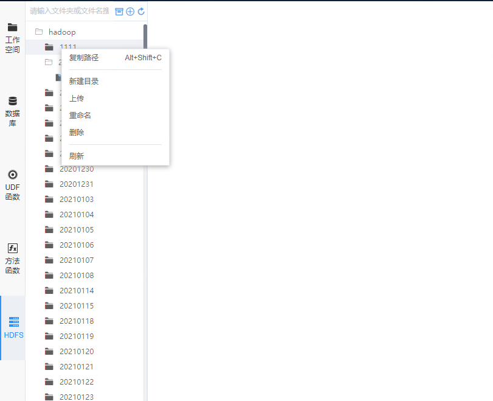

Scriptis usage documentation
------
## Introduce
&nbsp;&nbsp;&nbsp;&nbsp;Use the computing engines such as Spark, Hive, and HBase of the big data platform to conduct interactive query and analysis, and support the daily use of data mining and analysts. Provides a graphical and multi-style interface, making it more convenient and simple for users to perform data analysis, script editing, testing, and querying.

## workspace
&nbsp;&nbsp;&nbsp;&nbsp;The workspace is a file directory, and the user has all the permissions to perform file management operations and so on. Generally, it corresponds to a file directory deployed by the Linkis server, and each login user corresponds to a file directory, which stores files such as user scripts and result sets.

&nbsp;&nbsp;&nbsp;&nbsp;When you right-click the workspace folder, the right-click functions mainly include copy path, new directory, new script, and refresh.

&nbsp;&nbsp;&nbsp;&nbsp;When the mouse right-clicks the file under the workspace folder, the script right-click function, the script right-click mainly includes punching to the side, copying the path, renaming, deleting, importing to hive (csv, txt, excel type files), importing to hdfs, etc. Function.

## database
The database module obtains the hive library that the logged-in user has permission. The main functions of the right-click library include brushing the library, brushing the table, and brushing the field information. Table right-click function - query table, quickly produce temporary hive script for data viewing, copy table name and delete table, that is, copy table fields. The right-click function of the table can view the table structure, and can display the field details of the table, table details, table partition information, etc.

## UDFs and functions
The UDF function is convenient for users to classify and display UDFs, and users can manage personal functions. The configuration management of UDF has been moved to the Linkis management console. For related configuration, please refer to the related documents of Linkis UDF.

## HDFS
After Linkis is installed, each user is provided with an HDFS path by default to store user resource files. Scriptis will display the HDFS folder of the user. You can right-click to add, delete, and modify the folder. At the same time, the files in this path can also be managed through the right-click function.

