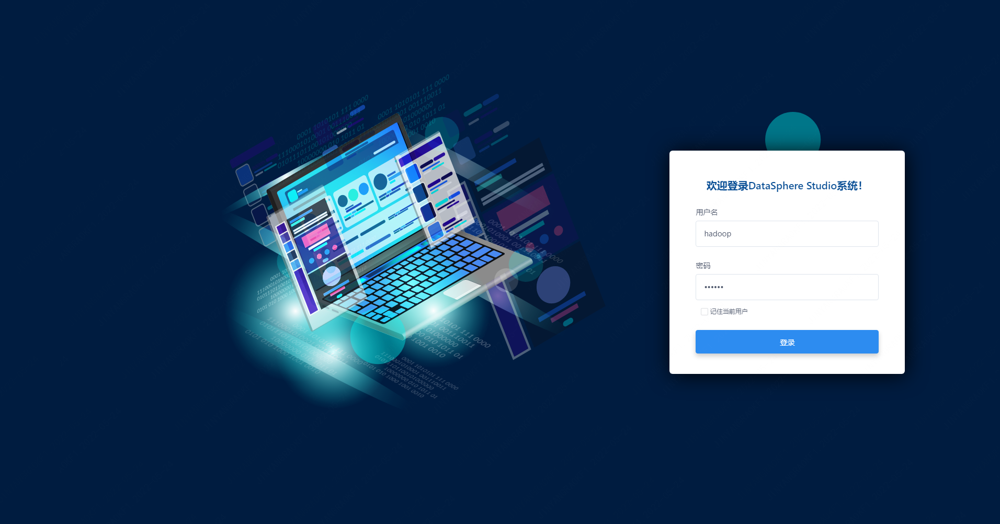
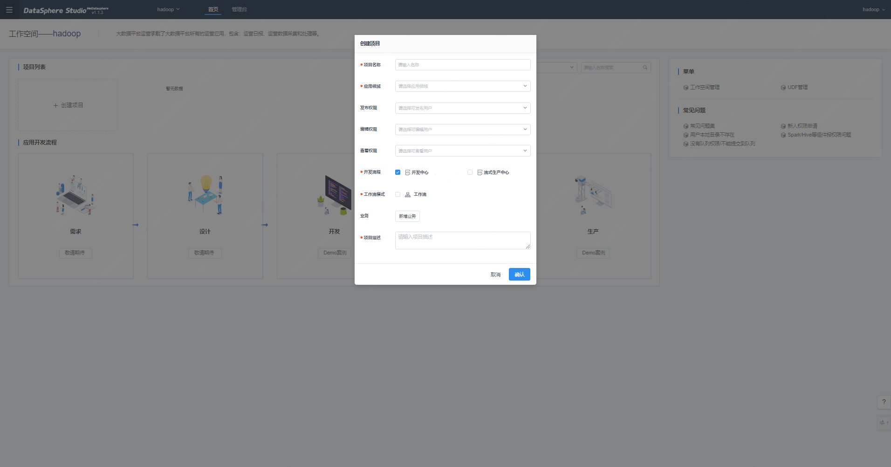

## DSS User Document

## motivation
&nbsp;&nbsp;&nbsp;&nbsp;DSS1.x version is a milestone version. It has carried out a lot of optimization and reconstruction on the basis of DSS0.x. Due to the limited space, it can only cover the basic use process of DSS, and more details of operation and use. I hope to work with community partners. Improve and optimize, if you have any questions or suggestions in the process of use, you can contact the relevant community open source personnel of WeBank's big data platform at any time. We are committed to creating a better one-stop big data suite and contributing to the big data open source ecosystem. the power of.

## foreword
&nbsp;&nbsp;&nbsp;&nbsp;The DSS1.x version has refactored and optimized the front-end page interaction. This document is the DSS user manual, which covers the basic usage process of DSS1.0. For more details on operation and usage, please refer to the documentation of each module.
&nbsp;&nbsp;&nbsp;&nbsp;User documentation is mainly divided into the following documents:
1. [Scriptis usage documentation]()
2. [Workflow usage document]()
3. [Data service usage document]()
4. [Linkis console user manual]()

## Management Module Introduction
## Login to the homepage
&nbsp;&nbsp;&nbsp;&nbsp;For the convenience of users, the system defaults to the Linux deployment user of Linkis to log in. For example, Linkis and DSS deployed with hadoop can log in directly through user: hadoop, password: hadoop (the password is the username). After entering the DSS front-end address, 127.0.0.1:8088 Enter the user name and password: hadoop hadoop to log in. The login page provides the DSS user access permission verification function.
  
* Note: If you want to support multi-user login, DSS user login depends on Linkis, which needs to be configured in the configuration of linkis-GateWay. Linkis-GateWay supports LDAP by default. *

## workspace
&nbsp;&nbsp;&nbsp;&nbsp;Go to the workspace page to create and manage workspaces. Workspace is the top-level concept of DSS. For example, a workspace can be a department, a business line, or an organization, which is used to manage data applications, including personnel, projects, or components. With the role permissions of the workspace administrator, you can manage the workspace and control the components and personnel permissions of the workspace.
  

## Engineering Management
&nbsp;&nbsp;&nbsp;&nbsp;After entering the corresponding workspace, it will jump to the homepage of the project. On the homepage of the project, you can create a project. In actual development and production, projects are often used to manage and develop a type of data application, including workflow, single task, etc. The projects under each workspace are isolated from each other. In practical applications, it is an ideal way to divide a project for each data application.
 