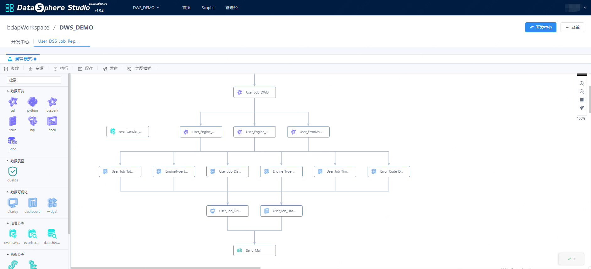

DSS-Workflow usage documentation
------

## Introduce
&nbsp;&nbsp;&nbsp;&nbsp;&nbsp;&nbsp;&nbsp;&nbsp;Data workflow (Workflow) refers to the transformation of data extraction and transformation into "the automation of part or the whole of the business process in the computer application environment", which can bring great convenience to scenarios such as data analysis and processing.
&nbsp;&nbsp;&nbsp;&nbsp;&nbsp;&nbsp;&nbsp;&nbsp;Compared with interactive analysis, DSS workflow greatly simplifies data processing tasks. The advantages of workflow can be simplified into the following three points:

1. It can automatically run batches to build the intermediate table data table, which is convenient for data use.
2. Automatically start running after the data is ready, and batch data processing regularly.
3. Workflow automation displays data into reports and data output.


## Introduction to Workflow Features
&nbsp;&nbsp;&nbsp;&nbsp;&nbsp;&nbsp;&nbsp;&nbsp;Entering the DSS workflow editing page, you can develop the workflow by dragging and dropping. The execution order of each node needs to be mentioned in the node connection control. If you need to debug a related node, after configuring the node, perform debugging of the node to determine whether the task configuration is correct.
&nbsp;&nbsp;&nbsp;&nbsp;&nbsp;&nbsp;&nbsp;&nbsp;SQL, HQL and other script nodes, after double-clicking to enter the editor, you can click Execute to run, and you can check whether the script is correct through the results (the entire workflow will not be triggered). After editing a workflow, click the Execute button directly on the page to execute the workflow in real time. This step can check whether the entire workflow can be fully run.
&nbsp;&nbsp;&nbsp;&nbsp;&nbsp;&nbsp;&nbsp;&nbsp;All flow nodes are placed in the blank area on the right by dragging and dropping. After placing the workflow node on the interface, when the mouse moves over a single node, four dots will appear in the flow node. Click the dot to draw a line. It can then be connected to another flow node, and the direction and order of the connections determine the order in which the workflow nodes are executed.


&nbsp;&nbsp;&nbsp;&nbsp;&nbsp;&nbsp;&nbsp;&nbsp;After the workflow development and debugging is completed, click Publish, and the workflow will submit the workflow to Schedulis. Find the project in Schedulis and set the scheduling parameters to schedule the workflow.

## Introduction to Workflow Nodes

### Spark node  
&nbsp;&nbsp;&nbsp;&nbsp;&nbsp;&nbsp;&nbsp;&nbsp;&nbsp;It supports sql, pyspark, and scala to execute spark tasks. When using it, you only need to drag the node to the workbench and write the code.
### Hive node  
&nbsp;&nbsp;&nbsp;&nbsp;&nbsp;&nbsp;&nbsp;&nbsp;&nbsp;The hive node supports the execution of hive tasks in SQL mode. When using it, you only need to drag and drop the node to the workbench and write the hivesql code.
### python node   
&nbsp;&nbsp;&nbsp;&nbsp;&nbsp;&nbsp;&nbsp;&nbsp;&nbsp;The python node supports executing python tasks. When using it, you only need to drag and drop the node to the workbench and write python code.
### shell node  
&nbsp;&nbsp;&nbsp;&nbsp;&nbsp;&nbsp;&nbsp;&nbsp;&nbsp;The shell node supports executing shell commands or running scripts. When using it, you only need to drag and drop the node to the workbench and write shell commands.
### jdbc node 
&nbsp;&nbsp;&nbsp;&nbsp;&nbsp;&nbsp;&nbsp;&nbsp;&nbsp;The jdbc node supports running sql commands in jdbc mode. When using it, you only need to drag and drop the node to the workbench and write the sql. **Note that you need to configure the jdbc connection information in the linkis console management console in advance.**

### signal node
&nbsp;&nbsp;&nbsp;&nbsp;&nbsp;&nbsp;&nbsp;&nbsp;&nbsp;The EventSender node is used to send information and send a piece of information event to the EventReceiver.

&nbsp;&nbsp;&nbsp;&nbsp;&nbsp;&nbsp;&nbsp;&nbsp;&nbsp;Common scenarios include upstream and downstream dependencies between projects, and upstream and downstream information dependencies between workflows. For example, a workflow node of workflow B depends on some information of a workflow node of workflow A (such as status information, that is, node A can execute successfully before node B can start executing), eventSender supports the following parameters:

```xml
1. msg.type: used to specify the type of Job, SEND is used to send messages, RECEIVE is used to receive messages
2. msg.sender: Specifies the sender of the message, which needs to be defined in the format of ProjectName@WFName@JobName
3. msg.topic: Specify the topic of the message. It is recommended to use the following format: first-level classification code+_+second-level classification code+_+third-level classification code
4. msg.name: Specifies the message name, which is user-defined
5. msg.body: specify the content of the message, it can be empty if no content is sent
6. **Note: msg.type cannot be changed to SEND by default, msg.sender, msg.topic, msg.name are required**
```

E.g：
```xml
msg.type=SEND
msg.sender=project01@flow@job01
msg.topic=bdp_tac_test
msg.name=TestDynamicReceive
msg.body=${msg.mycontent}
```
&nbsp;&nbsp;&nbsp;&nbsp;&nbsp;&nbsp;&nbsp;&nbsp;&nbsp;The EventReceiver node is used to receive the message sent by the eventSender, and store the content of the received message in the context of the workflow. Subsequent nodes will find the information according to the prefix and use it as a custom variable. The eventReceiver supports the following parameters :

```xml
1. msg.type: used to specify the type of Job, SEND is used to send messages, RECEIVE is used to receive messages
2. msg.receiver: Specifies the receiver of the message, which needs to be defined in the format of projectname@jobname@rtxname
3. msg.topic: Specify the topic of the message. It is recommended to use the following format: first-level classification code+_+second-level classification code+_+third-level classification code
4. msg.name: Specifies the message name, which is user-defined
5. query.frequency: Since active polling is used to receive messages, the number of queries during wait.time
6. max.receive.hours: The longest reception time, in hours
7. msg.savekey: used to save the key value of the message content. For multiple receiving jobs in a single flow, you need to specify different msg.savekey to save the message content. The default value is msg.body. Subsequent jobs can use this key value to get the message content.
8. only.receive.today: If it is true, it can only receive messages from the day the job is started
9. Note: msg.type cannot be changed to RECEIVE by default, msg.receiver, msg.topic, msg.name are required
```

### DataCheck node：
&nbsp;&nbsp;&nbsp;&nbsp;&nbsp;&nbsp;&nbsp;&nbsp;&nbsp;The DataCheck node is used to detect whether the data is ready. It can determine whether a table or partition in the hive library exists. If it exists, it will be executed downstream. It plays a very important role in data-dependent tasks and is used to replace the previous verbal agreement. Good time to start running.

&nbsp;&nbsp;&nbsp;&nbsp;&nbsp;&nbsp;&nbsp;&nbsp;&nbsp;dataCheck supports the following parameters：
```
1. source.type: dependent data source
2. check.object: The name of the dependent data For example: data.object.1=dbname.tablename{partitionlist}
3. max.check.hours: Describe the waiting time of the task, the unit is hours
4. job.desc: Append multi-source information configuration
```

### SendEmail node
&nbsp;&nbsp;&nbsp;&nbsp;&nbsp;&nbsp;&nbsp;&nbsp;&nbsp;The SendEmail node is generally used as the last node of the workflow, which is used to send the result information in front of the workflow. It supports sending forms, texts, DashBoard, Display, pictures, etc. The user directly selects the workflow node that they want to send when using it. That is, at present, it needs to be used with the third-party nodes DashBoard and Display of Visualis in the DSS workflow.
&nbsp;&nbsp;&nbsp;&nbsp;&nbsp;&nbsp;&nbsp;&nbsp;&nbsp;sendEmail supports the following parameters:
```
Type: supports node, text, file, link
Email subject: Specify the email list to mention
Send item: the specific content to send, for example: if the type is node, select the node here
Associated approval form: whether the email has been approved, if not, it will not be sent
Other basic mail properties: To, Cc, Bcc
```

### connection node
&nbsp;&nbsp;&nbsp;&nbsp;&nbsp;&nbsp;&nbsp;&nbsp;&nbsp;The role of the Connector node is to adjust the workflow layout as a connection between nodes and nodes, and it does not have special functions.

### child workflow node
&nbsp;&nbsp;&nbsp;&nbsp;&nbsp;&nbsp;&nbsp;&nbsp;&nbsp;The Subflow node allows you to embed a sub-workflow in a workflow. When the parent workflow is published, the sub-workflow will also be published synchronously, but when the parent workflow is executed in real time, the execution of the sub-workflow will be skipped.  
&nbsp;&nbsp;&nbsp;&nbsp;&nbsp;&nbsp;&nbsp;&nbsp;&nbsp;If you want to execute a sub-workflow, double-click the sub-workflow node to enter the sub-workflow editing page for execution.

### third-party node
&nbsp;&nbsp;&nbsp;&nbsp;&nbsp;&nbsp;&nbsp;&nbsp;&nbsp;The third-party node needs to configure the AppConn installation package according to the corresponding third-party system, and use it after inserting the relevant fields of the AppConn table.
