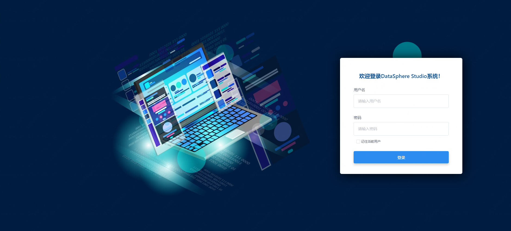
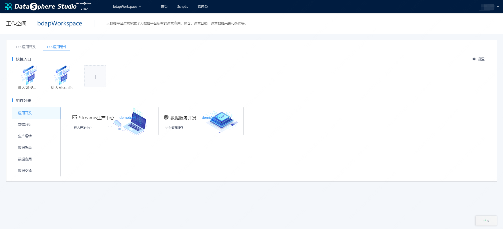
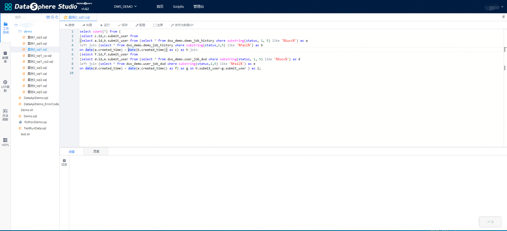

# Getting Started with DSS

## 1. Foreword

&nbsp;&nbsp;&nbsp;&nbsp;&nbsp;&nbsp;&nbsp;&nbsp;&nbsp;This article is a quick start document for DSS 1.0.0, covering the basic usage process of DSS. More details of operation and usage will be provided in the user documentation.  

&nbsp;&nbsp;&nbsp;&nbsp;&nbsp;&nbsp;&nbsp;&nbsp;&nbsp;At the same time, I would like to thank the Tianyi Cloud big data platform for its great assistance, and designed a UI visual draft for DSS, making DSS better.  

## 2. Login Home
&nbsp;&nbsp;&nbsp;&nbsp;&nbsp;&nbsp;&nbsp;&nbsp;&nbsp;For the convenience of users，**By default, the system logs in through the Linux deployment user of Linkis.**，If you use Linkis and DSS deployed by hadoop, you can log in directly through user: hadoop, password: hadoop (the password is the username). First enter the front-end container address: 192.168.xx.xx:8888 and then enter the username and password: hadoop hadoop. 

*Note: If you want to support multi-user login, DSS user login depends on Linkis, which needs to be configured in the configuration of linkis-GateWay. Linkis-GateWay supports LDAP by default. *


<center>图 2.1 DSS1.0.0登录首页</center>

## 3. Workspace management  

&nbsp;&nbsp;&nbsp;&nbsp;&nbsp;&nbsp;&nbsp;&nbsp;&nbsp;Go to the workspace page to create and manage workspaces.

&nbsp;&nbsp;&nbsp;&nbsp;&nbsp;&nbsp;&nbsp;&nbsp;&nbsp;The workspace is the basic organizational structure of DSS. Through the workspace, all data applications of a department, a business line, and a product can be put into a workspace to manage related participating users, roles, projects, and application components. The picture below is the home page of the workspace.


<center>Figure 3.1 Workspace Home Page</center>

## 4. Engineering Managemen

&nbsp;&nbsp;&nbsp;&nbsp;&nbsp;&nbsp;&nbsp;&nbsp;&nbsp;After entering the corresponding workspace, you can create a project. In actual development, projects are often used to manage a type of data application. Different projects are isolated from each other, and the users who can participate in development and release can be different from each other.  

&nbsp;&nbsp;&nbsp;&nbsp;&nbsp;&nbsp;&nbsp;&nbsp;&nbsp;You can create and manage projects on the project home page, including creating, modifying, and deleting, and on the project home page, you can switch the corresponding workspace at the top, work The **menu** on the right side of the space can jump to the **workspace management page**.


<center>Figure 4.1 Workspace Home Page</center>  

<br/>


<center>Figure 4.2 DSS App Store</center>  


# 5. DSS application components

&nbsp;&nbsp;&nbsp;&nbsp;&nbsp;&nbsp;&nbsp;&nbsp;&nbsp;On the home page of the workspace, you can click to enter the DSS application components. The application components page provides shortcuts to access third-party components of DSS, such as data services, Scritpis, Visualis, and Schedules.

## 5.1. Scripits

&nbsp;&nbsp;&nbsp;&nbsp;&nbsp;&nbsp;&nbsp;&nbsp;&nbsp;Scriptis is an interactive data exploration and analysis tool developed by WeDataSphere. Hive, Flink, Presto, etc.), Hive database management functions, resources (such as Yarn resources, server resources) management, application management and various user resources (such as UDFs, variables, etc.) management capabilities.


<center>Figure 5.1 Scriptis interface</center>
<br/>

&nbsp;&nbsp;&nbsp;&nbsp;&nbsp;&nbsp;&nbsp;&nbsp;&nbsp;Workspace is a file directory, the user has all the permissions to perform file management operations and so on. The recommended directory structure is four directories: script, data, log, and res. The directory structure is clear and convenient for users to view and manage.

&nbsp;&nbsp;&nbsp;&nbsp;&nbsp;&nbsp;&nbsp;&nbsp;&nbsp;The main functions of the workspace are as follows: 

1. The right-click of the workspace mainly includes copy path, new directory, new script, upload, rename, delete and refresh.
2. Top search function, support quick location of files
3. The new script function supports the creation of the following scripts

&nbsp;&nbsp;&nbsp;&nbsp;&nbsp;&nbsp;&nbsp;&nbsp;&nbsp;The database provides a graphical database table information display management function, through which you can quickly find the database table with permissions and the management function of the database table.

&nbsp;&nbsp;&nbsp;&nbsp;&nbsp;&nbsp;&nbsp;&nbsp;&nbsp;The UDF and function modules provide visualization of UDF functions and facilitate the management of custom functions.

&nbsp;&nbsp;&nbsp;&nbsp;&nbsp;&nbsp;&nbsp;&nbsp;&nbsp;The HDFS module provides visual file structure display and operation functions. Just a simple click, you can complete the operation of HDFS file and folder management.

## 5.2. Workflow

&nbsp;&nbsp;&nbsp;&nbsp;&nbsp;&nbsp;&nbsp;&nbsp;&nbsp;After creating a new project, enter the workflow development page, and you can develop data applications by dragging and dropping. 


<center>Figure 5.2 Workflow page</center>
<br/>

&nbsp;&nbsp;&nbsp;&nbsp;&nbsp;&nbsp;&nbsp;&nbsp;&nbsp;Double-click the workflow node to enter the node editing page, and complete script development and debugging on the editing page.

&nbsp;&nbsp;&nbsp;&nbsp;&nbsp;&nbsp;&nbsp;&nbsp;&nbsp;After completing the development of the workflow node, you can click on the workflow page to execute the workflow to complete the debugging of the workflow.


<center>Figure 5.3 Execution Workflow</center>
<br/>

&nbsp;&nbsp;&nbsp;&nbsp;&nbsp;&nbsp;&nbsp;&nbsp;&nbsp;After debugging, click the Release button to support the one-click release of the DSS workflow to Schedulelis for daily batch scheduling.

## 5.3. data service

&nbsp;&nbsp;&nbsp;&nbsp;&nbsp;&nbsp;&nbsp;&nbsp;&nbsp;DSS1.0 provides data service functions in the form of embedded application tools, which can facilitate users who do not have library table permissions to access specific data and publish data services Users only need to simply write Spark SQL queries, reserve query interfaces, and publish them as data services for other users to use.


<center>Figure 5.4 Data Services</center>

-----
## DSS Node Introduction Appendix：
### 1.Workflow spark node  
&nbsp;&nbsp;&nbsp;&nbsp;&nbsp;&nbsp;&nbsp;&nbsp;&nbsp;It supports sql, pyspark, and scala to execute spark tasks. When using it, you only need to drag the node to the workbench and write the code.
### 2. Workflow hive node
&nbsp;&nbsp;&nbsp;&nbsp;&nbsp;&nbsp;&nbsp;&nbsp;&nbsp;The hive node supports the execution of hive tasks in SQL mode. When using it, you only need to drag the node to the workbench and write the hivesql code.
### 3. Workflow python node
&nbsp;&nbsp;&nbsp;&nbsp;&nbsp;&nbsp;&nbsp;&nbsp;&nbsp;python node supports executing python tasks, just drag the node to the workbench and write python code.
### 4. Workflow shell node
&nbsp;&nbsp;&nbsp;&nbsp;&nbsp;&nbsp;&nbsp;&nbsp;&nbsp;The shell node supports executing shell commands or running scripts. When using, just drag the node to the workbench and write the shell command.
### 5. Workflow jdbc node
&nbsp;&nbsp;&nbsp;&nbsp;&nbsp;&nbsp;&nbsp;&nbsp;&nbsp;jdbc node supports running sql commands in jdbc mode, just drag the node to the workbench and write sql, **Note that you need to advance Configure jdbc connection information on the linkis console. **

### 6. Use of signal nodes:
&nbsp;&nbsp;&nbsp;&nbsp;&nbsp;&nbsp;&nbsp;&nbsp;&nbsp;The EventSender node is used to send information and send a piece of information event to eventReceiver.

&nbsp;&nbsp;&nbsp;&nbsp;&nbsp;&nbsp;&nbsp;&nbsp;&nbsp;Common scenarios include upstream and downstream dependencies between projects, and upstream and downstream information dependencies between workflows. For example, a workflow node of workflow B depends on some information of a workflow node of workflow A (such as status information, that is, node A can execute successfully before node B can start executing), eventSender supports the following parameters:

```xml
1. msg.type: Used to specify the type of Job, SEND is used to send messages, and RECEIVE is used to receive messages.

2. msg.sender: Specifies the sender of the message, which needs to be defined in the format of ProjectName@WFName@JobName.

3. msg.topic: Specify the topic of the message. It is recommended to use the following format: first-level classification code + "" + second-level classification code + "" + third-level classification code.

4. msg.name: Specifies the message name, which is user-defined.

5. msg.body: Specifies the content of the message. It can be empty if no content is sent.

6. **Note: msg.type cannot be changed to SEND by default, msg.sender, msg.topic, msg.name are required. **
```

示例：
```xml
msg.type=SEND

msg.sender=project01@flow@job01

msg.topic=bdp_tac_test

msg.name=TestDynamicReceive

msg.body=${msg.mycontent}
```
&nbsp;&nbsp;&nbsp;&nbsp;&nbsp;&nbsp;&nbsp;&nbsp;&nbsp;The EventReceiver node is used to receive the message sent by the eventSender, and store the received message content in the context of the workflow, and subsequent nodes will be based on the prefix To find this information and use it as a custom variable, eventReceiver supports the following parameters:

```xml
1. msg.type: Used to specify the type of Job, SEND is used to send messages, and RECEIVE is used to receive messages.

2. msg.receiver: Specifies the receiver of the message, which needs to be defined in the format of projectname@jobname@rtxname.

3. msg.topic: Specify the topic of the message. It is recommended to use the following format: first-level classification code + "" + second-level classification code + "" + third-level classification code.

4. msg.name: Specifies the message name, which is user-defined.

5. query.frequency: Since the active polling method is used to receive messages, the number of queries during wait.time.

6. max.receive.hours: The longest receiving time, in hours, if the message is not received after the time is exceeded, it will return a failure.

7. msg.savekey: used to save the key value of the message content. For multiple receiving jobs in a single flow, you need to specify different msg.savekey to save the message content. The default value is msg.body. Subsequent jobs can use this key value to get the message content. .

8. only.receive.today: If it is true, it can only receive messages from the day the job is started

9. Note: msg.type cannot be changed to RECEIVE by default. msg.receiver, msg.topic and msg.name are required.
```

### 7. DataCheck node:
&nbsp;&nbsp;&nbsp;&nbsp;&nbsp;&nbsp;&nbsp;&nbsp;&nbsp;DataCheck node is used to detect whether the data is ready, it can determine whether a table or partition in the hive library exists, if it exists, it will be executed downstream. Data-dependent tasks play a very important role in replacing the previously verbally agreed time to start running.

&nbsp;&nbsp;&nbsp;&nbsp;&nbsp;&nbsp;&nbsp;&nbsp;&nbsp;dataCheck supports the following parameters:
```
1. source.type: dependent data source, job representation is generated by other jobs

2. check.object: The name of the dependent data For example: data.object.1=dbname.tablename{partitionlist}

3. max.check.hours: Describe the waiting time of the task, the unit is hours

4. job.desc: Append multi-source information configuration.
```

### 8.SendEmail node
&nbsp;&nbsp;&nbsp;&nbsp;&nbsp;&nbsp;&nbsp;&nbsp;&nbsp;SendEmail node is generally used as the last node of the workflow, which is used to send the result information in front of the workflow, and supports sending form, text, DashBoard, Display , pictures, etc., the user can directly select the workflow node that he wants to send when using it:

&nbsp;&nbsp;&nbsp;&nbsp;&nbsp;&nbsp;&nbsp;&nbsp;&nbsp;sendEmail supports the following parameters:
```
Type: supports node, text, file, link
Email subject: Specify the email list to mention
Send item: the specific content to send, for example: if the type is node, select the node here
Associated approval form: whether the email has been approved, if not, it will not be sent
Other basic mail properties: To, Cc, Bcc
```

### 9. Function Node
### 9.1. Connecting nodes:
&nbsp;&nbsp;&nbsp;&nbsp;&nbsp;&nbsp;&nbsp;&nbsp;&nbsp;Connector node is used as a connection between nodes to make the workflow more beautiful, and does not have special functions.

### 9.2. Sub-workflow node:
&nbsp;&nbsp;&nbsp;&nbsp;&nbsp;&nbsp;&nbsp;&nbsp;&nbsp;Subflow node allows you to embed a sub-workflow in a workflow. When the parent workflow is published, the sub-workflow will also be published synchronously, but When the parent workflow is executed in real time, the execution of the child workflow is skipped.

&nbsp;&nbsp;&nbsp;&nbsp;&nbsp;&nbsp;&nbsp;&nbsp;&nbsp;If you want to execute a sub-workflow, please double-click the sub-workflow node to enter the sub-workflow editing page for execution.
