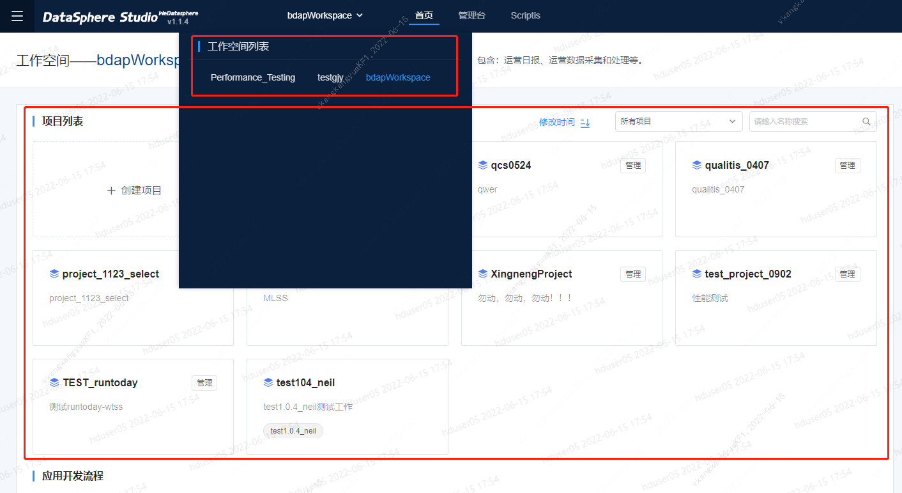

# 1.Introduction to Workspace Role Permissions 
&nbsp;&nbsp;&nbsp;&nbsp;&nbsp;&nbsp;&nbsp;In a project-oriented workspace, members of any department can be added; in a department-oriented workspace, only members of this department can be added. 
&nbsp;&nbsp;&nbsp;&nbsp;&nbsp;&nbsp;&nbsp;**management desk：**
- The default role of a workspace creator is owner, who can delegate the management of the workspace to one or more administrators.  
- Only the administrator of the workspace can enter the [Administrator] module to manage the basic information and permission information of the workspace accordingly.  
- The default roles of the workspace include owner, administrator, development user, operation and maintenance user, analysis user, operation user, data service user, and guest.  
  - Owner: has the highest authority, has the operation authority of all functions in the workspace, and can delete the workspace;
  - Administrator: has the operation authority of all functions in the workspace;
  - Development users: have permissions for data access, data quality, application development, test environment task release, production environment task submission, etc.;
  - Operation and maintenance users: have permissions for data quality, resource allocation, test environment task release, production task approval and release, etc.;
  - Analysis users: have data access, data analysis and other permissions;
  - Operational users: have data analysis and other permissions;
  - Data service users: have data access, data service and other rights;
  - Guest: has read-only access to all modules in the workspace, cannot edit or execute;

# 2.Workspace page introduction
&nbsp;&nbsp;&nbsp;&nbsp;&nbsp;&nbsp;&nbsp;The workspace page contains four parts: **Project List**, **Application Development Process**, **Menu**, and **FAQ**. 
- Project list: After users enter dss, they can choose different workspaces to create their own projects. Selecting different workspaces will display the created project list.

- Application development process: It includes **requirements** (unavailable), **design** (unavailable), **development**, **debugging**, **production**, click on the corresponding function button to jump to the corresponding function or view the corresponding example

- Menu: Click UDF management, you can enter the linkis management console for resource management, you can add functions or add UDFs

# 3.Create project
&nbsp;&nbsp;&nbsp;&nbsp;&nbsp;&nbsp;&nbsp;In the project space list, click Create Project, you can configure and add new projects according to your own needs

&nbsp;&nbsp;&nbsp;&nbsp;&nbsp;&nbsp;&nbsp;The basic information of the project can be modified by clicking the management button of the project, only the administrator can delete the project
