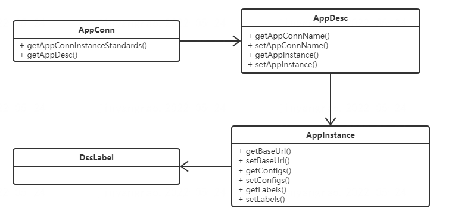
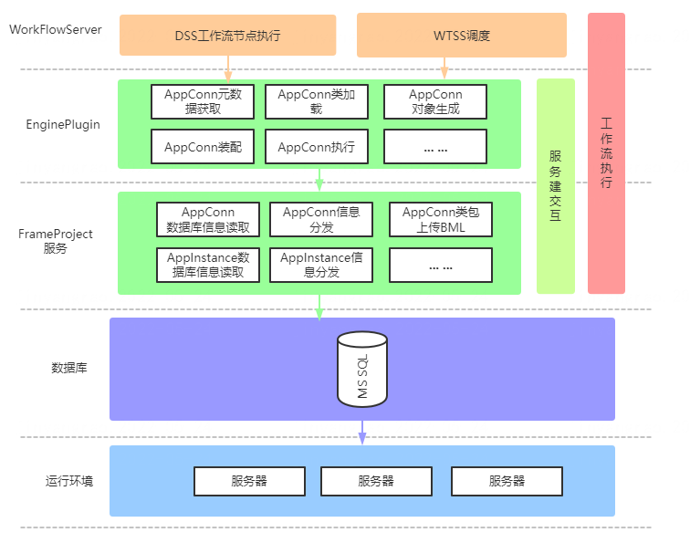
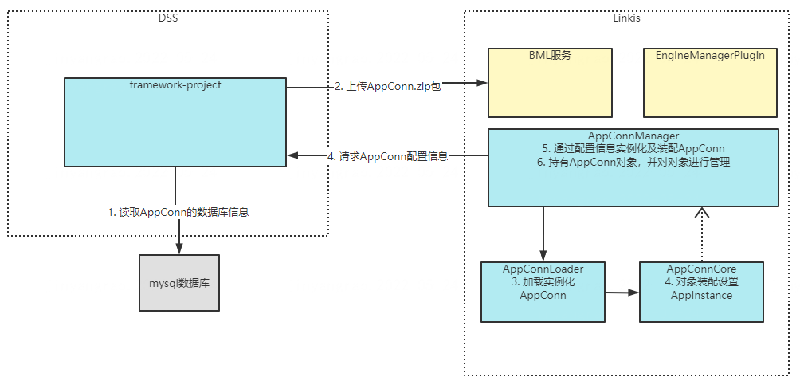

## Documentación de diseño de DSS-AppConn

## Introducir

    El principio de la AppJoint original es definir una interfaz de nivel superior AppJoint. El tercero implementa esta interfaz y almacena su propia información de conexión en la tabla DSS, e implementa un "servicio proxy" en DSS que se comunica con el sistema de terceros. En la etapa inicial de inicialización, creando una instancia del servicio a través del mecanismo de reflexión, y utilizando la información de conexión en la tabla, DSS puede usar el "servicio proxy" para establecer comunicación HTTP con el sistema de terceros, invocando así el sistema de terceros. Sin embargo, hay deficiencias en el diseño de AppJoint. Cada instancia de aplicación conectada debe generar una instancia de AppJoint. Las diferentes instancias de la misma aplicación no están asociadas lógicamente. La instancia de aplicación AppConn de cada sistema es DSS1.0. La interfaz de nivel superior, en DSS1.0, su propio modo de orquestación, flujo de trabajo, nodo de una sola tarea, etc., son todas instancias de AppConn. Además, los sistemas de terceros que acceden a DSS necesitan implementar la interfaz AppConn para implementar DSS. Integre con sistemas de terceros para llamar a aplicaciones de terceros. Lógicamente, AppConn tiene una lógica de abstracción más alta que AppJoint. AppConn es similar a una instancia de clase, mientras que AppJoint es similar a una instancia.

### Introducción a los módulos relacionados

| | del módulo de nivel 1 | del módulo de nivel 2 Introducción a la función|
|-------------|-----------|----------------|
|dss-appconn|appconns| Acceda a DSS para implementar el código de implementación de especificaciones relacionadas con AppConn|
|           |dss-appconn-core| Interfaz de Appconn y definición básica de clases|
|           |dss-appconn-loader| Creación de instancias, carga y montaje del paquete compilado AppConn de la aplicación conectada|
|           |dss-appconn-manager| Interactúe con los módulos del marco y administre la información de instancia de AppConn relacionada|
|           |dss-scheduler-appconn| Definición resumida de AppConn para la implementación del sistema de programación|
|           |linkis-appconn-engineplugin| Implementar las especificaciones relevantes de linkis appconn y abrir la interacción entre DSS AppConn y Linkis|

| Interfaz principal/| de clase Funciones principales |
|---------------------------|------------------------------|
| DSSDictionaryRestful、DSSDictionaryServiceImpl |  Proporcionar interfaz de adquisición de información de diccionario, consultar registros correspondientes de la tabla de diccionario a través de la clave de parámetro o parentKey |
| DSSWorkspacePrivRestful、DSSWorkspacePrivServiceImpl | Proporciona funciones de visualización y edición para la información de permisos del componente de menú del rol de área de trabajo |
| DSSWorkspaceRestful、DSSWorkspaceServiceImpl | Proporciona interfaces funcionales básicas del espacio de trabajo, como la creación de espacios de trabajo, la obtención de listas de espacios de trabajo, la obtención de información de permisos de componentes de menú, etc.               |
| DSSWorkspaceRoleRestful、DSSWorkspaceRoleServiceImpl | Proporciona interfaces de consulta y creación para roles de área de trabajo |
| DSSWorkspaceUserRestful、DSSWorkspaceUserServiceImpl | Proporciona una interfaz para agregar, eliminar, modificar y consultar usuarios del área de trabajo |

### Diagrama de arquitectura de AppConn

\

