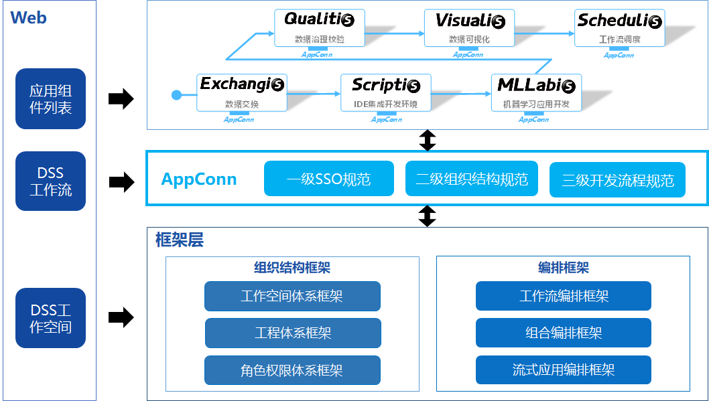
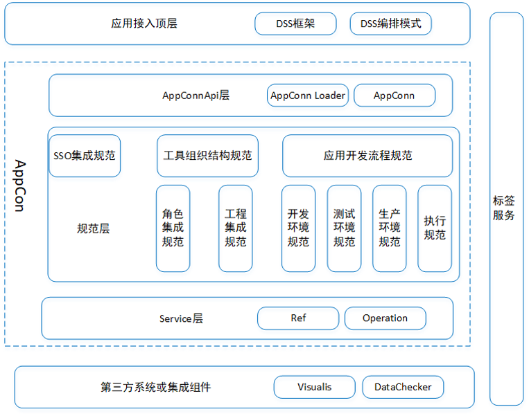
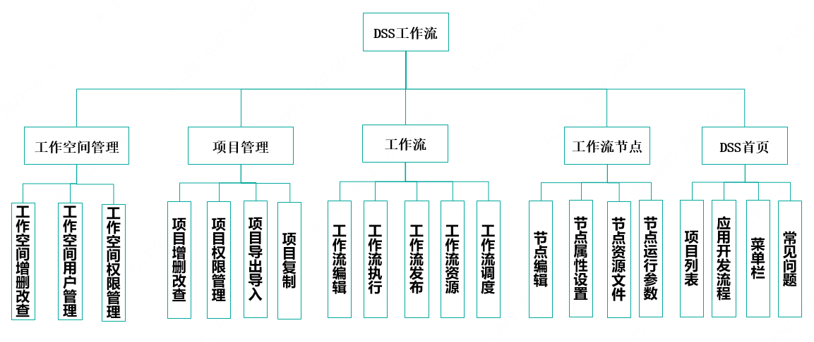
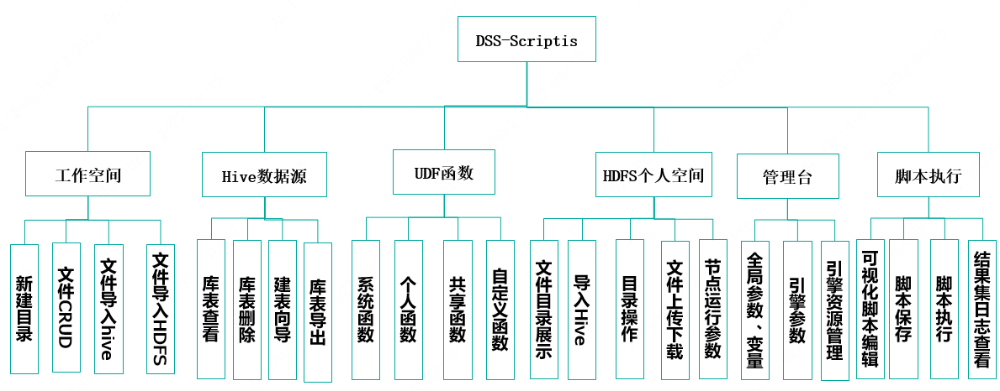

### 什么是 DataSphere Studio

DataSphere Studio（简称 DSS）是微众银行自研的数据应用开发管理集成框架。

基于插拔式的集成框架设计，及计算中间件 Linkis ，可轻松接入上层各种数据应用系统，让数据开发变得简洁又易用。

在统一的 UI 下，DataSphere Studio 以工作流式的图形化拖拽开发体验，将满足从数据交换、脱敏清洗、分析挖掘、质量检测、可视化展现、定时调度到数据输出应用等，数据应用开发全流程场景需求。

DSS 通过插拔式的集成框架设计，让用户可以根据需要，简单快速替换 DSS 已集成的各种功能组件，或新增功能组件。

借助于 Linkis 计算中间件的连接、复用与简化能力，DSS 天生便具备了金融级高并发、高可用、多租户隔离和资源管控等执行与调度能力。

### 架构图

### 功能模块图

### 工作流模块图

### Scriptis 功能模块图

### AppConn

AppConn，是 DSS 可以简单快速集成各种上层 Web 系统的核心概念。

AppConn ——应用连接器，定义了一套统一的前后台接入协议，总共分为三级规范，可让外部数据应用系统快速简单地接入，成为 DSS 数据应用开发中的一环。

AppConn 的三级规范即：一级 SSO 规范，二级组织结构规范，三级开发流程规范；

DSS 通过串联多个 AppConn，编排成一条支持实时执行和定时调度的工作流，用户只需简单拖拽即可完成数据应用的全流程开发。

由于 AppConn 对接了 Linkis，外部数据应用系统因此具备了资源管控、并发限流、用户资源管理等能力，且允许上下文信息跨系统级共享，彻底告别应用孤岛。

### 模块交互 

位于顶层的DSS框架和编排模式的对外服务能力由自身和借助于第三方组件和系统进行展现。
模块之间以及系统与系统之间通过AppConn进行调用赋能。
规范是用来实现AppConn调用的能力并约束调用的方式。
微模块如工作流可以独立对外部署并为其他组件以及顶层用户提供能力。 

### 使用场景

DataSphere Studio 适用于以下场景：

1. 使用SQL、PySpark、HQL、Python、SHELL等脚本进行数据分析处理的场景。

2. 使用工作流编排业务处理流程，并发布调度系统进行批量调度。

3. 使用DSS进行可视化报表设计、数据质量检查、机器学习等。

4. 使用SQL脚本发布后构建数据服务共享给其他用户使用。

5. 复用用户的UDF函数、资源参数设置、并实现脚本共享、项目共享等。
