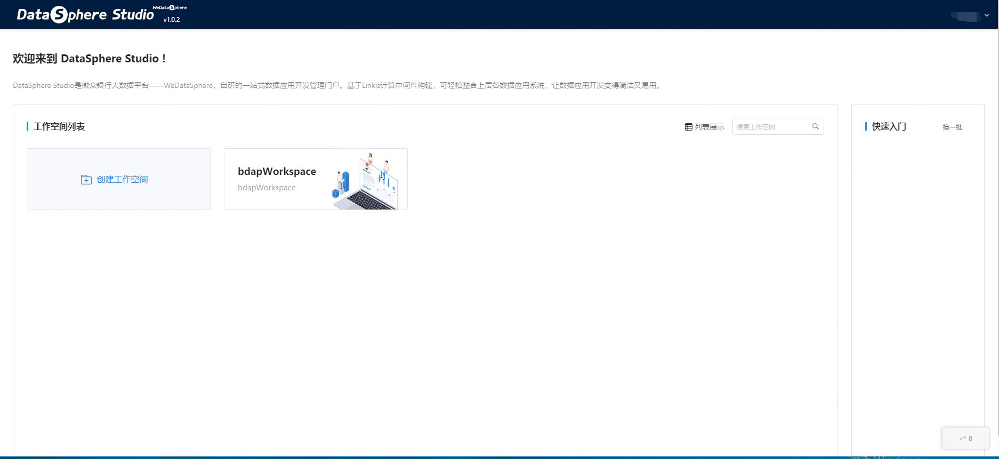
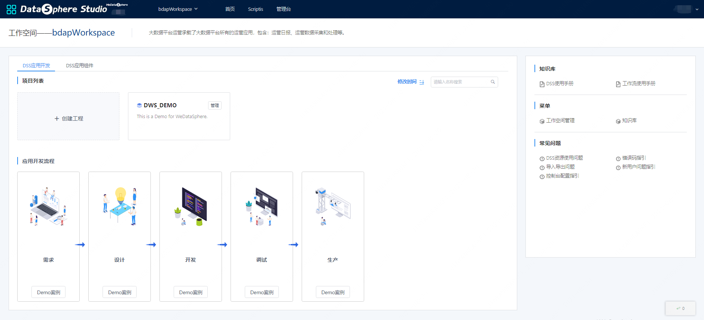
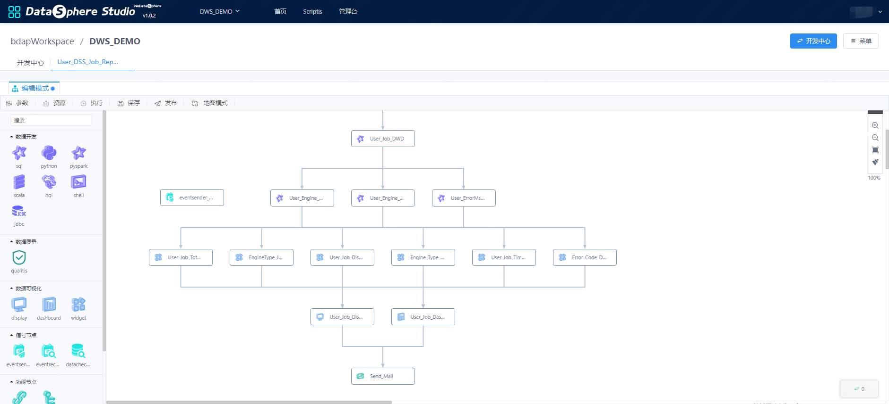
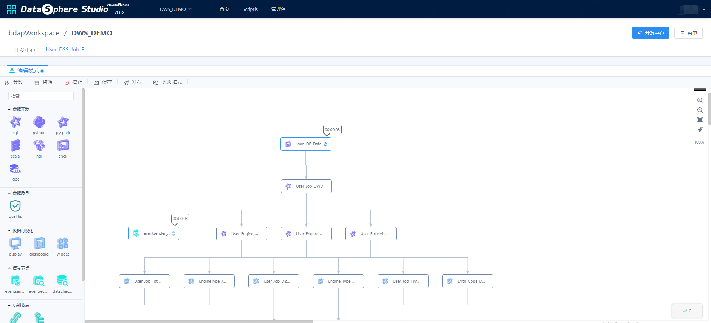

# DSS快速入门

## 1. 前言

&nbsp;&nbsp;&nbsp;&nbsp;&nbsp;&nbsp;&nbsp;&nbsp;&nbsp;本文是DSS1.0.0的快速入门文档，涵盖了DSS的基本使用流程，更多的操作使用细节，将会在用户使用文档中提供。  

&nbsp;&nbsp;&nbsp;&nbsp;&nbsp;&nbsp;&nbsp;&nbsp;&nbsp;同时感谢天翼云大数据平台的鼎力协助，为DSS量身设计了UI视觉稿，让DSS变得更好。  

## 2. 登录首页
&nbsp;&nbsp;&nbsp;&nbsp;&nbsp;&nbsp;&nbsp;&nbsp;&nbsp;为了方便用户使用，**系统默认通过Linkis的Linux部署用户进行登录**，如使用hadoop部署的Linkis和DSS，可以直接通过用户：hadoop，密码：hadoop(密码就是用户名)登录。 首先输入前端容器地址：192.168.xx.xx:8888 接着输入用户名密码：hadoop hadoop。 

*注意： 如果要支持多用户登录，DSS的用户登录依赖Linkis，需要在linkis-GateWay的配置里面进行配置，Linkis-GateWay默认支持LDAP。*


<center>图 2.1 DSS1.0.0登录首页</center>

## 3. 工作空间管理  

&nbsp;&nbsp;&nbsp;&nbsp;&nbsp;&nbsp;&nbsp;&nbsp;&nbsp;进入到工作空间页面，可以创建和管理工作空间。

工作空间是DSS的基本组织结构，通过工作空间，可以将一个部门、一条业务线、一个产品的所有数据应用放入一个工作空间，用来管理相关的参与用户、角色、工程和应用组件等，如下图是工作空间首页。


<center>图 3.1 工作空间首页</center>

## 4. 工程管理

&nbsp;&nbsp;&nbsp;&nbsp;&nbsp;&nbsp;&nbsp;&nbsp;&nbsp;在进入相应的工作空间后，可以创建工程，在实际的开发中，工程往往被用来管理一类数据应用，不同的工程互相隔离，其可参与开发、发布的用户可以互不相同。  

&nbsp;&nbsp;&nbsp;&nbsp;&nbsp;&nbsp;&nbsp;&nbsp;&nbsp;可以在工程首页创建和管理工程，包括创建，修改，和删除，同时在工程首页，可以在顶部切换对应的工作空间，工作空间右侧的**菜单**，可以跳转到**工作空间管理页面**。


<center>图4.1 工作空间首页</center>  


<center>图4.2 DSS应用商店</center>  


# 5. DSS应用组件

&nbsp;&nbsp;&nbsp;&nbsp;&nbsp;&nbsp;&nbsp;&nbsp;&nbsp;在工作空间首页，可以点击进入DSS应用组件，应用组件页面，提供了访问接入DSS第三方组件的快捷方式，如数据服务，Scritpis，Visualis，Schedulis等。

## 5.1. Scripits

&nbsp;&nbsp;&nbsp;&nbsp;&nbsp;&nbsp;&nbsp;&nbsp;&nbsp;Scriptis是微众银行WeDataSphere自研的交互式数据探索分析工具，以Linkis做为内核，提供多种计算存储引擎(如Spark、Hive、Flink、Presto等)、Hive数据库管理功能、资源(如Yarn资源、服务器资源)管理、应用管理和各种用户资源(如UDF、变量等)管理的能力。


<center>图5.1 Scriptis界面</center>

&nbsp;&nbsp;&nbsp;&nbsp;&nbsp;&nbsp;&nbsp;&nbsp;&nbsp;工作空间是一个文件目录，用户对该目录拥有所有的权限可以进行文件管理操作等。建议的目录结构是：script,data,log,res四个目录，目录结构清晰方便用户进行查看和管理。

工作空间主要功能如下：  

1. 工作空间右键主要包含复制路径，新建目录，新建脚本，上传，重命名，删除以及刷新。  
2. 顶上搜索功能，支持对文件快速定位
3. 新建脚本功能支持建立以下脚本

&nbsp;&nbsp;&nbsp;&nbsp;&nbsp;&nbsp;&nbsp;&nbsp;&nbsp;数据库提供图形化数据库表信息展示管理功能，可以通过该数据库功能快速查找具有权限的库表，和数据库表的管理功能。

&nbsp;&nbsp;&nbsp;&nbsp;&nbsp;&nbsp;&nbsp;&nbsp;&nbsp;UDF和函数两个模块，提供UDF函数的可视化功能，方便自定义函数的管理。  

&nbsp;&nbsp;&nbsp;&nbsp;&nbsp;&nbsp;&nbsp;&nbsp;&nbsp;HDFS模块提供了可视化文件结构展示，和操作的功能。只需简单的点击，就能完成对HDFS文件和文件夹管理的操作。

## 5.2. 工作流

&nbsp;&nbsp;&nbsp;&nbsp;&nbsp;&nbsp;&nbsp;&nbsp;&nbsp;新建项目后，进入工作流开发页面，通过拖拽，可以实现数据应用的开发。  


<center>图5.2 工作流页面</center>

&nbsp;&nbsp;&nbsp;&nbsp;&nbsp;&nbsp;&nbsp;&nbsp;&nbsp;当双击工作流节点，便进入节点编辑页面，在编辑页面完成脚本开发和调试。  

&nbsp;&nbsp;&nbsp;&nbsp;&nbsp;&nbsp;&nbsp;&nbsp;&nbsp;当开发完成工作流节点后，可以在工作流页面，点击执行工作流，完成工作流的调试。  


<center>图5.3 执行工作流</center>

&nbsp;&nbsp;&nbsp;&nbsp;&nbsp;&nbsp;&nbsp;&nbsp;&nbsp;调试完成后，点击发布按钮，支持将DSS工作流一键发布到Schedulis，进行日常跑批调度。

## 5.3. 数据服务

&nbsp;&nbsp;&nbsp;&nbsp;&nbsp;&nbsp;&nbsp;&nbsp;&nbsp;DSS1.0以内嵌应用工具的形式提供数据服务功能，可以方便实现不具有库表权限的用户，访问特定数据，发布数据服务的用户只需要简单的书写Spark SQL查询，预留查询接口，发布为数据服务，即可让其他用户使用。


<center>图5.4 数据服务</center>

-----
## DSS节点介绍附录：
### 1.工作流spark节点  
&nbsp;&nbsp;&nbsp;&nbsp;&nbsp;&nbsp;&nbsp;分别支持sql、pyspark、scala三种方式执行spark任务，使用时只需将节点拖拽至工作台后编写代码即可。
### 2.工作流hive节点  
&nbsp;&nbsp;&nbsp;&nbsp;&nbsp;&nbsp;&nbsp;hive节点支持sql方式执行hive任务，使用时只需将节点拖拽至工作台后编写hivesql代码即可。
### 3.工作流python节点   
&nbsp;&nbsp;&nbsp;&nbsp;&nbsp;&nbsp;&nbsp;python节点支持执行python任务，使用时只需将节点拖拽至工作台后编写python代码即可。
### 4.工作流shell节点  
&nbsp;&nbsp;&nbsp;&nbsp;&nbsp;&nbsp;&nbsp;shell节点支持执行shell命令或者脚本运行，使用时只需将节点拖拽至工作台后编写shell命令即可。
### 5.工作流jdbc节点  
&nbsp;&nbsp;&nbsp;&nbsp;&nbsp;&nbsp;&nbsp;jdbc节点支持以jdbc方式运行sql命令，使用时只需将节点拖拽至工作台后编写sql即可，**注意需要提前在linkis console管理台配置jdbc连接信息。**

### 6.信号节点的使用：  
&nbsp;&nbsp;&nbsp;&nbsp;&nbsp;&nbsp;&nbsp;EventSender节点用于进行信息发送，将一段信息事件进行发送给eventReceiver。

常见场景如：工程间存在上下游依赖，工作流间存在上下游信息依赖。比如B工作流的某个工作流节点依赖于A工作流的某个工作流节点的一些信息（如：状态信息，即A节点执行成功，B节点才能开始执行），eventSender支持如下参数：

```xml
1. msg.type: 用来指定Job的类型，SEND用于发送消息，RECEIVE用于接收消息。

2. msg.sender: 指定消息的发送者，需使用ProjectName@WFName@JobName的格式进行定义。

3. msg.topic: 指定消息的主题，建议使用如下格式： 一级分类编码+“”+二级分类编码+“”+三级分类编码。

4. msg.name: 指定消息名称，由用户自定义。

5. msg.body: 指定消息的内容，没有内容发送可以为空。

6. **注意：msg.type默认不可变为SEND，msg.sender、msg.topic、msg.name是必填。**
```

示例：
```xml
msg.type=SEND

msg.sender=project01@flow@job01

msg.topic=bdp_tac_test

msg.name=TestDynamicReceive

msg.body=${msg.mycontent}
```
&nbsp;&nbsp;&nbsp;&nbsp;&nbsp;&nbsp;&nbsp;EventReceiver节点用于接收eventSender发送过来的消息，并将接收过来的消息内容存放到工作流的上下文中，后续的节点会根据前缀去找该信息进行使用比如作为自定义变量进行使用，eventReceiver支持如下参数：

```xml
1. msg.type: 用来指定Job的类型，SEND用于发送消息，RECEIVE用于接收消息。

2. msg.receiver: 指定消息的接收者，需使用projectname@jobname@rtxname的格式进行定义。

3. msg.topic: 指定消息的主题，建议使用如下格式： 一级分类编码+“”+二级分类编码+“”+三级分类编码。

4. msg.name: 指定消息名称，由用户自定义。

5. query.frequency: 由于接收消息使用的是主动轮询的方式，wait.time期间的查询次数，。

6. max.receive.hours: 最长的接收时长，以小时为单位，超过时长未接收到消息返回失败，。

7. msg.savekey: 用于保存消息内容key值，单个flow内多个接收job，需指定不同的msg.savekey保存消息内容，默认值为msg.body，后续Job可以使用该key值获取消息内容。

8. only.receive.today: 如果为true 有且只能接收job启动当天发来的消息

9. 注意：msg.type默认不可变为RECEIVE，msg.receiver、msg.topic、msg.name是必填。
```

### 7.DataCheck节点：
&nbsp;&nbsp;&nbsp;&nbsp;&nbsp;&nbsp;&nbsp;DataCheck节点用于检测数据是否ready，可以判断hive库中某个表或者分区是否存在，如果存在则进行下游的执行，在有数据依赖的任务中扮演十分重要的作用，用于替换掉以前口头约定好的时间开始运行。

dataCheck支持如下参数：
```
1. source.type: 依赖的数据来源，job表示是由其他job产生

2. check.object: 依赖数据的名称例如：data.object.1=dbname.tablename{partitionlist}

3. max.check.hours: 描述任务的等待时间，单位是小时

4. job.desc: 追加多源信息配置。
```

### 8.SendEmail节点
&nbsp;&nbsp;&nbsp;&nbsp;&nbsp;&nbsp;&nbsp;SendEmail节点一般作为工作流的最后一个节点，用于将工作流前面的结果信息进行发送，支持发送表格、文本、DashBoard、Display、图片等，用户在使用的时候直接选择想要发送的工作流节点即可：

sendEmail支持如下参数：
```
类型：支持节点、文字、文件、链接
邮件标题：指定邮件表提
发送项：发送的具体内容，例如：类型是节点则这里选择节点
关联审批单：该邮件是否走过审批，如果未则不会进行发送
其他邮件基本属性：收件人、抄送、秘密抄送
```

### 9.功能节点
### 9.1.连接节点：
&nbsp;&nbsp;&nbsp;&nbsp;&nbsp;&nbsp;&nbsp;Connector节点的作用是为了作为节点与节点的连接，让工作流更加好看，并不具有特殊功能。

### 9.2.子工作流节点：
&nbsp;&nbsp;&nbsp;&nbsp;&nbsp;&nbsp;&nbsp;Subflow节点是您可以在一条工作流中嵌入一条子工作流，父工作流发布时，子工作流也会同步进行发布，但是在实时执行父工作流时，会跳过子工作流的执行。

如果您想执行子工作流，请双击子工作流节点，进入子工作流编辑页面进行执行。
