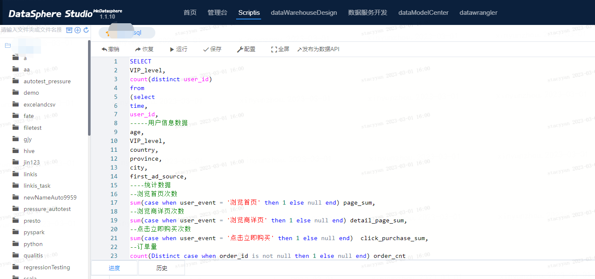

# 工作空间

工作空间是项目管理、成员管理、组件管理的基本单元。每个团队可开设独立的工作空间，工作空间中可完成工作流项目管理、成员管理和组件管理等相关操作。用户只有在加入工作空间并获得权限后，才具备运维管理、数据服务、数据开发、数据分析等操作权限。

# 项目

在工作空间中创建的对数据进行处理和分析的工作流集合，一个项目可包含对某项业务相关的数据资产进行的一系列数据处理和分析活动。

# 工作流

指为了完成一个事务或任务而按照一定顺序对数据进行处理的一组协同工作的相关节点集合，节点包括数据交换、数据开发、数据质量、数据可视化、机器学习、数据输出等节点。

# 脚本

指使用一种特定的描述性语言，依据一定的格式编写的可执行文件。大数据平台的工作流开发和即席查询支持多种语言的在线脚本编写。

# 任务

任务是对执行操作的定义，当操作系统收到运行指令后，任务即向计算机发出指令，计算机将根据输入产出相应的输出结果。在DSS中任务分为工作流任务、工作流节点任务、Scriptis任务。

* 工作流任务：按照一定顺序编排的一组节点的运行，组成一个工作流任务。可为工作流任务配置调度规则。

* 工作流节点任务：工作流任务中的单节点脚本的运行，可以与其他节点任务配置依赖关系。

* Scriptis任务：Scriptis中脚本的运行，目前Scriptis支持多种任务语言。任务主要服务即席分析场景，不依赖调度系统，运行结束后即在结果区展示结果。

# 资源

DSS中的资源包括计算资源和文件资源，计算资源指任务运行时所需的CPU资源、内存资源、硬盘资源和网络资源。DSS的资源管理主要在管理台模块进行管理，用户可在管理台的"参数配置"模块配置任务运行中引擎所需的资源参数。

文件资源指任务运行中需要的物料，包括jar包、txt等文件。用户可在运行任务时，自定义上传资源文件，以供任务使用。

# 组件

大数据平台，组件指一个个功能模块，主要包括数据服务组件、应用开发组件、数据分析组件、生产运维组件等。在展开的组件目录中收藏组件后，再点击!图标，即可将组件添加到平台上方一级操作栏。

# 管理台

基于Linkis的计算治理台，在管理台中可进行的操作包括：历史活动查看、资源配置、计算配置、全局变量查看、ECM管理和微服务管理等。

# Scriptis

Scriptis是一款一站式数据探索工具。提供数据源管理、脚本编辑开发、即席在线分析、可视化图表分析、hdfs文件管理、用户资源管理（UDF、变量）等功能。

# **开发中心和生产中心**

DSS提供开发中心和生产中心，开发人员可在开发中心进行工作流的开发、联调、测试和发布工作。运维人员在生产中心对已发布的工作流进行调度、执行等运维操作，帮助您规范的完成数据开发。开发中心和生产中心可以部署在同一套环境或者隔离的环境中，满足企业对生产环境的安全性要求。

