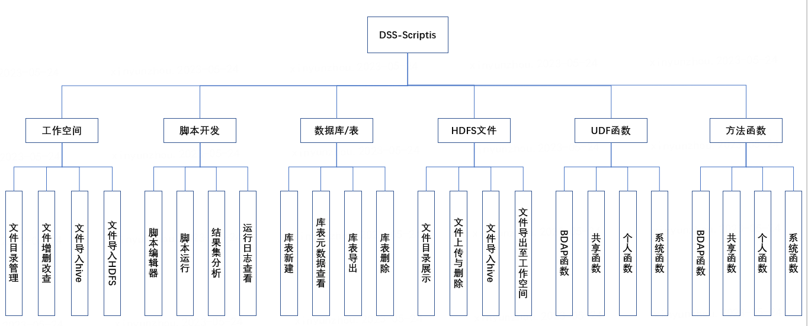

本文档主要面向新人用户，介绍什么是Scriptis?以及Scriptis主要能解决哪些问题;

## 什么是Scriptis?

Scriptis是一款一站式交互式数据探索分析工具，提供多种计算存储引擎(如Spark、Hive、TiSpark等)、Hive数据库管理功能、资源(如Yarn资源、服务器资源)管理、
应用管理和各种用户资源(如UDF、变量等)管理的能力。

## 用Scriptis解决哪些问题？ 

1）即席查询： Scritis提供丰富的IDE能力，用户可在IDE中编辑sql查询语句，运行语句即可在结果区查看结果。

2）数据可视化： Scriptis结果区嵌入了Visualis可视化分析能力，支持对查询结果进行可视化，提供丰富多样的图表来呈现分析结论。

3）Hive数据库管理：Scriptis数据库/表模块支持展示用户有权限可查看的hive库表信息，支持用户进行建表、查看库表详情、数据表导入与导出等操作。

4）用户函数管理：Scrptis提供UDF函数管理模块，用户可上传自定义的SQL脚本（如hive sql、spark sql等）；Scriptis还提供方法函数管理模块，用户可上传自定义的Python脚本和Scala脚本等。

5）HDFS文件管理：Scriptis提供HDFS（分布式文件系统）模块，用于上传和存储大数据文件。

## Scriptis有哪些核心功能模块？

Scriptis的主要功能模块包含工作空间模块、脚本开发模块，数据库/表管理模块、UDF函数模块、方法函数模块和HDFS文件管理模块等六个模块。

**各模块基本功能如下：**

|**模块**|**基本功能介绍**|
|:------------------------------|:----|
| 工作空间|工作空间模块是一个文件管理模块，主要以树形目录结构进行脚本文件、数据文件等文件的管理。核心功能包括文件目录管理、文件增删改查、文件导入至hive和hdfs等功能。|
| 脚本开发|脚本开发模块是scriptis的核心功能，主要包括脚本的编辑开发、运行、结果集分析、运行日志查看等。|
| 数据库/表|数据库/表模块，是dss的元数据管理模块，主要功能包括hive数据源的库信息查看与查询，表信息的查看、查询、新建、删除与导出等。|
| HDFS文件|HDFS模块，是一个提供可视化方式管理用户hdfs文件的模块，包括文件目录结构查看、文件上传与删除、文件导入hive与导出至工作空间等功能。|
| udf函数|用户自定义函数管理模块，根据作用范围分为BDAP函数、共享函数、个人函数和系统函数这四个类别，主要功能包括对udf函数的加载、版本管理、共享、删除等功能。|
| 方法函数|用户方法函数管理模块，与udf函数模块类似，根据作用范围分为BDAP函数、共享函数、个人函数和系统函数这四个类别，包括对方法函数的加载、编辑、版本管理、共享、删除等功能。|
