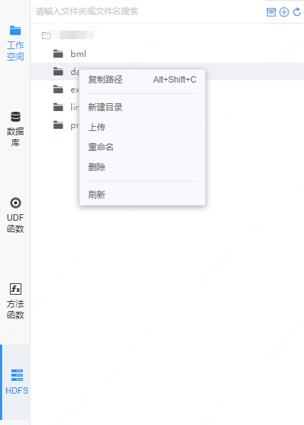
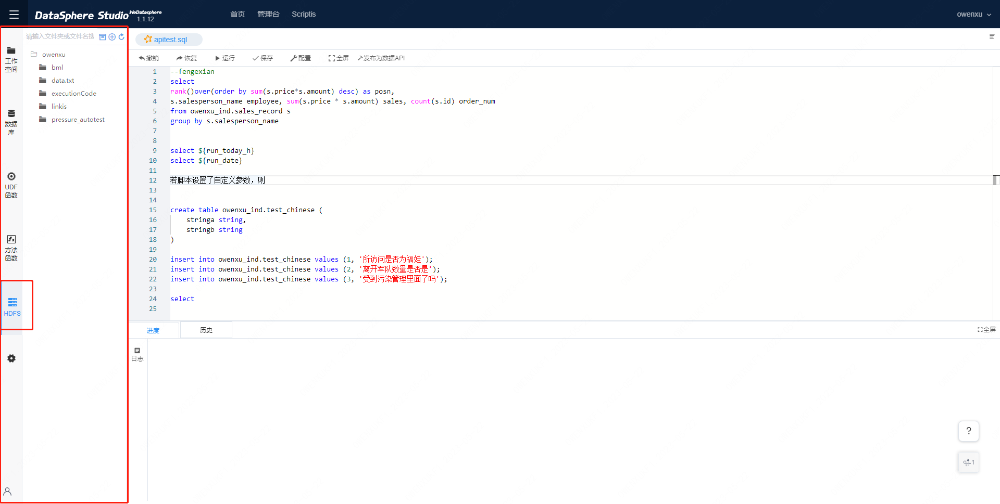
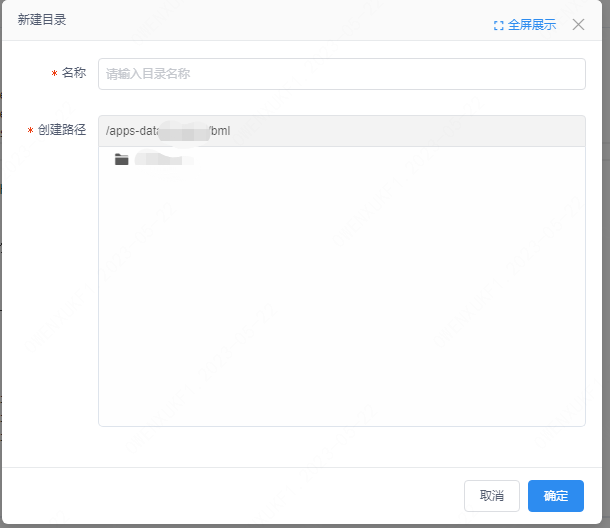
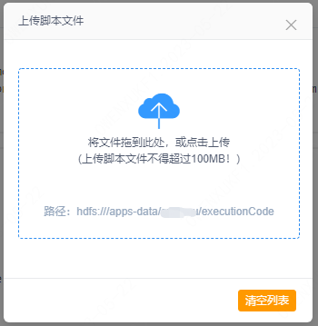
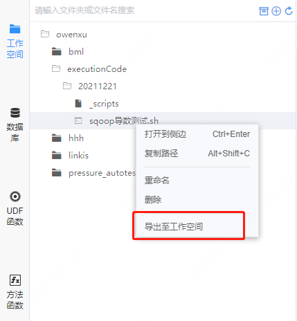
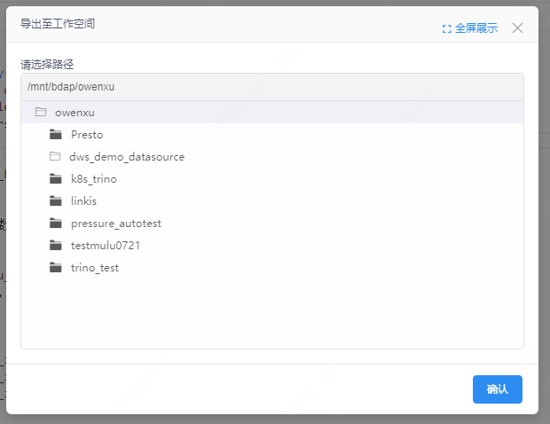

本文档主要面向Scriptis的使用用户，旨在通过介绍Scriptis-HDFS的主要功能来向您描述如何在Scriptis中使用HDFS目录。

# 1. 功能简介

HDFS文件管理是Scriptis提供的HDFS系统的图像化操作界面，支持用户管理有权限的HDFS文件。您可以在左侧文件管理区对文件进行增删改查等操作。

# 2. 界面介绍

在Scriptis左侧HDFS模块为HDFS文件管理区，为树结构文件（夹）列表，可在此区域对文件进行增删改查的管理。

# 3.  操作步骤

**操作入口**：鼠标悬浮在文件上，邮件可完成新建目录，上传文件，重命名，删除等操作。

**功能说明**：

**1）新增目录：** 创建目录用于存放文件；

**2）重命名：** 鼠标悬浮于对应文件夹及文件名上，右键可进行重命名。

**3）上传文件：** 支持上传100MB以内的数据至HDFS。

**4）删除：** 右键删除对应的文件夹及文件。

**5）导出至工作空间：** 对于HDFS中的文件，可右键，选择导出至工作空间的具体目录下。导出到工作空间后，可以在工作空间中看到导出的文件。

