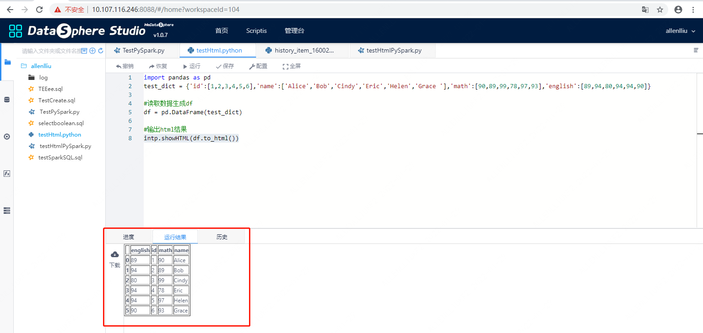
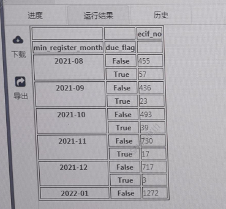
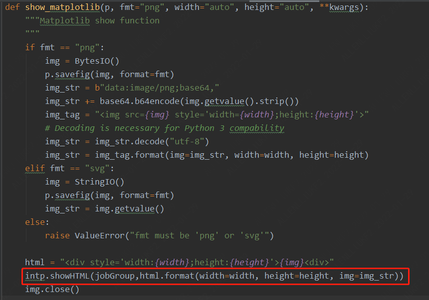
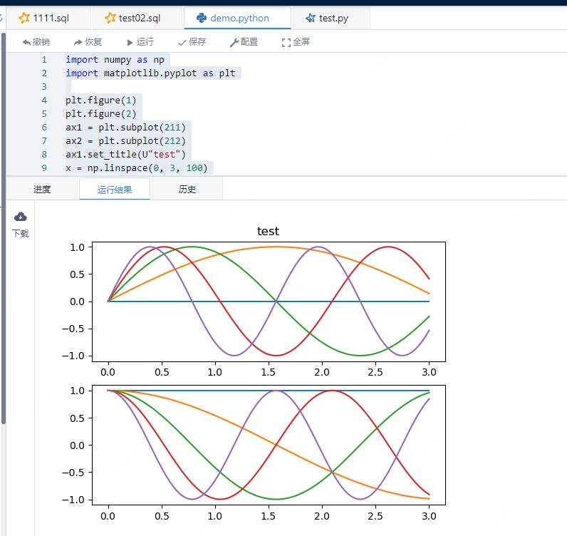

### DSS 中的Python和PySpark支持HTML结果集输出
&nbsp;&nbsp;&nbsp;&nbsp;&nbsp;&nbsp;&nbsp;DSS结果集的输出支持多种格式，不仅包含了传统的表格，文本，还支持了HTML格式，其中HTML格式也包括了图片的输出和渲染。
 
1、在DSS工作空间中新建.python或者.py格式的脚本文件

2、将结果集内容以HTML内容格式输出
  
  （1）简单的HTML输出：
  
```python
import pandas as pd
test_dict = {'id':[1,2,3,4,5,6],'name':['Alice','Bob','Cindy','Eric','Helen','Grace '],'math':[90,89,99,78,97,93],'english':[89,94,80,94,94,90]}

#读取数据生成df
df = pd.DataFrame(test_dict)

#输出html结果
intp.showHTML(df.to_html())
```

注意：python使用：intp.showHTML(df.to_html())
       py使用：intp.showHTML(jobGroup,df.to_html())

输出结果样式：



可定义HTML,支持更复杂结果集格式输出示例：



（2）绘制结果输出：可以使用matplotlib绘制出图片，再把图片嵌入HTML，再把整个HTML内容当做结果集输出
```python
import numpy as np
import matplotlib.pyplot as plt

plt.figure(1)
plt.figure(2)
ax1 = plt.subplot(211)
ax2 = plt.subplot(212)
ax1.set_title(U"test")
x = np.linspace(0, 3, 100)
for i in range(5):
    plt.figure(1)
    plt.plot(x, np.exp(i*x/3))
    plt.sca(ax1)
    plt.plot(x, np.sin(i*x))
    plt.sca(ax2)
    plt.plot(x, np.cos(i*x)

show_matplotlib(plt)
```

其中show_matplotlib是经过后台包装的HTML格式结果集的输出，用户可以直接使用。

show_matplotlib 的详细实现如下：



输出图片的效果：


