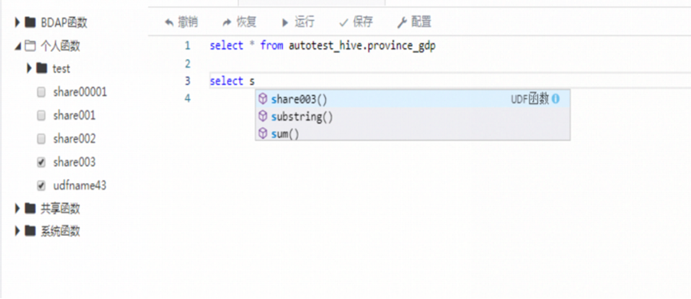
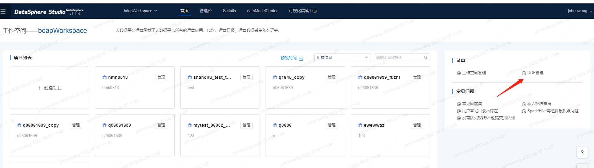
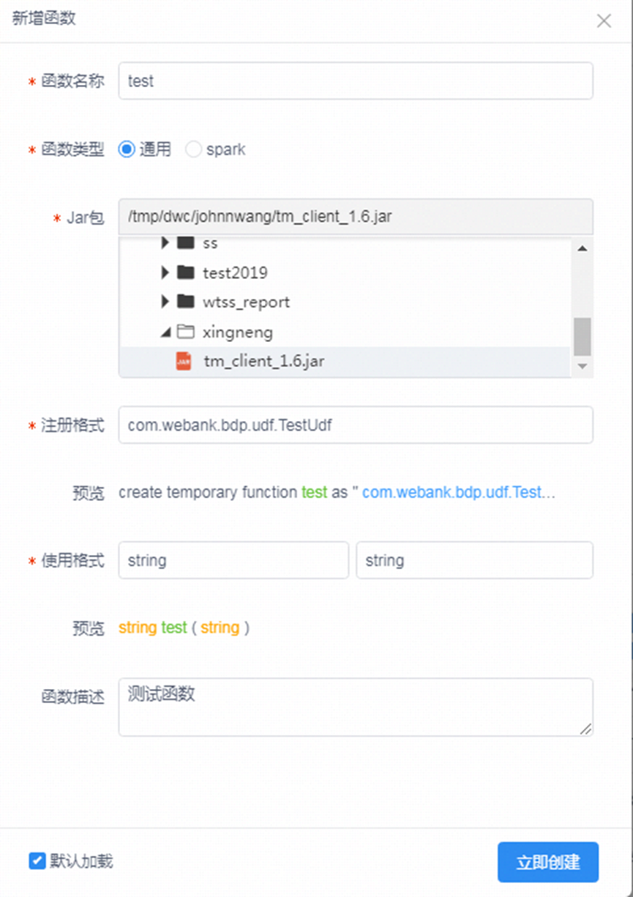
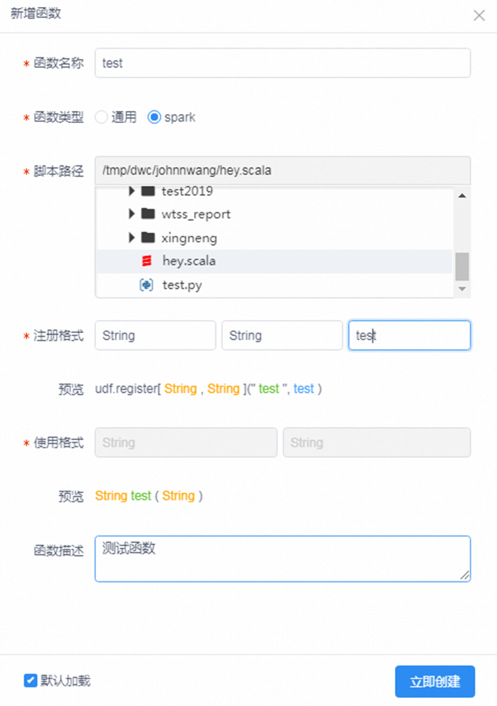
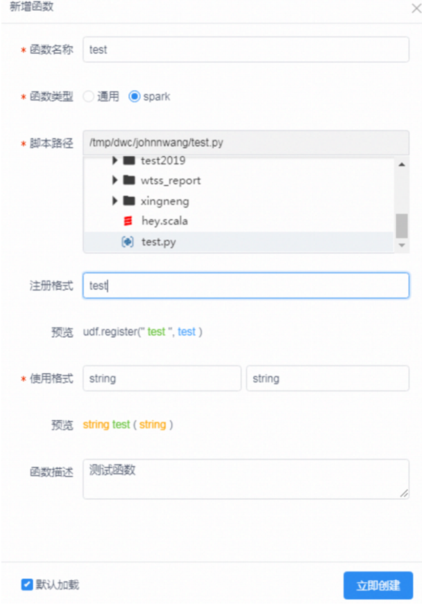

## UDF函数

### 1 界面介绍

&nbsp;&nbsp;&nbsp;&nbsp;&nbsp;&nbsp;&nbsp;UDF功能是方便用户对UDF进行分类展示，以及用户可以对个人函数进行管理，共享等。主要包含以下功能：

UDF展示和加载功能：

默认顶层目录是：

a)
平台函数：平台提供的UDF函数，可以在sql，pysaprk，scala，hive脚本的sql语言里面进行使用

b)
系统函数：系统默认已经提供并自动加载了的函数，可以在sql，pysaprk，scala，hive脚本的sql语言里面进行使用

c) 个人函数：个人自己新建立的UDF，包含通用函数，Spark专用函数。

d) 共享函数：科室管理员建立的UDF函数，并共享给其他人使用
除了系统函数外，其他类别的函数都必须点击加载后才能进行使用，而且点击勾选后一定要先kill掉已经启动的会话。
另外勾选加载的UDF，在脚本中也会进行自动补全提示：

### 2 使用方法
**udf管理操作在工作空间首页菜单栏进入：**

**UDF新增函数功能**

创建一个UDF，主要在于做好前期的UDF代码的准备。步骤主要如下：

1. 建立通用UDF，需要先编译好相应的Jar包。这里的通用是指Hive的hql和Spark的sql都可以用

2. 建立Spark专用的UDF，需要先建立好相应的py脚本或者scala脚本，为了使用的正确性，最好测试下相应的脚本

在开发建立该UDF:  
&nbsp;&nbsp;&nbsp;&nbsp;&nbsp;&nbsp;&nbsp;通用UDF：需要勾选通用，并选择对应的jar包路径，填写UDF的全类路径，填写使用格式和描述：

Spark专用--scala脚本：需要勾选Spark，并选择对应的scala脚本，填写注册格式（填写相应脚本中的函数名）：

**Spark专用--Python脚本：** 需要勾选Spark，并选择对应的python脚本，填写注册格式（填写相应脚本中的函数名）：

**Scala和Python函数写法**

PythonUDF建立方式，只需要定义一个方法即可，对应的脚本只能与该方法有关的内容：

def hello(id):

return str(id) + ":hello"

Scala和Python函数写法：

def helloWorld(str: String): String = "hello, " + str

注意：PythonUDF和ScalaUDF只能在Spark引擎对应的脚本中使用
