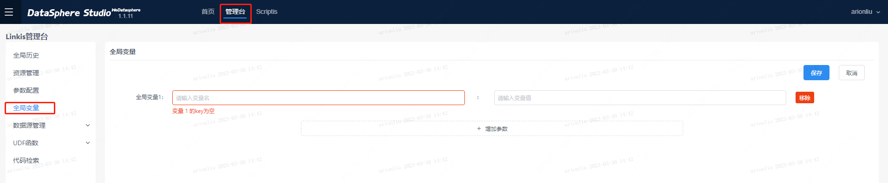
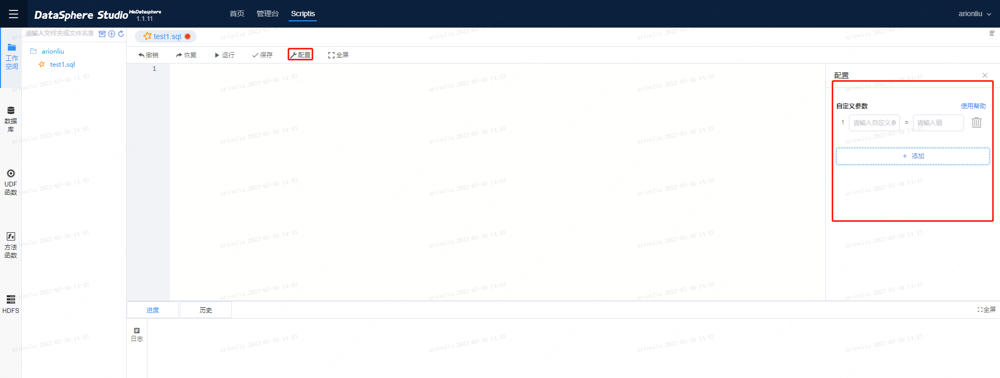

本文档主要面向数据开发人员使用，目的是让数据开发人员掌握如何新建、管理和使用变量。

# 变量简介

数据开发用户通常需要一些公共变量，这些公共变量可以运用在代码中，在代码执行的时候可以方便读取到变量中的值。举个例子，比如用户每天都会批量跑同一段sql，需要指定上一天的分区时间，如果基于sql去实现会比较复杂，如果系统提供一个run_date的变量，这个变量的值代表代码执行的当天，则可以非常方便地实现需求。

变量分为自定义变量和系统内置变量，系统内置变量是系统预先定义好的，可以直接在代码中使用；自定义变量则需要在使用前由用户新增。

变量支持字符串、整数、浮点数、日期变量等类型。不同的变量类型支持不同的计算格式：String支持+、整数小数支持+-*/,日期支持+-。

# 变量分类

## 系统内置变量

系统内置变量是系统预先定义好的，可以直接在代码中使用。已支持的内置变量如下： （下表中的变量值举例以闰年的20240229作为特殊日期）

|变量名|变量类型|变量含义|变量值举例|
|:----|:----|:----|:----|
|run_date|String|数据统计时间（支持用户自己设定，默认设置为当前时间的前一天），如今天执行昨天的数据，则为昨天的时间，格式为 yyyyMMdd|20240229|
|run_date_std|String|数据统计时间(标准日期格式)，如今天执行昨天数据，则为昨天的时间，格式为 yyyy-MM-dd|2024-02-29|
|run_today|String|run_date (数据统计时间) 的后一天，格式为 yyyyMMdd|20240301|
|run_today_std|String|run_date (数据统计时间) 的后一天（标准格式），格式为 yyyy-MM-dd|2024-03-01|
|run_mon|String|run_date所在月，格式为 yyyyMM|202402|
|run_mon_std|String|run_date所在月（标准格式），格式为 yyyy-MM|2024-02|
|run_month_begin|String|数据统计时间所在月的第一天，格式为 yyyyMMdd|20240201|
|run_month_begin_std|String|run_date 所在月的第一天(标准日期格式)，格式为 yyyy-MM-dd|2024-02-01|
|run_month_now_begin|String|run_today所在上月的第一天，格式为 yyyyMMdd|20240201|
|run_month_now_begin_std|String|run_today所在上月的第一天（标准格式），格式为 yyyy-MM-dd|2024-02-01|
|run_month_end|String|run_date所在月的最后一天，格式为 yyyyMMdd|20240229|
|run_month_end_std|String|run_date 所在月的最后一天(标准日期格式)，格式为 yyyy-MM-dd|2024-02-29|
|run_month_now_end|String|run_today 所在上月的最后一天，格式为 yyyyMMdd|20240229|
|run_month_now_end_std|String|run_today 所在上月的最后一天（标准日期格式），格式为 yyyy-MM-dd|2024-02-29|
|run_quarter_begin|String|run_date所在季度的第一天，格式为 yyyyMMdd|20240101|
|run_quarter_end|String|run_date 所在季度的最后一天，格式为 yyyyMMdd|20240331|
|run_half_year_begin|String|run_date 所在半年的第一天，格式为 yyyyMMdd|20240101|
|run_half_year_end|String|run_date所在半年的最后一天，格式为 yyyyMMdd|20240630|
|run_year_begin|String|run_date所在年的第一天，格式为 yyyyMMdd|20240101|
|run_year_end|String|run_date所在年的最后一天，格式为 yyyyMMdd|20241231|
|run_quarter_begin_std|String|run_date所在季度的第一天（标准格式），格式为 yyyy-MM-dd|2024-01-01|
|run_quarter_end_std|String|run_date所在季度的最后一天（标准格式），格式为 yyyy-MM-dd|2024-03-31|
|run_half_year_begin_std|String|run_date所在半年的第一天（标准格式），格式为 yyyy-MM-dd|2024-01-01|
|run_half_year_end_std|String|run_date所在半年的最后一天（标准格式），格式为 yyyy-MM-dd|2024-06-30|
|run_year_begin_std|String|run_date所在年的第一天（标准格式），格式为 yyyy-MM-dd|2024-01-01|
|run_year_end_std|String|run_date所在年的最后一天（标准格式），格式为 yyyy-MM-dd|2024-12-31|
|run_tody_h|String|run_today任务运行的时间， yyyyMMddHH|2024030111|
|run_tody_h_std|String|run_today任务运行的时间 yyyy-MM-dd HH|2024-03-01 11|

具体细节：

1、run_date为核心自带日期变量，默认为当前系统时间的前一天。 用户也可以通过自定义名为run_date的自定义变量去覆盖默认值。

2、其他衍生内置日期变量定义：其他日期内置变量都是相对run_date计算出来的，一旦run_date变化，其他变量值也会自动跟着变化，其他日期变量不支持设置初始值，只能通过修改run_date进行修改。

 3、内置变量支持更加丰富的使用场景：${run_date-1}为run_data的前一天；${run_month_begin-1}为run_month_begin的上个月的第一天，这里的-1表示减一个月。

以sql为例的例子：

```plain
--@set run_date=20240229
select 
"${run_date}" as run_date,
"${run_date_std}" as run_date_std,
"${run_today}" as run_today,
"${run_today_std}" as run_today_std, 
"${run_mon}" as run_mon,
"${run_mon_std}" as run_mon_std,
"${run_month_begin}" as run_month_begin,
"${run_month_begin_std}" as run_month_begin_std,
"${run_month_now_begin}" as run_month_now_begin, 
"${run_month_now_begin_std}" as run_month_now_begin_std,
"${run_month_end}" as run_month_end,
"${run_month_end_std}" as run_month_end_std,
"${run_month_now_end}" as run_month_now_end,
"${run_month_now_end_std}" as run_month_now_end_std, 
"${run_quarter_begin}" as run_quarter_begin,
"${run_quarter_end}" as run_quarter_end,
"${run_half_year_begin}" as run_half_year_begin,
"${run_half_year_end}" as run_half_year_end,
"${run_year_begin}" as run_year_begin, 
"${run_year_end}" as run_year_end,
"${run_quarter_begin_std}" as run_quarter_begin_std,
"${run_quarter_end_std}" as run_quarter_end_std,
"${run_half_year_begin_std}" as run_half_year_begin_std,
"${run_half_year_end_std}" as run_half_year_end_std, 
"${run_year_begin_std}" as run_year_begin_std,
"${run_year_end_std}" as run_year_end_std,
"${run_today_h}" as run_tody_h,
"${run_today_h_std}" as run_tody_h_std

编译替换后的内容：
select 
"20240229" as run_date,
"2024-02-29" as run_date_std,
"20240301" as run_today,
"2024-03-01" as run_today_std, 
"202402" as run_mon,
"2024-02" as run_mon_std,
"20240201" as run_month_begin,
"2024-02-01" as run_month_begin_std,
"20240201" as run_month_now_begin, 
"2024-02-01" as run_month_now_begin_std,
"20240229" as run_month_end,
"2024-02-29" as run_month_end_std,
"20240229" as run_month_now_end,
"2024-02-29" as run_month_now_end_std, 
"20240101" as run_quarter_begin,
"20240331" as run_quarter_end,
"20240101" as run_half_year_begin,
"20240630" as run_half_year_end,
"20240101" as run_year_begin, 
"20241231" as run_year_end,
"2024-01-01" as run_quarter_begin_std,
"2024-03-31" as run_quarter_end_std,
"2024-01-01" as run_half_year_begin_std,
"2024-06-30" as run_half_year_end_std, 
"2024-01-01" as run_year_begin_std,
"2024-12-31" as run_year_end_std,
"2024030111" as run_tody_h,
"2024-03-01 11" as run_tody_h_std
```
## 自定义变量

 自定义变量需要由用户定义后才能使用，它与SparkSQL和HQL本身支持的set变量语法不冲突，但是不允许同名。

# 变量作用域与优先级

## 变量作用域

如前所述，变量分为系统内置变量和用户自定义变量，其中自定义变量又分为全局自定义变量和脚本自定义变量。

在管理台中定义的变量为全局自定义变量。




在脚本的【配置】按钮中定义的变量为脚本自定义变量。



系统内置变量和全局自定义变量的作用域为所有脚本；脚本自定义变量的作用域为当前脚本。

## 变量优先级

如果在同一脚本中使用了多种变量，则优先级从高到低为：脚本自定义变量、全局自定义变量、系统内置变量。

# 变量新增与移除

系统内置变量已经由系统内置，不需要用户新增。

全局变量在管理台->全局变量中新增。


脚本自定义变量在脚本的配置按钮中新增。


# 变量的使用

在脚本代码中直接引用变量。

```plain
select 
* 
from
ds = "${run_date}";
```

