本文档主要面向数据分析、开发等有将外部数据/文件导入DSS系统的用户群体，旨在通过介绍scriptis数据导入的基本操作，帮助用户快速掌握外部数据导入的方法。

## 外部表导入HIVE中

根据文件大小，DSS提供两种路径将外部数据上传至Hive中。

## 1.文件小于2M

**操作路径：**

**1）文件导入Scriptis工作空间**： Scriptis -> 点击工作空间 ->选中文件目录 ->右键单击【上传】 -> 选择上传的文件 ->上传文件展现在工作空间目录中，即为上传成功。

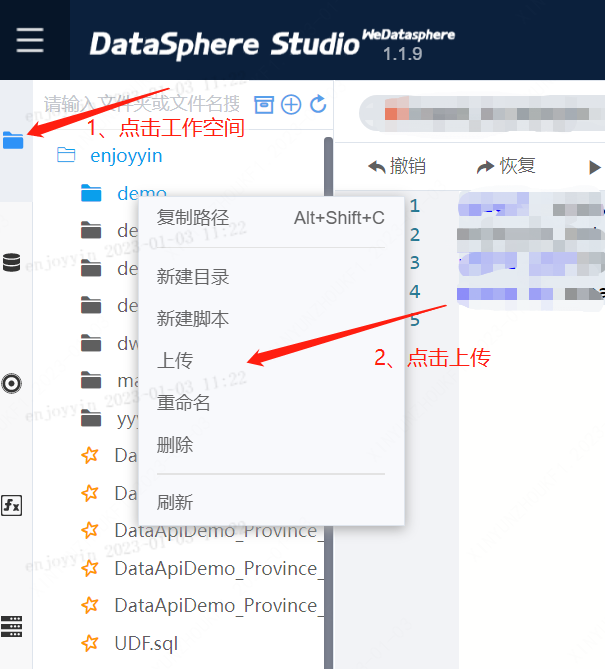

**2）文件从Scriptis工作空间导入Hive：** 在工作空间目录中选中已上传的文件 ->右键单击导入到HIVE -> 设置表基本信息 ->提交 -> 生成并运行表导入任务，任务成功则成功导入。

配置项说明： 

|配置项|说明|
|:----|:----|
|路径|待导入文件在hdfs中存储的地址|
|首行为表头|是否将导入文件的首行作为hive表的表头。若选中，则将导入文件的首行作为hive表的表头。否则，hive表将自动生成表头，一般命名为col1,col2....|
|数据库名|新建的hive表所在的库|
|数据表名|新建的hive表的表名|
|新增分区|是否创建分区表。若选中，则在建hive表时将根据用户指定的分区字段和字段取值创建对应分区表。否则为非分区表。|
|表字段编辑|支持对字段名称、字段类型、字段注释进行编辑；支持对字段进行删除；|

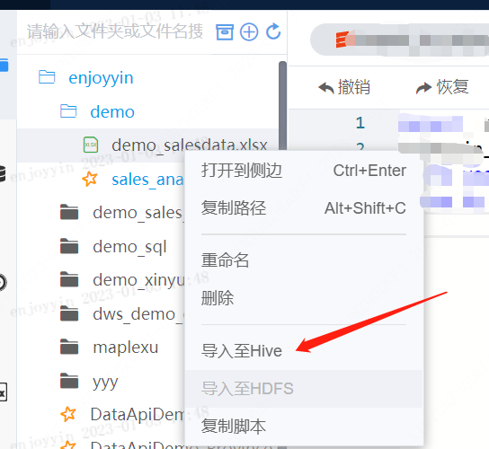

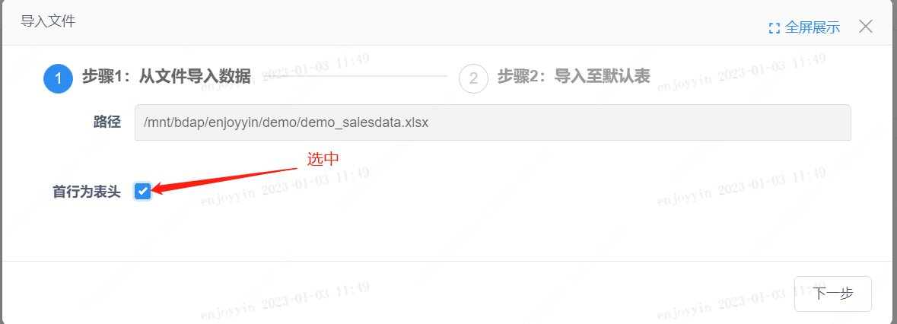

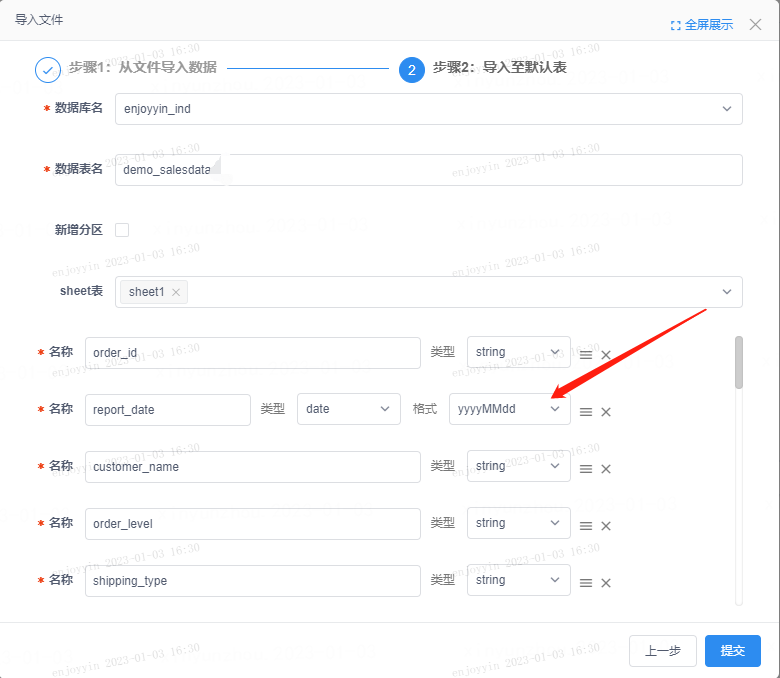

## 2.文件大于2M

**操作路径：**

**1）文件导入HDFS：** Scriptis -> 点击HDFS ->选中文件目录 ->右键单击【上传】 -> 选择上传的文件 ->上传文件展现在工作空间目录中，即为上传成功。

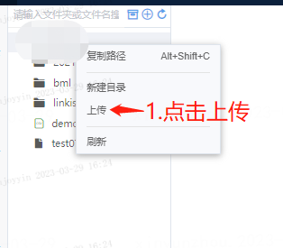

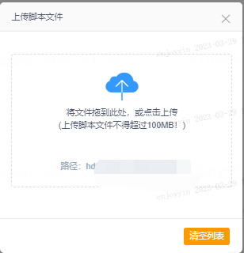

**2）hdfs文件导入HIVE；**

**路径一：** 选中上传的文件 -> 右键选择导入至HIVE->设置表头、分隔符、编码等信息  -> 生成并运行表导入任务，任务成功则成功导入。

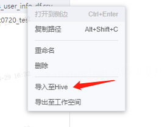

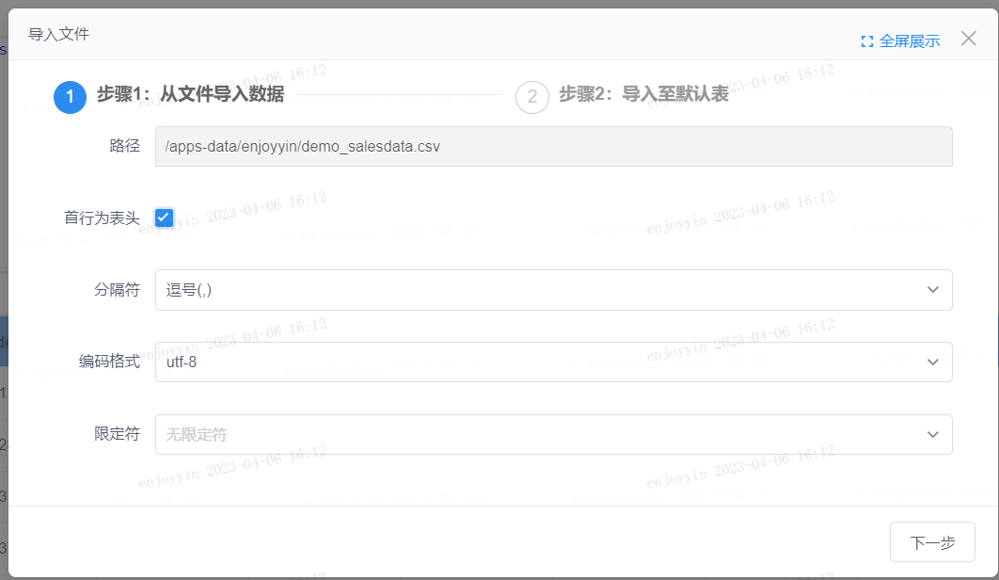

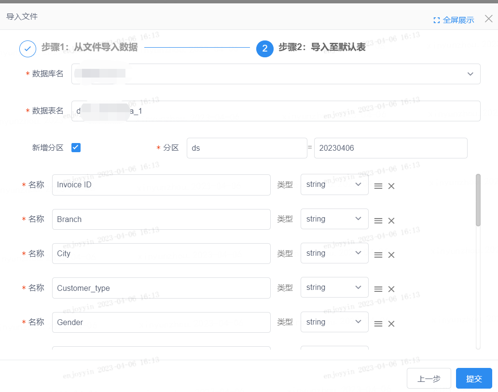

配置项说明如下： 

|配置项|说明|
|:----|:----|
|路径|待导入文件在hdfs中存储的地址|
|首行为表头|是否将导入文件的首行作为hive表的表头。若选中，则将导入文件的首行作为hive表的表头。否则，hive表将自动生成表头，一般命名为col1,col2....|
|分隔符|支持分隔符为逗号（,)，分号（;)，制表符（\t），空格的文件导入|
|编码形式|支持utf-8，GBK格式|
|数据库名|新建的hive表所在的库|
|数据表名|新建的hive表的表名|
|新增分区|是否创建分区表。若选中，则在建hive表时将根据用户指定的分区字段和字段取值创建对应分区表。否则为非分区表。|
|表字段编辑|支持对字段名称、字段类型、字段注释进行编辑；支持对字段进行删除；|

**路径二：** Scriptis -> 点击HDFS ->选中左上角按钮 ->在导入文件对话框中，选择【HDFS导入】 -> 选择导入的文件 ->设置表头、分隔符、编码等信息  -> 生成并运行表导入任务，任务成功则成功导入。

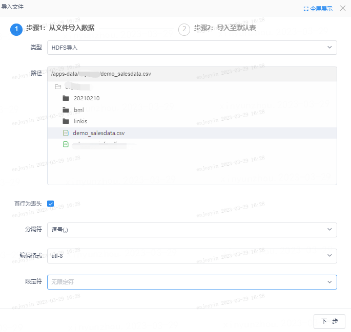

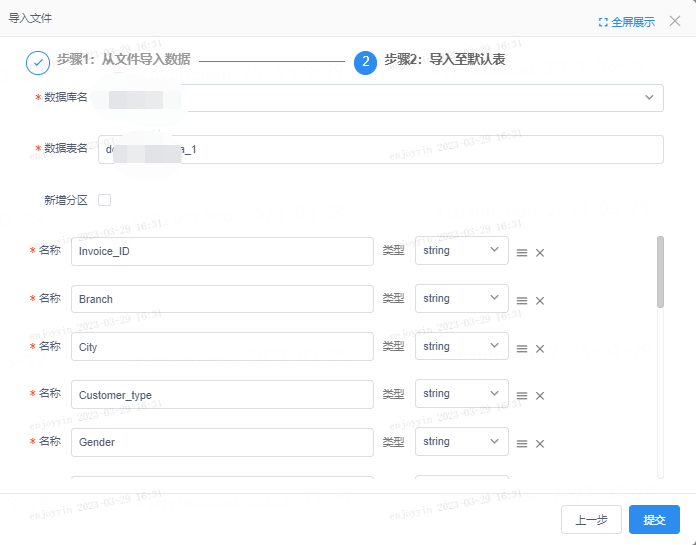

注：HDFS文件上传仅支持小于100M的文件，超过100M的文件导入，请联系大数据生产助手。

