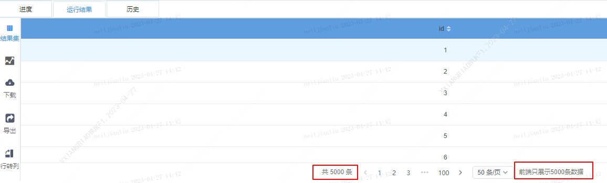
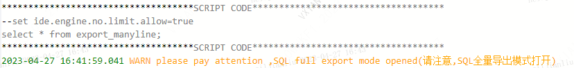
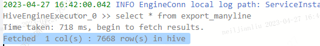
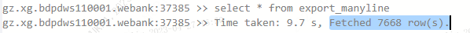
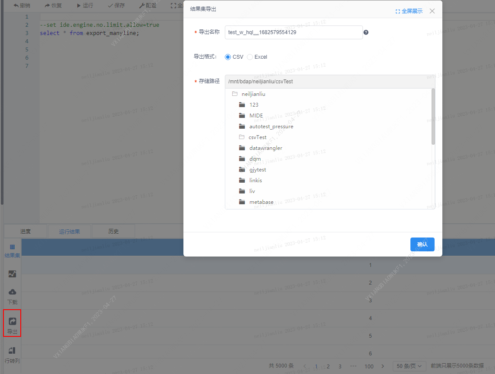
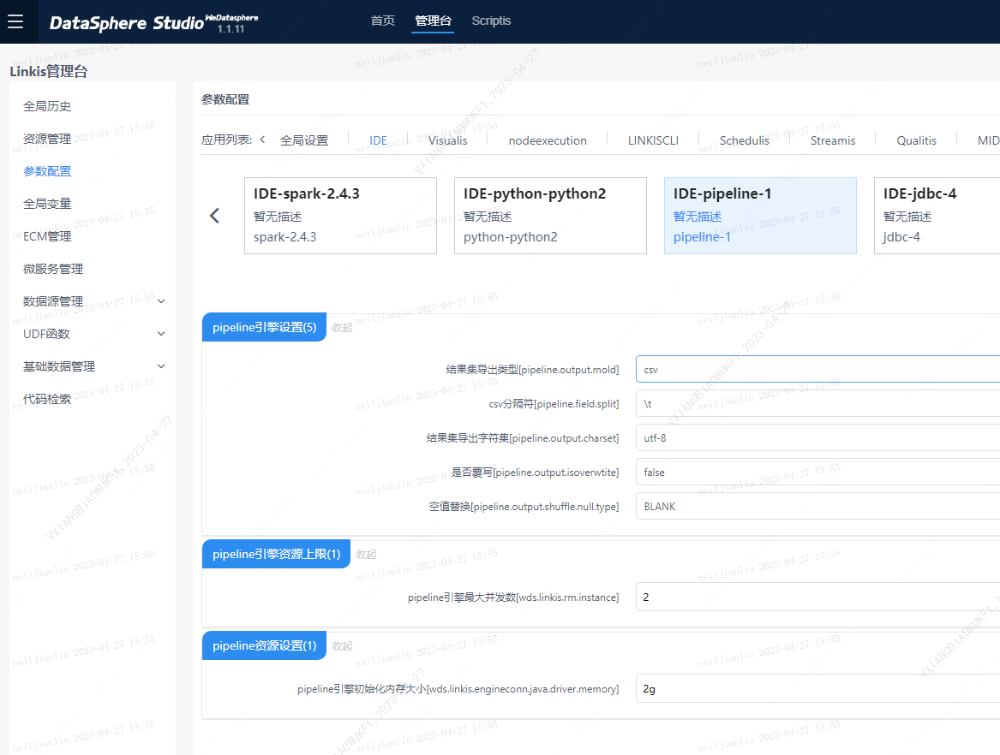
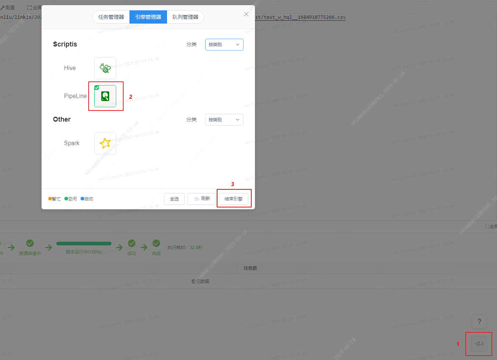

本文档主要面向数据分析工作人员，旨在介绍scriptis数据导出操作路径，帮助分析人员了解如何将结果集数据导出至本地。

根据结果集行数，DSS提供两种路径将数据导出。

# 1、结果集小于5000行

操作路径： Scriptis -> 脚本运行结果区 -> 点击下载 ->选择下载格式、编码、是否替换空值、分隔符等信息 ->点击确定,成功下载至本地


# 2、结果集超过5000行

当用户需要从scriptis结果集中导出超过5000行数据时，可通过导出功能将数据导出到Citrix共享目录中，再从共享目录移动至本地目录即可。

操作路径：Scriptis->结果区 ->点击导出 -> 选择导出路径 ->成功导出至Scriptis工作空间 ->到服务器指定目录中复制文件到本地

## 1.背景简介

当您的运行结果超过5000行时，出于对系统稳定性和浏览器稳定性保护的原因，系统会做如下限制:

1)  系统默认会在sql后面自动添加上limit 5000，将运行结果限制在5000行以内；（用户可通过加参数的方式取消此限制，详细方式见后文）

2）浏览器前端也默认结果集只显示5000行数据，即添加参数取消sql后默认的limit5000条件后，前端仍然限制展示5000条数据。

以上限制导致了用户下载的文件一般不超过5000行。若您需要下载超过5000行的全量数据集，则需按照下述解决方案操作，方可完成数据的导出。

**注意：** 慎用全量导出，数据量过大会导致影响运行性能。



## 2.解决方案

### 导出步骤

#### 1. 在执行的sql前设置：`--set ide.engine.no.limit.allow=true`

取消默认添加limit 5000的限制，示例：

```sql
--set ide.engine.no.limit.allow=true
select * from export_manyline;
```
日志中可查看开启全量导出模式，fetched的结果大于5000条



hive:



spark:



#### 2. 导出至Scriptis工作空间中的目录

**操作路径：** Scriptis -> 运行结果 -> 点击下载 ->输入导出名称，选择导出格式、存储路径 ->点击确定，成功导出至Scriptis工作空间。



#### 3. 复制文件到本地

浏览器查看访问接口/api/rest_j/v1/filesystem/getUserRootPath?pathType=file,返回响应
```txt
{
    "method": "/api/filesystem/getUserRootPath",
    "status": 0,
    "message": "OK",
    "data": {
        "userLocalRootPath": "file:///tmp/linkis/hadoop"
    }
}
```
登录服务器，根据userLocalRootPath的值执行`cd /tmp/linkis/hadoop`打开当前用户的Scriptis工作空间目录，然后就可以查看或下载文件到本地查看。


### 导出格式配置（可选）

若需要对导出文件的格式（csv/excel)配置进行调整，您可以按照以下步骤进行调整。

#### **1）pipeline引擎设置**

**操作路径：** 管理台 -> 参数配置 -> IDE -> IDE-pipeline -> pipeline引擎设置；

选择结果集导出类型csv/excel，设置对应导出类型的分隔符、结果集导出字符集、是否覆写、空值替换。



#### **2）重启pipeline引擎**

设置完导出格式后需要清理相应的PipeLine的会话再执行导出，导出的文件才会修改为设置的格式。

**操作路径：** 右下角任务管理器--引擎管理器--选择PipeLine结束引擎。



