本文档主要面向Scriptis的使用用户，旨在通过介绍Scriptis-数据库/表模块的主要功能和基本使用场景来向您描述Scriptis如何帮助用户管理Hive数据源。

# 1.界面介绍

数据库/表模块由两部分组成，主要包括库表展示区和功能操作区。

①库表展示区：展示用户有权限访问的数据库/表列表，按照“数据库名-数据表名-数据表字段”的结构展开。

②功能操作区：用户新建表、查看库信息、查看表信息的操作空间。用户从对应的入口选择功能后，将在该区域展开对应的操作页面。

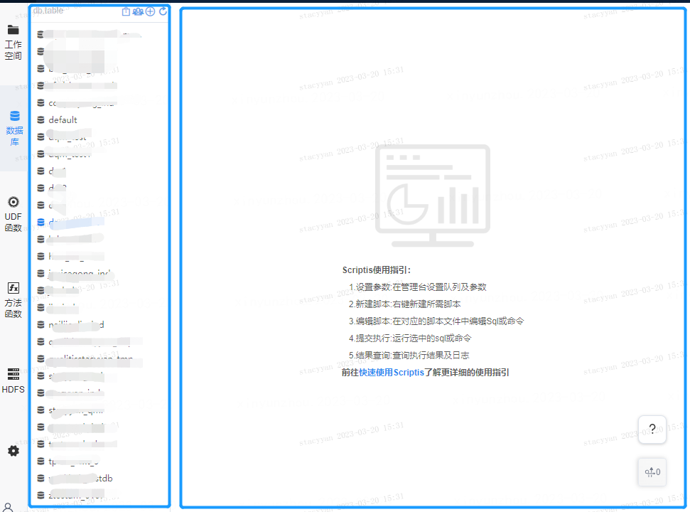

# 2.新建表

目前scriptis数据库/表模块支持新建数据表；

**操作入口：点击库表展示区右上角＋号，即进入建表向导页面。**

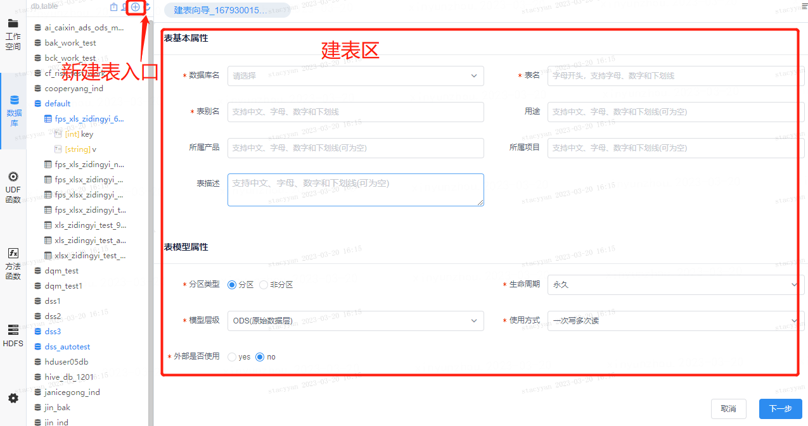

**功能说明**

**步骤一：** 填写表基本信息，包括表所属数据库、表名、表别名、表是否分区、表生命周期、表模型层级等信息。

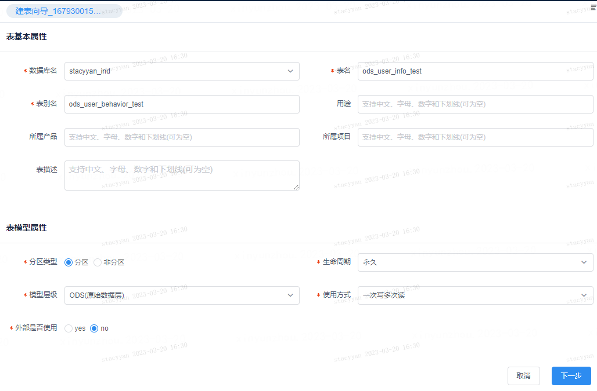

**步骤二：** 编辑新建表的字段信息，包括字段名、是否为主键、字段类型、长度、描述等。

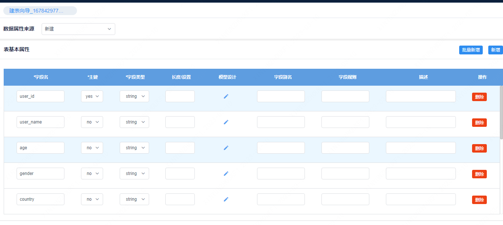

# 3.库表查询

**操作入口:** 在库表展示区上方的搜索框内输入库表名称即可定位对应的库/表。

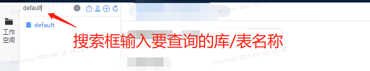

# 4.库表信息查看

**1.库信息查看**

**操作入口：** 将鼠标悬停在库名称上，右键选择“查看库信息”即可查看库的基本信息。

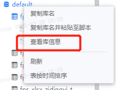

**功能说明：**

库信息查看支持查看库基本信息和库表信息。库基本信息展示库的库名、大小、配额，数量、库备注等信息。

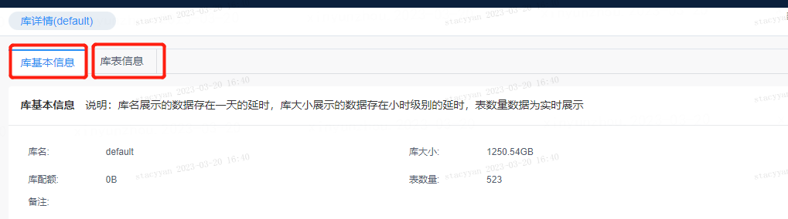

库表信息展示库中所包含的所有表，以及表的基本属性。同时提供以下功能：

1）表筛选与排序功能：支持输入表名或者按照【我有权限的表】/【我创建的表】作为筛选条件对表进行查询。其中查询和实时查询区别是，对于用户删除的表，查询功能需要在删除后1天才会从列表中删除表。而实时查询可以在删除完成后立刻删除表。

2）复制表名：支持一键复制库里面的所有表名。

3）批量删除：支持对选中的表进行批量删除。

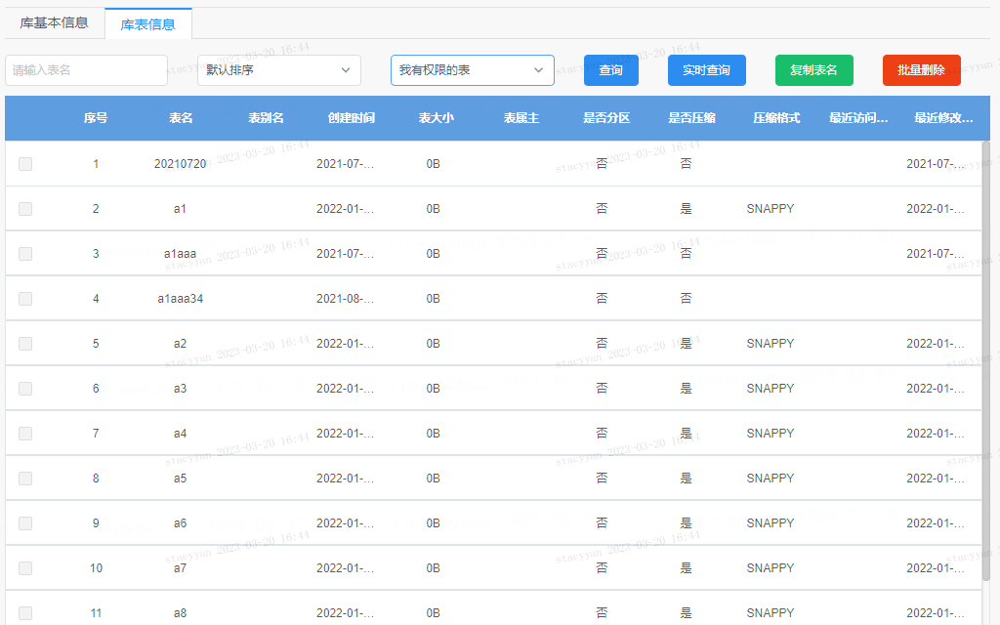

**2.表结构查看**

操作入口：将鼠标悬停在表名称上，右键选择“查看表结构”即可查看表的基本信息。

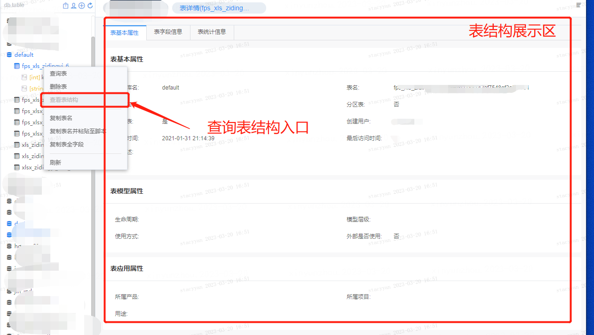

功能说明：表结构支持查看表基本属性、表字段信息和表统计信息。

表基本属性支持查看以下信息：

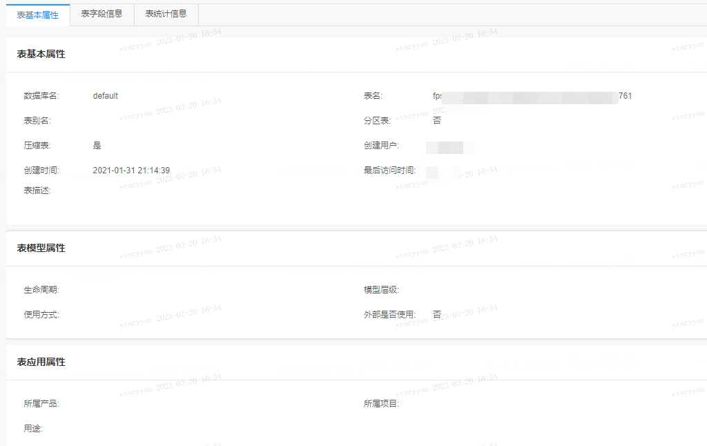

表字段信息展示表中所有字段的字段名、字段类型、是否主键等信息。

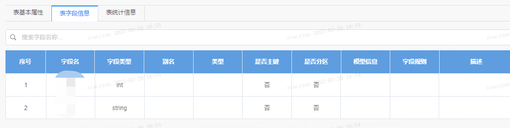

表统计信息展示表内字段数、表大小、文件数、分区数、最后访问时间以及分区相关数据（如有）。

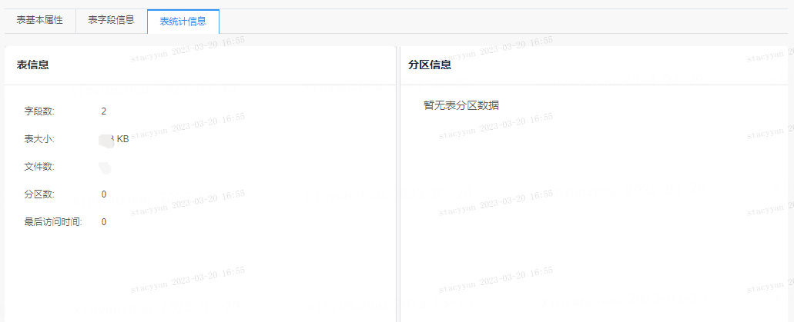

# 5.库表导出

操作入口：**点击库表展示区右上角导出图表，即进入表导出界面。**

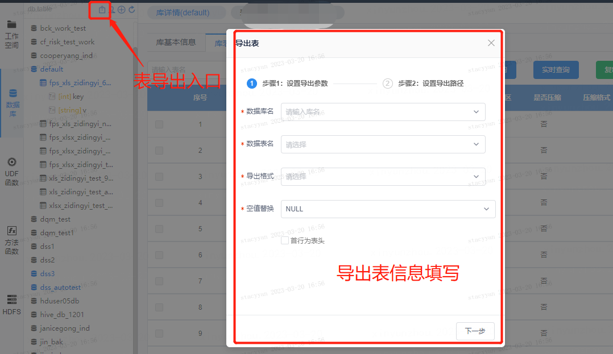

# 6.表删除

操作入口：

单表删除： 将鼠标悬停在表名称上，右键选择“查看表结构”即可查看表的基本信息。

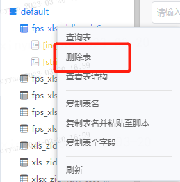

批量删除：在查看库信息-库表信息界面，提供【批量删除】功能，供用户批量删除表。

