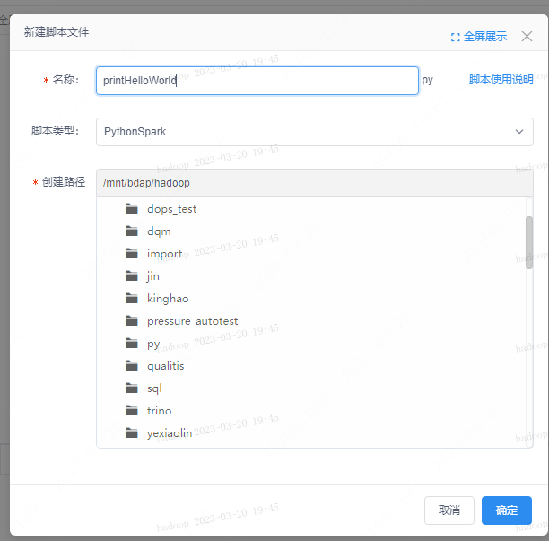
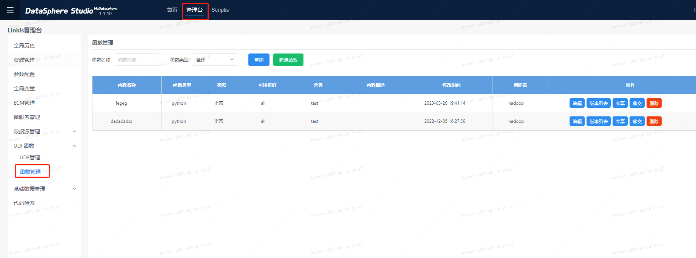
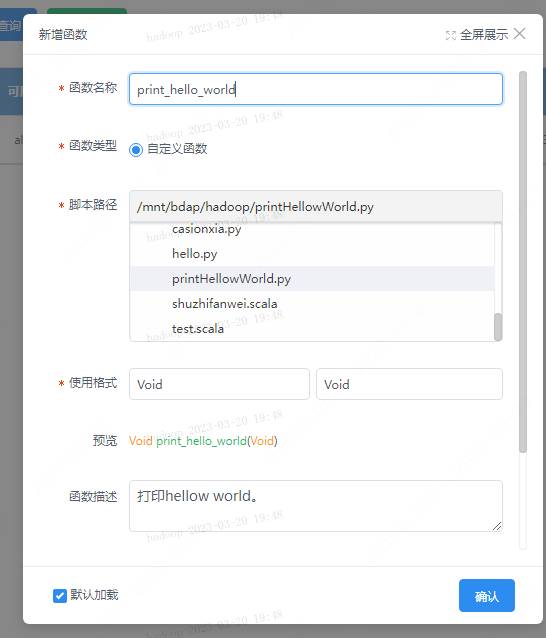
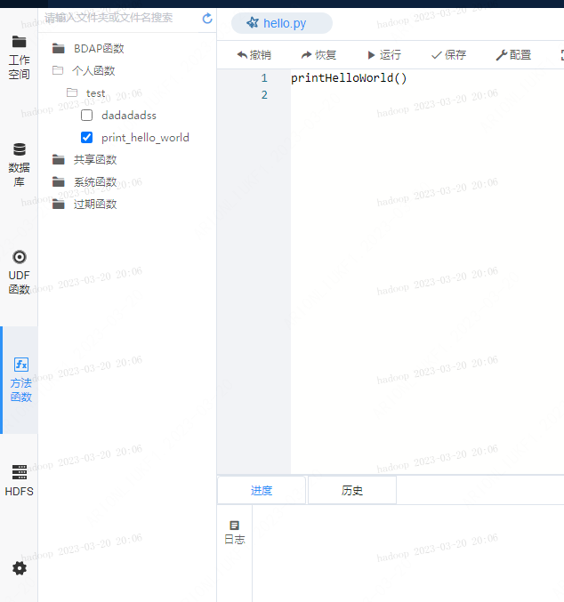
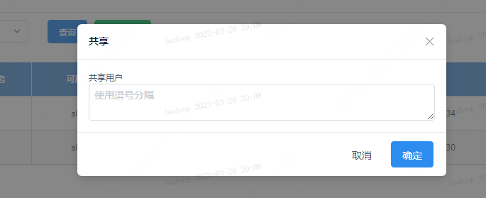

本文档主要面向数据开发和管理员使用，目的是让管理员掌握如何新建、管理方法函数，同时让数据开发人员掌握如何开发管理函数以及如何使用已有的方法函数。

# 方法函数简介

方法函数和UDF函数功能类似，只不过方法函数是一个写在脚本里的函数（pythonSpark脚本或者scala脚本），保存为脚本文件，定义之后可以直接在其他脚本里像普通函数一样使用；而UDF函数需要遵守一定规范编写代码并打包成jar包。

方法函数只能在Spark引擎中使用，且使用方法函数的脚本类型必须与定义方法函数的脚本类型保持一致，即python脚本定义的函数只能在python和pythonSaprk中使用，scala脚本定义的函数只能在scala中进行使用。

# 方法函数的新增

### 实现方法函数

要新增方法函数，首先要实现一个函数，并保存到脚本中。以python方法函数为例，实现一个方法函数。首先需要新建一个pythonSpark的脚本，命名为printHellowWorld.py，保存。

```python
def printHelloWorld():
    print("hello world!")
```


### 新增方法函数

点击DSS顶部的【管理台】菜单，进入UDF函数->函数管理，进入函数管理页面。



点击新增函数，进入函数新增页面，选中定义函数的脚本，并填写其他字段，即可新增方法函数。



# 方法函数的使用
如果要使你创建的方法函数在脚本中使用，则需要加载该方法函数。“加载”/“取消加载”的入口处为：进入scriptis左侧的方法函数->个人函数，个人创建的方法均在个人函数列表处。

加载之后，就可以在脚本中像使用普通函数那样使用方法函数了。




**注1：新增方法时如果没有在页面上主动取消勾选，则会默认勾选加载。此时需要kill掉对应引擎使之新起一个引擎，操作才会生效。**

**注2：加载/取消加载方法函数的操作，需要kill掉对应引擎使之新起一个引擎，操作才会生效。**

列表中非个人函数介绍：

BDAP函数：由bdap创建的给用户使用的函数，如脱敏函数等。注：bdap函数需要主动加载才能使用。

系统函数：系统默认的自带函数，不需要用户自己加载就能在代码中使用。

共享函数：其他人共享给你的函数，你需要加载它就能使用

过期函数：也是共享函数，只不过共享者标记了它为过期，暂不影响使用

# 方法函数的其他操作

### 编辑

点击对应方法函数的编辑按钮，即可修改方法函数。如果需要更新方法的内容，则需要编辑该方法函数的脚本后重新上传，并对该方法函数生成一个新的版本。如果脚本内容没有改变，而只是修改了其他内容如：使用格式，则只更新信息，不会生成新的版本。

### 版本列表

点击某方法函数的“版本列表”按钮，可以查看该方法函数的所有版本。对于每个版本提供如下功能：

创建新版本：将对应版本拷贝一份至最新版本。

下载：将函数方法的脚本文件下载至本地。

查看源码：查看方法函数的源码。

发布：共享方法函数可以对其点击发布某个版本，使该版本对被共享用户生效。注：被共享用户使用的是方法函数已发布的最新版本，个人用户使用的始终是最新版本。

### 共享

前提：共享功能需要用户为管理员才能使用，否则前端页面不会提供操作入口。

点击方法函数的共享按钮：会弹出内容框，输入你想要共享的用户列表（逗号分隔）。



**注：共享给他人后需要他人主动加载该方法函数才能使用。**

共享之后，被共享用户可以在“共享函数”中找到，勾选加载即可使用。

### 移交

如用户离职时可能需要移交个人udf给他人。点击移交按钮，选择你的移交对象，点击确定。

### 删除

点击函数列表上的删除按钮，即可删除该方法函数。注意：会删除该udf的所有版本。

### 过期

对于共享给他人的方法函数，如果已经被共享用户所加载，则不能直接删除该函数，只能标记该udf为过期。暂时只作标记作用，不影响使用。

