本文档主要面向Scriptis的使用用户，旨在通过介绍Scriptis-工作空间模块的主要功能和基本使用场景来向您描述Scriptis如何帮助用户开发脚本以及管理脚本。

# 1 界面介绍

工作空间模块界面主要分为三个部分，分别是：

**①文件管理区：** 为树结构文件（夹）列表，可在此区域对文件进行增删改查的管理。

**②脚本编辑与配置区：** 此区域可切换已打开的文件、对文件进行配置和内容编辑。

**③执行与历史状态区：** 显示当前脚本执行进度与该文件的历史脚本情况。

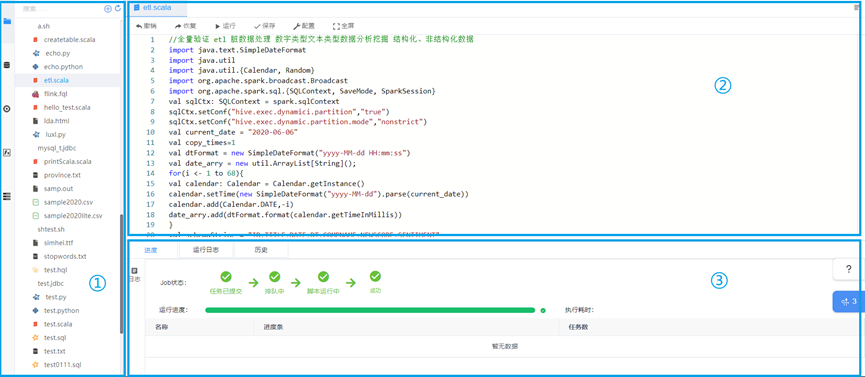

# 2.脚本管理

**脚本的增删改查：** 支持在左侧文件管理区对脚本进行增删改查操作。

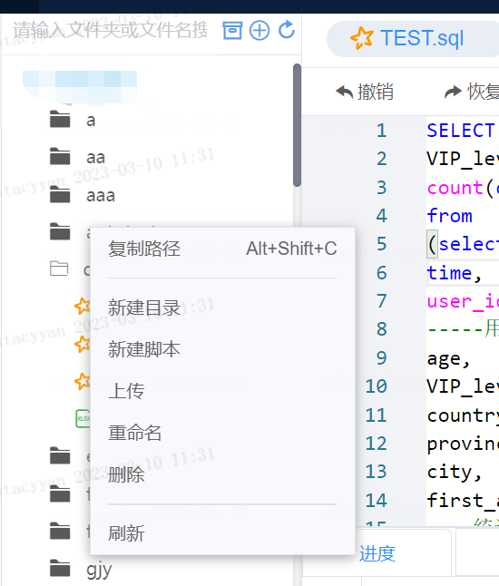

**操作入口：** 鼠标悬浮在脚本文件上，右键即可完成新建目录、新建脚本、上传文件、重命名、删除等操作。

**功能说明：**

**新增目录：** 创建目录来存放脚本文件。建议的目录结构是：script,data,log,res四个目录，目录结构清晰方便用户进行查看和管理。

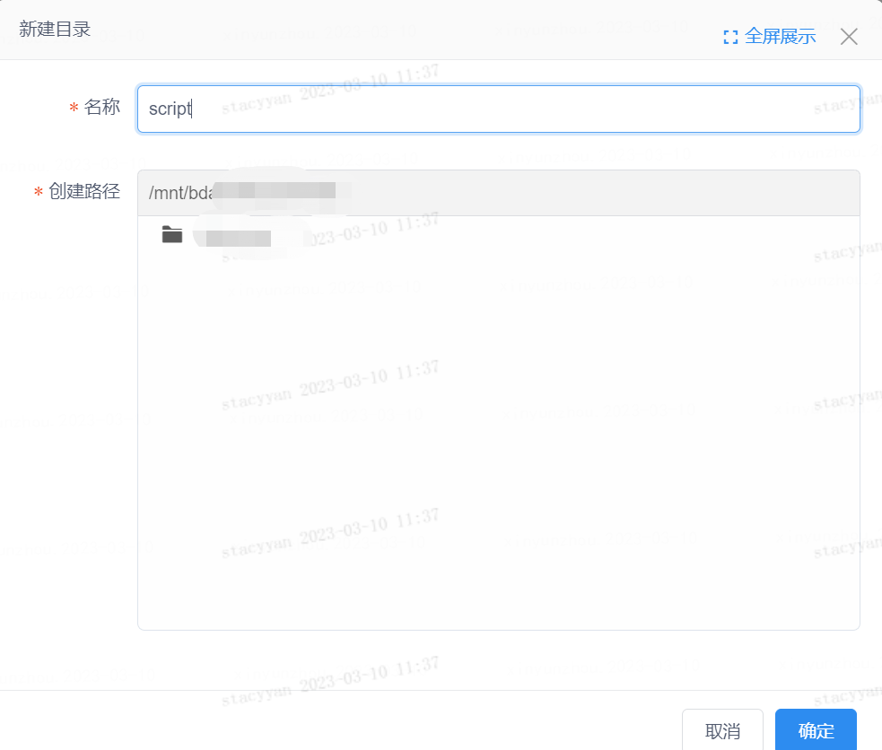

**新建脚本:** 确定脚本名称和脚本类型。

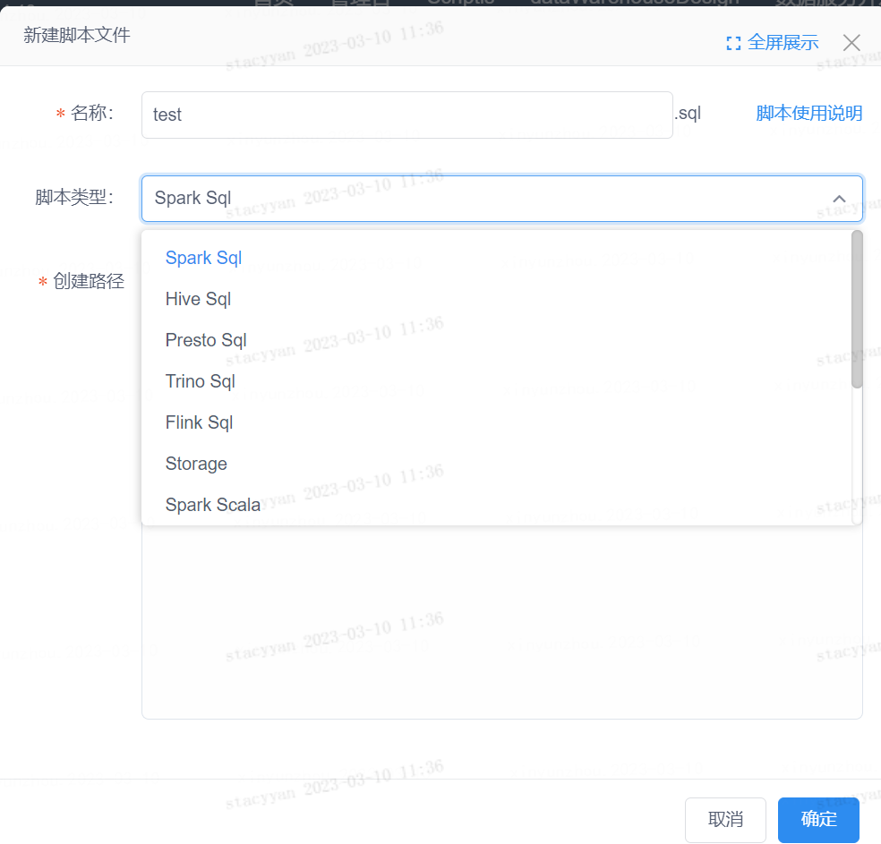

**删除：** 右键点击删除，并二次确定删除文件即可将文件删除。

**修改：** 右键点击“打开到侧边“或者双击文件将脚本文件在右侧编辑区打开，并对脚本进行编辑。

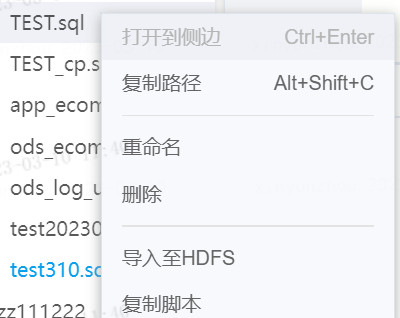

**查看：** 在顶部搜索栏中输入文件夹名称或者文件夹进行查询。

# 3.脚本类型

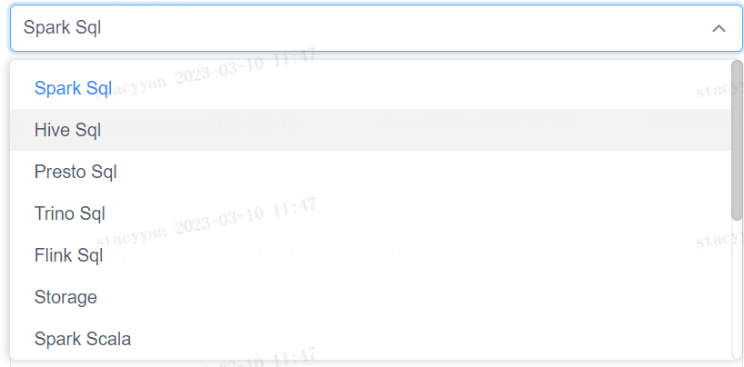

# 4.脚本开发

**使用入口：** 打开脚本后，在对应的脚本内进行编辑、保存、运行和发布。

**功能说明：**

## 脚本配置区基本功能

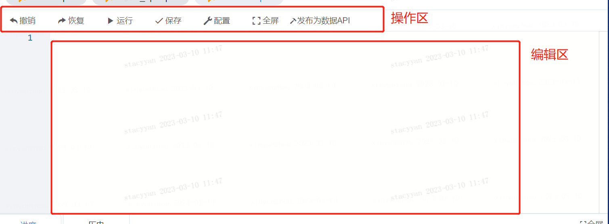

脚本配置区支持撤销与恢复、运行、保存、配置、全屏、分布数据API等功能。

脚本配置主要指的是自定义参数的配置，点击配置按钮，在右侧进行参数配置，自定义参数配置参考[自定义参数](./变量管理.md)

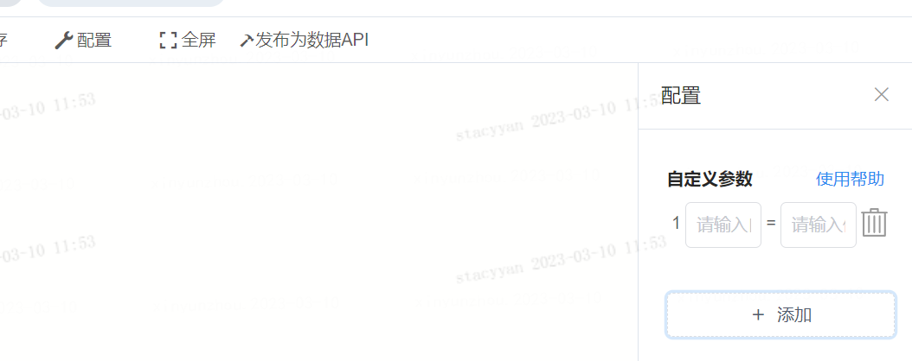

## 脚本编辑区进阶功能

为提升用户脚本开发的效率，我们对scriptis编辑器功能进行了升级。新版Scriptis编辑器在原有的基础上对sql、python类脚本做出了以下功能的加强：

|脚本类型|功能说明|
|:----|:----|
|Sql类脚本|数据库联想、表联想、表字段联想、Udf函数联想、语法纠错提示、函数详情展示、库详情展示、字段详情展示、Udf详情展示|
|Python类脚本|关键字联想、函数联想、第三方库联想、第三方库函数联想、语法纠错提示、函数详情展示、第三方库详情展示|

SQL脚本不仅仅只支持SQL脚本，还包括 hive sql 、 spark sql 、 presto Sql 、 trino sql、flink sql 脚本。用户在编辑sql类相关脚本时， 系统能够自动检测脚本类型，并根据不同的脚本类型由sql-language-server提供相应功能的服务。

python类脚本支持sparkPython与python脚本，由python-language-server服务提供python类脚本的联想、纠错、信息展示等等功能，当用户创建不同类型的脚本时， 服务能够自动嗅探当前用户使用的python版本，并完美区分.python脚本与.py脚本的当前使用的python版本，针对不同的python版本做出相应的处理。  

**使用入口：** 脚本编辑区右键包含了更多智能编辑功能。详情见：[Scriptis新版编辑器介绍](./脚本编辑器功能概述.md#4)

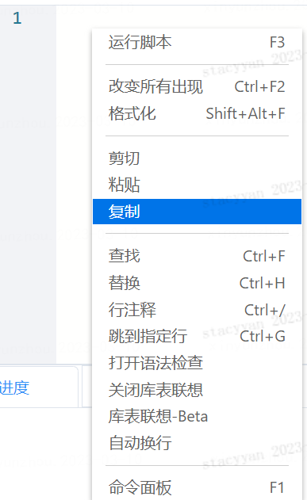

## 脚本结果区功能

**使用入口：** 运行结果及其进度详情将显示在此区域；

**关键任务状态说明：**

|job状态|说明|
|:----|:----|
|任务已提交|任务已成功提交至后台。|
|排队中|任务进入队列中排队，等待被执行。|
|脚本运行中|任务开始被执行，包括执行资源申请和脚本运行。|
|执行成功|任务执行完成。|

**结果展示与使用：**

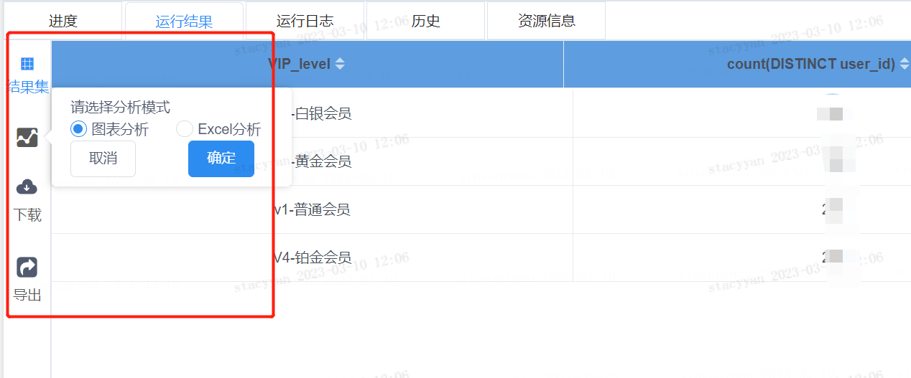

* 结果集：展示脚本运行的结果。
* 分析：支持图表分析与Excel分析，点击图表分析，将打开visualis界面，可以利用结果集数据制作视图，通过scrptis结果集-图表分析制作的视图将保存在visualis-【默认可视化项目】中。点击Excel分析，将进入excel分析模块中。
* 下载：支持结果集下载到本地。目前支持选择下载格式、编码、是否替换空值、分隔符等操作。

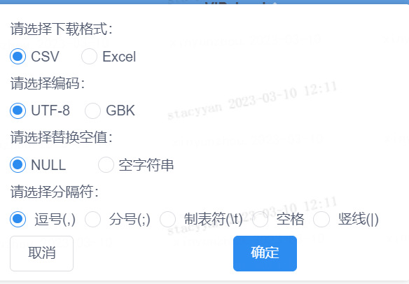

* **导出：** 支持将结果集导出到工作空间对应的目录下。

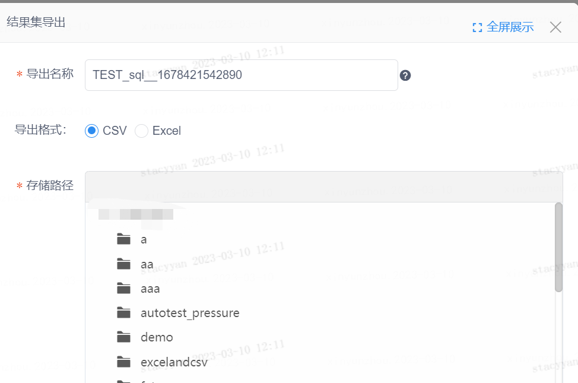

**历史任务查看：** 脚本历史展示了该脚本文件的历史运行信息，可以快速找到之前运行的脚本的日志、结果。

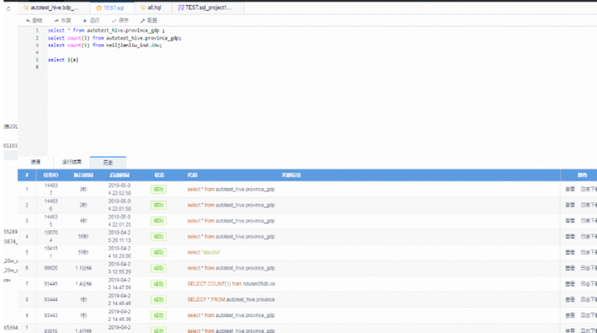

