# Scriptis新版编辑器介绍

## 1、新版scriptis编辑器说明

   Scriptis新版编辑器在dss-1.1.2正式上线，对scriptis编辑器做了全面的升级改造，部分能力由前端转移到后端，
   采取前端+后端的方式相互取长补短，新版编辑器引入了
   sql-language-server、python-language-server两个服务，分别提供对sql类脚本、python类脚本的支持，在兼顾原有功能的基础上，新增了部分新特性，
   不仅解决了占用浏览器内存过大导致浏览器卡死的性能问题，而且还提供了语法联想、语法纠错、函数提示等功能，使用户能够更高效便捷的编写脚本。具体功能对比请查看[【scriptis新旧版本功能对比】](#4)

## 2、功能介绍

   dss-1.1.2新版Scriptis编辑器在原有的基础上对sql、python类脚本做出了以下功能的加强：

| **脚本类型**       | **功能说明** |
| :-----------:  | :--------------: |
| Sql类脚本     | 数据库联想、表联想、表字段联想、Udf函数联想、语法纠错提示、函数详情展示、库详情展示、字段详情展示、Udf详情展示 |
| Python类脚本  | 关键字联想、函数联想、第三方库联想、第三方库函数联想、语法纠错提示、函数详情展示、第三方库详情展示 |

   SQL脚本不仅仅只支持SQL脚本，还包括 `hive sql` 、 `spark sql` 、 `presto Sql` 、 `trino sql`、`flink sql` 脚本。用户在编辑sql类相关脚本时，
   系统能够自动检测脚本类型，并根据不同的脚本类型由sql-language-server提供相应功能的服务。    
   python类脚本支持`sparkPython`与`python`脚本，由python-language-server服务提供python类脚本的联想、纠错、信息展示等等功能，当用户创建不同类型的脚本时，
   服务能够自动嗅探当前用户使用的python版本，并完美区分`.python`脚本与`.py`脚本的当前使用的python版本，针对不同的python版本做出相应的处理。

## 3、使用说明

### 3.1 新版/老版编辑器切换

   DSS1.1.2提供了新编辑器bate版本供用户使用，用户可以自主选择使用新版编辑器，或切换回旧版编辑器。
   用户在进入scriptis编辑sql/python脚本时，默认使用的为Release版（旧版），若想体验Bate版（新版），可使用右键菜单选择对应的功能选项进行新旧版本切换。
- 库表联想-Bate（新版）：

  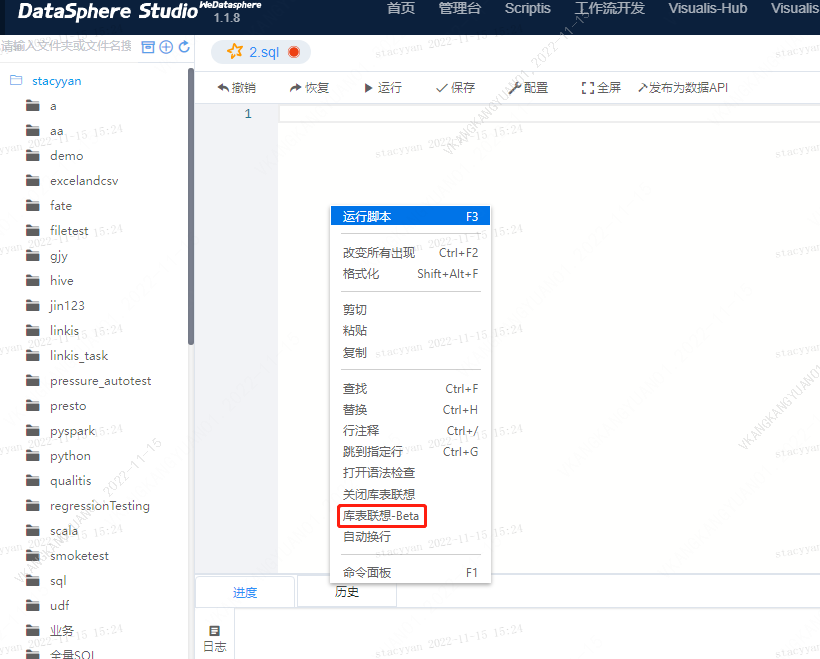
- 库表联想-Release（旧版）：

  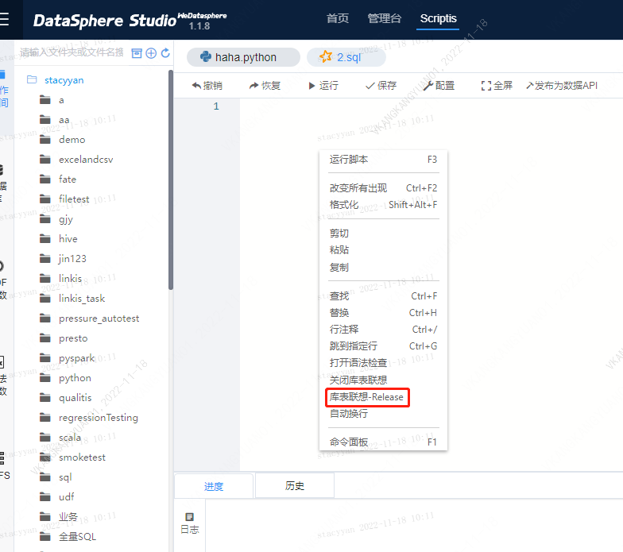

### 3.2 sql类脚本编辑介绍
   新版本sql脚本编辑功能使用方式、语法功能介绍如下：
   - 数据库联想

      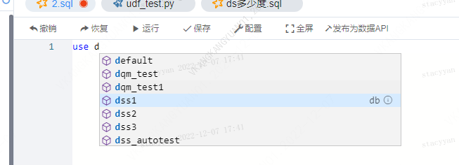

      不仅仅只有输入`use database`语法才会联想库，当用户输入`select * from`、`insert into`、`delete`等table位都会先联想库
   - 表联想

      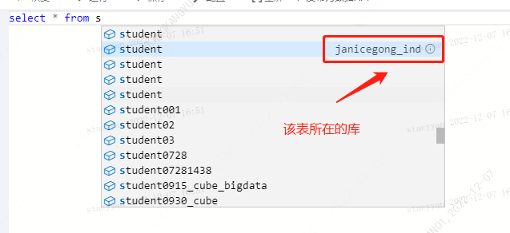

      表联想有两种形式：1.在table位（如上图from后即为table位）直接输入表名，描述位置会展示其所在的库，当键入`enter`之后`from`后会自动补全为db.table as alias;2.在table位输入库名键入`enter`确定后输入`.`即可联想该库下的所有表名，键入`enter`之后自动补全db.table as alias

      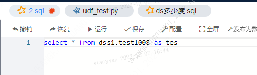

   - 字段联想

      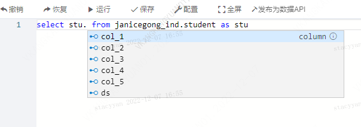

      字段联想必须以`别名`+`.`的形式才能联想
   - Udf函数联想

      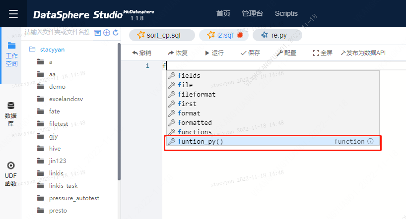

   - 语法纠错提示

      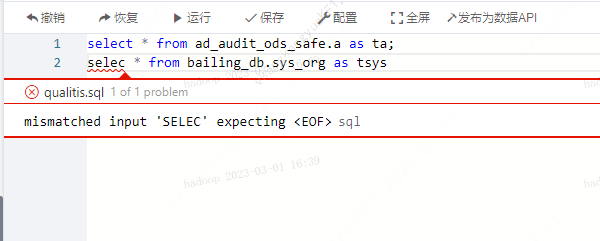

      语法纠错支持多行，优先提示最先出错的地方，针对不同的脚本类型有不同的纠错规则
   - 函数详情展示

      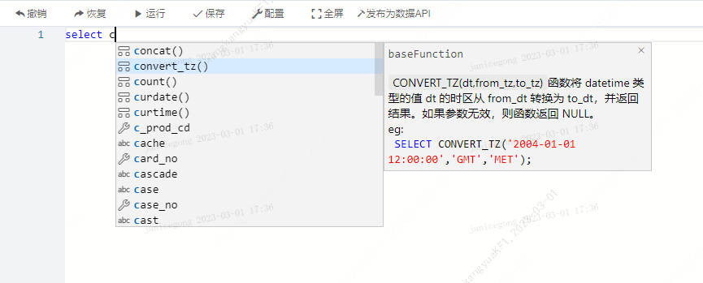

   - 库详情展示

     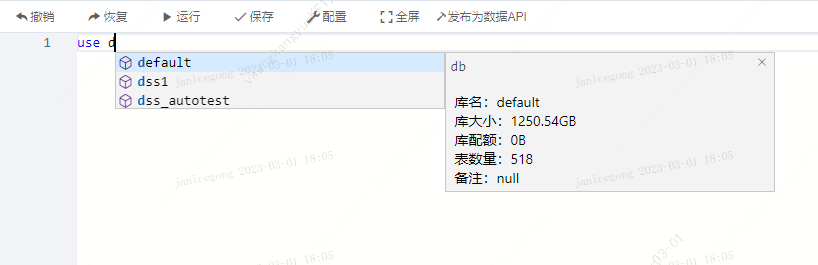

   - 字段详情展示

     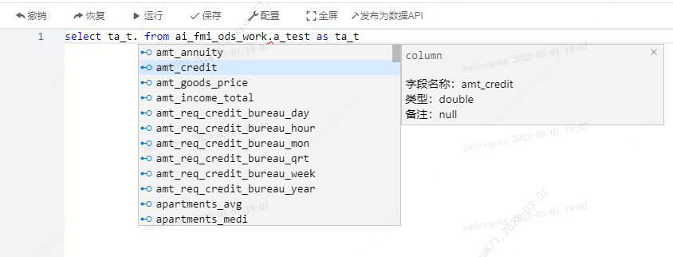

### 3.3 python类脚本编辑介绍
   新版本python脚本编辑功能使用方式、语法功能介绍如下：
   - 关键字联想

     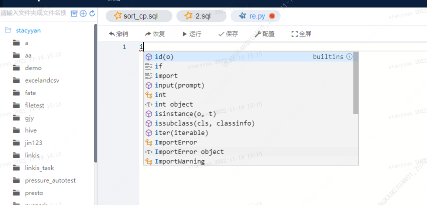

     当输入某个关键字时，会自动联想，如import，def等等
   - 函数联想

     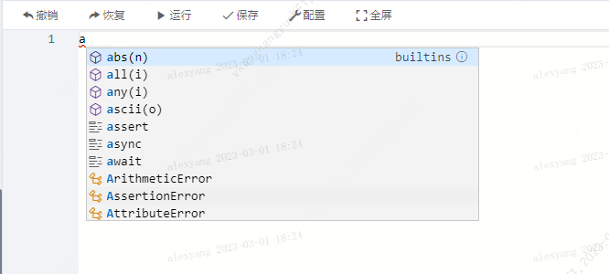
   - 第三方库联想

     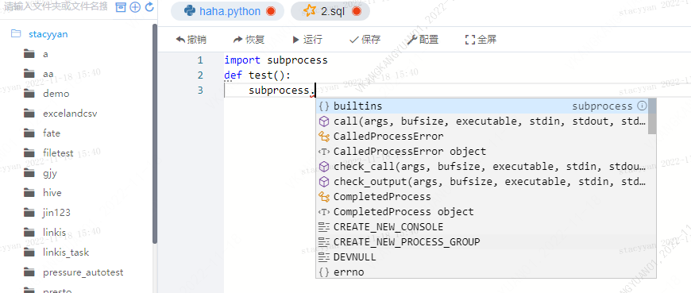
   - 第三方库函数联想

     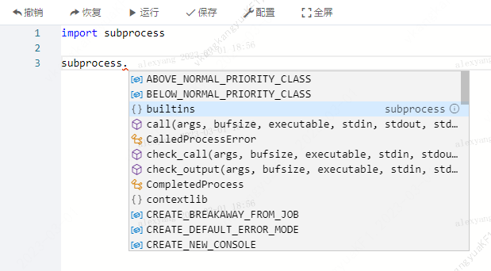
   - 语法纠错提示

     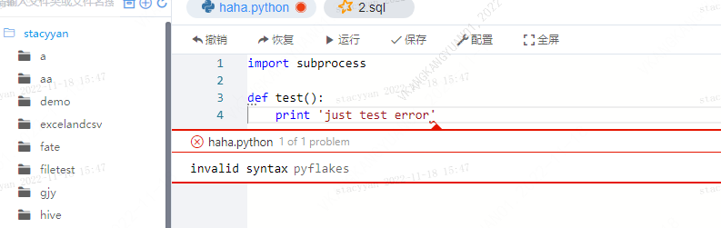

     只能针对python3语法进行纠错，在python2版本下会自动屏蔽纠错
   - 函数信息展示

     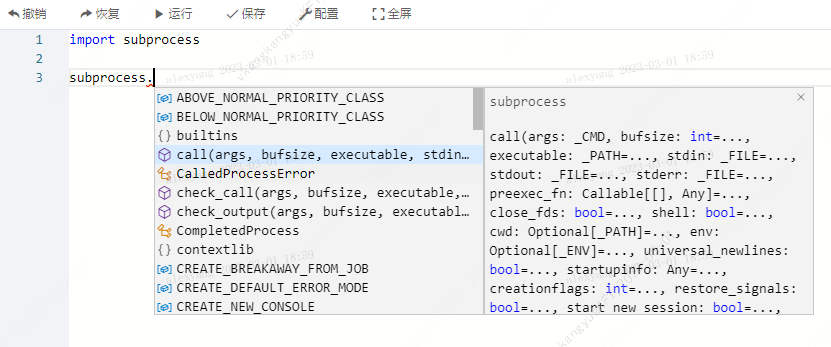
   - 第三方库信息展示

     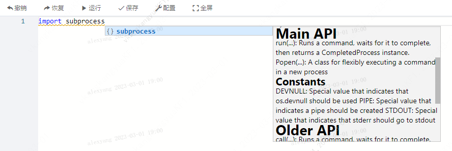  

### 3.4 其他脚本编辑
   其他脚本类型，此次scriptis编辑器升级并未做任何新增功能，新旧版本保持一致。

<h2 id="4"> 4、Scriptis新旧版本功能对比</h2>
   Scriptis新旧版本功能对比如下：

| **功能**       | **Scriptis（旧）** | **Scriptis（新）** |
| :----------- | :-------------- | :-------------- |
| sql脚本关键字联想  | 支持            | 支持              |
| 数据库联想        | 支持            | 支持              |
| 表名联想         | 支持             | 支持              |
| 字段联想         | <strong style="color:red">不支持</strong>       | 支持              |
| Udf函数联想      | 支持             | 支持              |
| 关键字高亮        | 支持            | 支持              |
| 高危语法         | 支持             | 支持              |
| Sql脚本格式化     | 支持            | 支持              |
| Sql语法纠错提示    | <strong style="color:red">不支持</strong>      | 支持              |
| Sql函数详情展示    | <strong style="color:red">不支持</strong>      | 支持              |
| Udf函数详情展示    | <strong style="color:red">不支持</strong>      | 支持              |
| 字段详情展示    | <strong style="color:red">不支持</strong>         | 支持              |
| 数据库详情展示      | <strong style="color:red">不支持</strong>      | 支持             |
| Python关键字联想   | 支持            | 支持             |
| Python函数联想    | 支持            | 支持              |
| Python语法纠错提示 | <strong style="color:red">不支持</strong>      | 支持              |
| Python函数详情展示 | <strong style="color:red">不支持</strong>      | 支持              |
| Python第三方库联想 | <strong style="color:red">不支持</strong>      | 支持              |
| Python第三方库函数联想 | <strong style="color:red">不支持</strong>   | 支持              |
| Sql脚本        | 支持              | 支持              |
| Hql脚本        | 支持              | 支持              |
| Python脚本     | 支持              | 支持              |
| Shell脚本      | 支持              | 支持              |
| Tsql脚本       | 支持              | 支持              |
| Psql脚本       | 支持              | 支持              |
| Hive脚本       | 支持              | 支持              |
| JDBC          | 支持              | 支持              |
| scala         | 支持              | 支持              |
| pyspark       | 支持              | 支持              |
| Flink         | 支持              | 支持              |
| Storage       | 支持              | 支持              |
| Nebula        | 支持              | 支持              |
| R             | 支持              | 支持              |

## 5、语法校验不支持场景
language-server纠错并不能涵盖所有语法类型的纠错，不同脚本类型存在不同的纠错规则，目前sql-language-server纠错均由第三方纠错插件`dt-parse-sql`提供，纠错性能将有该插件迭代持续优化。
### 5.1 sql类脚本不支持场景
sql-language-server支持 `hive sql` 、 `spark sql` 、 `presto Sql` 、 `trino sql`、`flink sql`五种类型的脚本纠错，其中`presto Sql` 、 `trino sql`两种脚本校验规则时相同的，不支持场景如下：

| 场景|  示例 | 文件扩展名 | 备注 |
|------|------|------|------|
|不合法关键字校验|`select describe from stacyyan_ind.exchangis_test1;`| 均不支持| describe为不合法关键字, select语法后会将describe作为字段解析，故无法纠错 |
|select后逗号分隔符校验|`select test2,test1, from stacyyan_ind.exchangis_test1;`| flink sql、hsql不支持| |
|提示位置错乱| `select test2,test1, from stacyyan_ind.exchangis_test1;` | sql | |
|函数参数个数/格式校验| `select substring(test1) from stacyyan_ind.exchangis_test1`|均不支持| sql函数是非常灵活的可直接在数据库服务端添加自定义函数，所以dss不会强校验函数参数|
|函数名校验| `select test2,sun(test1) from stacyyan_ind.exchangis_test1;`| 均不支持 | 不支持函数名校验，自定义函数校验等|
|分组语法校验| `select test2,sum(test1) from stacyyan_ind.exchangis_test1;`| 均不支持|  |
|多条错误语法同时校验| `selec test2,sum(test1) from stacyyan_ind.exchangis_test1;selec test2,sum(test1) from stacyyan_ind.exchangis_test1;`| 均不支持 | 需要将第一处报错点处理了之后才会显示第二处 |

### 5.2 python类脚本不支持场景
以下场景均在python3版本，存在语法校验的场景下进行

| 场景|  示例 | 文件扩展名 | 备注 |
|------|------|------|------|
|算法分母为0| `num = 1/0` | 均不支持 | python校验不会去做数值校验，只做静态语法校验 |
|运行时错误校验| `x = sys.float_info.max y = x * x * x * x * x` | 均不支持 | 纠错只支持语法层面纠错，不支持纠错系统错误|