# 一、UDF是什么？
**UDF：** 用户自定义函数。你可能会需要使用hive的函数来处理一些记录，像count()，sum()这些函数都是内置的。如果你想要一些没有自带的函数功能，则需要自定义功能函数，就可以通过写UDF来完成。

实现一个UDF的方式较为简单：只需要继承UDF类，并重写evaluate方法。

````
public class HelloUDF extends UDF{

        public String evaluate(String str){
                try {
                        return "Hello " + str;
                } catch (Exception e) {
                        // TODO: handle exception
                        e.printStackTrace();
                        return "ERROR";
                }
        }
````
# 二、UDF增删改
点击dss首页，右方会有“UDF管理”的入口

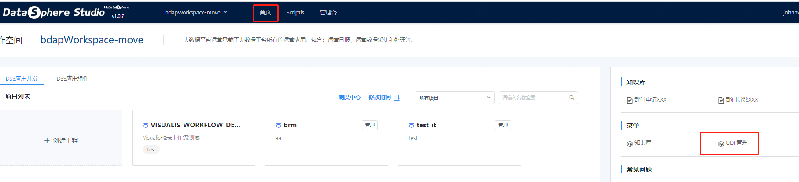

&nbsp;&nbsp;&nbsp;&nbsp;&nbsp;&nbsp;&nbsp;进来之后看到分为"UDF管理"和"函数管理"，其中在函数管理页的是一般的方法函数，比如python和scala函数，这种不需要注册即可在脚本里像普通函数一样使用。UDF则需要注册后才能使用。

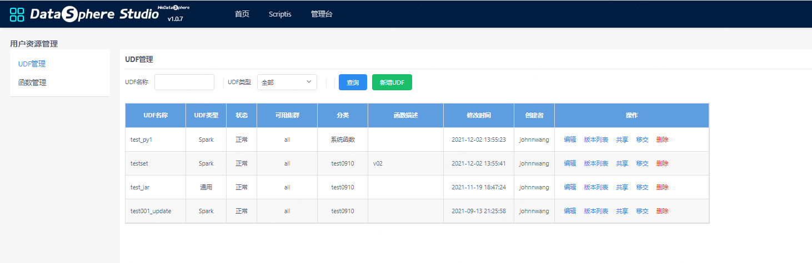

1）UDF新增

&nbsp;&nbsp;&nbsp;&nbsp;&nbsp;&nbsp;&nbsp;点击新增UDF按钮，有两种类型的UDF可以新增，选“通用”类型及为通过jar包方式注册，注册格式需要写UDF实现类的全限定类名。

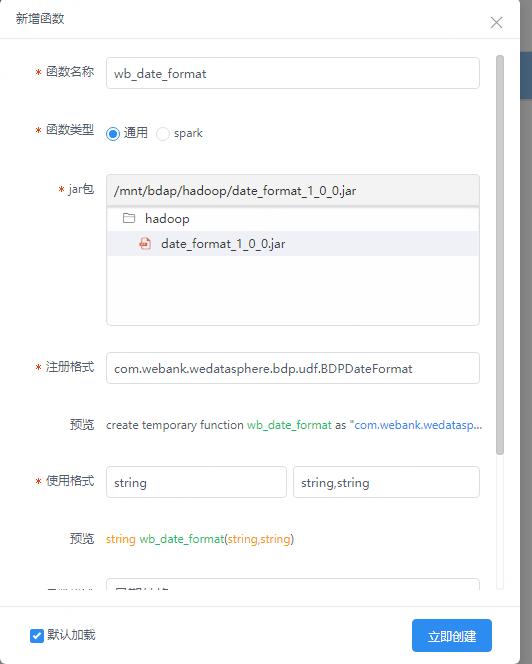


&nbsp;&nbsp;&nbsp;&nbsp;&nbsp;&nbsp;&nbsp;如果是选择“spark”类型，则可以选择你定义好的scala或python函数来注册，注册之后也可以在sql中使用，类似：select hello("abc")。

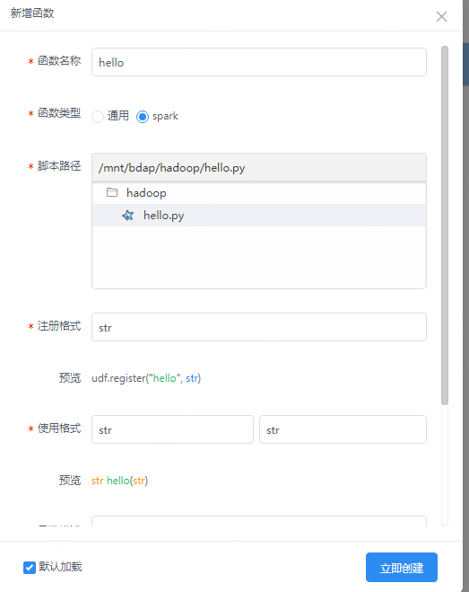

&nbsp;&nbsp;&nbsp;&nbsp;&nbsp;&nbsp;&nbsp;需要注意的是新增udf后你的jar/脚本内容会上传到bml存储。对本地脚本的改动需要更新后才能生效。

2）UDF修改

&nbsp;&nbsp;&nbsp;&nbsp;&nbsp;&nbsp;&nbsp;点击对应udf的编辑按钮。

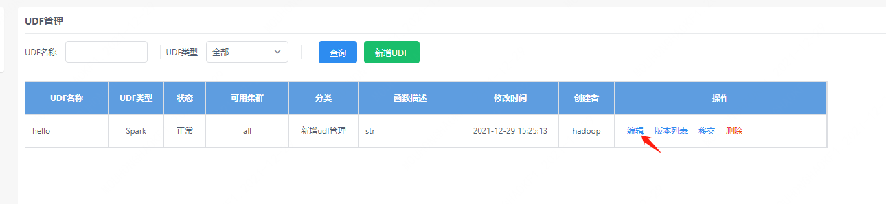

&nbsp;&nbsp;&nbsp;&nbsp;&nbsp;&nbsp;&nbsp;如果你需要更新udf的内容，则需要编辑该udf重新上传，并对该udf生成一个新的版本。如果脚本内容没有改变，而只是修改了其他内容如：使用格式，则只更新信息，不会生成新的版本。

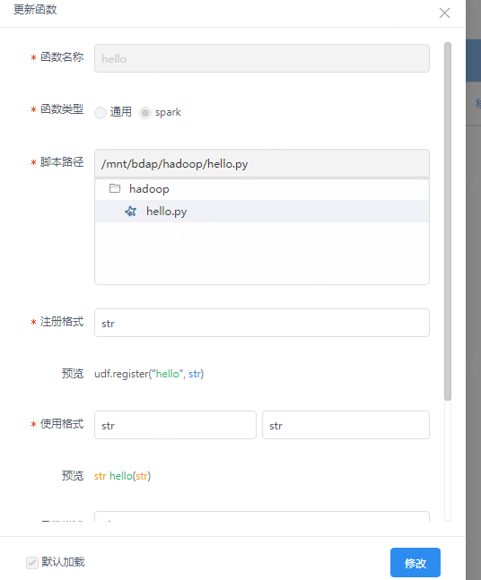

3）UDF删除

&nbsp;&nbsp;&nbsp;&nbsp;&nbsp;&nbsp;&nbsp;点击对应udf的删除按钮即可，注意：会删除该udf的所有版本。

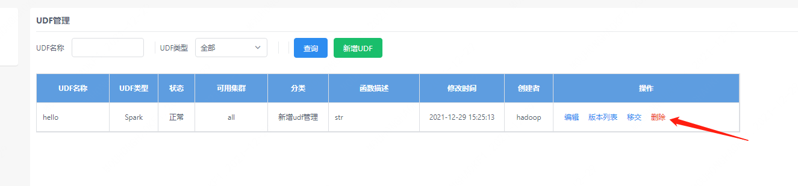

# 三、UDF使用
&nbsp;&nbsp;&nbsp;&nbsp;&nbsp;&nbsp;&nbsp;如果要使你创建的UDF生效在程序中使用，则需要加载该UDF。“加载”/“取消加载”的入口处为：进入scriptis左侧UDF函数->个人函数，你创建的UDF均在个人函数列表处。

**注1：** 新增UDF时如果没有在页面上主动取消勾选，则会默认勾选加载。

**注2：** 加载/取消加载udf的操作，需要kill掉对应引擎使之新起一个引擎，操作才会生效

&nbsp;&nbsp;&nbsp;&nbsp;&nbsp;&nbsp;&nbsp;列表中非个人函数介绍：

**BDAP函数：** 由bdap创建的给用户使用的函数，如脱敏函数等。注：bdap函数需要主动加载才能使用。

**系统函数：** 系统默认的自带函数，不需要用户自己加载就能在代码中使用。

**共享函数：** 其他人共享给你的函数，你需要加载它就能使用

**过期函数：** 也是共享函数，只不过共享者标记了它为过期，暂不影响使用-


# 四、UDF共享
**前提：** 共享功能需要用户为管理员才能使用，否则前端页面不会提供操作入口。

点击udf的共享按钮：会弹出内容框，输入你想要共享的用户列表（逗号分隔）。

**注：** 共享给他人后需要他人主动加载该UDF才能使用。

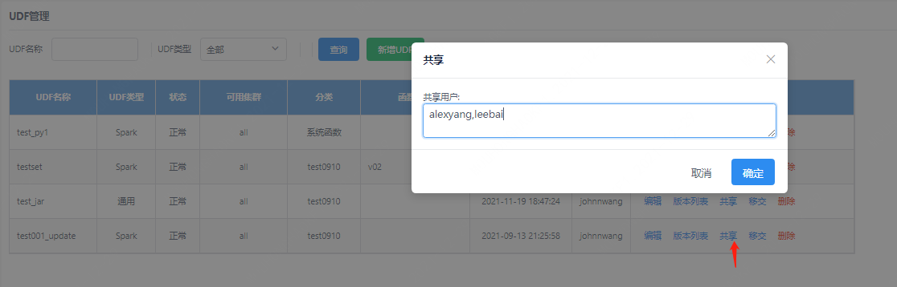

共享之后，被共享用户可以在“共享函数”中找到，勾选加载即可使用。

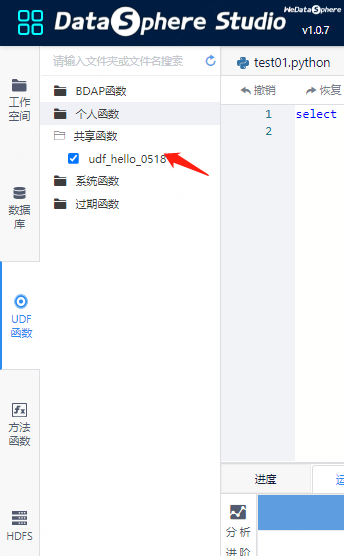

# 五、其他功能介绍
1）UDF移交：

&nbsp;&nbsp;&nbsp;&nbsp;&nbsp;&nbsp;&nbsp;如用户离职时可能需要移交个人udf给他人。点击移交按钮，选择你的移交对象，点击确定。

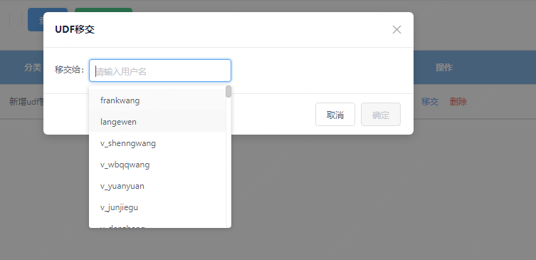

2）UDF过期：

&nbsp;&nbsp;&nbsp;&nbsp;&nbsp;&nbsp;&nbsp;对于共享给他人的UDF，如果已经被共享用户所加载，则不能直接删除该udf，只能标记该udf为过期。暂时只作标记作用，不影响使用。

3）UDF版本列表：

&nbsp;&nbsp;&nbsp;&nbsp;&nbsp;&nbsp;&nbsp;点击某udf的“版本列表”按钮，可以查看该udf的所有版本。对于每个版本提供如下功能：

**创建新版本：** 将对应版本拷贝一份至最新版本。

**下载：** 将udf文件从bml下载至本地。

**查看源码：** 对于python/scala脚本类型则可以直接查看源码，jar类型不支持。

**发布：** 共享udf可以对其点击发布某个版本，使该版本对被共享用户生效。注：被共享用户使用的是udf已发布的最新版本，个人用户使用的始终是最新版本。

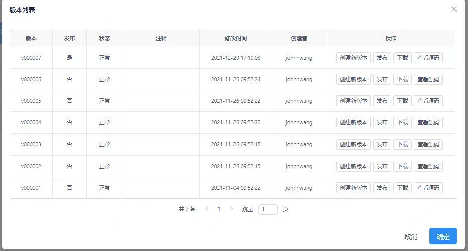


