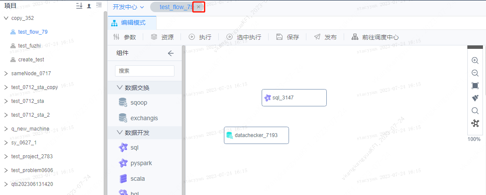
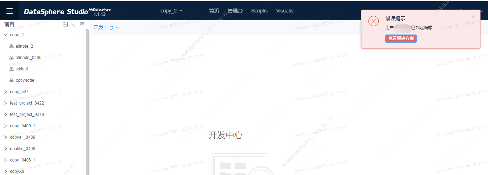
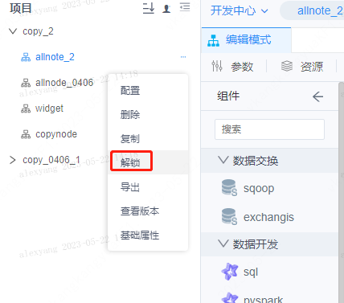
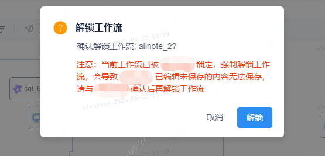

# 工作流协同开发

本文档主要面向数据开发人员协同开发使用，目的是让数据开发人员掌握如何多人协同开发工作流。

# 功能简介

工作流协同开发指的是可以多人协同编辑同一个工作流，暂不支持同时编辑，为保证同一时刻只有一个用户编辑工作流，系统提供了编辑锁的功能。
即会在用户打开工作流时自动加锁以锁定工作流，若此时另一用户需编辑该工作流，需要通过用户主动解锁、超时解锁或者强制解锁等三种方式解锁以达到编辑工作流的目的。

# 操作步骤

## 1.加锁

当用户打开工作流以后，默认该用户拿到了工作流的锁，其他用户无法编辑。此步骤不需要用户操作，对用户无感。

## 2.解锁

工作流解锁大致可以分为以下三种方式：

**1）用户主动解锁：** 用户关闭工作流时会自动解锁，点击tab页签上面的“x”，关闭工作流。

**2）超时自动解锁：** 如果用户忘记关闭工作流，直接关闭电脑，或关闭浏览器，锁超时会自动解锁。

**3）其他用户强制解锁：** 当工作流被一个用户打开时，另一个用户点击打开工作流出现“用户xx已锁定编辑”提示。若用户急需编辑工作流，
且确认占用工作流的用户编辑的内容已保存，则可以在沟通确认后，点击【解锁】按钮强制解锁。

点击工作流左侧对应的“...”即可选择【解锁】。

点击【解锁】会弹出解锁提示框，继续点击【解锁】即可强制解锁。

特别注意的是，强制解锁可能会导致锁定用户正在编辑的内容未保存，建议您先和占用锁的用户沟通确认后，再使用解锁功能。