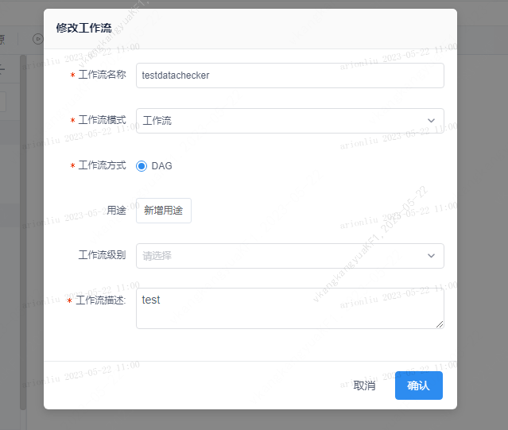
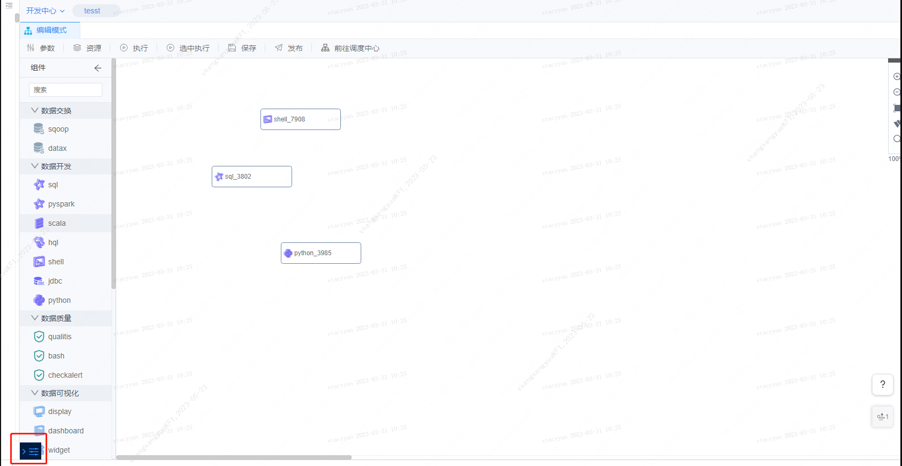
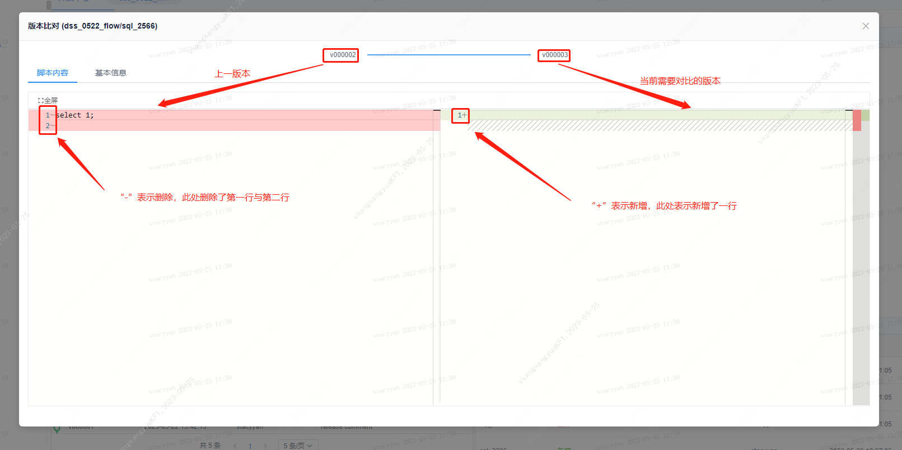

本文档主要面向数据开发人员，主要介绍工作流的增删改查、工作流的版本管理等基本管理功能，让您快速创建并管理您的工作流。

## 1 添加工作流

### 1.1 功能描述

&nbsp;&nbsp;&nbsp;&nbsp;&nbsp;&nbsp;&nbsp;用户可以在指定项目下添加一个工作流。

### 1.2 操作步骤

1. 登录平台，进入工作流开发。在目录区域将鼠标悬停在需要添加工作流的项目上，点击“+”按钮：
 

2. 在弹出框中填写工作流的信息，填写完成后点击【确认】按钮即可。目前的编排只支持工作流模式，且只支持以DAG方式展示工作流节点
    

## 2 配置工作流

## 2.1 功能描述

&nbsp;&nbsp;&nbsp;&nbsp;&nbsp;&nbsp;&nbsp;用户可以配置现有工作流的信息。

## 2.2 操作步骤

1. 登录平台，进入工作流开发。在目录区域将鼠标悬停在需要配置的工作流上，点击"\..."可弹出菜单，在菜单中点击【配置】

    

2. 在弹出框中修改工作的配置信息，点击【确认】按钮即可。

    

## 3 删除工作流

### 3.1 功能描述

&nbsp;&nbsp;&nbsp;&nbsp;&nbsp;&nbsp;&nbsp;用户可以删除现有工作流。

### 3.2 操作步骤

1. 登录平台，进入工作流开发。在目录区域将鼠标悬停在需要配置的工作流上，点击"\..."可弹出菜单，在菜单中点击【删除】
    

2. 在弹出框中点击【确认】按钮则删除工作流，点击【取消】按钮则返回上一步
    

## 4 工作流版本管理

### 4.1 功能描述

&nbsp;&nbsp;&nbsp;&nbsp;&nbsp;&nbsp;&nbsp;用户可以查看工作流的历史版本，并打开指定版本的工作流，并可将工作流回滚到指定版本。

### 4.2 操作步骤

1. 登录平台，进入工作流开发。在目录区域将鼠标悬停在需要配置的工作流上，点击"\..."可弹出菜单
    

2. 在菜单中点击【查看版本】，将弹出工作流版本信息。点击不同版本对应的操作栏中的【打开】按钮，可在开发中心打开相应版本的工作流，点击【回滚】即可回滚到指定历史版本。
    

## 5 工作流对比

### 5.1 功能描述

&nbsp;&nbsp;&nbsp;&nbsp;&nbsp;&nbsp;&nbsp;工作流对比可以查看工作流的历史版本记录，并对比相邻版本的差异，方便用户定位问题与快速开发脚本。

### 5.2 操作步骤

进入工作流编辑页面，点击工作流画布左下角的抽屉按钮，可以展开更多功能入口。
    

点击【版本对比】
    

点击抽屉按钮中的【版本比对】之后，点击相应的历史版本后可查看工作流中所包含节点
    

点击工作流节点中的【版本比对】即可查看节点的改动情况
    