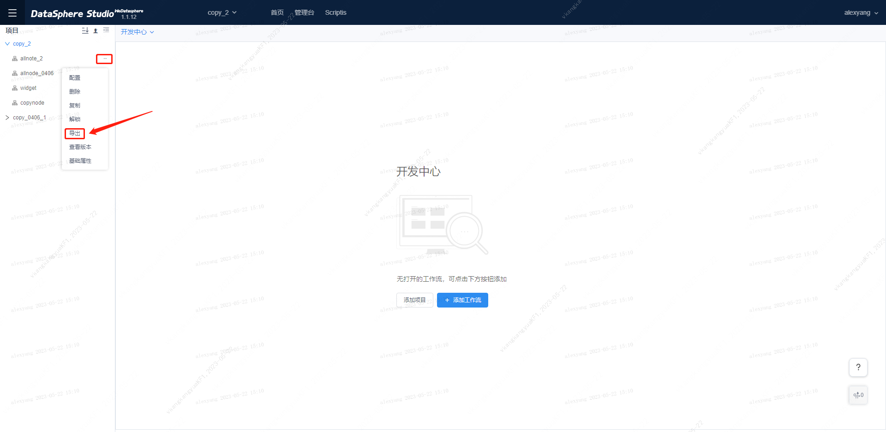
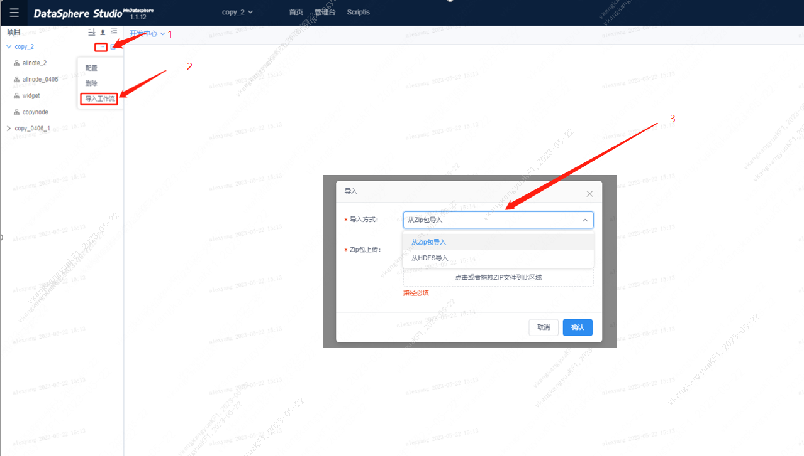
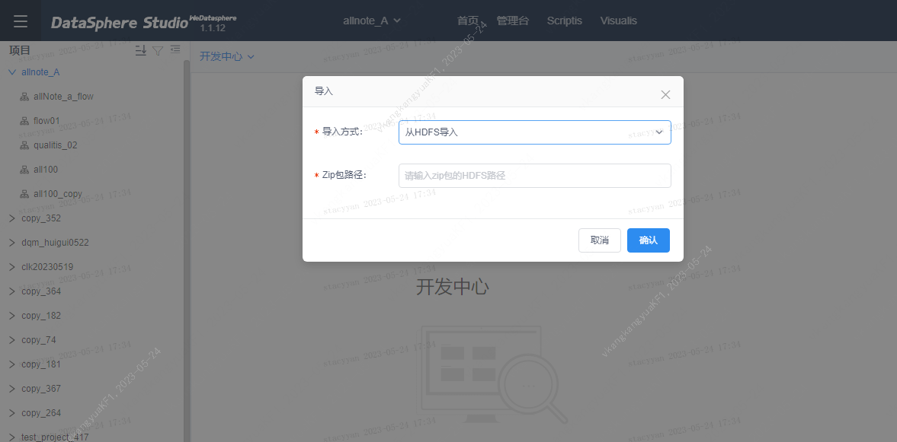
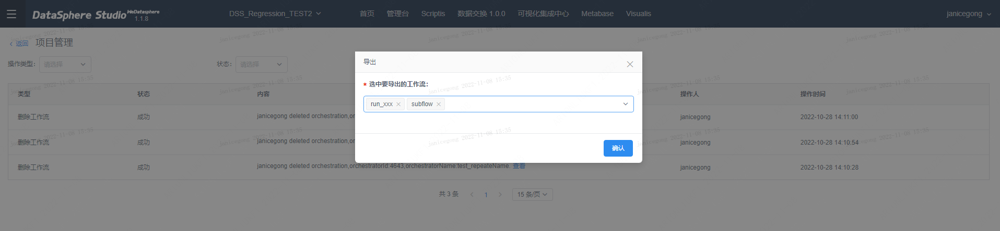
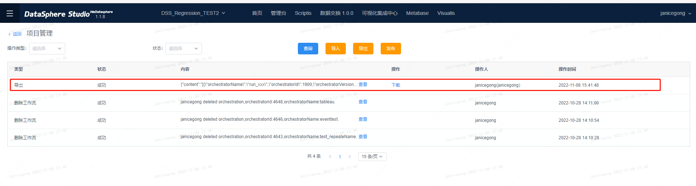
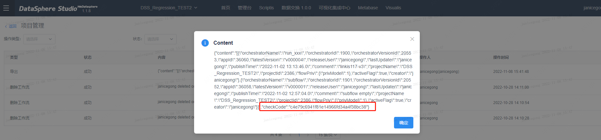
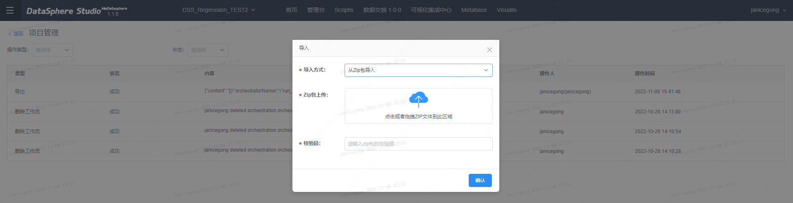
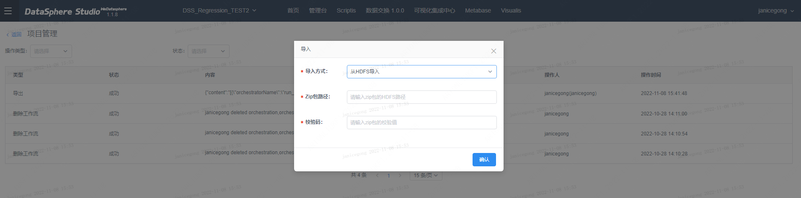

# 工作流导入与导出

本文档主要面向数据开发人员和运维人员使用。当开发人员或运维人员需要在不同环境或不同工作空间之间导入导出工作流，或导入到生产环境中时，可以参考本文档。

# 功能简介

工作流导入导出支持开发中心导入导出与生产中心导入导出，在导出时只需点击工作流导出按钮下载即可完成。注意，不支持跨生产中心与开发中心工作流导入导出。

# 开发中心工作流导入导出

**导出步骤：**

用户进入工作流开发中心点击需要导出的工作流左侧【...】，选择【导出】即可导出工作流

**导入步骤：**

用户进入工作流开发中心点击对应项目左侧【...】，选择【导入工作流】会弹出导入框，选择【导入方式】,可以选择【从zip包导入】或【从hdfs导入】两种导入方式，
上传zip文件或填写hdfs链接即可导入。

方式一：zip文件导入

选择【导入方式】-》【从zip包导入】，上传zip包，点击【确认】即可完成导入

方式二：hdfs链接导入

选择【导入方式】-》【从hdfs导入】，填写hdfs链接，点击【确认】即可完成导入

# 生产中心工作流导入导出

**导出步骤：**
1）用户进入工作流开发中心，在项目管理中，点击导出按钮，可以选中要导出的工作流，最多可选20个，点击确认后，开始导出工作流任务，
可以从操作记录中看到导出任务的状态。

 

2）当导出任务成功后，可以看到导出结果的【下载】按钮，点击下载，即可把工作流包下载下来。点击内容【查看】按钮，可以看到checkcode，
为导出包配套的校验码，在导入工作流包时需要填该改校验码。

**导入步骤：**
用户进入工作流开发中心，在项目管理中，点击【导入】按钮，选择【导入方式】,可以选择【从zip包导入】或【从hdfs导入】两种导入方式，填写校验码
（校验码可以从工作流导出任务内容中查看）即可把工作流包中的工作流导入到生产中心。

方式一：zip文件导入

选择【导入方式】-》【从zip包导入】，上传zip包，点击【确认】即可完成导入

方式二：hdfs链接导入

选择【导入方式】-》【从hdfs导入】，填写hdfs链接，点击【确认】即可完成导入

