本文档主要面向数据开发人员，目的是让数据开发人员了解工作流的开发。

# 功能简介

工作流开发是新建、配置节点并将各种节点组织到一起的过程，包括编辑节点内容，确定节点上下游关系，设置节点属性、工作流属性等内容。

# 新增节点

新建工作流项目后，单机进入工作流开发页面，通过从左侧组件列表中拖动节点到画布中，可以实现节点的添加。在画布上可以拖拽节点的位置，对接点进行连线，从而实现数据应用的开发，和使用第三方组件的能力。

注意，只有在开发中心才能进入工作流开发页面。

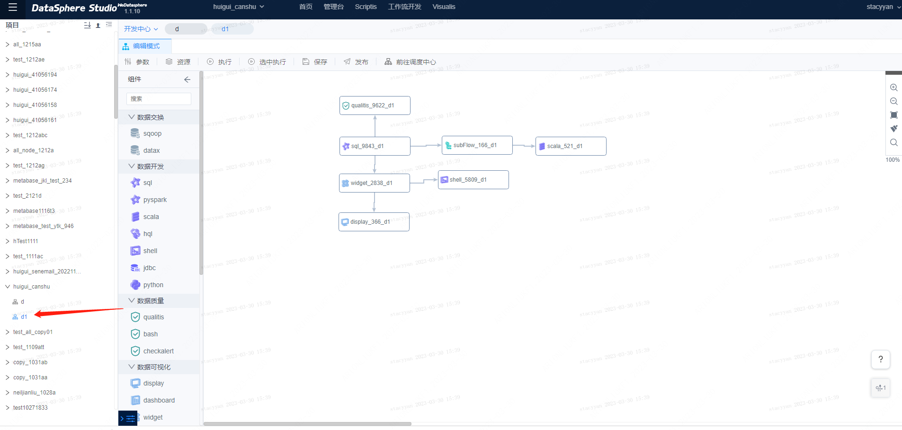


# 编辑节点

双击节点，可以进入节点编辑。

如果是代码节点，则进入代码编写页面。平台内置脚本编辑器，用户可按自身需求编辑工作流节点的脚本代码。当开发完成工作流节点，单击保存，DSS将会保存对应的脚本信息，关闭对应的脚本开发页面，

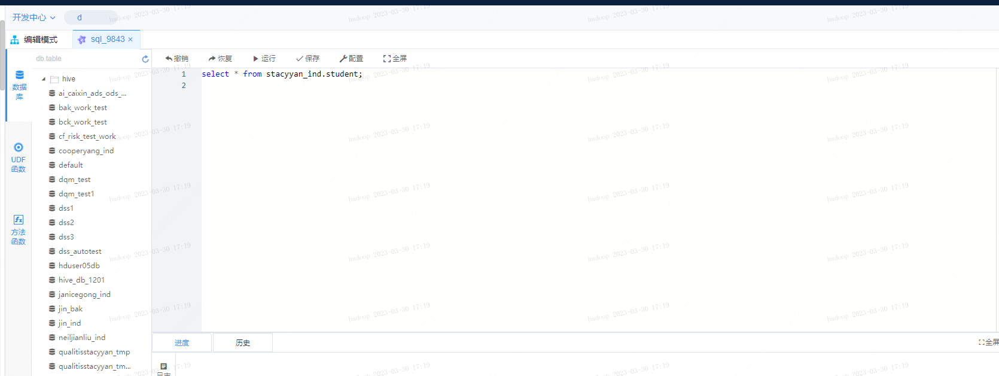

如果是第三方应用节点，则进入第三方应用的编辑页面。

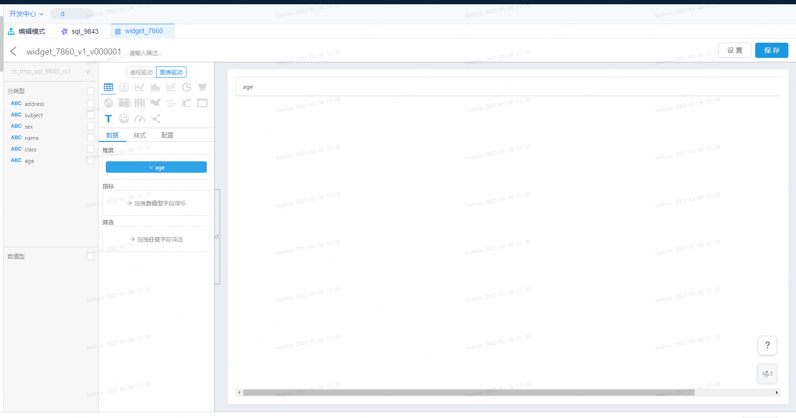


# 调试节点

编辑好节点后，可以点击上方的运行按钮，运行节点代码，查看运行结果。

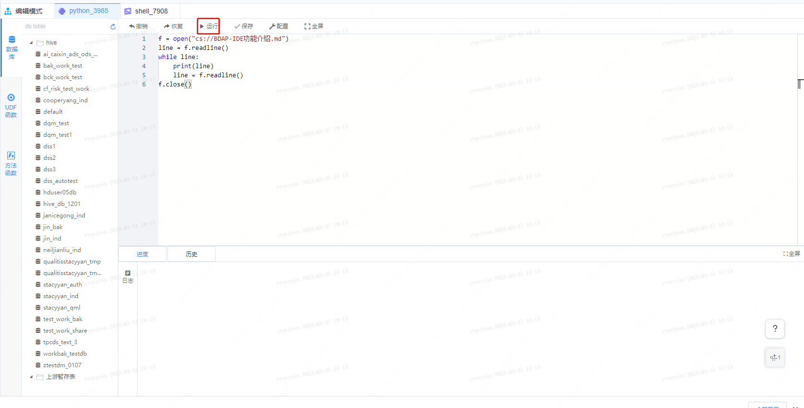

# 配置节点信息

点击编辑模式，重新回到工作流画布。

单击选中节点，此时节点是阴影状态，此时可以在右侧配置节点的基本属性，包括名称、标签、描述等信息。如果在选中状态点击【选中执行】按钮，则可以执行选中的节点。

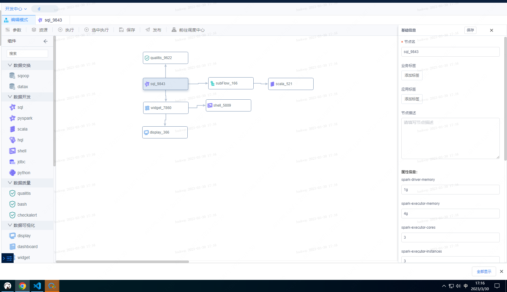

# 参数设置

点击参数按钮，可以设置工作流的代理用户和全局参数等信息。通过代理用户可以指定工作流调度执行时的执行用户。全局参数可以定义工作流级别的自定义变量，这些自定义变量可以在本工作流中的节点代码，以形如${变量名}的方式被引用。

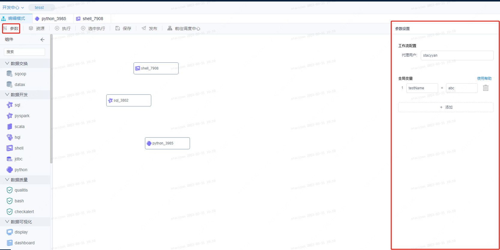

举个例子，定义名为testName的全局参数，值为abc，则可以在shell节点中，通过以下代码，打印结果为：我是abc。

```plain
echo "我是${testName}"
```

# 资源设置

点击资源按钮，可以上传工作流需要的数据资源。随后在代码中，可以通过形如“cs://test.txt”的方式读取文件。

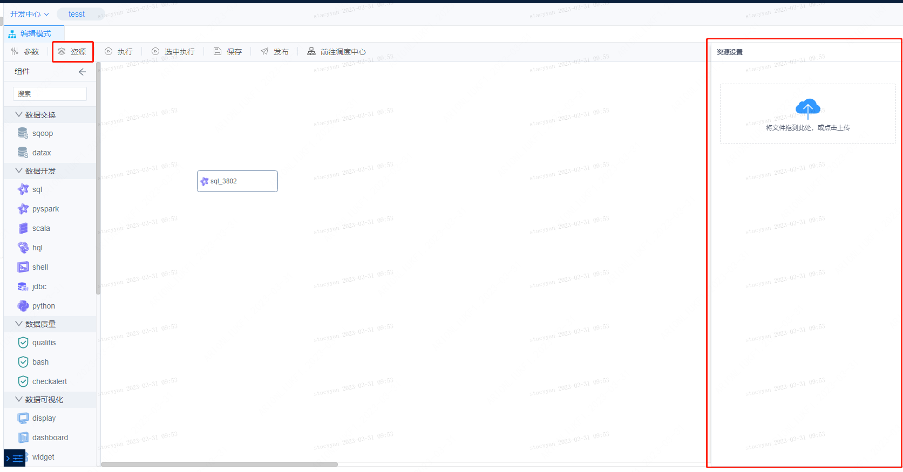

举个例子，将test.txt文件上传到资源中，随后新建python节点，并在节点中使用如下代码，即可按行打印test.txt中的内容。其他类型的节点入shell、scala等等，都是类似的方式。只要是本工作流内的节点，都能读取到上传的资源。

```plain
f = open("cs://text1.txt")
line = f.readline()
while line:
    print(line)
    line = f.readline()
f.close()
```
# **保存工作流**

点击保存按钮，即可保存编辑完成的工作流。

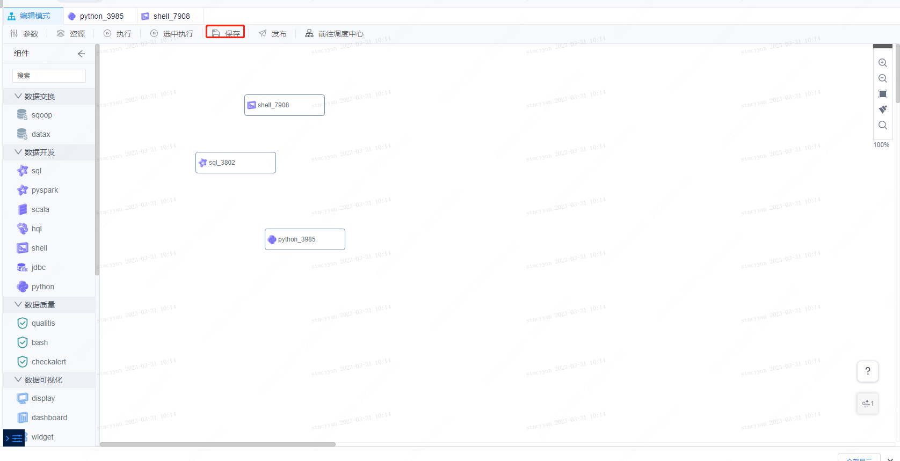

# 执行工作流

为了验证工作流的正确性，建议在开发完工作流后，先执行工作流。

在画布上选中节点，点击选中执行按钮，可以运行选中的节点。

如果点击执行按钮，DSS将会按照定义的上下游关系，从上到下运行工作流内的所有节点。

注：工作流执行将自动触发工作流保存。

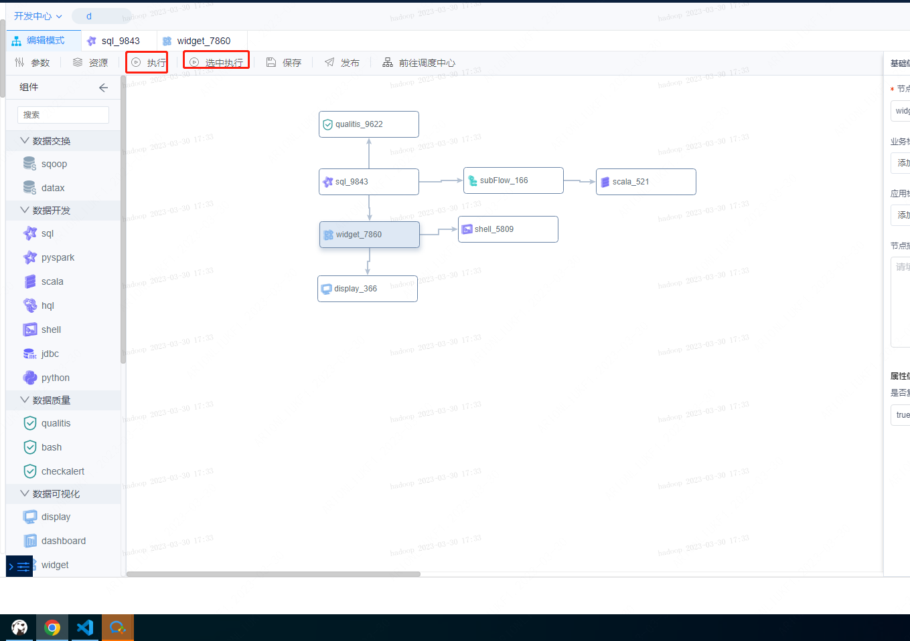

# 发布工作流

如果确认工作流没问题，可以点击发布按钮，将工作流发布到生产中心。发布到生产中心的工作流，会对接调度系统，实现工作流的批量调度。

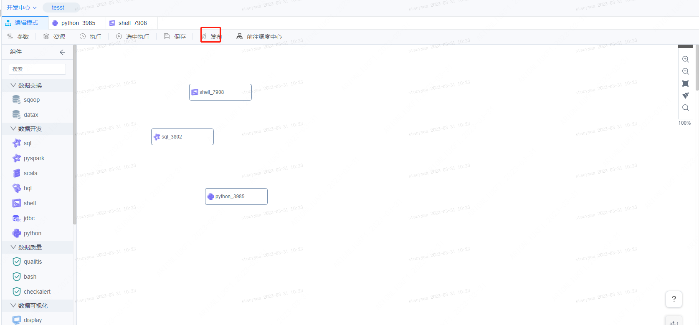

# 其他功能

点击工作流画布左下角的抽屉按钮，可以展开更多功能入口。

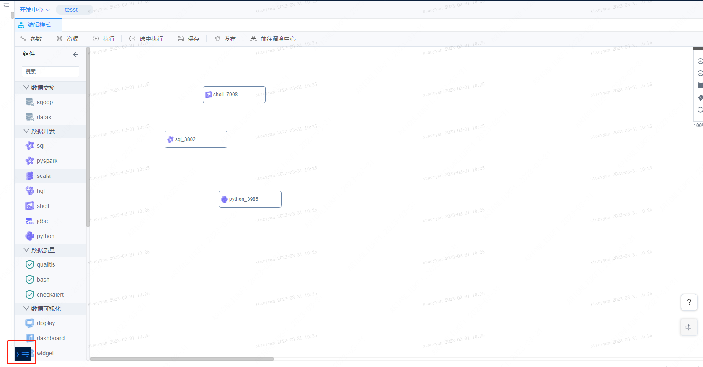

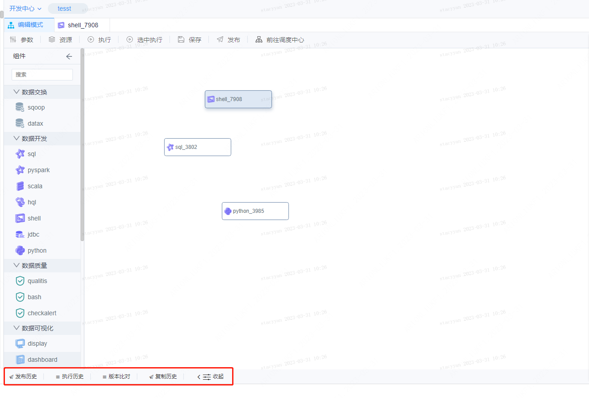

发布历史可以查看工作流的发布历史记录。

执行历史可以查看工作流的执行历史记录。

版本比对可以查看工作流的历史版本记录，并对比相邻版本的差异。

复制历史可以查看工作流的复制历史记录。

# 查看发布后的工作流

发布工作流后，可以点击前往调度中心按钮进入Schedulis，在Schedulis中可以查看和设置工作流的批量调度信息。

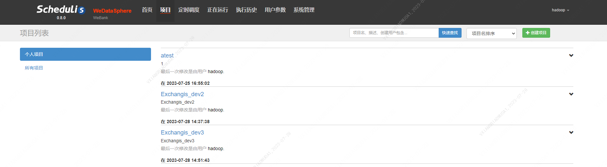


