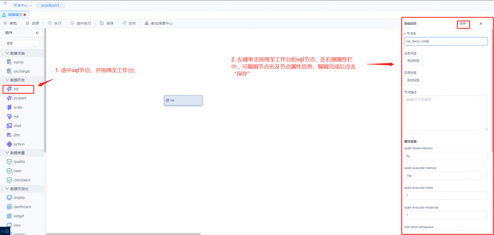
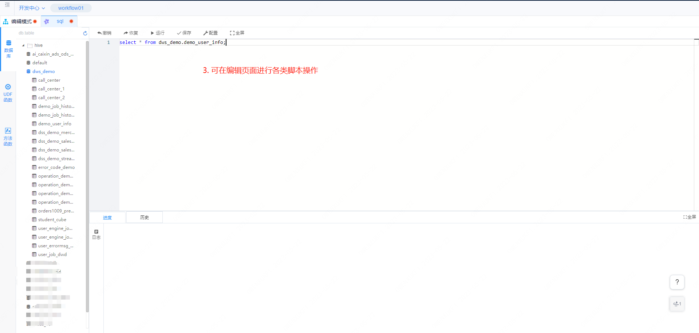
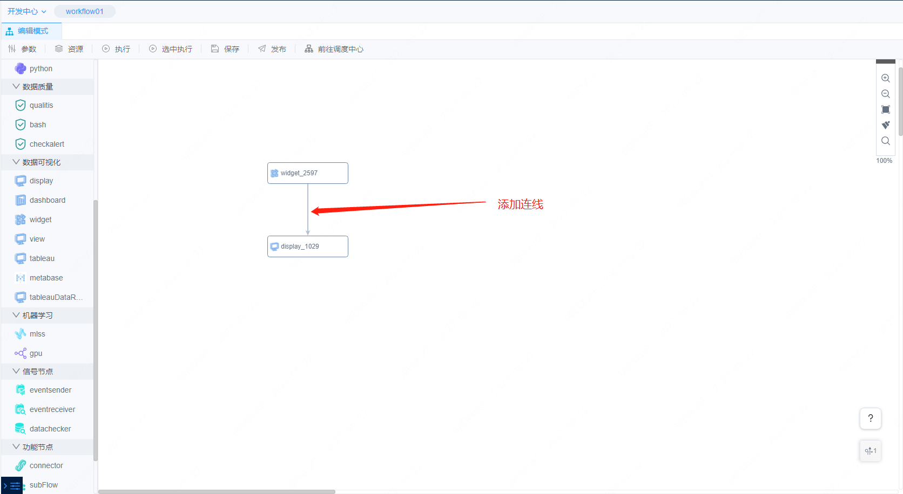
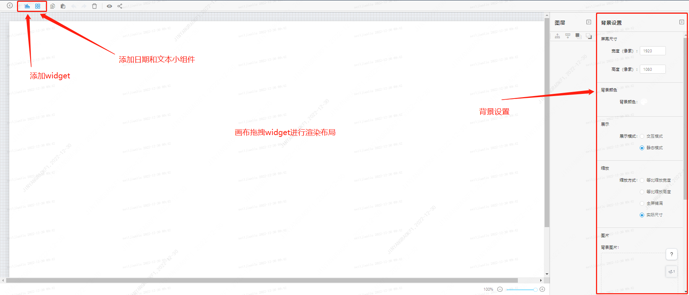
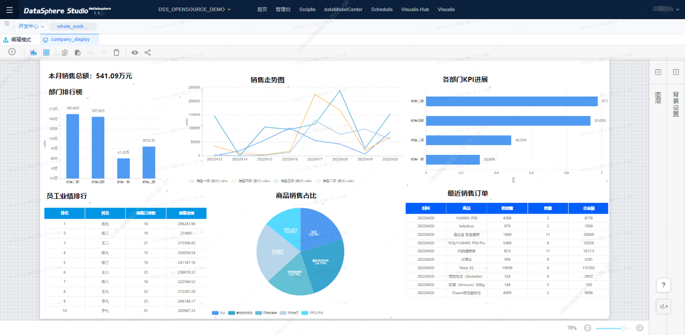

本文档主要面向数据开发工作人员，旨在通过介绍工作流支持的节点类型以及节点的使用方式来向开发者描述工作流模块所具备的能力，帮助开发者快速上手工作流开发。

# DSS节点介绍
DSS工作流支持Scriptis脚本类型节点及第三方Appconn工作流节点，按功能划分为数据开发、数据质量、数据可视化、机器学习、信号、功能及数据输出七类节点，以下是各类节点的介绍说明。

# 1. 数据开发节点
## 1.1 工作流sql, pyspark, scala节点

分别支持sql、pyspark、scala三种方式执行spark任务，使用时只需将节点拖拽至工作台后编写代码即可。

以sql节点为例，使用步骤如下：

1）选中sql节点，并拖拽至工作台；

2）单击sql节点，可编辑节点名和节点属性；



3）双击sql节点，可进入sql节点编辑页面，编辑完后可提交运行，使用方法同Scriptis中的脚本操作；



## 1.2 工作流hql节点

hql节点支持以sql方式执行hive任务，使用时只需将节点拖拽至工作台后编写hivesql代码即可。

操作步骤同sql节点。

## 1.3 工作流python节点

python节点支持执行python任务，使用时只需将节点拖拽至工作台后编写python代码即可。

操作步骤同sql节点。

## 1.4 工作流shell节点

shell节点支持执行shell命令或者脚本运行，使用时只需将节点拖拽至工作台后编写shell命令即可。

操作步骤同sql节点。

## 1.5 工作流jdbc节点

jdbc节点支持以jdbc方式运行sql命令，使用时只需将节点拖拽至工作台后编写sql即可，**注意需要提前在linkis console管理台配置jdbc连接信息**（在管理台-参数配置对应应用类型下配置JDBC参数）。

操作步骤同sql节点。

# 2. 数据质量节点

数据质量相关节点的具体使用可参考《Qualitis 用户手册》：[https://github.com/WeBankFinTech/Qualitis/blob/master/docs/zh_CN/ch1/用户手册.md](https://github.com/WeBankFinTech/Qualitis/blob/master/docs/zh_CN/ch1/用户手册.md)

## 2.1 qualitis节点

qualitis节点可用于数据质量校验，其不仅可以对已有hive数据进行校验，还可以对各种ETL的中间表数据进行校验。

操作步骤如下：

拖拽节点至工作台，双击节点进入内嵌规则编辑页面，完成编辑后保存。


## 2.2 bash节点

作用与qualitis节点一致，qualitis节点是以界面化的方式配置规则，bash节点是以指令的方式配置规则。

## 2.3 checkalert节点

根据用户保存在 hive 表中的数据，以及告警人，告警内容配置，将信息组织起来并调用 IMS 发起告警。

# 3. 数据可视化节点

工作流中目前集成了Visualis可视化组件。

## 3.1 visualis相关节点

view，widget，display，dashboard均为Visualis相关节点，与Visualis系统中的相应概念一一对应。以Display组件为例，visualis相关节点具体使用文档可参考《Visualis和Metabase工作流使用文档》：
[https://github.com/WeBankFinTech/Visualis/blob/master/visualis_docs/zh_CN/Visualis_user_manul_cn.md](https://github.com/WeBankFinTech/Visualis/blob/master/visualis_docs/zh_CN/Visualis_user_manul_cn.md)

使用示例如下:

1）拖拽display节点至工作台；

2）添加工作流连线：将需要在display中加载的widget与display关联



3）双击display节点进入节点编辑页面，编辑页面如下：



4）完成display的编辑，示例demo如下：




# 4. 信号节点
## 4.1 eventsender节点

eventsender节点用于进行信息

发送，将一段信息事件进行发送给eventreceiver。  

常见场景如：工程间存在上下游依赖，工作流间存在上下游信息依赖。比如B工作流的某个工作流节点依赖于A工作流的某个工作流节点的一些信息（如：状态信息，即A节点执行成功，B节点才能开始执行），eventsender支持如下参数：

```plain
1. msg.type: 用来指定Job的类型，SEND用于发送消息，RECEIVE用于接收消息。
2. msg.sender: 指定消息的发送者，需使用ProjectName@WFName@JobName的格式进行定义。
3. msg.topic: 指定消息的主题，建议使用如下格式： 一级分类编码+“”+二级分类编码+“”+三级分类编码。
4. msg.name: 指定消息名称，由用户自定义。
5. msg.body: 指定消息的内容，没有内容发送可以为空。
6. **注意：msg.type默认不可变为SEND，msg.sender、msg.topic、msg.name是必填。**
```
示例：
```plain
msg.type=SEND
msg.sender=project01@flow@job01
msg.topic=bdp_tac_test
msg.name=TestDynamicReceive
msg.body=${msg.mycontent}
```
## 4.2 eventreceiver节点

eventreceiver节点用于接收eventsender发送过来的消息，并将接收过来的消息内容存放到工作流的上下文中，后续的节点会根据前缀去找该信息进行使用比如作为自定义变量进行使用，eventseceiver支持如下参数：

```plain
1. msg.type: 用来指定Job的类型，SEND用于发送消息，RECEIVE用于接收消息。
2. msg.receiver: 指定消息的接收者，需使用projectname@jobname@rtxname的格式进行定义。
3. msg.topic: 指定消息的主题，建议使用如下格式： 一级分类编码+“”+二级分类编码+“”+三级分类编码。
4. msg.name: 指定消息名称，由用户自定义。
5. query.frequency: 由于接收消息使用的是主动轮询的方式，wait.time期间的查询次数，。
6. max.receive.hours: 最长的接收时长，以小时为单位，超过时长未接收到消息返回失败，。
7. msg.savekey: 用于保存消息内容key值，单个flow内多个接收job，需指定不同的msg.savekey保存消息内容，默认值为msg.body，后续Job可以使用该key值获取消息内容。
8. only.receive.today: 如果为true 有且只能接收job启动当天发来的消息
9. 注意：msg.type默认不可变为RECEIVE，msg.receiver、msg.topic、msg.name是必填。
```
## 4.3 datachecker节点：

datachecker节点用于检测数据是否ready，可以判断hive库中某个表或者分区是否存在，如果存在则进行下游的执行，在有数据依赖的任务中扮演十分重要的作用，用于替换掉以前口头约定好的时间开始运行。

datachecker支持如下参数：

```plain
1. source.type: 依赖的数据来源，job表示是由其他job产生
2. check.object: 依赖数据的名称例如：data.object.1=dbname.tablename{partitionlist}
3. max.check.hours: 描述任务的等待时间，单位是小时
4. job.desc: 追加多源信息配置。
```
# 5.功能节点

## connector节点

connector节点的作用是为了作为节点与节点的连接，让工作流更加好看，并不具有特殊功能。

## subFlow节点

subFlow节点是您可以在一条工作流中嵌入一条子工作流，父工作流发布时，子工作流也会同步进行发布，但是在实时执行父工作流时，会跳过子工作流的执行。

如果您想执行子工作流，请双击子工作流节点，进入子工作流编辑页面进行执行。

# 6. 数据输出节点
## sendemail节点

SendEmail节点一般作为工作流的最后一个节点，用于将工作流前面的结果信息进行发送，支持发送表格、文本、图片等，用户在使用的时候直接选择想要发送的工作流节点（可发送display，dashboard，tableua节点中的内容）即可：  

 sendEmail支持如下参数：

```plain
类型：支持节点、文字、文件、链接
邮件标题：指定邮件表提
发送项：发送的具体内容，例如：类型是节点则这里选择节点
关联审批单：该邮件是否走过审批，如果未则不会进行发送
其他邮件基本属性：收件人、抄送、秘密抄送
```

