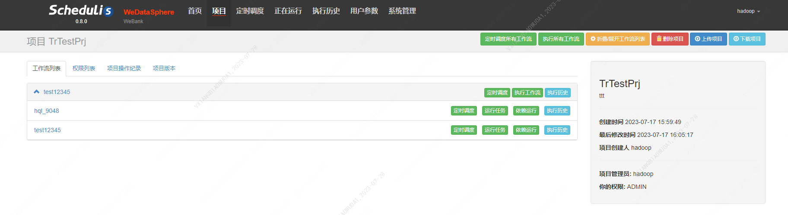
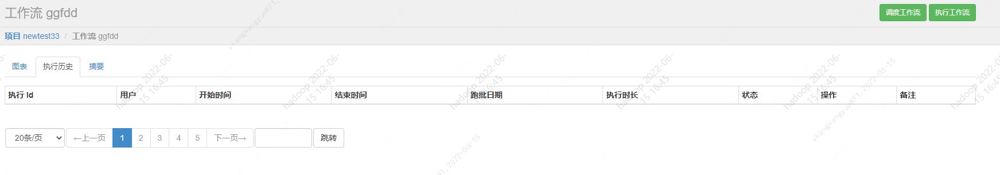
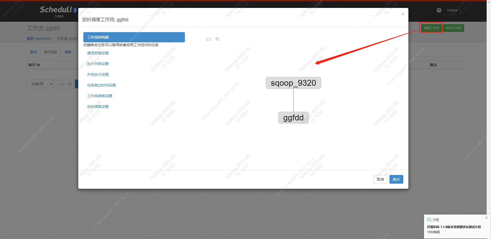
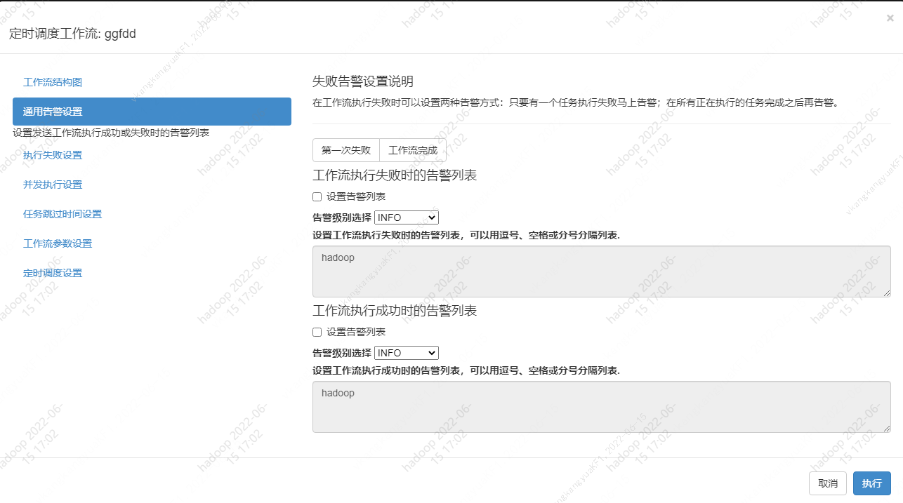
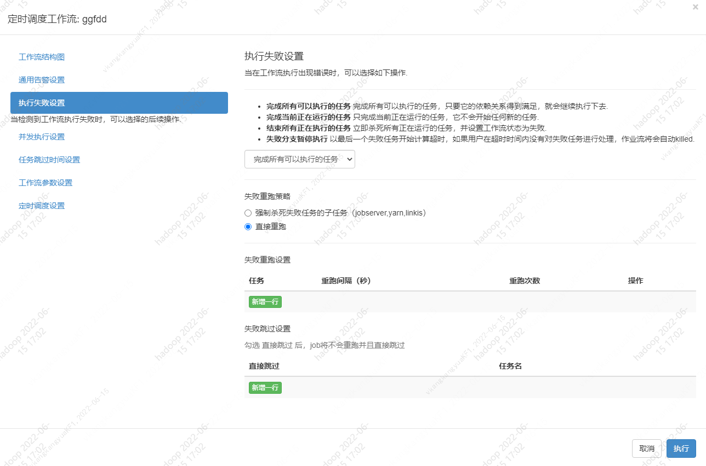
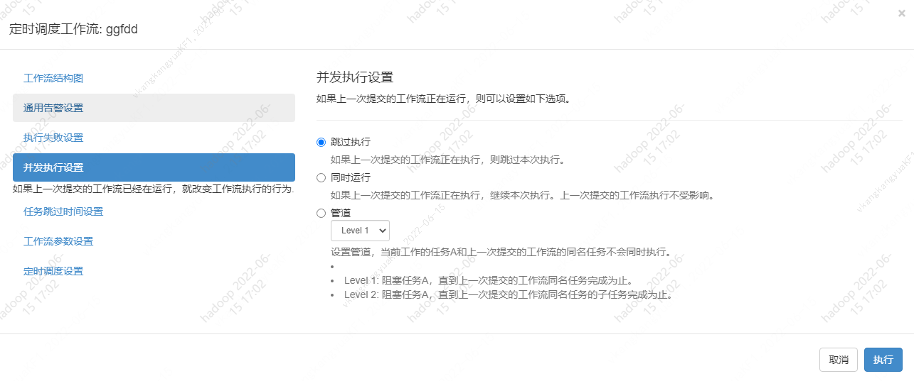
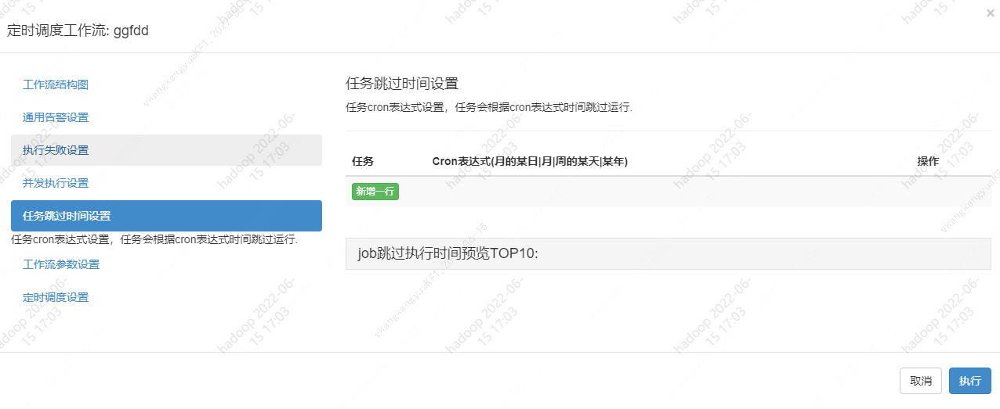
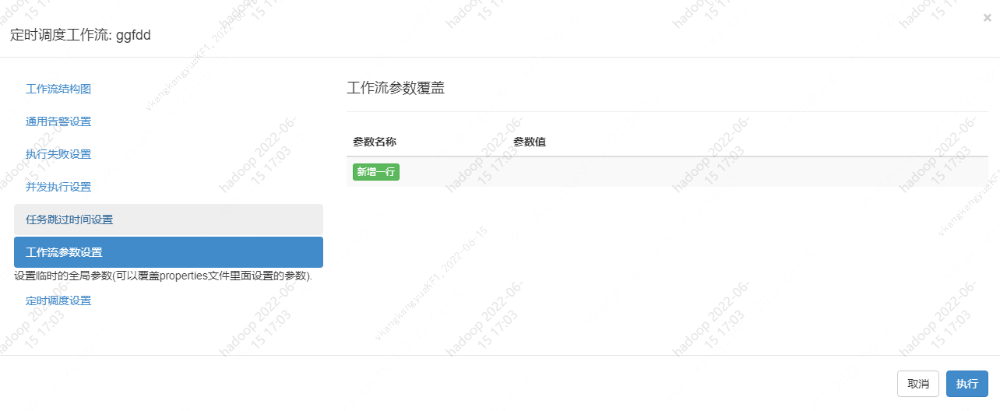
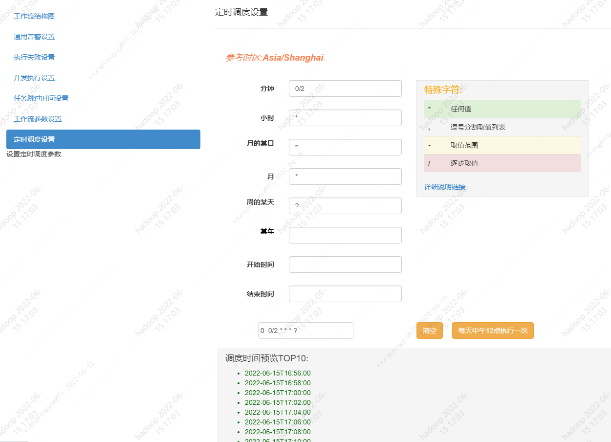
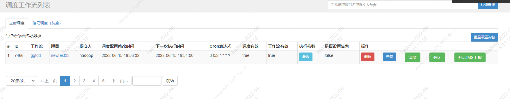

本文档主要面向数据开发和运维人员，旨在通过介绍调度管理系统schedulis的基本使用，帮助开发和运维人员了解工作流发布后，如何进行调度任务的管理和配置。

当用户点击`前往调度中心`之后，进入Schedulis项目列表界面，可以在搜索框查找项目，点击项目名称进入项目详情页面

- 在工作流列表栏，点击`执行历史`之后，可以进入到工作流所对应的执行历史界面

- 点击`调度工作流`可以选择执行工作流或重新配置其执行参数，其中带入过来到参数是之前在**图1.4工作流设置界面**设置好的

  - 通用告警设置：设置发送工作流执行成功或失败时的告警列表
    
  - 执行失败设置：当检测到工作流执行失败时，可以选择的后续操作.
    
  - 并发执行设置：如果上一次提交的工作流已经在运行，就改变工作流执行的行为.
    
  - 任务跳过时间设置：任务cron表达式设置，任务会根据cron表达式时间跳过运行.
    
  - 工作流参数设置：设置临时的全局参数(可以覆盖properties文件里面设置的参数).
    
  - 定时调度设置：设置定时调度参数.
    
- 工作流执行后会进入到**调度管理**界面，列表会显示配置的工作流列表，点击对应的操作按钮可以对其进行操作

