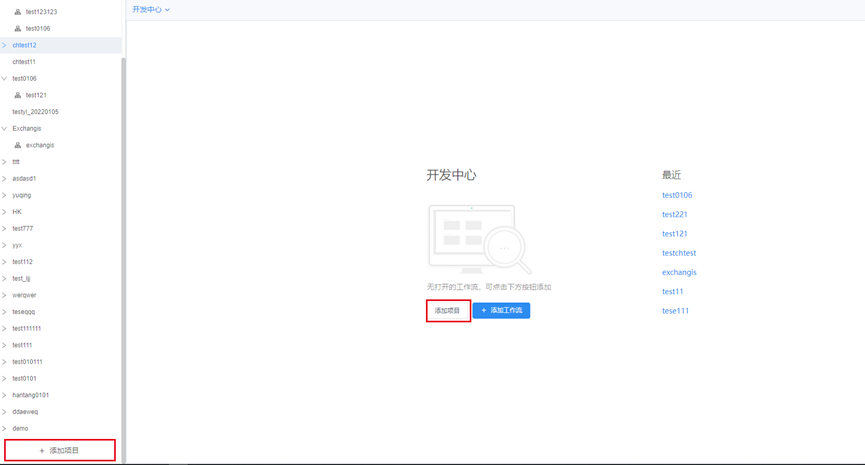
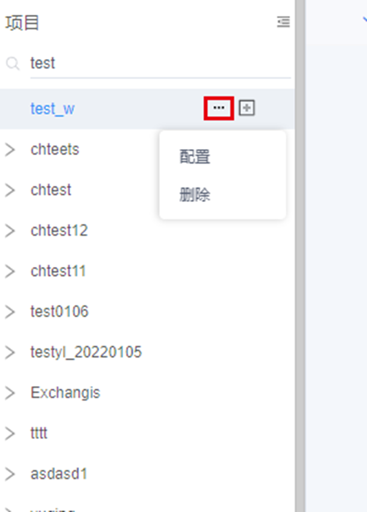
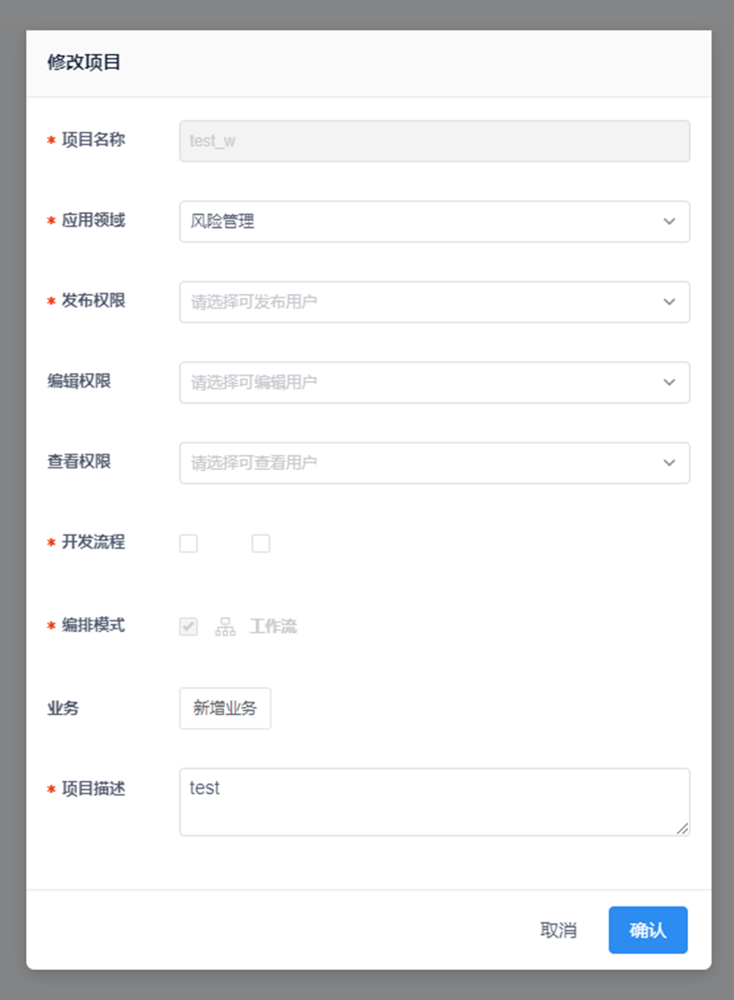
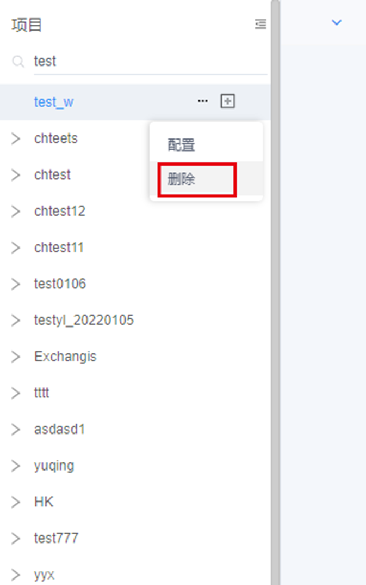

本文档主要面向数据开发工作人员和管理员，旨在通过介绍工作流的基本管理单元——项目的定义和使用，来帮助开发者了解如何创建、搜索、查找和删除项目。

## 1 添加项目

### 1.1 功能描述

&nbsp;&nbsp;&nbsp;&nbsp;&nbsp;&nbsp;&nbsp;用户可以添加一个新项目，项目是工作流的集合，用户可根据自己的需求创建项目。

### 1.1 操作步骤

1. 登录平台，进入工作流开发，点击目录区域或首页的【添加项目】按钮


2. 填写项目的基本信息并配置权限。对于配置了调度中心的项目，可在修改完成后发布到调度中心。关于调度中心的信息和操作细节可参见1.6节"调度中心"。信息填写完毕后点击【确认】按钮即可创建项目。

## 2 搜索项目

### 2.1 功能描述

&nbsp;&nbsp;&nbsp;&nbsp;&nbsp;&nbsp;&nbsp;用户可以基于项目名称关键字搜索项目。

### 2.1 操作步骤

&nbsp;&nbsp;&nbsp;&nbsp;&nbsp;&nbsp;&nbsp;登录平台，进入工作流开发，在项目列表的搜索框中输入项目名称关键字，搜索结果将展示在下方。

## 3 配置项目

### 3.1 功能描述

&nbsp;&nbsp;&nbsp;&nbsp;&nbsp;&nbsp;&nbsp;用户可以配置现有项目的基本信息。

### 3.1 操作步骤

1. 登录平台，进入工作流开发。在目录区域将鼠标悬停在需要配置的项目上，点击"\..."可弹出菜单。
    

2. 在第一步弹出的菜单中点击【配置】按钮，在弹出框中修改项目的配置信息。修改完成后点击【确认】按钮即可。
    

## 4 删除项目

### 4.1 功能描述

&nbsp;&nbsp;&nbsp;&nbsp;&nbsp;&nbsp;&nbsp;用户可以删除不再需要的项目。

### 4.1 操作步骤

1. 登录平台，进入工作流开发。在目录区域将鼠标悬停在需要配置的项目上，点击"\..."可弹出菜单。
    

2. 在弹出的菜单中点击【删除】按钮\  
    

```{=html}
<!-- -->
```
3. 在弹出框中点击【确认】按钮则删除项目，点击【取消】按钮则返回上一步
    
