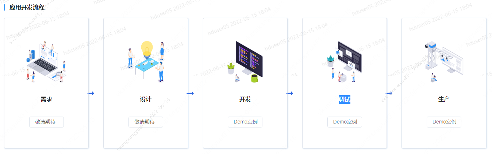
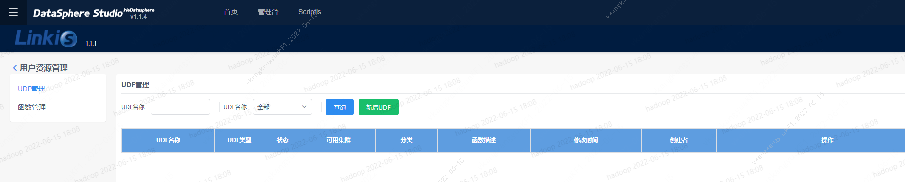
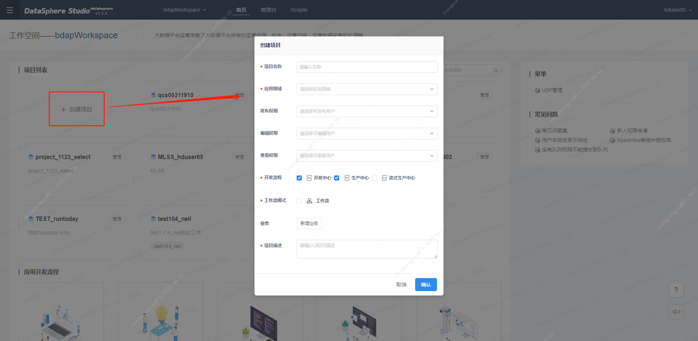
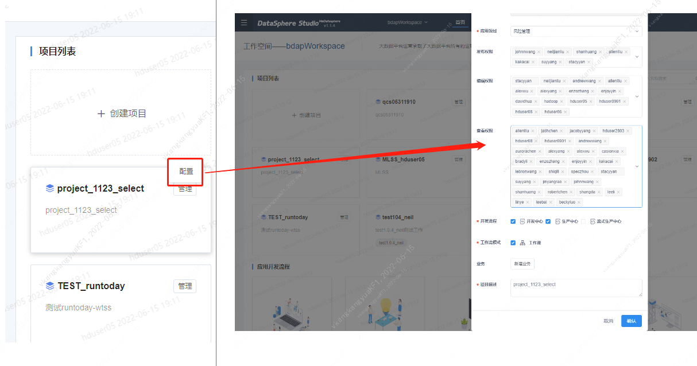

# 1.工作空间角色权限介绍 
&nbsp;&nbsp;&nbsp;&nbsp;&nbsp;&nbsp;&nbsp;在项目导向的工作空间中，可以添加任何部门的成员；在部门导向的工作空间中，只可以添加本部门的成员。 
&nbsp;&nbsp;&nbsp;&nbsp;&nbsp;&nbsp;&nbsp;**管理台：**
- 工作空间创建者的默认角色是拥有者，可以委托一名或多名管理员对工作空间进行管理。 
- 只有工作空间的管理员可以进入【管理台】模块，对该工作空间的基本信息和权限信息进行相应管理。 
- 工作空间的默认角色包括拥有者、管理员、开发用户、运维用户、分析用户、运营用户、数据服务用户、访客。 
  - 拥有者：拥有最高权限，拥有该工作空间内所有功能的操作权限，可以删除该工作空间；
  - 管理员：拥有该工作空间内所有功能的操作权限；
  - 开发用户：拥有数据接入、数据质量、应用开发、测试环境任务发布、生产环境任务提交等权限；
  - 运维用户：拥有数据质量、资源配置、测试环境任务发布、生产任务审批发布等权限；
  - 分析用户：拥有数据接入、数据分析等权限；
  - 运营用户：拥有数据分析等权限；
  - 数据服务用户：拥有数据接入、数据服务等权限；
  - 访客：拥有工作空间内所有模块的只读权限，不可编辑或执行；

# 2.工作空间页面介绍 
&nbsp;&nbsp;&nbsp;&nbsp;&nbsp;&nbsp;&nbsp;工作空间页面包含：**项目列表**、**应用开发流程**、**菜单**、**常见问题**四部分。 
- 项目列表：在用户进入dss后，可以选择不同的工作空间来创建自己的项目，选择不同的工作空间会展示所创建的项目列表。

- 应用开发流程：其中包含了**需求**（不可用）、**设计**（不可用）、**开发**、**调试**、**生产**,点击对应功能下的按钮可跳转到对应的功能或查看对应的示例

- 菜单：点击UDF管理，可进入linkis管理台进行资源管理，可以新增函数或新增UDF

# 3.创建项目
&nbsp;&nbsp;&nbsp;&nbsp;&nbsp;&nbsp;&nbsp;在项目空间列表中，点击创建项目，可以更具自己的需要配置并新增项目

&nbsp;&nbsp;&nbsp;&nbsp;&nbsp;&nbsp;&nbsp;通过点击项目的管理按钮可修改项目的基本信息，只有管理员才能够删除项目
