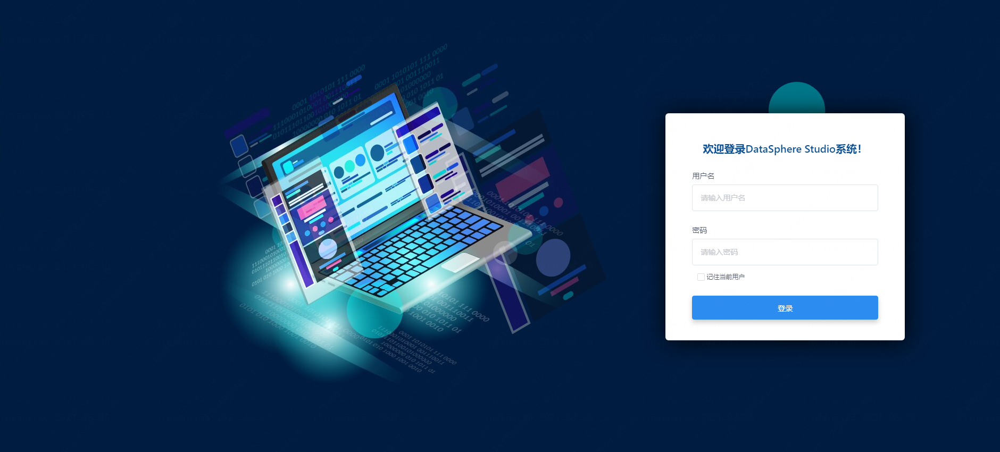
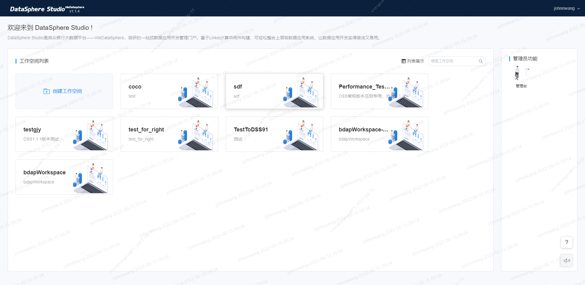
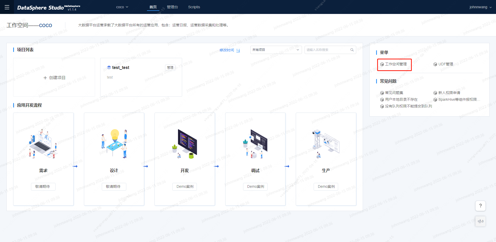
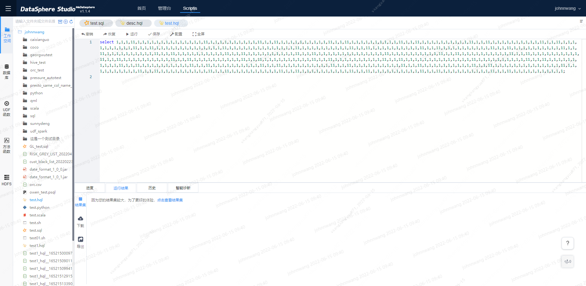
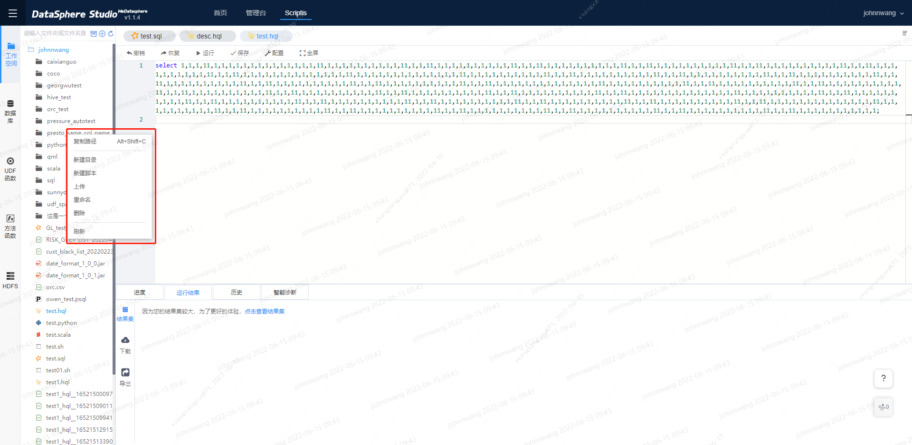
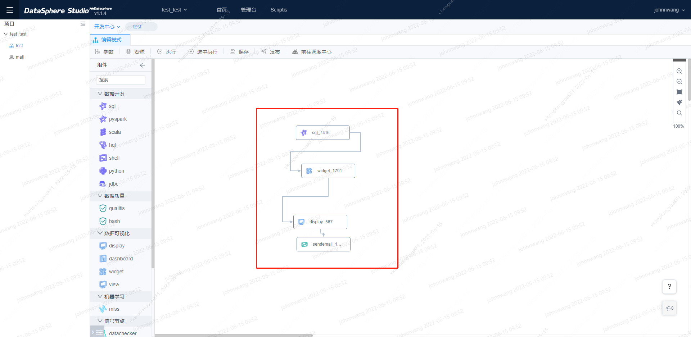
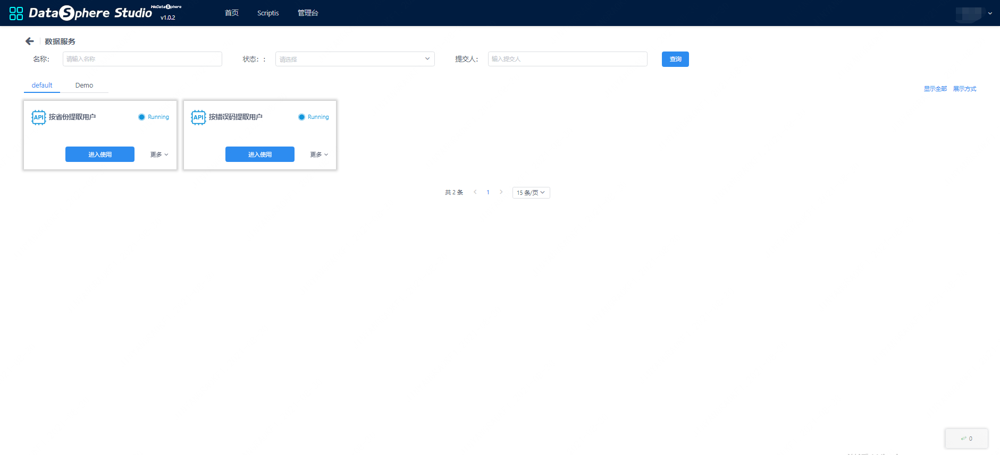

# DSS快速入门

## 1. 前言

&nbsp;&nbsp;&nbsp;&nbsp;&nbsp;&nbsp;&nbsp;&nbsp;&nbsp;本文是DSS快速入门文档，涵盖了DSS的基本使用流程，更多的操作使用细节，将会在用户使用文档中提供。

## 2. 登录首页
&nbsp;&nbsp;&nbsp;&nbsp;&nbsp;&nbsp;&nbsp;&nbsp;&nbsp;为了方便用户使用，**系统默认通过Linkis的Linux部署用户进行登录**，如使用hadoop部署的Linkis和DSS，则用hadoop账号即可登录。

*注意： 如果要支持多用户登录，DSS的用户登录依赖Linkis，需要在linkis-GateWay的配置里面进行配置，Linkis-GateWay默认支持LDAP。*

图 2.1 DSS1.0.0登录首页

## 3. 工作空间管理

&nbsp;&nbsp;&nbsp;&nbsp;&nbsp;&nbsp;&nbsp;&nbsp;&nbsp;进入到工作空间页面，可以创建和管理工作空间。

&nbsp;&nbsp;&nbsp;&nbsp;&nbsp;&nbsp;&nbsp;&nbsp;&nbsp;工作空间是DSS的基本组织结构，通过工作空间，可以将一个部门、一条业务线、一个产品的所有数据应用放入一个工作空间，用来管理相关的参与用户、角色、工程和应用组件等，如下图是工作空间首页。

图 3.1 工作空间首页

## 4. 工程管理
&nbsp;&nbsp;&nbsp;&nbsp;&nbsp;&nbsp;&nbsp;&nbsp;&nbsp;在进入相应的工作空间后，可以创建工程，在实际的开发中，工程往往被用来管理一类数据应用，不同的工程互相隔离，其可参与开发、发布的用户可以互不相同。 
&nbsp;&nbsp;&nbsp;&nbsp;&nbsp;&nbsp;&nbsp;&nbsp;&nbsp;可以在工程首页创建和管理工程，包括创建，修改，和删除，同时在工程首页，可以在顶部切换对应的工作空间，工作空间右侧的**菜单**，可以跳转到**工作空间管理页面**。 

图4.1 工作空间首页

## 5. DSS应用组件
&nbsp;&nbsp;&nbsp;&nbsp;&nbsp;&nbsp;&nbsp;&nbsp;&nbsp;在工作空间首页，可以点击进入DSS应用组件，应用组件页面，提供了访问接入DSS第三方组件的快捷方式，如数据服务，Scritpis，Visualis，Schedulis等。 

### 5.1. Scripits
&nbsp;&nbsp;&nbsp;&nbsp;&nbsp;&nbsp;&nbsp;&nbsp;&nbsp;Scriptis是微众银行WeDataSphere自研的交互式数据探索分析工具，以Linkis做为内核，提供多种计算存储引擎(如Spark、Hive、Flink、Presto等)、Hive数据库管理功能、资源(如Yarn资源、服务器资源)管理、应用管理和各种用户资源(如UDF、变量等)管理的能力。 

图5.1 Scriptis界面

&nbsp;&nbsp;&nbsp;&nbsp;&nbsp;&nbsp;&nbsp;&nbsp;&nbsp;工作空间是一个文件目录，用户对该目录拥有所有的权限可以进行文件管理操作等。建议的目录结构是：script,data,log,res四个目录，目录结构清晰方便用户进行查看和管理。 

工作空间主要功能如下：
1. 工作空间右键主要包含复制路径，新建目录，新建脚本，上传，重命名，删除以及刷新。
   
2. 顶上搜索功能，支持对文件快速定位 
3. 新建脚本功能支持建立以下脚本
    - 数据库提供图形化数据库表信息展示管理功能，可以通过该数据库功能快速查找具有权限的库表，和数据库表的管理功能。
    - UDF和函数两个模块，提供UDF函数的可视化功能，方便自定义函数的管理。
    - HDFS模块提供了可视化文件结构展示，和操作的功能。只需简单的点击，就能完成对HDFS文件和文件夹管理的操作。

### 5.2. 工作流
&nbsp;&nbsp;&nbsp;&nbsp;&nbsp;&nbsp;&nbsp;&nbsp;&nbsp;新建项目后，进入工作流开发页面，通过拖拽，可以实现数据应用的开发。  

图5.2 工作流页面

&nbsp;&nbsp;&nbsp;&nbsp;&nbsp;&nbsp;&nbsp;&nbsp;&nbsp;当双击工作流节点，便进入节点编辑页面，在编辑页面完成脚本开发和调试。开发完成工作流节点后，可以在工作流页面，点击执行工作流，完成工作流的调试,调试完成后，点击发布按钮，支持将DSS工作流一键发布到Schedulis，进行日常跑批调度。

### 5.3. 数据服务

&nbsp;&nbsp;&nbsp;&nbsp;&nbsp;&nbsp;&nbsp;&nbsp;&nbsp;DSS以内嵌应用工具的形式提供数据服务功能，可以方便实现不具有库表权限的用户，访问特定数据，发布数据服务的用户只需要简单的书写Spark SQL查询，预留查询接口，发布为数据服务，即可让其他用户使用。 

图5.3 数据服务

## DSS节点介绍附录：

<table>
    <tr>
        <th style="color:black;">节点一级分类</th>
        <th style="color:black;">节点名称</th>
        <th style="color:black;">节点功能</th>
    </tr>
    <tr>
        <td rowspan="7">数据开发节点</td>
        <td>sql节点</td>
        <td>spark sql执行节点，使用spark引擎执行任务。</td>
    </tr>
    <tr>
        <td>pyspark节点</td>
        <td>pyspark执行节点，使用spark引擎执行任务。</td>
    </tr>
    <tr>
        <td>spark节点</td>
        <td>scala执行节点，使用spark引擎执行任务。</td>
    </tr>
    <tr>
        <td>hql节点</td>
        <td>hive sql执行节点，使用hive引擎执行任务。</td>
    </tr>
    <tr>
        <td>python节点</td>
        <td>python执行节点，使用python引擎。</td>
    </tr>
    <tr>
        <td>shell节点</td>
        <td>shell命令或脚本执行节点，使用shell引擎。</td>
    </tr>
    <tr>
        <td>jdbc节点</td>
        <td>以jdbc方式运行sql命令，使用时只需将节点拖拽至工作台后编写sql即可，注意需要提前在linkis console管理台配置jdbc连接信息（在管理台-参数配置对应应用类型下配置JDBC参数）。</td>
    </tr>
    <tr>
        <td rowspan="3">数据质量节点</td>
        <td>qualitis节点</td>
        <td>用于数据质量校验，其不仅可以对已有hive数据进行校验，还可以对各种ETL的中间表数据进行校验。</td>
    </tr>
    <tr>
        <td>bash节点</td>
        <td>作用与qualitis节点一致，qualitis节点是以界面化的方式配置规则，bash节点是以指令的方式配置规则。</td>
    </tr>
    <tr>
        <td>checkalert节点</td>
        <td>根据用户保存在 hive 表中的数据，以及告警人，告警内容配置，将信息组织起来并调用 IMS 发起告警。</td>
    </tr>
    <tr>
        <td rowspan="4">数据可视化节点</td>
        <td>view节点</td>
        <td>Visualis数据视图节点，用于构造数据视图。</td>
    </tr>
    <tr>
        <td>widget节点</td>
        <td>Visualis可视化组件节点，用于创建各类可视化图表。</td>
    </tr>
    <tr>
        <td>dashboard节点</td>
        <td>Visualis数据应用-dashboard节点，基于widget节点构建可视化仪表板。</td>
    </tr>
    <tr>
        <td>display节点</td>
        <td>Visualis数据应用-display节点，基于widget节点构建可视化数字大屏。display节点比dashboard支持更丰富的辅助组件，更灵活的图表排版。</td>
    </tr>
    <tr>
        <td rowspan="3">信号节点</td>
        <td>eventsender节点</td>
        <td>eventsender节点用于进行信息发送，将一段信息事件进行发送给eventreceiver。</td>
    </tr>
    <tr>
        <td>eventreceiver节点</td>
        <td>eventreceiver节点用于接收eventsender发送过来的消息，并将接收过来的消息内容存放到工作流的上下文中，后续的节点会根据前缀去找该信息进行使用。</td>
    </tr>
    <tr>
        <td>datachecker节点</td>
        <td>datachecker节点用于检测数据是否ready，可以判断hive库中某个表或者分区是否存在，如果存在则进行下游的执行，在有数据依赖的任务中扮演十分重要的作用，用于替换掉以前口头约定好的时间开始运行。</td>
    </tr>
    <tr>
        <td rowspan="2">功能节点</td>
        <td>connector节点</td>
        <td>connector节点的作用是为了作为节点与节点的连接，让工作流更加好看，不具有特殊功能。</td>
    </tr>
    <tr>
        <td>subFlow节点</td>
        <td>subFlow节点是您可以在一条工作流中嵌入一条子工作流，父工作流发布时，子工作流也会同步进行发布，但是在实时执行父工作流时，会跳过子工作流的执行。如果您想执行子工作流，请双击子工作流节点，进入子工作流编辑页面进行执行。</td>
    </tr>
    <tr>
        <td>数据输出节点</td>
        <td>sendemail节点</td>
        <td>sendemail节点一般作为工作流的最后一个节点，用于将工作流前面的结果信息进行发送，支持发送表格、文本、图片等，用户在使用的时候直接选择想要发送的工作流节点即可（可发送display，dashboard，tableua节点中的内容）。</td>
    </tr>
</table>

各类型节点的详细使用说明请见 [工作流支持节点类型](../产品使用指南/workflow/工作流支持节点类型.md)。

