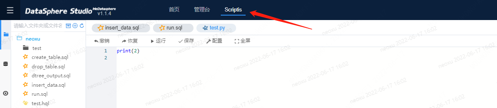
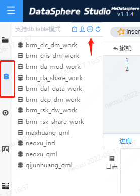
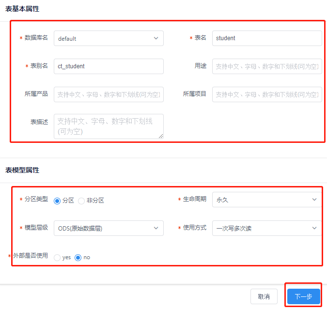

# DSS用户测试样例2：Hive

DSS用户测试样例的目的是为平台新用户提供一组测试样例，用于熟悉DSS的常见操作，并验证DSS平台的正确性



## 2.1 数仓建表

进入“数据库”页面，点击“+”，依次输入表信息、表结构和分区信息即可创建数据库表：





通过以上流程，分别创建部门表dept、员工表emp和分区员工表emp_partition，建表语句如下：

```iso92-sql
create external table if not exists default.dept(
    deptno int,
    dname string,
    loc int
)
row format delimited fields terminated by '\t';

create external table if not exists default.emp(
    empno int,
    ename string,
    job string,
    mgr int,
    hiredate string, 
    sal double, 
    comm double,
    deptno int
)
row format delimited fields terminated by '\t';

create table if not exists emp_partition(
    empno int,
    ename string,
    job string,
    mgr int,
    hiredate string, 
    sal double, 
    comm double,
    deptno int
)
partitioned by (month string)
row format delimited fields terminated by '\t';
```

**导入数据**

目前需要通过后台手动批量导入数据，可以通过insert方法从页面插入数据

```sql
load data local inpath 'dept.txt' into table default.dept;
load data local inpath 'emp.txt' into table default.emp;
load data local inpath 'emp1.txt' into table default.emp_partition;
load data local inpath 'emp2.txt' into table default.emp_partition;
load data local inpath 'emp2.txt' into table default.emp_partition;
```

其它数据按照上述语句导入，样例数据文件路径在：`examples\ch3`

## 2.2 基本SQL语法测试

### 2.2.1 简单查询

```sql
select * from dept;
```

### 2.2.2 Join连接

```sql
select * from emp
left join dept
on emp.deptno = dept.deptno;
```

### 2.2.3 聚合函数

```sql
select dept.dname, avg(sal) as avg_salary
from emp left join dept
on emp.deptno = dept.deptno
group by dept.dname;
```

### 2.2.4 内置函数

```sql
select ename, job,sal,
rank() over(partition by job order by sal desc) sal_rank
from emp;
```

### 2.2.5 分区表简单查询

```sql
show partitions emp_partition;
select * from emp_partition where month='202001';
```

### 2.2.6 分区表联合查询

```sql
select * from emp_partition where month='202001'
union
select * from emp_partition where month='202002'
union
select * from emp_partition where month='202003'
```

## 2.3 UDF 函数测试

关于UDF使用可以参考指引：[Linkis-UDF使用指引](../../产品使用指南/UDF函数.md)
