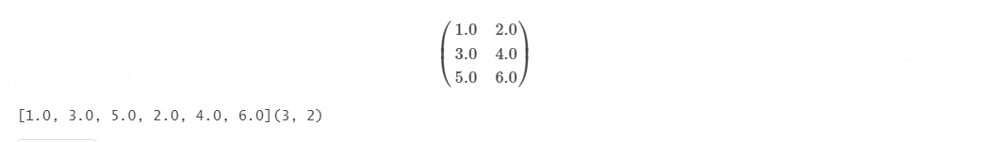

# DSS用户测试样例：MLlib

### 数据类型 - 基于 RDD 的 API

MLlib 支持存储在单台机器上的本地向量和矩阵，以及由一个或多个 RDD 支持的分布式矩阵。局部向量和局部矩阵是用作公共接口的简单数据模型。Breeze提供了底层的线性代数运算 。监督学习中使用的训练示例在 MLlib 中称为“标记点”。

#### 局部向量
本地向量具有整数类型和基于 0 的索引以及双类型值，存储在单个机器上。MLlib 支持两种类型的局部向量：密集和稀疏。密集向量由表示其条目值的双精度数组支持，而稀疏向量由两个并行数组支持：索引和值。例如，向量(1.0, 0.0, 3.0)可以用密集格式表示为，也可以[1.0, 0.0, 3.0]用稀疏格式表示为(3, [0, 2], [1.0, 3.0])，其中3是向量的大小。

局部向量的基类是 Vector，我们提供了两种实现方式：DenseVector和 SparseVector。我们建议使用实现的工厂方法 Vectors来创建本地向量。

```scala
import org.apache.spark.mllib.linalg.{Vector, Vectors}

// Create a dense vector (1.0, 0.0, 3.0).
val dv: Vector = Vectors.dense(1.0, 0.0, 3.0)
// Create a sparse vector (1.0, 0.0, 3.0) by specifying its indices and values corresponding to nonzero entries.
val sv1: Vector = Vectors.sparse(3, Array(0, 2), Array(1.0, 3.0))
// Create a sparse vector (1.0, 0.0, 3.0) by specifying its nonzero entries.
val sv2: Vector = Vectors.sparse(3, Seq((0, 1.0), (2, 3.0)))
```

注意：scala.collection.immutable.Vector默认导入，因此您必须 org.apache.spark.mllib.linalg.Vector显式导入才能使用 MLlib 的Vector.

#### 标记点
标记点是与标签/响应相关联的局部向量，无论是密集的还是稀疏的。在 MLlib 中，标记点用于监督学习算法。我们使用 double 来存储标签，因此我们可以在回归和分类中使用标记点。对于二元分类，标签应该是0（负）或1（正）。对于多类分类，标签应该是从零开始的类索引：0, 1, 2, ....

```scala
import org.apache.spark.mllib.linalg.Vectors
import org.apache.spark.mllib.regression.LabeledPoint

// Create a labeled point with a positive label and a dense feature vector.
val pos = LabeledPoint(1.0, Vectors.dense(1.0, 0.0, 3.0))

// Create a labeled point with a negative label and a sparse feature vector.
val neg = LabeledPoint(0.0, Vectors.sparse(3, Array(0, 2), Array(1.0, 3.0)))
```

稀疏数据

在实践中，训练数据稀疏是很常见的。MLlib 支持读取以LIBSVM格式存储的训练示例，这是 LIBSVM和 使用的默认格式LIBLINEAR。它是一种文本格式，其中每一行使用以下格式表示一个标记的稀疏特征向量：
```shell
label index1:value1 index2:value2 ...
```

其中索引是从一开始并按升序排列的。加载后，特征索引转换为从零开始的。

MLUtils.loadLibSVMFile读取以 LIBSVM 格式存储的训练示例。

有关 API 的详细信息，请参阅MLUtilsScala 文档。

```scala
import org.apache.spark.mllib.regression.LabeledPoint
import org.apache.spark.mllib.util.MLUtils
import org.apache.spark.rdd.RDD

val examples: RDD[LabeledPoint] = MLUtils.loadLibSVMFile(sc, "data/mllib/sample_libsvm_data.txt")
```

####局部矩阵
本地矩阵具有整数类型的行和列索引以及双类型值，存储在一台机器上。MLlib 支持密集矩阵（其条目值以列优先顺序存储在单个双精度数组中）和稀疏矩阵（其非零条目值以列优先顺序以压缩稀疏列 (CSC) 格式存储）。例如，下面的密集矩阵存储在一个矩阵大小 为 的一维数组中。


局部矩阵的基类是 Matrix，我们提供了两种实现方式：DenseMatrix和SparseMatrix。我们建议使用实现的工厂方法Matrices来创建本地矩阵。请记住，MLlib 中的局部矩阵以列优先顺序存储。

有关 API 的详细信息，请参阅MatrixScala 文档和MatricesScala 文档。

```scala
import org.apache.spark.mllib.linalg.{Matrix, Matrices}

// Create a dense matrix ((1.0, 2.0), (3.0, 4.0), (5.0, 6.0))
val dm: Matrix = Matrices.dense(3, 2, Array(1.0, 3.0, 5.0, 2.0, 4.0, 6.0))

// Create a sparse matrix ((9.0, 0.0), (0.0, 8.0), (0.0, 6.0))
val sm: Matrix = Matrices.sparse(3, 2, Array(0, 1, 3), Array(0, 2, 1), Array(9, 6, 8))
```

####分布式矩阵
分布式矩阵具有长类型的行和列索引以及双类型值，分布存储在一个或多个 RDD 中。选择正确的格式来存储大型分布式矩阵非常重要。将分布式矩阵转换为不同的格式可能需要全局洗牌，这非常昂贵。到目前为止，已经实现了四种类型的分布式矩阵。

基本类型称为RowMatrix. ARowMatrix是一个面向行的分布式矩阵，没有有意义的行索引，例如，特征向量的集合。它由其行的 RDD 支持，其中每一行都是一个局部向量。我们假设 a 的列数不是很大，RowMatrix因此单个本地向量可以合理地与驱动程序通信，也可以使用单个节点进行存储/操作。AnIndexedRowMatrix类似于 aRowMatrix但具有行索引，可用于标识行和执行连接。ACoordinateMatrix是以坐标列表 (COO)格式存储的分布式矩阵，由其条目的 RDD 支持。ABlockMatrix是一个分布式矩阵，由一个 RDD 支持，RDDMatrixBlock 是 的元组(Int, Int, Matrix)。

笔记

分布式矩阵的底层 RDD 必须是确定性的，因为我们缓存了矩阵大小。通常，使用非确定性 RDD 会导致错误。

####行矩阵
行矩阵是一个面向行的分布式矩阵，没有有意义的行索引，由其行的 RDD 支持，其中每一行都是一个局部向量。由于每一行都由一个局部向量表示，因此列数受整数范围的限制，但实际上应该小得多。

行矩阵可以从RDD[Vector]实例中创建。然后我们可以计算它的列汇总统计和分解。 QR 分解的形式为 A = QR，其中 Q 是正交矩阵，R 是上三角矩阵。关于奇异值分解（SVD）和主成分分析（PCA），请参考降维。

有关 API 的详细信息，请参阅RowMatrixScala 文档。

```scala
import org.apache.spark.mllib.linalg.Vector
import org.apache.spark.mllib.linalg.distributed.RowMatrix

val rows: RDD[Vector] = ... // an RDD of local vectors
// Create a RowMatrix from an RDD[Vector].
val mat: RowMatrix = new RowMatrix(rows)

// Get its size.
val m = mat.numRows()
val n = mat.numCols()

// QR decomposition 
val qrResult = mat.tallSkinnyQR(true)
```

####索引行矩阵
IndexedRowMatrix类似于 aRowMatrix但具有有意义的行索引。它由索引行的 RDD 支持，因此每一行都由其索引（长类型）和本地向量表示。

可以 IndexedRowMatrix 从一个RDD[IndexedRow]实例创建一个，其中 IndexedRow是一个包装器(Long, Vector)。AnIndexedRowMatrix可以RowMatrix通过删除其行索引来转换为 a。

有关 API 的详细信息，请参阅IndexedRowMatrixScala 文档。

```scala
import org.apache.spark.mllib.linalg.distributed.{IndexedRow, IndexedRowMatrix, RowMatrix}

val rows: RDD[IndexedRow] = ... // an RDD of indexed rows
// Create an IndexedRowMatrix from an RDD[IndexedRow].
val mat: IndexedRowMatrix = new IndexedRowMatrix(rows)

// Get its size.
val m = mat.numRows()
val n = mat.numCols()

// Drop its row indices.
val rowMat: RowMatrix = mat.toRowMatrix()
```

####坐标矩阵
CoordinateMatrix 是一个分布式矩阵，由其条目的 RDD 支持。每个条目是 的元组(i: Long, j: Long, value: Double)，其中i是行索引，j是列索引，并且 value是条目值。CoordinateMatrix只有当矩阵的两个维度都很大并且矩阵非常稀疏时，才应该使用A。

CoordinateMatrix 可以从一个RDD[MatrixEntry]实例创建，其中 MatrixEntry是一个包装器(Long, Long, Double)。CoordinateMatrix可以通过调用将A转换为IndexedRowMatrix 具有稀疏行的toIndexedRowMatrix. CoordinateMatrix当前不支持其他计算 。

有关 API 的详细信息，请参阅CoordinateMatrixScala 文档。

```scala
import org.apache.spark.mllib.linalg.distributed.{CoordinateMatrix, MatrixEntry}

val entries: RDD[MatrixEntry] = ... // an RDD of matrix entries
// Create a CoordinateMatrix from an RDD[MatrixEntry].
val mat: CoordinateMatrix = new CoordinateMatrix(entries)

// Get its size.
val m = mat.numRows()
val n = mat.numCols()

// Convert it to an IndexRowMatrix whose rows are sparse vectors.
val indexedRowMatrix = mat.toIndexedRowMatrix()
```

####块矩阵
ABlockMatrix是由MatrixBlocks 的 RDD 支持的分布式矩阵，其中 aMatrixBlock是 的元组((Int, Int), Matrix)，其中(Int, Int)是块的索引，并且是给定索引处大小为xMatrix的子矩阵。 支持方法，例如和with another 。 还有一个辅助功能，可用于检查是否 设置正确。

```scala
import org.apache.spark.mllib.linalg.distributed.{BlockMatrix, CoordinateMatrix, MatrixEntry}

val entries: RDD[MatrixEntry] = ... // an RDD of (i, j, v) matrix entries
// Create a CoordinateMatrix from an RDD[MatrixEntry].
val coordMat: CoordinateMatrix = new CoordinateMatrix(entries)
// Transform the CoordinateMatrix to a BlockMatrix
val matA: BlockMatrix = coordMat.toBlockMatrix().cache()

// Validate whether the BlockMatrix is set up properly. Throws an Exception when it is not valid.
// Nothing happens if it is valid.
matA.validate()

// Calculate A^T A.
val ata = matA.transpose.multiply(matA)
```