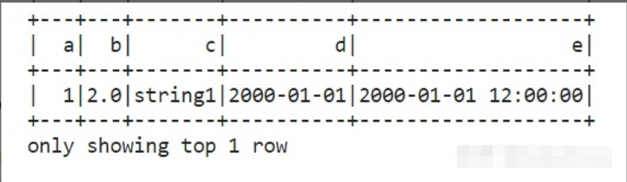

# DSS用户测试样例：pyspark

表格型的数据在PySpark中以Spark DataFrame的形式存在。我们可以按如下方式直接创建一个DataFrame：

在Scriptis中，已经默认为您注册了SparkContext，所以可以直接在脚本中使用sc变量：
```python
fa = sc.textFile("viewfs:///tmp/linkis/hadoop/newNameAuto907/upload3.txt")
fa.collect()
print(fa)
```

```python
from datetime import datetime, date
import pandas as pd
from pyspark.sql import Row

df = spark.createDataFrame([
    Row(a=1, b=2., c='string1', d=date(2000, 1, 1), e=datetime(2000, 1, 1, 12, 0)),
    Row(a=2, b=3., c='string2', d=date(2000, 2, 1), e=datetime(2000, 1, 2, 12, 0)),
    Row(a=4, b=5., c='string3', d=date(2000, 3, 1), e=datetime(2000, 1, 3, 12, 0))
])
```

也可以将底层的数据以Spark DataFrame的形式直接读入(常用)。
有了DataFrame后，我们可以通过df.show()来展示数据。

```python
df.show(1)
```



Spark DataFrame的基本操作有：

- 选择列：df.select(df.c)
- 增加列：df.withColumn('upper_c', upper(df.c))
- 筛选行：df.filter(df.a == 1)
- 聚合：df.groupby('color').avg()
- 自定义的函数(UDF)等

我们还可以通过df.toPandas()将Spark DataFrame转换成Python DataFrame以直接使用相关方法。我们也可以将Python DataFrame转换成Spark DataFrame：

```python
df = pd.DataFrame([["jack",23], ["tony", 34]], columns = ["name", "age"])
df_values = df.values.tolist()
df_columns = list(df.columns)
spark_df = spark.createDataFrame(df_values, df_columns)
```

由于Spark DataFrame和Spark SQL共享同样的执行引擎。我们可以将Spark DataFrame注册成表格，使用SQL进行逻辑运算。
```python
df.createOrReplaceTempView("tableA")
df2 = spark.sql("SELECT count(*) from tableA")
#存储计算结果
df2.write.csv('data.csv', header=True)
df2.show()
```


有了它，我们可以通过SQL的join拼接数据(替代Pig join的功能)，也可以执行复杂的SQL逻辑(类似Hive SQL)并将最终的计算结果存储成不同格式的数据(csv，parquet等)。可以说Spark给我们提供了一个更完善，更易用的框架。

Spark DataFrame还有许多其他的API，由于工作中并没有太多接触，这里就不多介绍了。需要的时候不妨去官方文档查询即可。

Hadoop生态圈中，Spark以及PySpark给我们提供了一套很强大的工具。我们并不需要关心底层的MapReduce具体是如何执行的，我们只需要按照简单的PySpark语法，甚至常用的SQL语言即可灵活，自如地操作底层的数据。

