# Scriptis快速入门

本文档面向新人用户，旨在以使用spark引擎，在scriptis上运行spark sql任务为例，为您介绍数据分析人员如何使用scriptis来完成从即席查询到可视化分析的完整链路。
## 前提条件：
1. 已完成队列资源配置，详情请见[《管理台资源参数配置》](./管理台资源参数配置.md)。
2. 为确认您已完成权限和队列资源配置，可通过以下步骤确认是否已申请成功：   
1）工作空间本地目录已创建：在工作空间模块下，有以用户名命名的文件夹展示。  
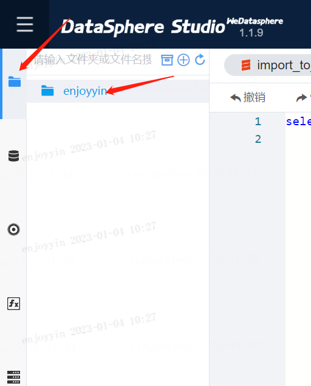   
2）数据库表权限已申请完成：在数据库模块下，有【用户授权】单中申请的库表展示。   
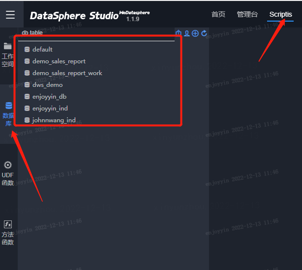      
3）队列资源已配置：在管理台模块下，已配置【用户服务】单中申请的队列，且在scriptis中向该队列提交任务可成功运行。  
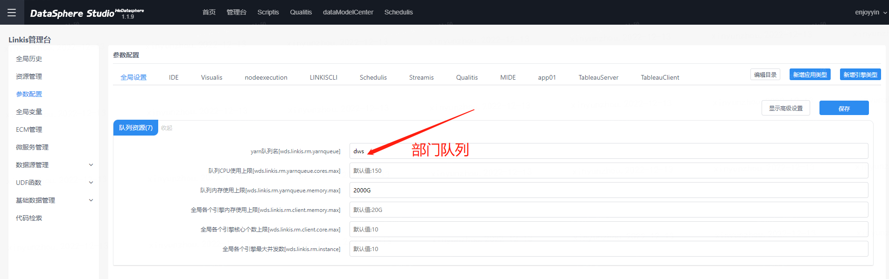   

## 操作步骤：

为向用户更好展示scriptis的数据分析能力，接下来以基于某公司年度经营数据，查询“2014年度各销售区销售额及排名”为例，介绍scriptis数据分析基本操作。

### 1.数据详情

用户可点击<a href="./source/demo_salesdata.xlsx" target="_blank">这里</a>下载测试数据集至本地，再通过上传方式，对数据集进行访问；    
1. 上传数据集至工作空间： 工作空间模块下，在对应目录文件上右键，选择“上传”。上传对应的文件至工作空间目录;   
   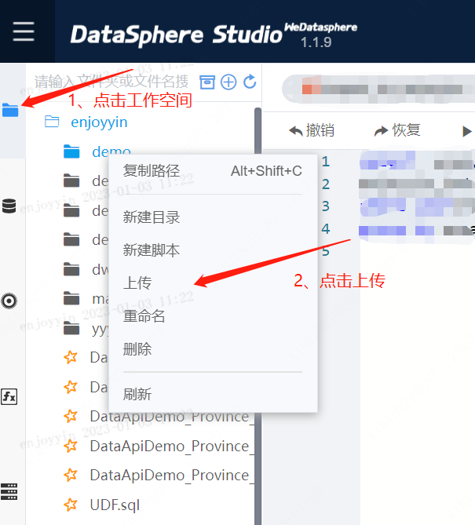   
2. 导入至hive表: 鼠标选中文件，右键点击“导入至hive”，选择“首行为表头”，点击“下一步”，并将“report_date”字段格式设置为“date”格式。   
   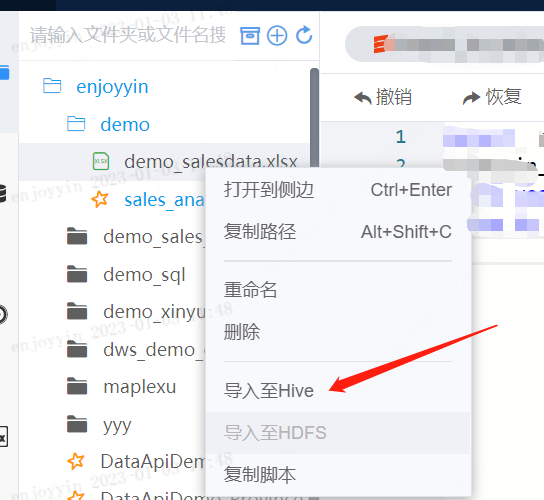    
   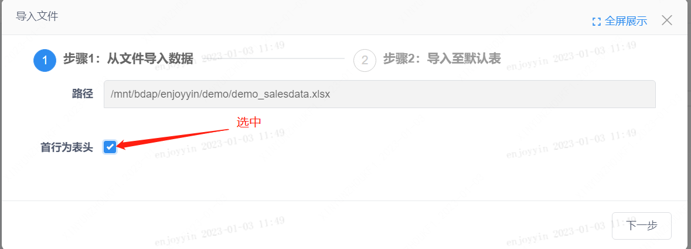
   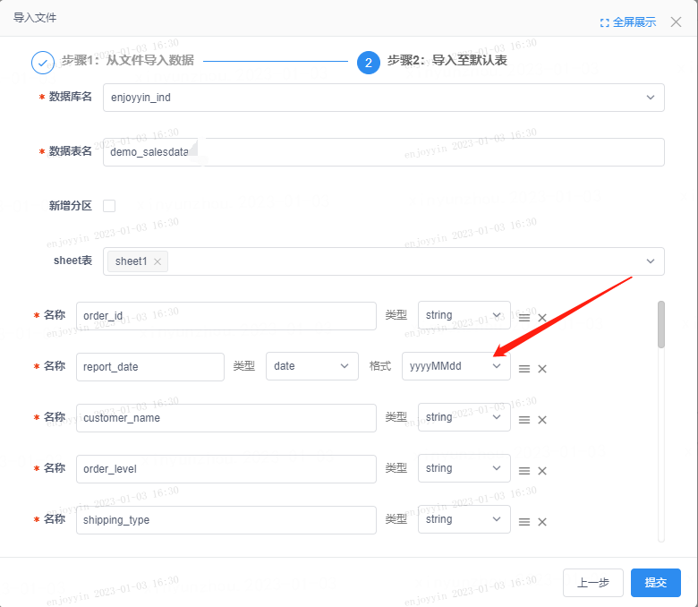
3. 查看hive表结构信息： 在左侧导航栏，点击数据库模块，搜索“demo_salesdata”数据表，即可查看样例数据集表结构；右键点击”查看表结构“，可查看表详情信息。   
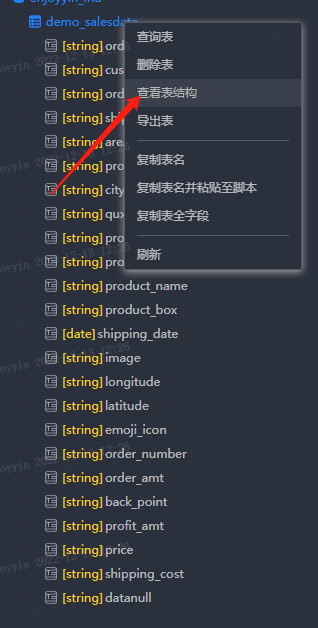    
4. 在表字段信息中，我们可以找到计算“各销售区销售额及排名”字段信息；分别是report_date、area、price。

### 2.创建目录

如需创建新工作目录，可点击“工作空间”模块，右键新建目录。这里我们创建一个名为“demo”的目录，选择保存的路径后，点击保存。   
如无需创建目录，则可直接进入步骤3。  
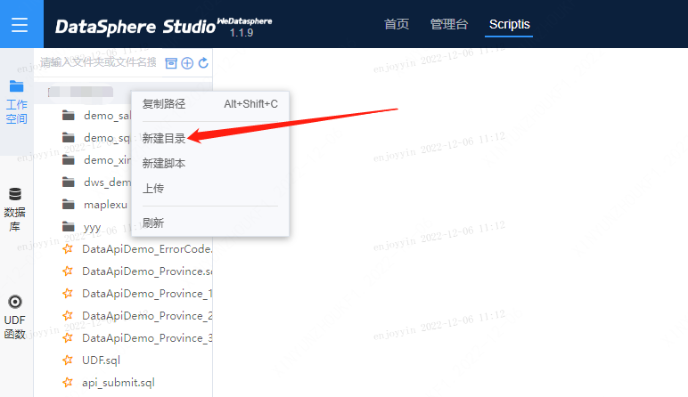   
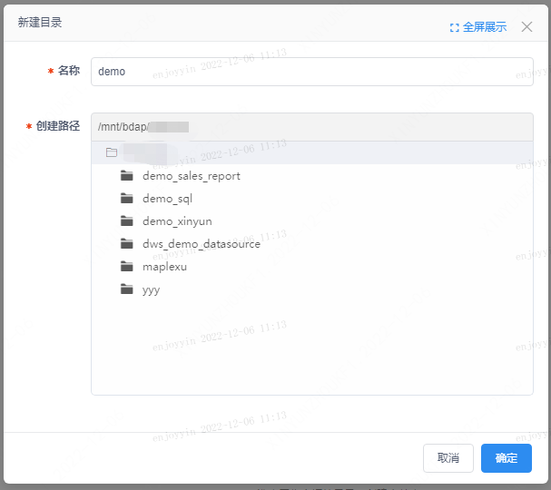   

### 3、脚本创建与编辑

1. 在对应的目录下，右键“新建脚本”;
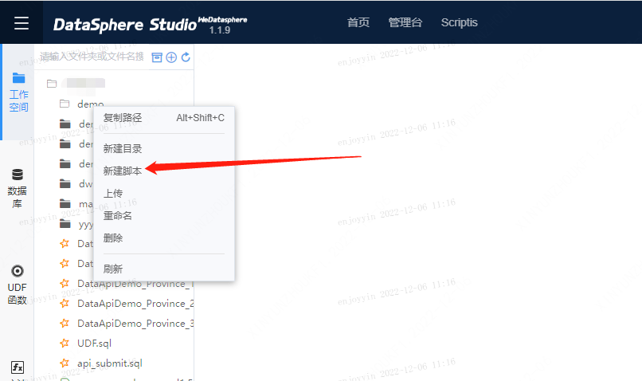
2. 在弹出窗口中设置脚本文件的名称、脚本类型以及脚本保存路径（默认在右键时选中的目录下） ，点击确定创建脚本文件；
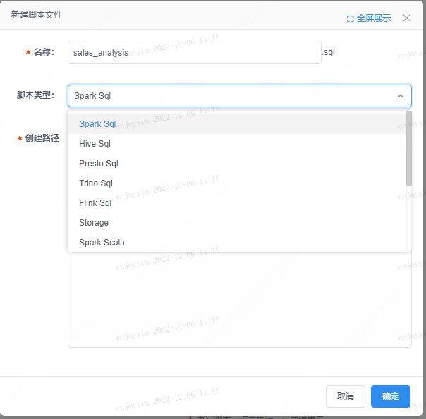
3. 在脚本编辑区内编辑脚本；在脚本编辑区编辑脚本时，您可点击左侧导航栏“数据库”，搜索您即将查询的库表和字段，双击表名称或者字段名称，即可自动在编辑框中完成输入。
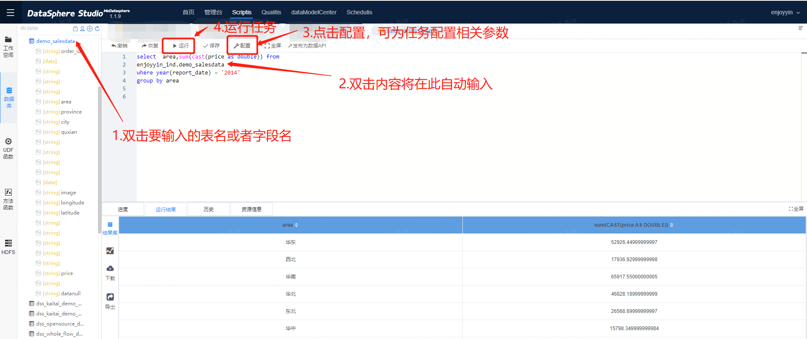   
脚本参考： 
    ````sql
    select  area,sum(cast(price as double)) price from 
    enjoyyin_ind.demo_salesdata
    where year(report_date) = '2014'
    group by area
    ````
值得注意的是scriptis提供自定义参数的能力，可通过“配置”选项对任务运行的资源进行设置。 详情见[《scriptis参数使用指引》](../产品使用指南/Scriptis/变量管理.md)   
scriptis还提供了丰富的代码辅助编辑功能，详情见[《Scriptis代码编辑器使用说明文档》](../产品使用指南/Scriptis/脚本编辑器功能概述.md)。

### 4、结果集查看与导出

结果区将以表格形式展示结果集数据信息。同时支持结果集导出；目前支持按照csv或者excel格式、utf-8或者gbk编码导出，导出默认限制为5000行。如有超过5000行的数据导出，可参考[《scriptis超过5000行数据导出》](../产品使用指南/Scriptis/数据导出.md#2、结果集超过5000行)。

### 5、结果区可视化分析

在结果区可直接对数据进行可视化分析。操作路径如下：
1. 点击“分析”，选择“图表分析”，打开可视化界面。为方便用户操作，可点击“全屏”操作。
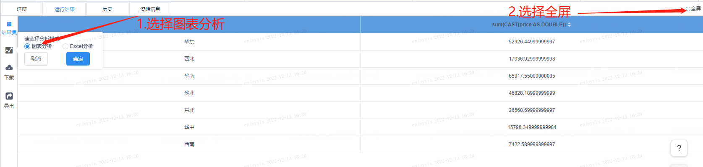
2. 选择合适的图表组件展示：这里要展示的是各销售区的排名情况，选择“条形图”查看。
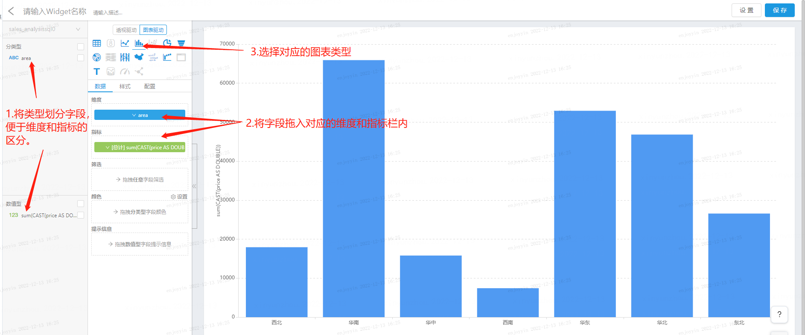
3. 选择“排序”，从高到低展示各区销售额情况。
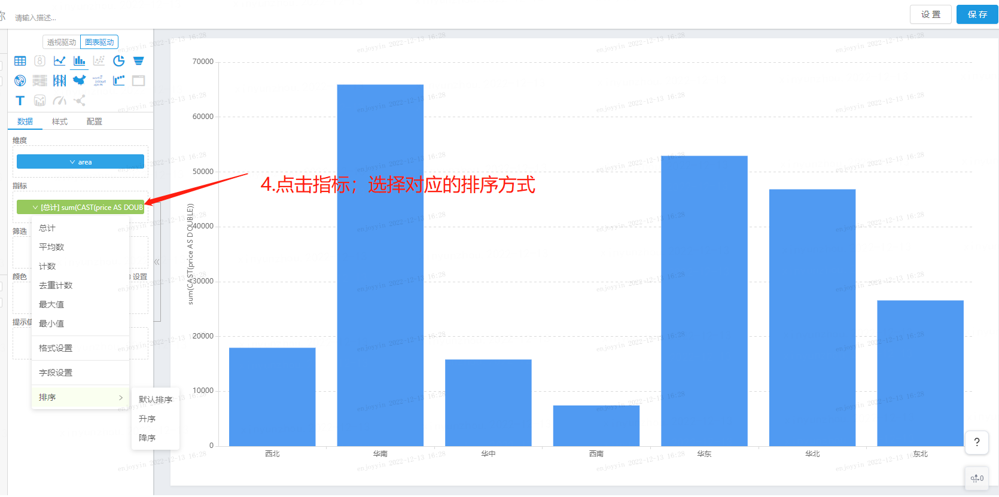
4. 为图表命名，并点击保存。图表将会被保存至visualis的【默认可视化】项目中。
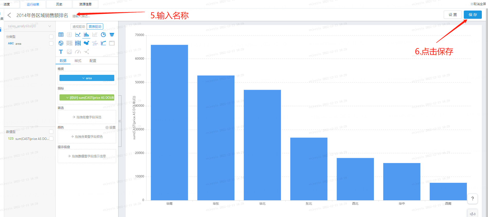
5. 图表二次编辑：用户可通过visualis-访问【默认可视化项目】-访问Widget List对widget进行编辑。也可以将多个widget组合成display(视图）或者dashboard(仪表板） 。
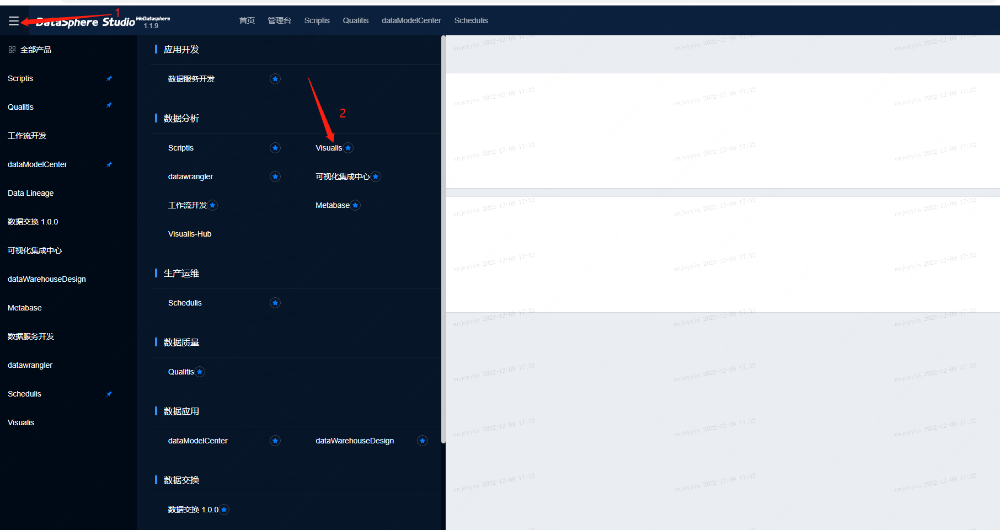
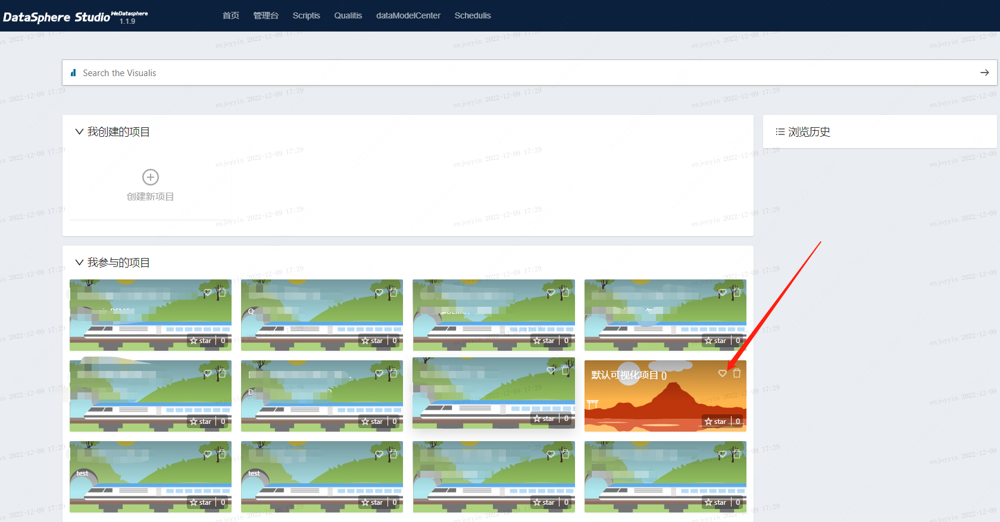
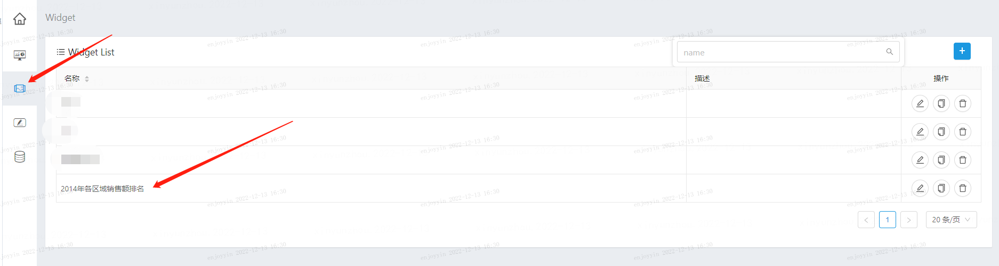

至此，我们就完成了使用scriptis独立完成数据分析的全部流程。 如需了解scriptis进阶功能介绍，请前往scriptis产品功能介绍模块。
